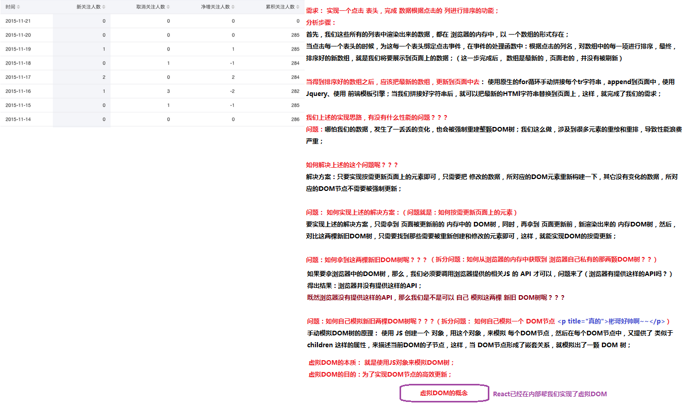
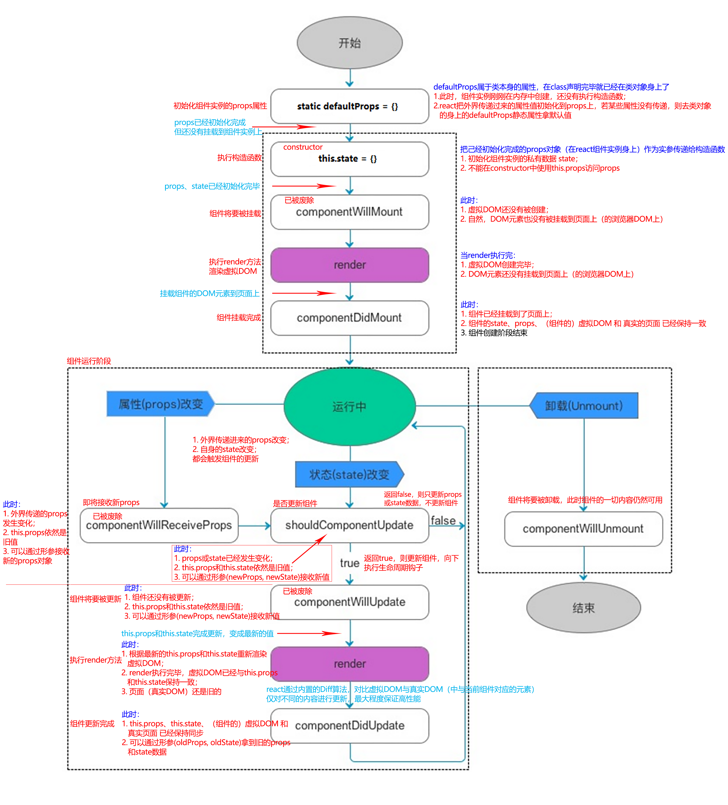
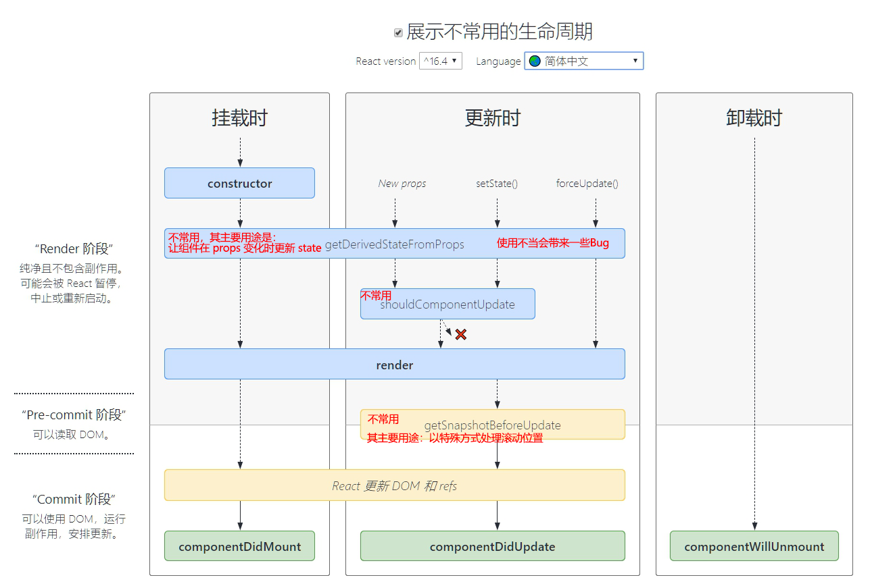
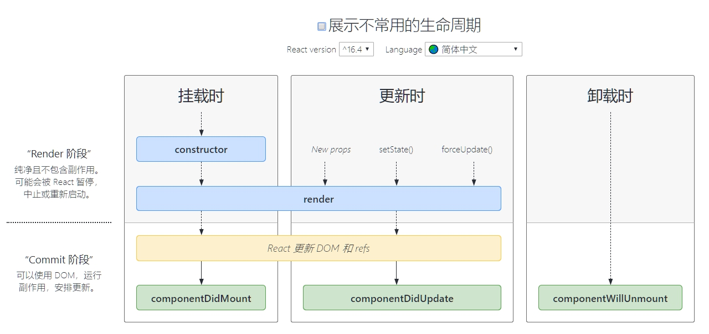

# React入门

## 一、了解React

### 1. 组件化与模块化

1. 组件化：从UI界面的角度去划分，是对前端界面中的可重用元素的封装，有利于前端工程化、方便分工合作、提高代码利用率、方便后期维护升级
2. 模块化：从代码逻辑的角度去划分，是对代码功能的封装，同样有利于分工合作、提高代码利用率、方便后期维护升级

### 2. react和vue对比

1. 组件化的方式
   * vue：通过.vue文件，每个.vue文件分为3部分：html结构、js业务逻辑和数据、css样式
   * react：直接使用JS代码的形式，去创建任何你想要的组件；引入了jsx语法
2. 开发团队方面
   * React是由FaceBook前端官方团队进行维护和更新的；因此，React的维护开发团队，技术实力比较雄厚；
   * Vue：第一版，主要是有作者 尤雨溪 专门进行维护的，当 Vue更新到 2.x 版本后，也有了一个小团队进行相关的维护和开发；
3. 社区方面
   * 在社区方面，React由于诞生的较早，所以社区比较强大，一些常见的问题、坑、最优解决方案，文档、博客在社区中都是可以很方便就能找到的；
   * Vue是近几年才诞生开源出来的，所以，它的社区相对于React来说，要小巧一些，所以，可能有的一些坑，没人踩过；
4. 移动APP开发体验方面
   * Vue，结合 Weex 这门技术，提供了 迁移到 移动端App开发的体验（Weex，目前只是一个 小的玩具， 并没有很成功的 大案例；）
   * React，结合 ReactNative，也提供了无缝迁移到 移动App的开发体验（RN用的最多，也是最火最流行的）；

### 3. react几个核心概念

#### 3.1 虚拟DOM

##### (1) 为什么使用虚拟DOM

1. DOM的本质：使用js（对象）表示的页面元素
2. DOM和虚拟DOM的区别：
   * DOM是由浏览器中的JS提供功能，所以我们只能人为的使用 浏览器提供的固定的API来操作DOM对象；
   * 虚拟DOM：并不是由浏览器提供的，而是我们程序员手动模拟实现的，类似于浏览器中的DOM，但是有着本质的区别；
3. 使用虚拟DOM的原因：减少因局部数据更新引起的页面重绘，提高性能
   * 当排序一个表格时，即使只有两条数据的位置发生交换，使用原生DOM API也会导致整个表格重新渲染
4. react和vue都有虚拟DOM的概念



#### 3.2 Diff算法

1. tree diff:新旧DOM树，逐层对比的方式，就叫做 tree diff,每当我们从前到后，把所有层的节点对比完后，必然能够找到那些 需要被更新的元素；

2. component diff：在对比每一层的时候，组件之间的对比，叫做 component diff;当对比组件的时候，如果两个组件的类型相同，则暂时认为这个组件不需要被更新，如果组件的类型不同，则立即将旧组件移除，新建一个组件，替换到被移除的位置；

3. element diff:在组件中，每个元素之间也要进行对比，那么，元素级别的对比，叫做 element diff；

4. key：key这个属性，可以把 页面上的 DOM节点 和 虚拟DOM中的对象，做一层关联关系；


## 二、React基本使用

### 1. helloWorld

1. 直接引入react.development.js和react-dom.development.js

   ```
   <!-- 加载 React。-->
   <!-- 注意: 部署时，将 "development.js" 替换为 "production.min.js"。-->
   <script src="https://unpkg.com/react@16/umd/react.development.js" crossorigin></script>
   <script src="https://unpkg.com/react-dom@16/umd/react-dom.development.js" crossorigin></script>
   <!-- 使用jsx，在任何 <script> 标签内使用 JSX，方法是在为其添加 type="text/babel" 属性。-->
   <script src="https://unpkg.com/babel-standalone@6/babel.min.js"></script>
   ```

2. webpack应用

   1. 安装react 和 react-dom：`yarn add react react-dom`
   2. 导入模块并使用

   ```javascript
   import React from 'react'
   import ReactDOM from 'react-dom'
   
   // 创建元素
   let myH1 = React.createElement('h1', {}, '这是一个h1')
   let myDiv = React.createElement('div', {title: '我的div', className: 'box'}, 'hello world', myH1)
   
   // 把元素渲染到页面中
   ReactDOM.render(myDiv, document.getElementById('app'))
   ```

#### 1.1 React.createElement

* React.createElement('div', props, inner, ...)：用于创建一个DOM元素
  * 参数1：字符串，指定要创建的DOM元素
  * 参数2：对象，内部是要添加到元素身上的html属性（title、className等），没有可填：{}或null
  * 参数3+：从第3个参数开始，是要依次放入当前元素的子节点，可以是字符串 和 对象（已创建的元素）

#### 1.2 ReactDOM.render

* ReactDOM.render(element, position)：把指定的元素放置到指定的位置
  * 参数1：对象，由React.createElement（或jsx语法）创建的DOM元素
  * 参数2：对象，一个原生DOM元素，代表要把第一个参数挂载到页面的哪个位置

### 2. jsx语法

* jsx是一种js扩展语法
  * 一种表达式，形似html标签，但会被编译为react API的函数调用（的返回值）
  * 使用了jsx的地方相当于使用了React.createElement等函数，并得到返回值
  * 在编译之后，JSX 表达式会被转为普通 JavaScript 函数调用，并且对其取值后得到 JavaScript 对象。

#### 2.1 编译jsx

1. 安装babel编译器关于jsx的语法包：`yarn add --dev @babel/preset-react`

2. 在.babelrc中添加相应的语法规则：详细配置 百度，去官网看

   ```json
   {
     "presets": ["@babel/preset-react"]
   }
   ```

3. 写jsx表达式，可以正确编译

   * ==jsx表达式只能有一个根节点==

   ```jsx
   // 使用jsx创建元素
   let myDiv = <div>这是使用jsx创建的元素</div>
   ReactDOM.render(myDiv, document.getElementById('app'))
   ```

#### 2.2 嵌入js表达式

* 可以在使用尖括号`<` 包裹的jsx表达式内部 使用 花括号{ }书写js表达式（任何js表达式）

* 若要对标签的属性使用 js变量的值，可以这样：

  ```jsx
  let msg = '123'
  // 使用jsx创建元素
  let myDiv = <div title={msg}>这是使用jsx创建的元素</div>
  ```

* 若要循环创建多个元素，可以这样：

  * 内嵌表达式中，只能放js表达式，不能放语句，例如for语句

  ```jsx
  let arr = []
  for(let i = 0; i < 10; i++) {
    arr.push(<div>这是第{i}个div</div>)
  }
  let myDiv = <div title={msg}>
    这是使用jsx创建的元素
    {/* 数组中的DOM元素，会被取出，放置在这里 */}
    {arr}
  </div>
  ```

##### (1) array.map

* react中没有类似vue中的v-for指令，但使用js原生的数组map方法，配合jsx也可以很方便地循环创建元素

* 当map的回调中的返回值比较复杂时，可以把相关的jsx表达值 抽离为一个无状态组件，return这个组件，并为其传递合适的props并绑定key即可

  ```jsx
  {/* 
  var arr = [
  	{title: 't1'},
  	{title: 't2'},
  	{title: 't3'},
  ]
  */}
  render() {
  	return <div>
          {/* 得到一个数组 */}
  		{arr.map((item, i) => {
              return <h1 key={i}>{item.title}</h1>
          })}
  	</div>
  }
  ```

  

#### 2.3 需要注意的属性名

* jsx中的标签的属性名使用 小驼峰命名法，即形如 tabIndex、className
* jsx中的标签的 class属性，使用`className`表示，避免与class关键字冲突
* jsx中的标签的 for属性，使用`htmlFor`表示，避免与for关键字冲突
* ...

#### 2.4 jsx内部的注释

* jsx标签内部要使用注释：

  ```jsx
  {/* 写注释 */}
  ```

### 3. 组件

* react中创建组件，有两种方式：
  * 使用构造函数
  * 使用类class

#### 3.1 使用构造函数

1. 使用构造函数定义的组件基本结构如下：

   * 构造函数==首字母必须大写==
   * 构造函数必须返回一个 react DOM元素（一般使用jsx）

   ```jsx
   function Hello() {
     return <div>
       这是一个最基本的组件，使用构造函数定义
     </div>
   }
   ```

2. 把构造函数名，作为标签名，放在需要使用的地方即可

   ```jsx
   ReactDOM.render(<div>
     <Hello></Hello>
   </div>, document.getElementById('app'))
   ```

##### (1) 向子组件传递数据

1. 可以通过 在组件标签内书写属性（键值对）来向组件传递数据，==在组件内部使用构造函数的参数props接收这些数据==（==不能==直接使用this.props获取父组件传递进来的数据）

   * props是一个react组件（对象）的属性，保存着外界向组件传递的数据（通过标签的属性）

   * Tips：如果要传递一个对象的所有属性，可以直接使用ES6的 解构运算符`...`

     * ```jsx
       <Hello {...person}></Hello>
       {/*相当于*/}
       <Hello name={person.name} age={person.age}></Hello>
       ```

   ```jsx
   function Hello(props) {
     return <div>
       这是一个最基本的组件，使用构造函数定义
       <br />
       name: <span>{props.name}</span>
       <br />
       age: <span>{props.age}</span>
     </div>
   }
   let person = {
     name: 'zs',
     age: '34'
   }
   ReactDOM.render(<div>
     {/* <Hello {...person}></Hello> */}
     <Hello name={person.name} age={person.age}></Hello>
   </div>, document.getElementById('app'))
   ```

2. 通过这种方式，父组件向子组件传递的数据，在子组件内部，是==只读==的，（在构造函数内部）不能被修改

##### (2) 单文件组件

* 可以把定义组件的 构造函数，放入一个单独的`.jsx`文件中，在需要的地方导入即可使用

  * 注意1：单文件组件，必须导入React
  * 注意2：必须导出构造函数

  ```jsx
  // 封装Hello组件
  import React from 'react'
  export default function Hello(props) {
    return <div>
      这是一个最基本的组件，使用构造函数定义
      <br />
      name: <span>{props.name}</span>
      <br />
      age: <span>{props.age}</span>
    </div>
  }
  ```

* 在需要的地方导入

  ```javascript
  import Hello from './components/Hello.jsx'
  ```

* 要编译jsx文件，需要修改webpack的js loader，将test的值改为 `/\.jsx?$/`

#### 3.2 使用class定义组件

1. 使用class定义组件的基本结构如下：

   * 组件类 必须继承自React.Component
   * 组件类 必须有一个 render方法
   * render方法 必须返回 react DOM元素（可以使用jsx）

   ```jsx
   import React from 'react'
   class HelloWorld extends React.Component{
     render() {
       return <div>
         <h3>这是使用class定义的组件</h3>
       </div>
     }
   }
   export default HelloWorld
   ```

2. 把类名，作为标签名，放在需要使用的地方即可

   ```jsx
   ReactDOM.render(<div>
     <HelloWorld></HelloWorld>
   </div>, document.getElementById('app'))
   ```

##### (1) 向子组件传递数据

1. 可以通过 在组件标签内书写属性（键值对）来向组件传递数据，==在组件内部（的方法中）使用  `this.props.属性名`使用父组件传递进来的数据==

   * props是一个react组件（对象）的属性，保存着外界向组件传递的数据（通过标签的属性）

   * Tips：如果要传递一个对象的所有属性，可以直接使用ES6的 解构运算符`...`

     * ```jsx
       <Hello {...person}></Hello>
       {/*相当于*/}
       <Hello name={person.name} age={person.age}></Hello>
       ```

   ```jsx
   import React from 'react'
   class HelloWorld extends React.Component{
     render() {
       return <div>
         <h3>这是使用class定义的组件{this.props.name}--{this.props.age}</h3>
       </div>
     }
   }
   let person = {
     name: 'zs',
     age: '34'
   }
   ReactDOM.render(<div>
     <HelloWorld {...person}></HelloWorld>
   </div>, document.getElementById('app'))
   ```

2. 通过这种方式，父组件向子组件传递的数据，在子组件内部，是==只读==的，（在构造函数内部）不能被修改

##### (2) 在构造函数中访问this.props

* 当调用构造函数时，当前组件实例的props属性还没有初始化完毕，所以在constructor中，this.props是undefined

* 同使用构造函数定义组件一样，react会把 父组件传递给子组件的数据放到一个对象中 传递给构造器，只需在constructor中定义一个形参接收一下即可使用

* ==props也需要传递给super==，即告诉父类的构造函数，父组件传递过来的props是什么

  ```jsx
  class HelloWorld extends React.Component{
    constructor(props) {
      super(props)
      console.log(props)
    }
    render() {
      return <div>
        <h3>这是使用class定义的组件{this.props.name}--{this.props.age}</h3>
      </div>
    }
  }
  ```

##### (3) render方法

* render()：在有状态组件中，需要定义render方法，并使用其返回值来定义组件的虚拟DOM结构
  * ==必须==，返回虚拟DOM结构，最好使用jsx语法

#### 3.3 有状态组件/无状态组件

* 无状态组件：就是通过构造函数创建的组件，它没有自己的state私有数据，也没有自己的生命周期函数
  * 精简，运行效率更高
  * 必须使用构造函数的形参来接收外界传递进来的props数据
  * 适用于 只需要根据外部数据 来显示特定UI结构和样式的 组件
* 有状态组件：就是通过class语法创建的组件，它有自己的state私有数据，也有一系列生命周期函数
  * 相对复杂一些
  * 可以在constructor构造器中定义私有数据state
  * 在除构造器以外的方法中，可以直接使用this.props访问外界传递进来的数据，在构造器中，需要使用形参接收一下props
  * 适用于 需要有自己的私有数据的 或 需要在生命周期钩子中处理业务逻辑的 组件

#### 3.4 检查props的类型

1. 可以为class或 构造函数 添加 propsDefault 静态属性，来设置props的默认值

   ```
   static defaultProps = {
     xxx: '123'	// 指定xxx的默认值是'123'，若父组件传递了props，则将默认值覆盖
   }
   ```

2. 可以为class或 构造函数 添加 propTypes 静态属性，来对props的类型进行限制

   * 1.安装prop-types扩展包：yarn add prop-types

   * 2.在需要的js或jsx文件中导入：`import PropTypes from 'prop-types'`

   * 3.设置类型限制

     ```
     static propTypes = {
       xxx: PropTypes.string	// 限制xxx这个props属性，必须传一个字符串，否则报警告，但值依旧能传递进来
     }
     // 或者（Greeting是一个构造函数，无状态组件）
     Greeting.propTypes = {
       name: PropTypes.string
     };
     ```
   
3. props必须是从父组件（react组件）中传递进来，当其在父组件中变化时，才会被子组件捕捉到并更新组件

### 4. React事件

1. react中，对几乎所有的原生事件进行了封装，一律采用驼峰命名，以on开头，例如onClick、onMouseMove

2. 要为某元素绑定事件，直接把事件写在 元素的标签中即可

   ```jsx
   <input type="button" value="修改state" onClick={this.changeMsg}/>
   ```

3. 事件处理函数，必须使用this，指定当前类的实例方法

#### 4.1 事件处理函数

* react对class组件的实例方法的this做了规定，使其指向undefined

* 所以事件处理函数必须使用==箭头函数==，否则无法使用this访问当前组件实例

  ```jsx
  class HelloWorld extends React.Component{
    constructor(props) {
      super()
      this.state = {
        msg: '私有数据————哈撒给',
        flag: false
      }
    }
    render() {
      return <div>
        <h3>这是使用class定义的组件</h3>
      </div>
    }
    changeMsg = () => {
      // 组件的实例方法，可用作 事件处理函数
    }
  }
  ```

#### 4.2 绑定this并传参

* react组件中的普通方法（非构造函数、非生命周期、非render），通过`this.方法名`将其作为事件处理函数时，其中的this是指向undefined，因为作为事件处理函数（只是传递了引用）之后，它就是一个普通函数，而非react组件的实例方法

##### (1) 使用箭头函数

* 最常用的做法，但不方便传递参数

##### (2) 构造函数中修改this指向

* 由于class的实例方法定义在类的prototype对象上，类一旦声明完毕，这些方法就已经存在且可以被访问

* 在构造函数中，拿到实例方法，使用bind方法修改其内部this指向，并传递参数，把bind返回的新函数在赋值给原方法的引用

* 在事件注册中，直接使用`this.经过bind修改过的方法`

* 这种方式，并不会修改原型prototype上的原方法，而是返回了一个新方法，并将其挂载到了当前组件实例对象上（由于js中对象的属性和方法会沿原型链向上找的规则，对象身上的方法，会把原型对象上的同名方法屏蔽掉）

  ```jsx
  export default class BindThis extends React.Component {
    constructor(props) {
      super(props)
      this.state = {}
      this.changeThis1 = this.changeThis1.bind(this, '参数1', '参数2')
    }
    render() {
      return <div>
        <h2 onClick={this.changeThis1}>这是测试组件</h2>
      </div>
    }
    changeThis1(arg1, arg2) {
      console.log(this)
      console.log(arg1 + arg2)
    }
  }
  ```

##### (3) 使用时修改this指向

* 和上一个方法类似，只不过不再把bind修改后的方法挂载到 实例对象上，而是直接放在需要的地方

  ```jsx
  export default class BindThis extends React.Component {
    constructor(props) {
      super(props)
      this.state = {}
    }
    render() {
      return <div>
        <h2 ref={this.myh2} onClick={this.changeThis2.bind(this, '参数3', '参数4')}>这是测试组件</h2>
      </div>
    }
    changeThis2(arg1, arg2) {
      console.log(this)
      console.log(arg1 + arg2)
    }
  }
  ```

##### (4) 把方法装进箭头函数

* 在为事件指定事件处理函数时，为它传递一个箭头函数（这样箭头函数内部的this就是组件实例），然后在箭头函数内部调用方法（不是传递引用，而是直接调用）

* 在事件触发时，浏览器会调用箭头函数，箭头函数内部又执行 `this.组件实例方法()`，由于普通函数内部的this指向调用它的对象，而调用它的this正好是组件实例，完美！！！

  ```jsx
  export default class LifeCycle extends React.Component {
    constructor(props) {
      super(props)
      this.state = {}
    }
    render() {
      return <div>
        <h2 ref={this.myh2} onClick={() => this.changeThis3('参数5', '参数6')}>这是测试组件</h2>
      </div>
    }
    changeThis3(arg1, arg2) {
      console.log(this)
      console.log(arg1 + arg2)
    }
  }
  ```

### 5. 私有数据state

* ==只有通过class定义的组件，拥有自己的私有数据==

* 组件的state只能在constructor中初始化的时候赋值

* 组件的state可以通过`this.state.dataName`来使用

  ```jsx
  class HelloWorld extends React.Component{
    constructor(props) {
      super()
      this.state = {
        msg: '私有数据————哈撒给',
        flag: false
      }
    }
    render() {
      return <div>
        <div>state: {this.state.msg}</div>
      </div>
    }
  }
  ```

#### 5.1 修改state

* 不能直接使用 `this.state.dataName = newValue`来修改组件的state，修改后，页面不会更新
* ==要使用this.setState()方法来修改组件的state==

##### (1) this.setState

* this.setState：用于修改组件的state中的数据，修改完成后，会更新页面

  * 参数1：配置对象，react会用此对象的属性来更新state中的同名数据，若有一个新的属性，则可以正常添加到state，并更新页面

    * 当state数据的==新值== ==不依赖==于state或props中的值 时使用 ==配置对象==即可

      ```jsx
      this.setState({
        msg: '私有数据————面对疾风吧'
        msg2: '123'	// 可以为state新增一个msg2
      }, () => {
        // 第二个参数，给定的回调函数，会在state更新完成后调用
        console.log(this.state.msg)	// 新值
      })
      ```

  * 参数1：函数，内部this指向当前react组件实例（无论是否是箭头函数），必须返回一个对象，此对象的作用同 配置对象

    * 形参1：本次更新前的state对象

    * 形参2：本次更新前的props对象

    * ==适用于 state数据的新值 依赖于state或props中的值==

      ```jsx
      this.setState(function (prevState, props) {
        // 2.第二个执行，异步执行
        // 2.1 prevState, props是本次更新state之前的state、props
        // 2.2 这里即使没有使用箭头函数，react也会把此函数的this修正为指向当前react组件的
        // 2.3 打印this得到的结果是错误的，console.log打印复杂类型可能是异步的，即更新后才打印
        console.log(this)
        return {
          msg: prevState.flag ? '私有数据————哈撒给' : '私有数据————面对疾风吧',
          flag: !prevState.flag
        }
      }, () => {
        // 3. 第二个参数，给定的回调函数，会在state更新完成后调用
        console.log(this.state.msg)	// 此处的msg已经是新的
      })
      // 1.主线程，最先执行
      console.log(JSON.stringify(this.state))
      ```

  * 参数2（可选）：一个函数，最好使用箭头函数（以访问this），此函数在本次更新成功之后被调用（可以访问到新的state）

#### 5.2 使用配置对象还是函数

* ==state的更新可能是异步的==

1. 不要在 调用this.setState的方法 中访问 修改后的state，此时state还没有更新完毕
2. 使用配置对象的情形：
   * state或props发生更新（第一次），更新前的值用 v1 表示，更新后的值用 v2 表示
   * 紧接着setState()在 极短时间（短到异步更新还没有完成，this.state或this.props还是旧的，v1）内被调用（第二次更新）
   * 配置对象中属性的值 依赖this.state或this.props，那么配置对象中的this.state或this.props使用的就是旧的（v1）
   * 所以第二次更新setState()得到的新值 v3 是基于 v1 的，而非 v2
     * 正常的逻辑是：第一次更新，v1 变成 v2，第二次更新，依赖v2， 得到v3
     * 但由于第二次更新时，v1 变成 v2的异步过程还没有结束，于是，第二次更新，依赖v1，得到错误的v3
3. this.setState第一个参数使用一个函数，可以避免上述问题
   * 由于js的异步操作（函数）都会被放进事件队列
   * 于是，第二次更新（调用this.setState）传递给setState的函数（参数1），必然在 上一次（第一次）state或props发生更新的异步操作后面
   * 所以传递给参数1的函数 的prevState 和 props 一定是上一次异步更新完成后的 v2，这样第二次更新就可以依赖正确的state和props，得到正确的v3

#### 5.3 react中的双向数据(表单)

* react中没有提供v-model这样的指令实现表单的双向数据绑定
* react可以使用onChange事件来实现从表单元素 => state的反向数据传递
* 表单的react onChange事件，类似于原生的input事件，当输入内容的时候就会触发（而非失去焦点）

1. 将state中的私有数据作为表单的value值

2. 为表单绑定onChange事件，每当表单输入值变化，就调用setState方法，把value值依赖的state数据改变为当前的输入值（使用事件对象获得）

3. 当state值更新，react就会把新值渲染到表单中，作为新的value值

   * 要拿到表单的实时输入，要在setState的第二个参数的回调函数中访问，因为state的更新是异步的

   ```jsx
   export default class LifeCycle extends React.Component {
     constructor(props) {
       super(props)
       this.state = {
         inputValue: ''
       }
     }
     render() {
       return <div>
         <input type="text" value={this.state.inputValue} onChange={this.getValueFromInput}/>
       </div>
     }
     getValueFromInput = (event) => {
       this.setState({
         inputValue: event.target.value
       }, () => {
         console.log(this.state.inputValue)
       })
     }
   }
   ```

   


### 6. 样式

* 在项目依赖的任一js或jsx文件中直接导入css文件，这个css文件中的样式都是全局的（前提是css-loader没有启动模块化）

#### 6.1 style行内样式

1. 要使用行内样式，自然是在jsx书写的标签中使用

2. jsx样式规则：

   * 标签的style属性，必须以js表达式为值，值必须是一个对象，所以：

     ```jsx
     <div style={{color: 'red', paddingLeft: '50px'}}></div>
     ```

   * 对象的属性名，采用驼峰命名法

   * 属性的值：如果是字符串，必须带引号

   * 特别的：`'15px'`可以简写为 数值：`15`，jsx会把数值自动加上px

3. 大量style样式，可以集中写到一个对象中，甚至写到state中方便加以控制

   * 甚至可以把style样式对象，集中放到一个js文件中，导出，在需要的地方再导入

   ```javascript
   const inlineStyles = {
     boxStyle: { border: '1px solid #ccc', margin: '10px 0', paddingLeft: 15 },
     titleStyle: { fontSize: 16, color: "purple" },
     bodyStyle: { fontSize: 14, color: "red" }
   }
   ```

#### 6.2 CSS模块化

* CSS模块化，是通过webpack的css-loader实现的
* 同样适用于less和scss，只要修改css-loader的配置即可
* 一般我们并不把对css-loader设置模块化，而是对less或scss设置模块化
  * 因为，我们开发时可能会使用第三方组件库，他们的样式文件一般是打包好的css，如果对css启用模块化，就会导致第三方库的样式失效
  * 只要我们自己的样式使用less或scss，即可保证我们自己的css是模块化的

##### (1) 基本使用

1. 在webpack配置中，对css-loader添加配置如下参数，开启css模块化

   ```
   {
     test: /\.css$/,
     use: [
       'style-loader',
       { 
         loader: 'css-loader',
         options: {
           modules: {
             localIdentName: '[name]__[local]--[hash:base64:5]'
           }
         }
       }
     ]
   }
   ```

   * modules：开启css模块化编译，使用import导入css文件会得到一个js对象（要接收一下）
     * 不需要自定义名称时，可以把modules直接设置为true
   * localIdentName：自定义局部样式的类名，==若不使用，则使用一串长hash值==
     * name：css文件的文件名（不带后缀名）
     * local：css文件中原本的类名
     * hash：取指定位数的hash值

2. 在需要的js或jsx文件中导入

   `import localStyle from 'path/style.css'`

   * localStyle是一个js对象，由css-loader在编译过程中提供
   * 此对象的属性：就是相应的css源文件中的类名（hash之前的类名）
   * 此对象的属性值：一段经过编码的长字符串，作为原类名的替代（保证其唯一性）

3. 在jsx中使用`<div className={localStyle.原类名}></div>`即可

   * ==在编译后的css文件 和 使用类名的地方，都使用了经过处理的具有唯一性的类名，这就是css模块化（作用域）的本质==

##### (2) 模块中的全局样式

* `:global(.className)`：把其内部的css类样式作为全局样式（就是不对类名进行处理，使其保留原样）

  * :global 选择器：可把选择器作为全局样式

  ```
  :global(.title) {	/* 此title编译后还是title，只要导入，全局生效 */
  	color: green;
  }
  .title {	/* 此title编译后会被处理，完全变成另一个名字，与上面的title毫无关系 */
  	color: red;
  }
  ```

* 对于局部的类名 / 选择器，也可使用`:local(.className)` 或 `:local .className p`

  * 复合选择器的中的类名，编译后会自动与其他使用同类名的类名保持一致
  * 一般省略local即可

* 使用css-loader模块化的类名，最好使用驼峰命名，因为它会被暴露到js文件中作为对象的属性

### 7. 组件的生命周期

#### 7.1 旧版本

**下图是旧版本，仅做参考：**



##### (1) 创建阶段

1. static defaultProps = {}：初始化组件实例的props属性

   ```
   defaultProps属于类本身的属性，在class声明完毕就已经在类对象身上了
   1.此时，组件实例刚刚在内存中创建，还没有执行构造函数；
   2.react把外界传递过来的属性值初始化到props上，若某些属性没有传递，则去类对象的身上的defaultProps静态属性拿默认值
   ```

2. this.state = {}：执行构造函数`constructor(props)`==此时props对象已经初始化完成，但还没有挂载到组件实例身上==

   ```
   把己经初始化完成的props对象（在react组件实例身上）作为实参传递给构造函数
   1. 初始化组件实例的私有数据 state；
   2. 不能在constructor中使用this.props访问props
   ```

3. *~~componentWillMount()~~：执行 组件将要被挂载 钩子* ==已被废除==

   ```
   此时：
   1. 虚拟DOM还没有被创建；
   2. 自然，DOM元素也没有被挂载到页面上（的浏览器DOM上）
   ```

4. render()：执行render方法，渲染虚拟DOM

   ```
   当render执行完：
   1. 虚拟DOM创建完毕；
   2. DOM元素还没有挂载到页面上（的浏览器DOM上）
   ```

5. componentDIdMount()：执行 组件挂载完成 钩子

   ```
   此时：
   1. 组件已经挂载到了页面上；
   2. 组件的state、props、（组件的）虚拟DOM 和 真实的页面 已经保持一致
   3. 组件创建阶段结束 
   ```

##### (2) 运行阶段

1. *~~componentWillReceiveProps(newProps)~~：外界的props发生变化，执行即将接收Props 钩子* ==已被废除==

   * 参数：即将更新的新props对象，此时this.props还没有更新

   ```
   此时：
   1. 外界传递的props发生变化；
   2. this.props依然是旧值
   3. 可以通过形参接收新的props对象
   ```

2. shouldComponentUpdate(newProps, newState)：决定是否使用新的props、state更新组件（DOM元素）

   * 参数1：即将更新的新props对象，此时this.props还没有更新
   * 参数2：即将更新的新state对象，此时this.state还没有更新
   * 返回值：bool类型
     * true：向下执行更新组件（DOM元素）的生命周期钩子，把最新的数据呈现到页面上
     * false：只保留props、state数据的更新，但不把新数据呈现到页面上（也不执行剩下的钩子）

   ```
   此时：
   1. props或state已经发生变化；
   2. this.props和this.state依然是旧值；
   3. 可以通过形参(newProps, newState)接收新值
   ```

3. *~~componentWillUpdate(newProps, newState)~~：执行 组件将要被更新 钩子* ==已被废除==

   * 参数1：即将更新的新props对象，此时this.props还没有更新
   * 参数2：即将更新的新state对象，此时this.state还没有更新

   ```
   此时：
   1. 组件还没有被更新；
   2. this.props和this.state依然是旧值；
   3. 可以通过形参(newProps, newState)接收新值
   ```

4. render()：执行render方法，渲染新的虚拟DOM，==此时this.props和this.state才是最新的==

   ```
   此时：
   1. 根据最新的this.props和this.state重新渲染虚拟DOM；
   2. render执行完毕，虚拟DOM已经与this.props和this.state保持一致；
   3. 页面（真实DOM）还是旧的
   ```

5. componentDidMount(oldProps, oldState)：执行 组件更新完成 钩子

   * 参数1：更新前的旧props对象，此时this.props已经是最新的了
   * 参数2：更新前的旧state对象，此时this.state已经是最新的了

   ```
   此时：
   1. this.props、this.state、（组件的）虚拟DOM 和 真实页面 已经保持同步
   2. 可以通过形参(oldProps, oldState)拿到旧的props和state数据 
   ```

##### (3) 销毁阶段

1. componentWillUnmount()：执行 组件即将被卸载 钩子
   * 组件将要被卸载，此时组件的一切内容仍然可用

#### 7.2  新版本



##### (1) 创建阶段

1. static defaultProps = {}：初始化组件实例的props属性

   ```
   defaultProps属于类本身的属性，在class声明完毕就已经在类对象身上了
   1.此时，组件实例刚刚在内存中创建，还没有执行构造函数；
   2.react把外界传递过来的属性值初始化到props上，若某些属性没有传递，则去类对象的身上的defaultProps静态属性拿默认值
   ```

2. this.state = {}：执行构造函数`constructor(props)`==此时props对象已经初始化完成，但还没有挂载到组件实例身上==

   * 可以在任意能够访问组件实例this的地方，通过this.属性名，给组件实例添加或修改自定义属性，这与react无关
   * 例如组件内部的定时器，就可以把其id放在组件对象上，不必放在state中

   ```
   把己经初始化完成的props对象（在react组件实例身上）作为实参传递给构造函数
   1. 初始化组件实例的私有数据 state；
   2. 不能在constructor中使用this.props访问props
   ```

3. static getDerivedStateFromProps(props, state)：==不常用==，主要用途，在props变化时，更改state

   * 参数1：最新的props
   * 参数2：最新的state
   * 返回值：一个对象，将根据此对象修改state（立即修改）
   * 无法访问组件实例，即this是undefined（因为它是静态方法）
   * ==慎用==，如有需要，可参考[你可能不需要使用派生 state](https://react.docschina.org/blog/2018/06/07/you-probably-dont-need-derived-state.html#when-to-use-derived-state)

   ```
   此时：
   1. 虚拟DOM还没有被创建；
   2. 自然，DOM元素也没有被挂载到页面上（的浏览器DOM上）
   ```

4. render()：执行render方法，渲染虚拟DOM

   * ==render方法中不能 调用setState更新state==，因为state更新是异步的，它会在本次render调用后更新，然后react就又要发起更新流程了，会无限更新下去

   ```
   当render执行完：
   1. 虚拟DOM创建完毕；
   2. DOM元素还没有挂载到页面上（的浏览器DOM上）
   ```

   ==componentDIdMount被调用之前，react更新DOM和refs==，执行回调refs的回调函数，拿到ref指定的元素

5. componentDIdMount()：执行 组件挂载完成 钩子

   ```
   此时：
   1. 组件已经挂载到了页面上；
   2. 组件的state、props、（组件的）虚拟DOM 和 真实的页面 已经保持一致
   3. 组件创建阶段结束 
   ```

##### (2) 运行阶段

1. static getDerivedStateFromProps(props, state)：==不常用==，主要用途，在props变化时，更改state

   * 参数1：最新的props
   * 参数2：最新的state
   * 返回值：一个对象，将根据此对象修改state（立即修改）
   * 无法访问组件实例，即this是undefined（因为它是静态方法）
   * ==慎用==，如有需要，可参考[你可能不需要使用派生 state](https://react.docschina.org/blog/2018/06/07/you-probably-dont-need-derived-state.html#when-to-use-derived-state)

   ```
   此时：
   1. 父组件的props 或 自身的state 发生变化
   2. 可能需要使用props来更新state
   ```

2. shouldComponentUpdate(newProps, newState)：决定是否使用新的props、state更新组件（DOM元素），==不常用==

   * 参数1：即将更新的新props对象，此时this.props还没有更新
   * 参数2：即将更新的新state对象，此时this.state还没有更新
   * 返回值：bool类型
     * true：向下执行更新组件（DOM元素）的生命周期钩子，把最新的数据呈现到页面上
     * false：只保留props、state数据的更新，但不把新数据呈现到页面上（也不执行剩下的钩子）

   ```
   此时：
   1. props或state已经发生变化；
   2. this.props和this.state依然是旧值；
   3. 可以通过形参(newProps, newState)接收新值
   ```

3. render()：执行render方法，渲染新的虚拟DOM，==此时this.props和this.state才是最新的==

   * ==render方法中不能 调用setState更新state==，因为state更新是异步的，它会在本次render调用后更新，然后react就又要发起更新流程了，会无限更新下去

   ```
   此时：
   1. 根据最新的this.props和this.state重新渲染虚拟DOM；
   2. render执行完毕，虚拟DOM已经与this.props和this.state保持一致；
   3. 页面（真实DOM）还是旧的
   ```

4. getSnapshotBeforeUpdate(prevProps, prevState)：在虚拟DOM渲染完毕，但还没有更新到DOM（页面）上时，被调用，==常用于处理滚动问题==

   * 参数1：更新前的旧props对象，此时this.props已经是最新的了

   * 参数2：更新前的旧state对象，此时this.state已经是最新的了

   * 返回值：snapshot 的值（或 `null`），snapshot 的值，应该是可滚动内容（高度当然超过了屏幕高度）的总高度（ele.scrollHeight） - 已经滚动出去的高度（ele.scrollTop）

   * 应用场景：

     * 一个长列表（高度大于屏幕，可滚动），已经向上滚动了一段距离（ele.scrollTop）

     * 然后列表更新了，在列表顶部（或已经滚动出去的地方）插入了一项（此时若不做处理，滚动距离scrollTop将保持不变，它将把列表内容整体向下挤下去一段距离（新增项的高度），用户会看到画面向下一跳）

     * 此时可以在getSnapshotBeforeUpdate中比较列表数据的长度，若新的长度（通过this.state获得）大于旧的长度（通过参数prevState获得），则把尚未滚动出去的高度作为snapshot返回

       ```
       return list.scrollHeight - list.scrollTop;	// 得到屏幕顶端 到 滚动内容底端的距离，即尚未滚动出去的高度
       ```

     * 下一个生命周期函数，将拿到snapshot，如果它不是null，则说明需要修改列表的scrollTop，将scrollTop设置为 最新的滚动内容高度 - snapshot，即可保证未滚动出去的内容位置不变

     * [详情参考react官方文档](https://react.docschina.org/docs/react-component.html)

   ==componentDidUpdate被调用之前，react更新DOM和refs==

5. componentDidUpdate(prevProps, prevProps, snapshot )：执行 组件更新完成 钩子

   * 参数1：更新前的旧props对象，此时this.props已经是最新的了
   * 参数2：更新前的旧state对象，此时this.state已经是最新的了
   * 参数3：参考getSnapshotBeforeUpdate钩子

   ```
   此时：
   1. this.props、this.state、（组件的）虚拟DOM 和 真实页面 已经保持同步
   2. 可以通过形参(oldProps, oldState)拿到旧的props和state数据 
   ```

##### (3) 销毁阶段

1. componentWillUnmount()：执行 组件即将被卸载 钩子
   * 组件将要被卸载，此时组件的一切内容仍然可用

#### 7.3 常用的生命周期钩子



### 8. refs

* 不能对函数式组件使用ref，因为它没有实例，但可以对它的子组件（class组件）使用ref

#### 8.1 字符串ref（旧）

* 旧版本的react支持使用字符串作为refs，来获取DOM元素或react组件实例，用法与vue中的ref完全一样

* 在需要获取的元素上使用ref属性，值为任意字符串（符合规范的标识符）

  ```
  <h2 ref="myh2">这是测试生命周期子组件</h2>
  ```

* 然后（组件创建阶段的componentDidMount及其之后）就可以在任意可以使用this的生命周期或方法中通过`this.refs.myh2`拿到指定的DOM元素

#### 8.2 对象ref

* 在新版本中，应该使用React.createRef()创建一个对象，并把希望使用ref获取的DOM元素/组件 绑定到这个对象

  1. 在constructor中创建ref对象：`this.myH3 = React.createRef()`

  2. 在需要使用ref获取的 DOM元素/组件 上把ref属性值设置为 ref对象

     * react会在虚拟DOM完成挂载后，把相应的 DOM元素/组件 对象挂载到 ==this.myH3.current==
     * 在其他地方（挂载后，且能访问this），就可以使用相应的ref对象，拿到指定的DOM元素或组件实例

     ```
     <h3 ref={this.myH3}>这是测试生命周期子组件</h3>
     // 访问ref
     const node = this.myH3.current;
     ```

#### 8.3 refs转发

* 为了让父组件在某些情况下，可以方便地获取子组件内部的DOM元素或class组件实例，react提供了refs转发

  1. 在父组件中创建ref对象，并把此对象传递给子组件（通过属性）

     ```jsx
     class Father extends React.Component {
       constructor(props) {
         super(props)
         // 1.创建ref对象，并保存，确保父组件可以访问到它
         this.myBtn = React.createRef()
       }
       render() {
         return <div>
           <h1>这是用于测试的父组件，它是一个容器</h1>
           {/* 2. 通过子组件标签的ref属性把父组件中的ref对象传递给子组件 */}
           <ChildUseRefs ref={this.myBtn}>按钮</ChildUseRefs>
         </div>
       }
       componentDidMount() {
         console.log(this.myBtn.current)
       }
     }
     ```

  2. 子组件必须通过React.forwardRef来创建，在其回调函数中除了接收props外，还要接收ref

     * 并把接收到的ref，放到自己内部的 DOM元素或组件实例 上

     ```jsx
     // 一个使用refs转发的子组件,ref就是父组件传递过来的ref对象，父组件可以通过它拿到子组件中特定的元素
     const ChildUseRefs = React.forwardRef((props, ref) => (
       <button ref={ref}>
         {props.children}
       </button>
     ))
     ```

  3. 第二个参数 `ref` 只在使用 `React.forwardRef` 定义组件时存在。常规函数和 class 组件不接收 `ref` 参数，且 props 中也不存在 `ref`。

#### 8.4 回调refs

* 就是给 DOM元素/组件实例 的ref传递一个箭头函数，它接收一个element参数（由react在渲染DOM后把 使用ref的元素传递进去，并执行之）
* 箭头函数内部执行 this.myRef = element，这样组件实例的this.myRef就指向了对应的DOM元素/组件实例
* 当组件被卸载时，react会再次执行这个箭头函数，并把null作为参数传递给element
* [详见react文档](https://react.docschina.org/docs/refs-and-the-dom.html)

```jsx
class CustomTextInput extends React.Component {
  constructor(props) {
    super(props);
    this.textInput = null;
    // 此箭头函数会在mount之后，componentDidMount之前执行，把指定的DOM元素传递给element
    this.setTextInputRef = element => {
      this.textInput = element;
    };

    this.focusTextInput = () => {
      // 使用原生 DOM API 使 text 输入框获得焦点
      if (this.textInput) this.textInput.focus();
    };
  }

  componentDidMount() {
    // 组件挂载后，让文本框自动获得焦点
    this.focusTextInput();
  }

  render() {
    // 使用 `ref` 的回调函数将 text 输入框 DOM 节点的引用存储到 React实例上（比如 this.textInput）
    return (
      <div>
        <input type="text" ref={this.setTextInputRef} />
      </div>
    );
  }
}
```

### 9. context

* context是为了 解决跨级传递数据问题，取代props层层传递 的
* MyContext是一个对象，但MyContext.Provider是一个类，可以有多个实例（组件），可在任意可以访问MyContext的地方创建一个新的MyContext.Provider组件实例（必须设置value，否则警告）
* MyContext.Consumer也是一个类，可以有多个实例（组件），可在任意可以访问MyContext的地方创建一个新的MyContext.Consumer组件实例，它会沿着React组件树，找到最近的Provider实例的value值
* contextType指明了当前class组件使用了哪个 React.createContext（MyContext这样的实例）类型的context，并沿着React组件树，找到最近的==同类（MyContext这样的实例）==的Provider实例的value值，将this.context指向它

#### 9.1 基本用法

1. 在一个单独的js文件中创建Context 对象，这个对象有一个提供者组件（在上层组件中使用）来设置context的值；还有一个或多个消费者组件（在下层组件中使用）来获取context值，

   * 在需要使用使用context的jsx文件中按需导入

   ```js
   // mycontext.js
   import React from 'react'
   const MyContext = React.createContext('aaa')
   export { MyContext }
   ```

2. 在一个上层组件中使用提供者组件（MyContext.Provider）创建一个实例，并为其设置value

   ```jsx
   // TopCom.jsx
   import React from 'react'
   import SecondCom from './SecondCom.jsx'
   import {MyContext} from '../../context/mycontext.js'
   export default class TopCom extends React.Component {
     constructor(props) {
       super(props)
       this.state = {}
     }
     render() {
       return <MyContext.Provider value={"bbb"}>
         <SecondCom></SecondCom>
       </MyContext.Provider>
     }
   }
   ```

3. 中间层不需要处理任何context，当然也可以使用MyContext.Provider设置一个值，会覆盖它上层的值

   ```jsx
   import React from 'react'
   import ThirdCom from './ThirdCom.jsx'
   export default class SecondCom extends React.Component {
     constructor(props) {
       super(props)
       this.state = {}
     }
     render() {
       return <div>
         <ThirdCom></ThirdCom>
       </div>
     }
   }
   ```

4. 在下层组件中使用消费者组件（MyContext.Consumer，函数式组件）或 contextType（class组件），来读取==最近的==上层组件设置的context值（==不包括它自己==，即在消费context的下层组件又使用了提供者，此下层组件消费的context至少是它父级的）

   * 在class组件中也可以使用MyContext.Consumer

   ```jsx
   import React from 'react'
   import {MyContext} from '../../context/mycontext.js'
   export default class ThirdCom extends React.Component {
     constructor(props) {
       super(props)
       this.state = {}
     }
     // 1.1 class组件要读取context的值，需先把要读取的context对象挂载到静态属性contextType上
     static contextType = MyContext
     render() {
       return <div>
         {/* 1.2 使用this.context使用最近的上层提供者 设置的value */}
         {this.context}
         <Inner></Inner>
       </div>
     }
   }
   function Inner(props) {
     // 2.1 使用MyContext.Consumer在函数式组件中获取最近的上层提供者 设置的value
     return <MyContext.Consumer>
       {/* 2.2 必须用一个函数来接收context值，并在这个函数中返回本组件的 jsx标签结构 */}
       {value => <p>{value}</p>}
     </MyContext.Consumer>
   }
   ```

#### 9.2 后代修改context

* 要让子组件可以修改上层提供者设置的context值，思路类似于 子组件通过props传递过来的函数修改父组件的state
* MyContext.Consumer实例设置value时，将value设置为一个对象，这个对象包含
  * 要向后代传递的值（contextVal），且这个值来源于state（属性名自定，只要后代获取时 对上就行）
  * 一个方法（this指向当前父组件的方法），在这个方法（changeContext）中，修改上一条传递的state的值（使用setState）
* 在后代的消费组件中
  * 使用context 传递下来的值
  * 在某个事件中调用上层传递下来的方法，修改state，就可以修改context值，且其他使用此值的消费组件也会获得更新

1. 提供者，上层组件

   ```jsx
   import React from 'react'
   import SecondCom from './SecondCom.jsx'
   import { MyContext } from '../../context/mycontext.js'
   export default class TopCom extends React.Component {
     constructor(props) {
       super(props)
       this.state = {
         contextVal: '123'
       }
     }
     render() {
       let contextV = {
         contextVal: this.state.contextVal,
         changeContext: this.changeContext
       }
       return <MyContext.Provider value={contextV}>
         <SecondCom></SecondCom>
       </MyContext.Provider>
     }
     // 凡是传递给后代组件的方法，都要使用箭头函数，或bind保证其内部this指向是父组件
     changeContext = () => {
       this.setState(prevState => {
         return {
           contextVal: prevState.contextVal === '123' ? '456' : '123'
         }
       })
     }
   }
   ```

2. 若干中间组件略

3. 消费者，下层组件

   ```jsx
   import React from 'react'
   // import ThirdCom from './ThirdCom.jsx'
   import {MyContext} from '../../context/mycontext.js'
   export default class ThirdCom extends React.Component {
     constructor(props) {
       super(props)
       this.state = {}
     }
     static contextType = MyContext
     render() {
       return <div>
         {/* Inner组件中修改了context，这里也会重新渲染 */}
         <p>{this.context.contextVal}</p>
         <Inner></Inner>
       </div>
     }
   }
   function Inner(props) {
     return <MyContext.Consumer>
       {value => <button onClick={value.changeContext}>{value.contextVal}</button>}
     </MyContext.Consumer>
   }
   ```

#### 9.3 消费多个context

1. 在一个单独的js文件中创建多个Context 对象

   ```javascript
   import React from 'react'
   const MyContext = React.createContext('aaa')
   const MyContext2 = React.createContext('aaa')
   const MyContext3 = React.createContext('aaa')
   export { MyContext, MyContext2, MyContext3 }
   ```

2. 在上层组件中以嵌套的方式 创建多个属于不同context的提供者（未必要在一个组件中嵌套，只要保证层级关系即可）

   ```jsx
   import React from 'react'
   import SecondCom from './SecondCom.jsx'
   import { MyContext, MyContext2, MyContext3 } from '../../context/mycontext.js'
   export default class TopCom extends React.Component {
     constructor(props) {
       super(props)
       this.state = {}
     }
     render() {
       return <MyContext.Provider value={'ctx1'}>
         <MyContext2.Provider value={'ctx2'}>
           <MyContext3.Provider value={'ctx3'}>
             <SecondCom></SecondCom>
           </MyContext3.Provider>
         </MyContext2.Provider>
       </MyContext.Provider>
     }
   }
   ```

3. 在下层组件中可以使用多个 消费者（MyContext.Consumer）来获取每一个context

   * 嵌套使用，MyContext.Consumer组件内部有且只能有一个函数，不能有其他东西。可以在上一层消费者内部的函数的返回值中使用下一层消费者（层级关系不必与提供者对应）
   * 并列使用，可以把多个MyContext.Consumer组件放在一个div中，作为兄弟关系

   ```jsx
   function Inner(props) {
     return <div>
       <MyContext.Consumer>
         {value => <p>{value}</p>}
       </MyContext.Consumer>
       <MyContext2.Consumer>
         {value => <p>{value}</p>}
       </MyContext2.Consumer>
       <MyContext3.Consumer>
         {value => <p>{value}</p>}
       </MyContext3.Consumer>
     </div>
   }
   ```

### 10. react路由

* 路由Hook函数，只能在函数式组件中使用

#### 10.1 基本组件

* react中的路由依赖 `yarn add react-router-dom`
* 它提供了一些组件，用于路由导航，均使用按需导入
* 最基本的有：
  * <BrowserRouter>：使用html history API进行导航，需要后端在拿到没有匹配的前端路由的url时，返回当前页面，以避免404
  * <Switch>：（若有多个路由规则匹配成功）只渲染Switch包裹的第一个匹配成功的组件（由Route提供）
    * 设计路由的时候，就应该考虑，不要让一个路由地址可以匹配到多个<Route>
    * 例如：to="/home"可以匹配到 path="/home" 和 path="/:user"(home变成了user参数的值)
    * Switch并不是严格匹配，即使用了Switch之后，只是保证在多个匹配中只渲染第一个，即使启用了严格匹配，上述混淆依然会存在
  * <Link>：会被渲染为路由链接（默认是带 href 的 a 标签）
  * <Route>：用作路由规则
    * 首先，<Route>是一个占位符，里面是当Route匹配成功后要显示的组件（若不使用Switch，则会显示所有匹配的结果组件）
    * 其次，<Route>用于书写路由规则

##### (1) \<BrowserRouter>

* 一个单页应用只需要一个<BrowserRouter>即可（一般放在App组件中），它表示它里面的组件使用了react路由
* 其他组件（根组件App之下的）若要使用路由，不用再放置<BrowserRouter>组件

##### (2) \<Link>

* Link组件可以当做 a 链接来使用，属性：
  * to：用于写 路由地址，当点击此链接时，会调用h5 history API进行路由导航
  * to属性可以使用字符串、配置对象、函数，[详见文档](https://reactrouter.com/web/api/Link/to-object)
  * 其他属性参考文档

##### (3) \<Route>

* Route组件用于设置路由规则、放置组件，它本身不会被渲染为DOM元素
  * path：字符串，路由规则（路径，可带restful参数）
  * exact：精准匹配，不使用此参数的话，只要路由链接能 部分 匹配本路由规则，就代表匹配成功

##### (示例)

```jsx
import React from 'react'
import {
  BrowserRouter as Router,
  Switch,
  Link,
  Route
} from 'react-router-dom'
import Home from './pages/Home.jsx'
import About from './pages/About.jsx'
import User from './pages/User.jsx'
export default function App(props) {
  return <Router>
    <div>
      <nav>
        <ul>
          <li>
            <Link to="/home">首页</Link>
          </li>
          <li>
            <Link to="/about">关于</Link>
          </li>
          <li>
            <Link to="/user/10">用户</Link>
          </li>
        </ul>
      </nav>
      <Switch>
        <Route exact path="/home">
          <Home />
        </Route>
        <Route exact path="/about">
          <About />
        </Route>
        <Route exact path="/user/:id">
          <User />
        </Route>
      </Switch>
    </div>
  </Router>
}
```

#### 10.2 路由传参（restful）

* 要在路由目标（即匹配成功要显示的组件）中接收url中传递过来的参数，（目标组件）需要使用 函数式组件
* 在目标组件所在的jsx文件中，要导入 useParams
* 在构造函数中调用useParams()，它会返回一个对象，包含当前路由的参数

```jsx
import React from 'react'
import { useParams } from "react-router-dom";
export default function User(props) {
  let myId = useParams()
  console.log(myId) // {id: '10'}，路由规则是path="/user/:id"
  return <div>
    用户
  </div>
}
```

#### 10.3 路由嵌套

* 假设对10.1中的 路由：/about进行路由嵌套，不需对父级路由做任何改动，只需在其目标组件中使用路由Link和Route即可
* 可在<About />组件内部使用useRouteMatch（按需导入）获取当前（父路由）路由链接（'/about'）
  * 同样，要使用useRouteMatch，About 组件必须为 函数式组件
* 在Link的to属性中，使用完整的子路由链接即可，可拼接（`${match.url}/child1`），即'/about/child1'
* 在Route中使用子路由规则（完整的链接，可拼接），设置匹配成功时指定的组件即可
  * 建议设置一个等同于父级路由url的路由规则，以使父路由匹配成功（显示<About />）时，有默认的显示内容

```jsx
import React from 'react'
import {
  Switch,
  Link,
  Route,
  useParams
} from 'react-router-dom'
export default class About extends React.Component {
  constructor(props) {
    super(props)
    this.state = {}
  }
  render() {
    return <div>
      <ul>
        <li>
          {/* 点击这个链接，匹配到"/about/:id"，id是ab1 */}
          <Link to="/about/ab1">关于1</Link>
        </li>
        <li>
          {/* 点击这个链接，匹配到"/about/:id"，id是ab2 */}
          <Link to="/about/ab2">关于2</Link>
        </li>
      </ul>
      <Switch>
        <Route path="/about/:id">
          <About1 />
        </Route>
        {/* 一进入本组件，路由就是"/about"，所以显示默认内容 */}
        <Route path="/about">
          <h3>Please select a about.</h3>
        </Route>
      </Switch>
    </div>
  }
} 
// 子路由目标组件，接收id参数
function About1() {
  let { id } = useParams();
  return <h3>ID: {id}</h3>;
}
```

## 三、Ant Design

* Ant Design是蚂蚁提供的前端库，有react版和vue版，提供了一些组件

### 1. 安装和使用

1. 使用 `yarn add antd`，安装即可
2. 导入需要的组件（js）`import { DatePicker, Button } from 'antd'`
3. 导入样式（全局css）`import "antd/dist/antd.css"`
   * 这样会把ant design的全部样式导入进来
4. 把导入进来的组件放在需要的位置即可
   * 注意，有些组件（如Button），必须添加相应的属性或行内样式才能正常显示

### 2. 按需导入

1. 按照官网的说法，只要webpack配置了tree shaking，就可以按需导入，如果不行，可以借助babel

2. 安装babel插件：`yarn add babel-plugin-import --dev`

3. 在.babelrc中配置插件，添加如下内容

   * libraryName：指明要使用import插件的库
   * style：要处理的样式文件，如果设置为true，则处理less文件

   ```
   "plugins": [
     "@babel/plugin-transform-runtime",
     "@babel/plugin-proposal-class-properties",
     [
       "import",
       {
         "libraryName": "antd",
         "style": "css"   // or 'css'
       }
     ]
   ]
   ```

## \#. React文档概念记录

### 1. 核心概念

- [1. Hello World](https://react.docschina.org/docs/hello-world.html)
- [2. JSX 简介](https://react.docschina.org/docs/introducing-jsx.html)
- [3. 元素渲染](https://react.docschina.org/docs/rendering-elements.html)
- [4. 组件 & Props](https://react.docschina.org/docs/components-and-props.html)
- [5. State & 生命周期](https://react.docschina.org/docs/state-and-lifecycle.html)
- [6. 事件处理](https://react.docschina.org/docs/handling-events.html)
- [7. 条件渲染](https://react.docschina.org/docs/conditional-rendering.html)
  * react没有专门的条件指令，而是直接通过在 构造函数（函数式组件）和render方法中使用 if、&&（前面为真，返回后面的；前面为假，返回前面的）、三元运算符来对要渲染的jsx表达式进行控制，以达到条件渲染的目的
- [8. 列表 & Key](https://react.docschina.org/docs/lists-and-keys.html)
- [9. 表单](https://react.docschina.org/docs/forms.html)
  * 讲解双向数据绑定
- [10. 状态提升](https://react.docschina.org/docs/lifting-state-up.html)
  * 就是 父组件 有两个子组件（兄弟组件），这两个兄弟组件要共用（读和写） 同一个数据
  * 于是，就把这个公用的数据定义在父组件的state中
  * （父组件）分别为两个子组件 各写一个方法（用于操作共享的state），并把这两个方法，分别作为props传递给子组件
  * 当然这个共享数据也要作为props传递给两个子组件（供他们显示，必要时可做相应的转换）
  * 这样一个子组件要修改这个共享值（父组件的state），只需使用this.props调用父组件给的 操作此state的方法，即可使两个子组件同步得到被修改的共享数据
- [11. 组合 vs 继承](https://react.docschina.org/docs/composition-vs-inheritance.html)
  * react推荐使用组合，所谓组合，就是类似于vue中的插槽，组件可以通过this.props.children获取书写在组件的jsx标签内部的DOM元素、组件、字符串 或其他形式的数据
- [12. React 哲学](https://react.docschina.org/docs/thinking-in-react.html)

### 2. 高级指引

- [无障碍](https://react.docschina.org/docs/accessibility.html)

- [代码分割](https://react.docschina.org/docs/code-splitting.html)

- [Context](https://react.docschina.org/docs/context.html)

- [错误边界](https://react.docschina.org/docs/error-boundaries.html)

- [Refs 转发](https://react.docschina.org/docs/forwarding-refs.html)

  * 就是把父组件中创建的ref对象，作为props传递给子组件（通过React.forwardRef创建），子组件可以接收这个ref对象，并把它放在自己内部的DOM元素、组件中，这样父组件就可以通过this.myRef.current方便地拿到子组件内部的元素

- [Fragments](https://react.docschina.org/docs/fragments.html)

  * render、构造函数 返回的 jsx标签 必须有且只有一个根元素（例如div）但有时我们并不想要这个根元素

  * 使用<React.Fragment>作为组件html结构的根元素，可以保证只有一个根元素的同时，它不会被渲染到DOM结构中，<React.Fragment>相当于一个==虚标签==，即当渲染DOM时，它会不复存在，而把它内部的内容直接放在组件所在的位置

  * <React.Fragment></React.Fragment>可以简写为`<></>`

  * 如果一个组件封装了3个并列的td

    ```jsx
    render() {
    	return <div>
        	<td>1</td>
            <td>2</td>
            <td>3</td>
        </div>
    }
    ```

  * 把这个组件放到 tr 中，完了，浏览器肯定报错。使用<React.Fragment>代替div，td就会变成tr的直接子元素

    ```
    <table>
        <tr>
        	<div>
        		<td>1</td>
            	<td>2</td>
            	<td>3</td>
        	</div>
        </tr>
    </table>
    ```

- [高阶组件](https://react.docschina.org/docs/higher-order-components.html)

- [与第三方库协同](https://react.docschina.org/docs/integrating-with-other-libraries.html)

- [深入 JSX](https://react.docschina.org/docs/jsx-in-depth.html)

- [性能优化](https://react.docschina.org/docs/optimizing-performance.html)

- [Portals](https://react.docschina.org/docs/portals.html)

  * 就是通过在render的返回值处不使用jsx，而是使用ReactDOM.createPortal(child, container)把组件标签内部的内容（this.props.children）挂载到container所指定的DOM元素下（这个DOM元素不必与react组件有任何关系）
  * 即this.props.children的内容从DOM树的结构上来讲，已经不是当前组件的子节点了
  * 但是从react组件树的结构上来讲，它（this.props.children）依然在react组件树中原来的位置，且可以把其内部的react事件正常冒泡至它的上层组件（即使从DOM树上来讲，它的根 与上层组件DOM元素的根 属于兄弟关系）

- [Profiler](https://react.docschina.org/docs/profiler.html)

- [不使用 ES6](https://react.docschina.org/docs/react-without-es6.html)

- [不使用 JSX](https://react.docschina.org/docs/react-without-jsx.html)

- [协调](https://react.docschina.org/docs/reconciliation.html)

  * 讲解react内部的diff算法如何两棵DOM的不同，以及列表的key

- [Refs & DOM](https://react.docschina.org/docs/refs-and-the-dom.html)

- [Render Props](https://react.docschina.org/docs/render-props.html)

- [静态类型检查](https://react.docschina.org/docs/static-type-checking.html)

- [严格模式](https://react.docschina.org/docs/strict-mode.html)

- [使用 PropTypes 类型检查](https://react.docschina.org/docs/typechecking-with-proptypes.html)

- [非受控组件](https://react.docschina.org/docs/uncontrolled-components.html)

- [Web Components](https://react.docschina.org/docs/web-components.html)