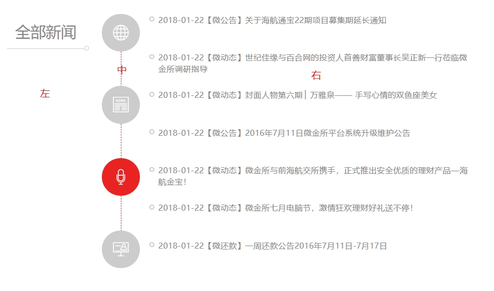
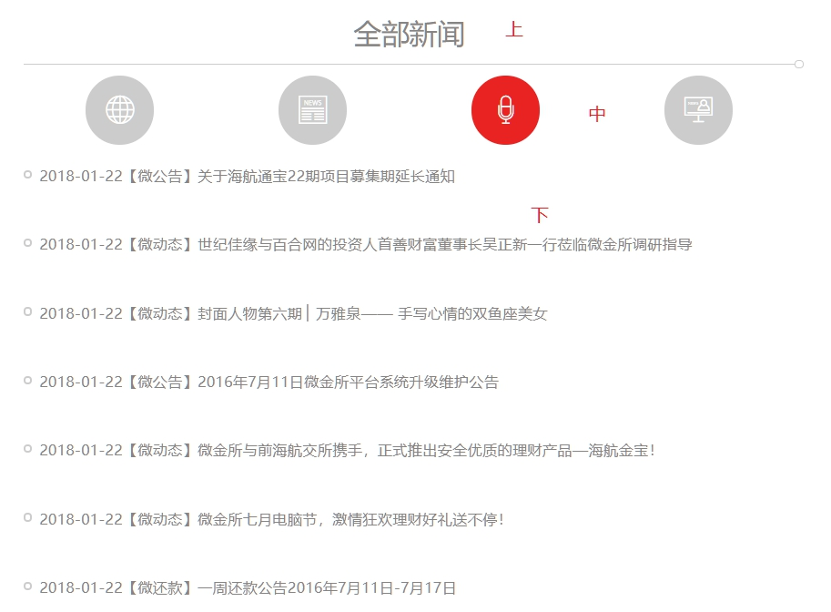

## 一、一一

### 1.

#### 1.1 自定义视频控制栏

需求： （控制栏默认不出现）

* 点击全屏按钮，全屏，且仍然显示控制栏
* 鼠标在视频区域移动，控制栏出现，如果停止移动，2s后控制栏消失
* 当鼠标放在控制栏上的时候，控制栏**永远不**消失

##### (1)问题1：视频全屏后控制栏显示不出来

* 查资料，有人说把控制栏的z-index属性设置为很大，不行
* 后来把视频video标签的父元素作为全屏的对象，解决

##### (2)问题2：鼠标移动控制栏反复出现

* 一开始我把定时器setTimeOut的id添加给了控制栏标签对应的jQuery对象，由于每次触发Mousemove时这个jQuery对象都是新的，所以储存的id总是undefined，就会重复设置定时器，相当于定时器的时间缩短了，且有多个不同的定时器
* 解决办法，把定时器setTimeOut的id添加给控制栏标签的DOM对象，这个对象会一直存在，id就唯一了

##### (3)问题3：鼠标悬停在控制栏，控制栏仍消失

* 鼠标进入控制栏事件清除定时器后，控制栏仍在2s后消失
* 原因：仔细分析mouseover/mouseenter事件后，发现它只会在鼠标进入时触发一次，然后mousemove事件依然触发，由于事件冒泡，控制栏的上级元素会执行mousemove事件处理函数，又设置了新的定时器
* 解决办法：为控制栏注册mousemove事件，阻止事件冒泡


#### 1.2 京东移动端

##### (1)移动端轮播图的基本思路

0. HTML结构：div-ul-li-a-img

   * div：**宽度**，相对定位，溢出隐藏
   * ul：轮播移动的主体，**宽度** ，**清除浮动**
   * li：**宽度**，浮动
   * img：**宽度**，**转换块级**

   ```html
   <div class="jd_banner">
   	<!-- 图片列表 -->
   	<ul class="jd_bannerImg clearfix">
   		<li>
   			<a href="javascript: void(0);">
   				
   			</a>
   		</li>
   	</ul>
   </div>
   <style>
     	/*轮播图块div*/
   	.jd_banner{
   		width: 100%;
   		position: relative;
   		overflow: hidden;
   	}
   	/*图片列表ul*/
   	.jd_bannerImg{
   		width: 800%;
   	}
   	.jd_bannerImg > li{
   		width: 12.5%;
   		float: left;
   	}
   	.jd_bannerImg > li img{
   		width: 100%;
   		display: block;
   	}
   </style>
   ```


1. **添加图片** ：为了实现无缝滚动（主要是最后一张==>第一张，第一张==>最后一张），要在最后动态追加原本的第一张，在开头插入原本的最后一张（这里与pc端不同，因为从第一张手动向右滑动到最后一张时，需要在原本的第一张左侧显示最后一张）
2. **重设宽度，初始偏移**：要根据添加li元素之后的图片数量重新设置ul的宽度（100*count %），重新设置每一个li的宽度（100/count %）,设置初始偏移量，保证默认显示原来的第一张图。**ul应该使用相对定位**，否则它的父级轮播图块就没有高度，影响页面布局
   * **设置索引变量记录当前轮播图编号，初始为1（原来的第一张）**
3. **自动轮播** ：设置定时器，每隔一段时间，索引加1，根据新的索引设置轮播图的位置（-100*index %），添加css过渡
   * 定时器使用setTimeout，因为在TransitionEnd事件中，会取消并重复设置定时器，相当于每次图片移动结束都取消定时器，再设置新的定时器。使用setInterval会有问题。
4. **手动轮播** ：三个touch事件
   * touchstart事件：获取手指点击的位置，取消定时器
   * touchmove事件：获取手指当前位置，计算位置差；获取ul的当前位置；据此二者改变ul的偏移量（不要过渡）
   * touchend事件：根据手指移动的距离（百分比）判断是下一张、上一张、还是不动，据此改变索引和ul的偏移量（要过渡）
5. **过渡结束事件**：由于每次轮播都有过渡（无论手动还是自动），过渡结束事件代表一次图片移动结束
   * 判断是否是最后一张、第一张，若是，改变索引，跳转（不要过渡）
   * 清除掉上次图片移动的定时器，设置新的定时器
   * 下方点高亮显示

##### (2) 轮播图拖动延迟

* 轮播图的移动动画通过transition过渡效果实现，每次偏移量发生改变，都会有动画效果
* 在最后一张（原来的第一张）跳到第一张（现在的第二张）时，不需要过渡效果，所以要清除（因为存在清除transition操作，所以每n s轮播一张图片的定时器每次都要重新添加transition）
* 在手动拖动轮播图，使其跟手移动的时候，也不需要过渡transition效果，需要将其清除，否则会引起手指拖动效果延迟

##### (3) 手动拖动轮播图过快

* 手动快速滑动轮播图（在滑动一次后的过渡效果transition还没做完就继续滑动），webkittransitionend事件一直不会触发（这个事件处理最后一张到第一张的跳转），就不会在需要最后一张（原来的第一张）跳到第一张（现在的第二张）时进行跳转，导致可以一直往一个方向滑动
* 设置过渡结束标记transitionIsEnd，初始为true
  * 当webkittransitionend触发时设置为true，代表过渡已经结束，可以对手动拖动操作进行处理
  * 只要标记是false，代表过渡没有结束，touchstart、touchmove、touchend都不做处理
  * 当标记是true时，代表过渡结束，touchstart、touchmove、touchend正常处理，touchend将标记置为flase
* 这样就可以避免过渡没有做完就产生下一次滑动，相当于滑动操作有一个最小间隔（就是过渡效果的时长）

##### (4) setInterval重复设置问题

* 重复设置定时器setInterval，但在每一次重新设置之前都先清掉之前的定时器，为什么还是会出现多个定时器（setInterval）
* 原因不明（猜测是存在多个重复定时器，但为啥会存在多个重复定时器，不明，毕竟设置新的定时器前就清除了已有定时器）
* 可以使用setTimeout解决（因为每次动画结束会重设定时器，所以可以用setTimeout）

##### (5) touchmove真机卡顿

* 原因：手机浏览器开启了左右滑动手势功能（上一页下一页）

##### (6) zepto.js中的swipe失效

* 在很过移动端浏览器中，zepto.js中的swipe失效失效
* 原因：touchmove、touchstart、touchend事件也在触发
* 解决方案：
  * 1.给使用swipe事件的DOM元素（或其可以触发touch事件的子元素）取消touchmove、touchstart、touchend事件的默认操作：`event.preventDefault();`
  * 2.阻止touchmove、touchstart、touchend事件冒泡：`event.stopPropagation();`
* 兼容性：在swipe生效的浏览器中不能阻止touch，若阻止touch，swipe反而会失效；在swipe本来就失效的浏览器中阻止touch，就可以正常使用swipe
  * 通过检测`navigator.appVersion` 字符串获取浏览器信息，使用Chrome的浏览器和LieBao需要阻止touch，其他不需要，根据浏览器信息阻止touch即可解决兼容问题

```javascript
// 阻止默认的touch事件
if(isChrome(navigator.appVersion)) {
	imgUl[0].addEventListener('touchmove', function (event) {
	    event.preventDefault();
	    event.stopPropagation();
	}, false);
	imgUl[0].addEventListener('touchstart', function (event) {
	    event.preventDefault();
	    event.stopPropagation();
	}, false);
	imgUl[0].addEventListener('touchend', function (event) {
	    event.preventDefault();
	    event.stopPropagation();
	}, false);
}
// 检测是否为Chrome或LieBao
function isChrome(str) {
	if (str.search('Mobile') > -1) {
		if(str.search(/(Chrome|LieBao)/) > -1) {
			return true;
		} else {
			return false;
		}
	}
}
```

##### (7) 移动端a点击高亮

* 移动端的a标签默认有点击高亮显示效果，一般不需要，使用如下代码移除

```css
// 给a标签加即可
a {
  -webkit-tap-highlight-color: transparent;
}
```

#### 1.3 微金所项目

##### (1) 重置bootstrap样式

- 引用bootstrap组件以后，往往需要重置一些样式，使之变成我们想要的
- 在浏览器中找到需要重置样式的元素，在右侧查看css样式列表，找到相关的类（比如修改背景色，就找bootstrap预定义的背景色所在的类）
- 使用less定位到当前html结构中的指定元素，对其所用的**上文中寻找到的类**重置相关样式
- 注意：less定位过程中要保证通过子选择器或后代选择器选定目标元素，这样重置的样式就不会影响到其他使用该类的元素

##### (2) 字体图标的使用

1. 一般字体图标的使用过程（已制作好图标）：
   - css中定义字体
   - css定义字体基类（一个语义化的类选择器，只定义font-family，指定使用的字体名称）
   - css定义具体字体图标伪元素（一个语义化的类：before选择器，定义content: "\xxxx", font-size等等）
   - 在需要字体图标的地方放一个span，为其添加字体基类，和具体的字体图标类
2. 若使用bootstrap提供的字体，只需到官网找到字体，复制下面的基类和字体类放到指定位置就行了

##### (3) bootstrap组件使用技巧

1. 复制bootstrap组件代码，放入页面的html结构中，阅读代码，看看标签和类的基本作用
   - 如果组件最外层的标签和自己预置的标签一样，可以去掉之际预置的标签
   - 但要为组件的最外层标签加一个类，用于自己修改样式，避免影响其他使用此组件的地方
2. 去掉不需要的标签，添加需要的内容，使组件的结构符合预期
3. 对比项目需求和bootstrap组件的样式区别，一项一项进行更改
   - 如何确定样式是由bootstrap.css的哪个类控制的：
   - 控制台审查目标元素，检查css样式表中有没有相关的属性
   - 去bootstrap.css文件中寻找组件最外层标签所包含的类，一个复杂组件的类一般有很多子选择器，后代选择器
   - 对着找到的类写less代码，覆盖需要修改的样式
4. **修改height这样的样式时，要注意最好修改子级标签的height，让父级的高度被子级撑开，否则会影响布局**

##### (4) 轮播图

* 在大屏设备（width>768px）上随着屏幕宽度的增加，轮播图高度不变，但居中且宽度向两侧延伸
* 思路：大屏设备上轮播图使用大图（两边宽度足够宽的图）
  * 让图片作为**背景**，以便居中
  * 设置图片居中background-position: center center;
  * 设置图片大小background-size: cover;（自动填满区域，溢出部分（左右两侧）隐藏）


##### (5) 新闻块水平/垂直布局

* 大屏时（lg、md > 992px）：新闻块呈现左--中--右水平布局，使用bootstrap栅格系统即可（只需设置col-md-n，向上兼容lg）
* 
* 小屏时（xs、sm < 992px）：垂直上中下布局。无需做任何处理，因为bootstrap栅格系统向上兼容，向下（小屏）没有设置宽度的话，每一块div的宽度自动是100%，自然垂直排列
* 

##### (6) bootstrap标签页水平/垂直布局

* bootstrap标签页（js插件）的导航栏（上边图中的4个圆块）默认是水平布局，其实只要将导航栏的父容器（ul的父容器，如div）的宽度设为较小值（使得一行放不下两个标签）就可以实现垂直布局
* 标签页导航栏与内容的对应是通过锚点来实现的（列表里面的a的href的值是目标的id）
* ul和放置内容的div不必放在一起，放在不同的地方依然可以使用


### 2. Node.js

#### 2.1 nvm use 失效

* 使用nvm安装node之后，切换版本无效，提示node不是内部命令
* 查资料有人遇到这样的问题，是路径有空格，我的路径没有空格——没解决
* 有人是环境变量设置的问题，我的环境变量设置好了——没解决
* 怀疑是路径问题，检查了一下nodejs文件夹，发现它作为快捷方式指向了之前安装失败的node版本目录，将其删除重新创建就好了

#### 2.2 图书管理系统

##### (1) 基于文件读写的增删改查

1. 项目结构
   * 展示页面：主体是一个表格，用于展示图书信息，有添加、修改、删除的入口链接，数据由模板引擎填充
   * 表单页面：用于添加或修改图书信息，添加和修改共用此页面，内容由模板引擎填充
   * 后台处理
     * 入口模块：只做导入模块、配置服务器等功能
       * 导入依赖包：Express框架、path模块、参数处理body-parser模块、**自己写的路由模块**
       * 设置模板引擎
       * 挂载第三方中间件body-parser，用于处理post参数
       * 启动静态资源服务
       * **将（来自路由模块的）路由对象router导入应用级`app.use(router);`**
       * 监听端口
     * 路由模块：负责处理路由，**将路由对象router导出**，**在入口模块中导入使用**
       * 不关心中间件的实现，只关心流程，每一个功能都是一个路由，指定相应的中间件
       * 查看：展示图书信息
       * 增加：跳转到添加图书页，并根据表单数据，添加图书信息，最后重新渲染展示页面
       * 修改：跳转到修改图书页，并根据表单数据，修改图书信息，最后重新渲染展示页面
       * 删除：根据id找到后台数据中要删除的图书，删除图书信息，最后重新渲染展示页面
     * 业务模块：负责每一个功能点（中间件）的实现
       * 每一个功能点作为一个函数，导出
       * 在路由模块中导入，使用这些函数
2. 模块导出的函数中使用的**第三方模块的变量**
   * 若 模块1导出的函数f 中直接使用了A模块提供的**对象及其方法**，需要在模块1中导入依赖包A
   * 若 模块1导出的**函数f** 中的**形参及其方法**由B模块提供，则使用 **函数f** 的模块2（即导入模块1的模块）需要导入依赖包B，模块1不需要导入依赖包B

#### 2.3 操作数据库报sql语法错误

* update更新数据库操作，总报语法错误
* 检查后发现是键值对之间要用","而非空格
* 以后报语法错误直接找文档

### 3. webpack

#### 3.1 版本兼容

* webpack并非一切都冲着新的去用 就好，它与他的大量loader、plugin之间存在版本兼容问题，所以一味追求“新”，可能会碰一鼻子灰，找到一套稳定的、尽量新的、版本兼容的webpack配置才是最重要的

#### 3.2 css模块化配置问题（坑）

* webpack通过配置css-loader可以实现css模块化，但官网的配置方式都有问题（可能是版本没对上）

* 官网：4.x版本的webpack，照这样配置，必报错，编译失败

  ```
  module.exports = {
    module: {
      rules: [
        {
          test: /\.css$/,
          loader: 'css-loader',
          options: {
            modules: true,
            localIdentName: '[path][name]__[local]--[hash:base64:5]',
          },
        },
      ],
    },
  };
  ```

* 实际：这样就好了

  ```
  module.exports = {
    module: {
      rules: [
        {
          test: /\.css$/,
          loader: 'css-loader',
          options: {
            modules: {
            	localIdentName: '[path][name]__[local]--[hash:base64:5]',
            }
          },
        },
      ],
    },
  };
  ```

  

