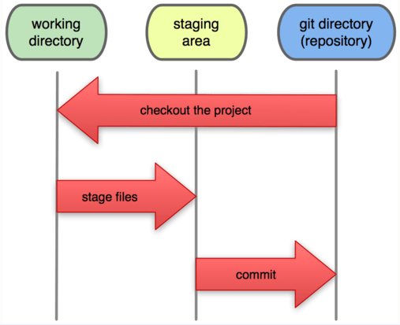

# 涂家豪的Git学习笔记

## 〇、Git原理

### 1. Git简易原理图



### 2. 只能跟踪文本文件

  所有的版本控制系统，只能跟踪文本文件的改动，比如TXT文件，网页，所有的程序代码等等，Git也不例外。版本控制系统可以告诉你每次的改动，比如在第5行加了一个单词“Linux”，在第8行删了一个单词“Windows”。

  图片、视频这些二进制文件，虽然也能由版本控制系统管理，但没法跟踪文件的变化，只能把二进制文件每次改动串起来，也就是只知道图片从100KB改成了120KB，但到底改了啥，版本控制系统不知道，也没法知道。

  所以可以用git管理项目中的图片目录，但git只能跟踪图片文件的增删，无法跟踪其内容改变（如修图），图片不要用中文名称。

## 一、安装git

### 1. 在Linux上安装git

  暂略，详见360浏览器收藏/Git/安装git

### 2. 在Windows上安装git

  在Windows上使用Git，可以从Git官网直接[下载安装程序](https://git-scm.com/downloads)，然后按默认选项安装即可。

  安装完成后，还需要最后一步设置，在命令行输入：

```
$ git config --global user.name "Your Name"
$ git config --global user.email "email@example.com"
```

  注意`git config`命令的`--global`参数，用了这个参数，表示你这台机器上所有的Git仓库都会使用这个配置，当然也可以对某个仓库指定不同的用户名和Email地址。

* 更新git

  ```
  git update-git-for-windows
  ```

## 二、创建版本库

  版本库又名仓库，英文名**repository**，可以简单理解成一个目录，这个目录里面的所有文件都可以被Git管理起来，每个文件的修改、删除，Git都能跟踪，以便任何时刻都可以追踪历史，或者在将来某个时刻可以“还原”。

### 1. 创建版本库

  在Git Bash中定位到要创建git仓库的目录，使用如下命令即可：

```
$ git init
Initialized empty Git repository in /Users/michael/learngit/.git/
```

  此时，仓库目录下会多一个隐藏文件夹`.git` ，如果要删除git仓库，将此文件夹删除即可

### 2. 把文件添加到版本库

  要添加某个新目录下的文件，只要通过路径把新文件加入版本库即可，不用再添加目录。

#### 2.1 git add 命令 

  针对版本库目录下已存在的文件，使用如下命令将文件（新文件或改动后的文件）添加到缓存区（staging area）：

```
$ git add <file>
```

> git add .  
>
> 不加参数默认为将**修改操作的文件**和 **新增的未跟踪的文件**添加到git系统的暂存区，注意**不包括删除**

> git add -u .
>
> -u  == --update，表示将**已跟踪文件**中的**修改和删除的文件**添加到暂存区，**不包括新增加的文件**，注意这些被删除的文件被加入到暂存区再被提交并推送到服务器的版本库之后这个文件就会从git系统中消失了。

> git add -A .
>
> -A == --all，表示将**所有的已跟踪的文件**的**修改**与**删除**和**新增的未跟踪的文件**都添加到暂存区。

#### 2.2 git commit 命令 

  使用如下命令将缓存区进行一次提交（commit）：

```
$ git commit -m "wrote a readme file"
[master (root-commit) eaadf4e] wrote a readme file
 1 file changed, 2 insertions(+)
 create mode 100644 readme.txt
```

  `git commit`命令，`-m`后面输入的是本次提交的说明。一次`commit`即生成一个版本。

### 3. 查看状态

#### 3.1 git status 命令 

  `git status`命令可以查看仓库当前的状态。  

#### 3.2 git diff 命令

  `git diff`命令用于查看工作区（working directory）修改的还未提交的内容与仓库（repository）的区别。

> `git diff HEAD -- <file>`
>
> 命令可以查看某文件在版本库和工作区里面最新版本的区别

#### 3.3 git log 日志

  `git log`命令显示从最近到最远的提交日志，日志内容中一大串类似`1094adb...`的是`commit id`（版本号）。

> git log --pretty=oneline
>
> 在一行内显示简略版本信息

> git log --graph --pretty=oneline --abbrev-commit
>
> --graph 参数可以看到分支合并图
>
> --abbrev-commit 参数以缩略方式显示版本号
>
> 此命令可以**以简略方式**查看**带分支合并图**的日志

## 三、版本管理

### 1. 版本回退

#### 1.1 HEAD

  在Git中，用`HEAD`表示当前版本，也就是最新的提交`1094adb...`（注意此ID和实验时肯定不一样），上一个版本就是`HEAD^`，上上一个版本就是`HEAD^^`，往上100个版本写成`HEAD~100`。

#### 1.2 git reset 版本回退

  使用`git reset`命令，可以回退到之前的版本：

```
$ git reset --hard HEAD^
```

  `--hard`参数：回退到指定版本后，用其内容更新 缓冲区和工作区（没有--hard的话，只会更新缓冲区）

  也可以通过版本号跳到指定的版本，版本号没必要写全，前几位就可以了，Git会自动去找。：

```
$ git reset --hard 1094a
```

  Git的版本回退速度非常快，因为Git在内部有个指向当前版本的`HEAD`指针，当你回退版本的时候，Git仅仅是更改了`HEAD`的指向。

#### 1.3 git reflog 命令

  `git reflog`命令用来记录你的每一次命令，可以查看过去版本的版本号：

```
$ git reflog
649f5c1 (HEAD -> master) HEAD@{0}: reset: moving to HEAD^	#回退到倒数第二个版本，形成最新版本
cdbde67 HEAD@{1}: commit: 去除git add命令章节第三个区块的多显示两个区块符的bug	#原来的最新的版本
649f5c1 (HEAD -> master) HEAD@{2}: commit: 新增第〇章2，新增git add 命令参数	#倒数第二个版本
15d9114 HEAD@{3}: commit (initial): 创建版本库，加一张图片		#最旧的版本
```

### 2. 工作区和暂存区

#### 2.1 工作区

  创建git仓库的目录，及其下面可以看到的项目文件。

#### 2.2 暂存区

  工作区有一个隐藏目录`.git`，这个不算工作区，而是Git的版本库。

  Git的版本库里存了很多东西，其中最重要的就是称为`stage`（或者叫index）的暂存区，还有Git为我们自动创建的第一个分支`master`，以及指向`master`的一个指针叫`HEAD`。

  把文件往Git版本库里添加的时候，是分两步执行的：

* 第一步是用`git add`把文件添加进去，实际上就是把文件修改添加到暂存区；
* 第二步是用`git commit`提交更改，实际上就是把暂存区的所有内容提交到当前分支。


### 3. 管理修改

  Git跟踪并管理的是修改，而非文件。

  假设有如下操作过程：

> 第一次修改 -> `git add` -> 第二次修改 -> `git commit`

  Git管理的是修改，当你用`git add`命令后，在工作区的第一次修改被放入暂存区，准备提交，但是，在工作区的第二次修改并没有放入暂存区，所以，`git commit`只负责把暂存区的修改提交了，也就是第一次的修改被提交了，第二次的修改不会被提交。

  此时版本库和工作区是不同的，因为工作区的第二次修改没有提交，可以再次使用`git add`再`git commit` 再提交一次。

### 4. 撤销修改

#### 4.1 git checkout 撤销未add修改

  以下两种情况可以使用`git checkout -- <file>`对没有提交的未add修改（即工作区的修改，其实可以手动修改）进行撤销：

* 修改后还没有被放到暂存区（即还没有add），撤销修改就回到和版本库一模一样的状态
* 已经添加到暂存区后（即还没有commit），又作了修改，撤销修改就回到添加到暂存区后的状态

可以用`git checkout -- .` 对所有文件进行操作。

#### 4.2 git reset 撤销已add修改

  对于以下情况：

* 修改已add到暂存区，还未提交（commit）

可以使用`git reset HEAD <file>`把缓存区的修改进行撤销（即清空暂存区），使修改仅存在于工作区。可以用`git reset HEAD .` 对所有文件进行操作。

  然后再使用`git checkout -- <file>` 把工作区的修改撤销。

### 5. 删除文件

#### 5.1 真的删除

  在Git中，删除也是一个修改操作。手动删除工作区文件后，工作区和git版本库就不一样了。要在版本库中保留“删除”这一修改操作，需要使用`git rm <file>` 命令或者`git add <file>` 命令，然后再`commit` （提交）：

```
########################################
$ git rm file
rm 'test.txt'
$ git commit -m "remove file"
输出略...
########################################
$ git add file
$ git commit -m "remove file"
输出略...
```

然后版本库中也没有这个文件了。

#### 5.2 误删

  手动删除工作区文件后，发现删错了，可以使用撤销修改操作将误删的文件恢复：

```
##未add到缓存区#####################################
$ git checkout -- file
##已add到缓存区#####################################
$ git reset HEAD file
输出略...
$ git checkout -- file
输出略...
```

`git checkout`其实是用版本库里的版本替换工作区的版本，无论工作区是修改还是删除，都可以“一键还原”。

## 四、远程仓库

  Git是分布式版本控制系统，同一个Git仓库，可以分布到不同的机器上。怎么分布呢？最早，肯定只有一台机器有一个原始版本库，此后，别的机器可以“克隆”这个原始版本库，而且每台机器的版本库其实都是一样的，并没有主次之分。

### 1.设置ssh秘钥

  首先注册号GitHub账号并登陆。本地Git仓库和GitHub仓库之间的传输是通过SSH加密的，每一台本地电脑都需要创建一个SSH秘钥与GitHub账户关联。

#### 1.1 创建SSH Key

  秘钥文件保存在`用户主目录`下的.ssh目录下的`id_rsa`和`id_rsa.pub`这两个文件，其中`id_rsa`是私钥，不能泄露出去，`id_rsa.pub`是公钥，可以放心地告诉任何人。要创建SSH Key，只需在git bash中使用如下命令：

```
$ ssh-keygen -t rsa -C "youremail@example.com"
```

然后一路回车，使用默认值即可。

#### 1.2 Github添加SSH Key

  登陆GitHub，打开“settings”，“SSH Keys”页面，然后，点“Add SSH Key”，填上任意Title，在Key文本框里粘贴`id_rsa.pub`文件的内容，再点“Add Key”即可。

### 2.添加远程库

  在关联本地git仓库和远程git仓库之前，要在GitHub（或其他git服务器）上有一个远程仓库（没有的话需要创建：填写仓库名称，其他保持默认）

#### 2.1 git remote add 命令

  在本地仓库下运行命令，就可以吧本地仓库和远程仓库关联：

```
$ git remote add origin git@github.com:michaelliao/learngit.git
```

添加后，远程库的名字就是`origin`，这是Git默认的叫法，也可以改成别的，但是`origin`这个名字一看就知道是远程库。

#### 2.2 git push 命令

  使用git push 命令可以把本地仓库推送到远程仓库：

```
$ git push -u origin master
Counting objects: 20, done.
Delta compression using up to 4 threads.
Compressing objects: 100% (15/15), done.
Writing objects: 100% (20/20), 1.64 KiB | 560.00 KiB/s, done.
Total 20 (delta 5), reused 0 (delta 0)
remote: Resolving deltas: 100% (5/5), done.
To github.com:michaelliao/learngit.git
 * [new branch]      master -> master
Branch 'master' set up to track remote branch 'master' from 'origin'.
```

实际上是把当前分支`master`推送到远程。

  由于远程库是空的，我们第一次推送`master`分支时，加上了`-u`参数，Git不但会把本地的`master`分支内容推送的远程新的`master`分支，还会把本地的`master`分支和远程的`master`分支关联起来，在以后的推送或者拉取时就可以简化命令。

  关联完成以后，只要本地作了提交，就可以通过命令：

```
$ git push origin master

```

把本地`master`分支的最新修改推送至GitHub！

#### 2.3 拉取新分支&关联

​		当远程仓库有一个本地没有的新分支时，可以使用以下命令拉取（远程不会与拉取下来的本地分支关联）

```
git fetch origin 远程分支名xxx:本地分支名xxx
```

​		为了将远程分支与本地分支关联一起来，可以运行：

```
在当前分支输入该命令，就会将当前所在本地分支关联远程dev分支
git branch -u origin/远程分支

写两个分支名的话远程分支写前面，本地分支写后面
git branch -u origin/远程分支 本地分支
```


#### 2.4 SSH警告

  当第一次使用Git的`clone`或者`push`命令连接GitHub时，会得到一个警告。这是因为Git使用SSH连接，而SSH连接在第一次验证GitHub服务器的Key时，需要你确认GitHub的Key的指纹信息是否真的来自GitHub的服务器，输入`yes`回车即可。

  这个警告只会出现一次，后面的操作就不会有任何警告了。


### 3.从远程库克隆

#### 3.1 git clone

  要把一个已经存在的远程库克隆到本地，只需：

```
$ git clone git@github.com:michaelliao/gitskills.git
```

即可。克隆远程仓库到`git bash当前所在的目录`。

* 从远程库clone时，默认情况下，本地只有`master`分支，要获取远程的其他分支（如dev分支）：

```
$ git checkout -b dev origin/dev
```

#### 3.2 传输协议

  Git支持多种协议，默认的`git://`使用ssh，ssh协议的传输速度较快。也可以使用`https`等其他协议。使用`https`除了速度慢以外，还有个最大的麻烦是每次推送都必须输入口令，但是在某些只开放http端口的公司内部就无法使用`ssh`协议而只能用`https`。

## 五、分支管理

### 1. git分支的原理及常用命令

  `HEAD` 指向分支（如master），`master` 也是一个指针，指向提交。创建分支就是创建了一个新的`指向提交的指针` ，切换分支就是把`HEAD` 指向目标分支的指针。详见[Git分支的基本原理](https://www.liaoxuefeng.com/wiki/896043488029600/900003767775424)。


Tips：在工作区修改文件后，在git中将此修改提交到分支（如dev），那么主分支中将不再有此修改，主分支的状态是修改前的最新一次提交（显示工作区未修改）。

#### 1.1 git branch 增查删分支

##### (1) git branch <name>

```
# 创建名为dev的分支
$ git branch dev
```

##### (2) git branch 

```
$ git branch
* dev
  master
```

  `git branch`命令会列出所有分支，当前分支前面会标一个`*`号。

##### (3) git branch -d <name> 

  `git branch`命令加上`-d` 参数就是删除分支。

```
# 删除名为dev的分支
$ git branch -d dev
Deleted branch dev (was b17d20e).
```

#### 1.2 切换分支

##### (1) git checkout <name>

```
# 切换到名为dev的分支
$ git checkout dev
```

##### (2) git switch <name> 

```
# 切换到名为dev的分支
$ git switch dev
```

##### (3) 切换分支时工作区变化

  从一个分支（如dev）切换到另一个分支（如master），若dev的提交更新于master，则切换后工作区会更新为master的提交对应的工作区（看上去像是版本回退了）。

##### !!!避免未提交就切换分支

  如果一个分支的修改**未提交**也**未保存现场** ，不可切换分支，否则工作区内容的修改将出现在不同的分支。

#### 1.3 创建并切换分支

##### (1)git checkout -b

   `git checkout`命令加上`-b`参数表示创建并切换分支，相当于`git branch <name>`和`git checkout <name>`两条命令。

```
# 创建并切换到名为dev的分支
$ git checkout -b dev
Switched to a new branch 'dev'
```

##### (2)git switch -c

   `git switch`命令加上`-c`参数表示创建并切换分支，相当于`git branch <name>`和`git checkout <name>`两条命令。

```
# 创建并切换到名为dev的分支
$ git switch -c dev
```

#### 1.5 git merge 合并分支

  `git merge ` 命令用于合并某分支到当前分支。

#### 1.6 合并模式

##### (1) 快进模式

   `Fast-forward`是“快进模式”，也就是在把目标分支`dev`合并到当前分支`master`的过程中，直接把`master`指向`dev`的当前提交，所以合并速度非常快。适用于**当前分支** （如master）在拉**目标分支** （如dev）后**没有**新的提交，而**目标分支** （如dev）有新的提交。

  这种模式下，**当前分支** （如master）的日志中不会保留合并分支的操作，只能看到一次新的提交。

##### (2) 解决冲突

  **当前分支** （如master）在拉**目标分支** （如dev）后**有**新的提交，而**目标分支** （如dev）也有新的提交，且这些提交修改的内容有冲突，就需要解决冲突。

  `git status` 可以告诉我们冲突的文件。

  Git会在当前分支（如master）的冲突文件中用`<<<<<<<`，`=======`，`>>>>>>>`标记出不同分支的内容。用编辑器打开冲突文件，把内容改为想要的（可以采用两个分支中任一个的内容，也可以是其他任何内容）再提交即可。

  解决冲突后，并不影响目标分支（如dev）的内容，目标分支（如dev）的内容还是解决冲突前的内容。

```
# 文件内容省略...
Git tracks changes of files.
<<<<<<< HEAD
Creating a new branch is quick & simple.
=======
Creating a new branch is quick AND simple.
>>>>>>> dev
```

Tips：解决冲突其实就是人为地强制确定**当前分支**在合并之后的内容。

##### (3) 普通模式

  如果可以的话，合并分支时Git会自动使用`Fast-forward` 模式，但快进模式会丢失分支信息（日志中无法看到分支信息）。禁用`Fast-forward` 可以使用普通模式，可以：

* 保留分支信息
* 合并时生成一个新的提交

使用`git merge --no-ff <name>` 即可禁用`Fast-forward` ：

```
# 由于普通模式会产生一次提交，所以-m参数对提交进行说明
$ git merge --no-ff -m "提交说明" dev
```

### 2. BUG分支

#### 2.1 BUG修复思路

  工作分支是dev，要在master分支上修复BUG：

> 1.对dev分支保存现场；
>
> 2.切换到master分支，拉一个新分支BUG-101；
>
> 3.在BUG-101上修复BUG，测试通过；
>
> 4.把BUG-101分支合并到master，删除BUG-101分支；
>
> 5.恢复dev分支工作现场。

#### 2.2 git stash 保存现场

  `git stash` 命令用于保存**当前分支**的工作现场。适用于当前分支工作进行了一半，**无法提交**，但要临时切换到另一个分支工作。

```
$ git stash
```

  保存现场后，当前分支的修改相当于被临时撤销，当前分支回到它的最新提交（版本）。

##### (1) git stash list 现场列表

  `git stash list` 可以查看所有的保存现场。

```
$ git stash list
stash@{0}: WIP on dev: f52c633 add merge
```

##### (2) git stash apply 恢复现场 

  `git stash apply` 可以恢复已保存的现场。恢复后保存的现场**不会**被删除。

> `git stash apply stash@{0}` 可以恢复指定的现场

```
// 0来自stash@{0}
$ git stash apply 0
```

##### (3) git stash pop 恢复现场

  `git stash pop` 可以恢复已保存的现场。恢复后保存的现场**会**被删除。

##### (4) git stash drop 删除现场

  对于`git stash apply` 恢复的现场，可以使用`git stash drop` 手动删除。
```
// 0来自stash@{0}
$ git stash drop 0
```

#### 2.3 git cherry-pick 复制修改

  如果一个分支（如master）上的某次提交所做的修改，另一个分支（如dev）也需要，可以在当前分支（dev）使用`git cherry-pick <缩略版本号>` 把其他分支的修改复制到当前分支。同时会在当前分支生成一个新的提交。

> 1.`<缩略版本号>` 是指提交（commit）产生的版本号，不能是合并分支（merge）产生的版本号
>
> 2.git cherry-pick 必须在当前分支的修改**提交**或**保存现场**后才能使用
>
> 3.git cherry-pick 相当于一次merge（从目标版本号的提交  到  当前分支），往往会有冲突（因为至少存在“修复bug”和“当前分支的最新工作”这两处修改）

### 3. Feature分支

* 一般开发一个新功能会从dev分支上拉一个新的feature分支，新功能测试通过再将其合并到dev分支

1. 创建并切换到feature-vulcan分支

```
$ git switch -c feature-vulcan
```

2. 开发...，测试，完成后提交

```
$ git add vulcan.py
$ git commit -m "add feature vulcan"
```

3. 回到dev分支，合并

```
$ git switch dev
$ git merge feature-vulcan
```

#### 3.1 合并前删除新功能分支

* 有时，新分支开发一半或刚开发完成，还未合并，接到通知，新功能不需要了，需要删除分支
* 未合并的分支不允许普通删除，只能强制删除

```
$ git branch -D feature-vulcan
```

### 4. 多人协作

* 当从远程仓库克隆时，实际上Git自动把本地的`master`分支和远程的`master`分支对应起来了，并且，远程仓库的默认名称是`origin`。

#### 4.1 查看远程仓库信息

##### (1) git remote

* 查看远程库信息

```
$ git remote
```

* 或者，下面显示了可以抓取和推送的`origin`的地址。如果没有推送权限，就看不到push的地址。

```
$ git remote -v
origin  git@github.com:michaelliao/learngit.git (fetch)
origin  git@github.com:michaelliao/learngit.git (push)
```

#### 4.2 推送分支

##### (1) git push origin dev

* 把指定分支上的所有提交推送至远程库

```
# 推送dev分支
$ git push origin dev
# 推送master分支
$ git push origin master
```

* 并非所有分支都需要推送
  * `master`分支是主分支，因此要时刻与远程同步；
  * `dev`分支是开发分支，团队所有成员都需要在上面工作，所以也需要与远程同步；
  * bug分支只用于在本地修复bug，就没必要推到远程了，除非老板要看看你每周到底修复了几个bug；
  * feature分支是否推到远程，取决于你是否和你的小伙伴合作在上面开发。

#### 4.3 抓取分支

* 当你（员工A）和同事B都在（各自本地的）dev上工作，各自时不时地将自己的提交push到远程库，就可能出现冲突
* 例如，A和B在同一个文件上做了修改，B先把dev push到远程库，A再push，就会遇到错误（冲突），无法push

* 这时，要：
  * 先把远程的dev分支抓取下来，自动合并有冲突
  * 手动解决冲突
  * 提交
  * push到远程

##### (1) git pull

1. 使用`git pull`之前，要先设置本地dev分支和远程dev分支的链接（如果已经建立链接（即本来就可以git push origin dev），则忽略这一步）

   ```
   $ git branch --set-upstream-to=origin/dev dev
   Branch 'dev' set up to track remote branch 'dev' from 'origin'.
   ```

2. `git pull` 把远程库中与本地的当前分支对应的分支抓取下来，尝试自动合并

3. 往往有冲突，解决后提交然后再push

#### 4.4 多人工作模式

多人协作的工作模式通常是这样：

1. 首先，可以试图用`git push origin <branch-name>`推送自己的修改；
2. 如果推送失败，则因为远程分支比你的本地更新，需要先用`git pull`试图合并；
3. 如果合并有冲突，则解决冲突，并在本地提交；
4. 没有冲突或者解决掉冲突后，再用`git push origin <branch-name>`推送就能成功！

如果`git pull`提示`no tracking information`，则说明本地分支和远程分支的链接关系没有创建，用命令`git branch --set-upstream-to <branch-name> origin/<branch-name>`。

## 六、Git杂项

### 1. 标签（别名,版本号）

#### 1.1 添加和查看标签

* 要添加标签，需切换到想打标签的分支

1. 打标签

   ```
   $ git tag v1.0
   ```

2. 查看标签

   ```
   $ git tag
   v1.0
   ```

3. 为历史版本打标签

   ```
   $ git tag v0.9 f52c633
   ```

4. 查看标签信息

   ```
   $ git show v1.0
   ```

5. 其他参数：

   * -a 后跟标签名
   * -m 后跟标签说明

6. 注意：标签总是和某个commit挂钩。如果这个commit既出现在master分支，又出现在dev分支，那么在这两个分支上都可以看到这个标签。

#### 1.2 删除标签

1. 使用-d参数即可

   ```
   $ git tag -d v0.1
   ```

#### 1.3 推送标签

1. 把标签名推送到远程

   ```
   $ git push origin v1.0
   ```

2. 把所有标签名推送到远程

   ```
   $ git push origin --tags
   ```

3. 删除已经推送到远程的标签

   ```
   # 先从本地删除
   $ git tag -d v0.9
   Deleted tag 'v0.9' (was f52c633)
   # 再把删除操作推送至远程
   $ git push origin :refs/tags/v0.9
   ```

### 2. 使用远程代码托管平台

#### 2.1 Github

* 详见[Github的使用](https://www.liaoxuefeng.com/wiki/896043488029600/900937935629664)

#### 2.2 Gitee

* 详见[Gitee的使用](https://www.liaoxuefeng.com/wiki/896043488029600/1163625339727712)

### 3. 自定义Git

#### 3.1 忽略特殊文件

* 在Git工作区的根目录下创建一个特殊的`.gitignore`文件，然后把要忽略的文件名填进去，Git就会自动忽略这些文件。
* 详见[忽略特殊文件](https://www.liaoxuefeng.com/wiki/896043488029600/900004590234208)

#### 3.2 为命令配置别名

* 我们只需要敲一行命令，告诉Git，以后`st`就表示`status`：

  ```
  $ git config --global alias.st status
  ```

* 还有别的命令可以简写，很多人都用`co`表示`checkout`，`ci`表示`commit`，`br`表示`branch`：

  ```
  $ git config --global alias.co checkout
  $ git config --global alias.ci commit
  $ git config --global alias.br branch
  ```

  以后提交就可以简写成：

  ```
  $ git ci -m "bala bala bala..."
  ```

* `--global`参数是全局参数，也就是这些命令在这台电脑的所有Git仓库下都有用。

* 配置一个`git last`，让其显示最后一次提交信息：

  ```
  $ git config --global alias.last 'log -1'
  ```

  这样，用`git last`就能显示最近一次的提交：

  ```
  $ git last
  commit adca45d317e6d8a4b23f9811c3d7b7f0f180bfe2
  Merge: bd6ae48 291bea8
  Author: Michael Liao <askxuefeng@gmail.com>
  Date:   Thu Aug 22 22:49:22 2013 +0800
  
      merge & fix hello.py
  ```

* 甚至还有人丧心病狂地把`lg`配置成了：

  ```
  git config --global alias.lg "log --color --graph --pretty=format:'%Cred%h%Creset -%C(yellow)%d%Creset %s %Cgreen(%cr) %C(bold blue)<%an>%Creset' --abbrev-commit"
  ```

  来看看`git lg`的效果：


##### (1) 配置文件

配置Git的时候，加上`--global`是针对当前用户起作用的，如果不加，那只针对当前的仓库起作用。

配置文件放哪了？每个仓库的Git配置文件都放在`.git/config`文件中：

```
$ cat .git/config 
[core]
    repositoryformatversion = 0
    filemode = true
    bare = false
    logallrefupdates = true
    ignorecase = true
    precomposeunicode = true
[remote "origin"]
    url = git@github.com:michaelliao/learngit.git
    fetch = +refs/heads/*:refs/remotes/origin/*
[branch "master"]
    remote = origin
    merge = refs/heads/master
[alias]
    last = log -1
```

别名就在`[alias]`后面，要删除别名，直接把对应的行删掉即可。

而当前用户的Git配置文件放在用户主目录下的一个隐藏文件`.gitconfig`中：

```
$ cat .gitconfig
[alias]
    co = checkout
    ci = commit
    br = branch
    st = status
[user]
    name = Your Name
    email = your@email.com
```

配置别名也可以直接修改这个文件，如果改错了，可以删掉文件重新通过命令配置。