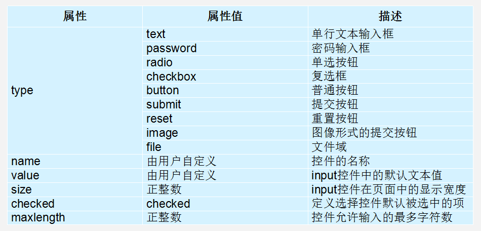

# HTML5

## 〇、基础知识

### 1. 浏览器内核

  浏览器内核可以分成两部分：

* 渲染引擎(layout engineer 或者 Rendering Engine)

  > 渲染引擎 负责取得网页的内容（HTML、XML、图像等等）、整理讯息（例如加入 CSS 等），以及计算网页的显示方式，然后会输出至显示器或打印机。

* JS 引擎

  > JS 引擎解析 Javascript 语言，执行 javascript语言来实现网页的动态效果。

#### (1)Trident(IE内核) 

  国内很多的双核浏览器的其中一核便是 Trident，美其名曰 "兼容模式"。代表： IE、傲游、世界之窗浏览器、Avant、腾讯TT、猎豹安全浏览器、360极速浏览器、百度浏览器等。

  Window10 发布后，IE 将其内置浏览器命名为 Edge，Edge 最显著的特点就是新内核 EdgeHTML。

#### (2)Gecko(firefox) 

  Gecko(Firefox 内核)： Mozilla FireFox(火狐浏览器) 采用该内核，Gecko 的特点是代码完全公开，因此，其可开发程度很高，全世界的程序员都可以为其编写代码，增加功能。 可惜这几年已经没落了， 比如 打开速度慢、升级频繁、猪一样的队友flash、神一样的对手chrome。

#### (3)webkit(Safari)  

   Safari 是苹果公司开发的浏览器，所用浏览器内核的名称是大名鼎鼎的 WebKit。代表浏览器：傲游浏览器3、 Apple Safari (Win/Mac/iPhone/iPad)、Symbian手机浏览器、Android 默认浏览器，

#### (4) Chromium/Bink(chrome) 

   在 Chromium 项目中研发 Blink 渲染引擎（即浏览器核心），内置于 Chrome 浏览器之中。Blink 其实是 WebKit 的分支。 大部分国产浏览器最新版都采用Blink内核。

#### (5) 移动端

   移动端的浏览器内核主要说的是系统内置浏览器的内核。

   目前移动设备浏览器上常用的内核有 Webkit，Blink，Trident，Gecko 等，其中

* iPhone 和 iPad 等苹果 iOS 平台主要是 WebKit
* Android4.4 系统以后浏览器切换到了Chromium，内核是 Webkit 的分支 Blink。

### 2. Web标准

   浏览器的内核不同，我们知道他们工作原理、解析肯定不同，显示就会有差别。

#### (1) Web 标准的好处

1. 让Web的发展前景更广阔 
2. 内容能被更广泛的设备访问
3. 更容易被搜寻引擎搜索
4. 降低网站流量费用
5. 使网站更易于维护
6. 提高页面浏览速度

#### (2) Web 标准构成

  Web标准不是某一个标准，而是由W3C和其他标准化组织制定的一系列标准的集合。主要包括结构（Structure）、表现（Presentation）和行为（Behavior）三个方面。

```
结构标准：结构用于对网页元素进行整理和分类，主要包括XML和XHTML两个部分。
样式标准：表现用于设置网页元素的版式、颜色、大小等外观样式，主要指的是CSS。
行为标准：行为是指网页模型的定义及交互的编写，主要包括DOM和ECMAScript两个部分
```

理想状态我们的源码： .HTML    .css   .js 

### 3. HTML基础概念

#### 3.1 HTML5骨架格式和文档类型

```html
<!DOCTYPE html>
<html lang="en">
<head>
	<meta charset="UTF-8">
	<title>Document</title>
</head>
<body>
	
</body>
</html>
```

1. `<!DOCTYPE html>` 标识文档类型，即告诉内核此文档使用的是HTML5。
2. `<meta charset="UTF-8">` 中的UTF-8是常用的字符集，包含全世界所有国家需要用到的字符。

#### 3.2 标签类型

* 双标签

  > <标签名> 内容 </标签名>
  >
  > `<p>文字</p>`

* 单标签

  > <标签名 />
  >
  > <hr />

#### 3.3 标签关系

* 嵌套关系

  > ```
  > <head>
  > 	<title> </title>
  > </head>
  > ```

* 并列关系

  > ```
  > <head></head>
  > <body></body>
  > ```

#### 3.4 HTML标签的语义化

##### ？为什么要有语义化标签？

1. 方便代码的阅读和维护
2. 同时让浏览器或是网络爬虫可以很好地解析，从而更好分析其中的内容 
3. 使用语义化标签会具有更好地搜索引擎优化 
4. 当我们去掉CSS之后，网页结构依然组织有序，并且有良好的可读性。

## 一、常用标签

### 1. 排版标签

#### 1.1 标题标签h1

  HTML提供了6个等级的标题，即：

```html
<h1>一级标题</h1>
<h2>二级标题</h2>
<h3>三级标题</h3>
<h4>四级标题</h4>
<h5>五级标题</h5>
<h6>六级标题</h6>
```

**注意**：  h1 标签因为重要，尽量少用，一般h1 都是给logo使用。

#### 1.2 段落标签p

  段落标签是：

```html
<p>文本内容</p>
```

是HTML文档中最常见的标签，默认情况下，文本在一个段落中会根据浏览器窗口的大小自动换行。

#### 1.3 水平线和换行

##### (1) 水平线hr

```html
<hr/>
```

##### (2)换行br

```html
<br/>
```

#### 1.4 div和span

  div和span  是没有语义的 ，是网页布局主要的2个盒子

##### (1)div

  div是块级标签：

```html
<div></div>
```

##### (2)span

  span是行内块标签：

```html
<span></span>
```

#### 1.5 注释标签

```html
<!-- 注释语句 -->
```

#### 1.6 HTML5新增排版标签

- header：定义文档的页眉 头部

- nav：定义导航链接的部分

- footer：定义文档或节的页脚 底部

- article：定义文章。

- section：定义文档中的节（section、区段）

- aside：定义其所处内容之外的内容 侧边

  ```html
  <header> 语义 :定义页面的头部  页眉</header>
  <nav>  语义 :定义导航栏 </nav> 
  <footer> 语义: 定义 页面底部 页脚</footer>
  <article> 语义:  定义文章</article>
  <section> 语义： 定义区域</section>
  <aside> 语义： 定义其所处内容之外的内容 侧边</aside>
  ```

### 2. 文本格式化标签

  在网页中，有时需要为文字设置粗体、斜体或下划线效果，这时就需要用到HTML中的文本格式化标签，使文字以特殊的方式显示。

#### 2.1 strong/b 

  标签所包裹的文本加粗，推荐使用<strong></strong>

#### 2.2 em/i

  标签所包裹的文本倾斜，推荐使用<em></em>

#### 2.3 del/s

  标签所包裹的文本加删除线，推荐使用<del></del>

#### 2.4 ins/u

  标签所包裹的文本加下划线，推荐使用<ins></ins>

### 3. 图像标签img

  src属性用于指定图像文件的路径和文件名，是img标签的必需属性。

```html

```


#### 3.1标签属性

  使用HTML制作网页时，如果想让HTML标签提供更多的信息，可以使用HTML标签的属性加以设置。其基本语法格式如下：

```html
<标签名 属性1="属性值1" 属性2="属性值2" …> 内容 </标签名>
```

- 任何标签的属性都有默认值，省略该属性则取默认值
- 采取  键值对 的格式   key="value"  的格式  
- 宽高均不需要带单位（单位是px）

```html

```

### 4. 链接标签a

  在HTML中创建超链接非常简单，只需用标签环绕需要被链接的对象即可，其基本语法格式如下：

```html
<a href="跳转目标" target="目标窗口的弹出方式">文本或图像（标签）</a>
```

* href：用于指定链接目标的url地址，当为标签应用href属性时，它就具有了超链接的功能。
* target：用于指定链接页面的打开方式，其取值有_self和_blank两种，其中_self为默认值，_blank为在新窗口中打开方式。

**注意**：

1. 外部链接 需要添加 http:// www.baidu.com
2. 内部链接 直接链接内部页面名称即可 比如 < a href="index.html"> 首页 </a >
3. 如果当时没有确定链接目标时，通常将链接标签的href属性值定义为“#”(即href="#")，表示该链接暂时为一个空链接。

#### 4.1 锚点定位

  通过创建锚点链接，用户能够快速定位到目标内容。创建锚点链接分为两步：

1. 使用 `<a href="#id名">链接文本</a> `创建链接文本。
2. 为要跳转的目标使用**相应的id名**标注跳转目标的位置。

```html
<a href="#oneborder">4.边框</a>
<!-- 此处略去一万字......-->
<h3 id="oneborder">4.边框</h3>
```

### 5. base标签base

  base 可以设置整体链接的打开状态（在当前页面打开还是在新标签页打开），base 写到  <head>  </head>  之间

```html
<head>
	<base target="blank" />
<head/>
```

### 6. 特殊字符（转义字符）

* \&emsp; 汉字（宽度）空白


### 7. 列表标签

#### 7.1 无序列表ul

  无序列表的各个列表项之间没有顺序级别之分，是并列的。其基本语法格式如下：

```html
<ul>
  <li>列表项1</li>
  <li>列表项2</li>
  <li>列表项3</li>
  ......
</ul>
```

ul无序列表的默认表现形式如下：

* ul中只能嵌套li
* <li>与</li>之间相当于一个容器，可以容纳所有元素。
* 无序列表会带有自己样式属性，放下那个样式，一会让CSS来！

#### 7.2 有序列表ol

  有序列表的基本语法格式如下：

```html
<ol>
  <li>列表项1</li>
  <li>列表项2</li>
  <li>列表项3</li>
  ......
</ol>
```

很少用。默认效果如下：

1. ol中只能嵌套li
2. <li>与</li>之间相当于一个容器，可以容纳所有元素。
3. 有序列表会带有自己样式属性，放下那个样式，一会让CSS来！

#### 7.3 自定义列表dl

  定义列表常用于对术语或名词进行解释和描述，定义列表的列表项前没有任何项目符号。其基本语法如下：

```html
<dl>
  <dt>帮助中心</dt>
  <dd>账户管理</dd>
  <dd>购物指南</dd>
</dl>
```

其默认显示如下：

```
帮助中心

	账户管理

	购物指南
```

一般用CSS去除`<dd></dd>` 标签前面的空白margin使之呈现:

```
帮助中心

账户管理

购物指南
```

### 8.表格table

  创建表格的基本语法格式如下：

```html
<table>
  <tr>
    <td>(1,1)</td>
    <td>(1,2)</td>
  </tr>
  <tr>
    <td>(2,1)</td>
    <td>(2,2)</td>
  </tr>
</table>
```

在上面的语法中包含三对HTML标签，分别为 <table></table>、<tr></tr>、<td></td>。

* table用于定义一个表格。
* tr 用于定义表格中的一行，必须嵌套在 table标签中，在 table中包含几对 tr，就有几行表格。只能包含<td></td>
* td 用于定义表格中的单元格，必须嵌套在<tr></tr>标签中，一对 <tr> </tr>中包含几对<td></td>，就表示该行中有多少列（或多少个单元格）。td就像一个容器，可以容纳所有的元素。

#### 8.1 表格属性


* width和height是整个表格（不包括caption）的尺寸，不要单位
* align是整个表格在页面中的对齐方式，不是内容在表格中的对齐方式

#### 8.2 表头标签th

  表头一般位于表格的第一行或第一列，其文本加粗居中。只需用表头标签<th></th>替代相应的单元格标签<td></td>即可。

#### 8.3 表格结构

  在使用表格进行布局时，可以将表格划分为头部、主体和页脚（页脚有兼容性问题），具体如下所示：

##### (1)thead

  用于定义表格的头部。必须位于<table></table> 标签中，一般包含网页的logo和导航等头部信息。

##### (2)tbody

  用于定义表格的主体。必须位于<table></table>标签中，一般包含网页中除头部和底部之外的其他内容。

##### (3)caption

  caption 元素定义表格标题。caption 标签必须紧随 table 标签之后。您只能对每个表格定义一个标题。通常这个标题会被居中于表格之上。

```html
<table border="1" cellspacing="0" width="400" height="600" align="center">
	<caption>我是表格标题</caption>
	<thead>
		<tr>
		  <td>(1,1)</td>
		  <td>(1,2)</td>
		  <td>(1,3)</td>
		</tr>
	</thead>
	<tbody>
		<tr>
		  <td>(2,1)</td>
		  <td>(2,2)</td>
		  <td>(2,3)</td>
		</tr>
		<tr>
		  <td>(3,1)</td>
		  <td>(3,2)</td>
		  <td>(3,3)</td>
		</tr>
	</tbody>
</table>
```


#### 8.4 合并单元格

  rowspan和colspan这两个属性应用于要合并的单元格td标签：

* 跨行合并：rowspan    一列中上下的单元格合并
* 跨列合并：colspan      一行中左右的单元格合并

```html
<table border="1" cellspacing="0" width="400" height="600" align="center">
	<caption>我是表头</caption>
	<thead>
		<tr>
		  <td>(1,1)</td>
		  <td>(1,2)</td>
		  <td>(1,3)</td>
		</tr>
	</thead>
	<tbody>
		<tr>
          <!-- (2,1)和(3,1)两个同列单元格跨行合并，删除(3,1) -->
		  <td rowspan="2">(2,1)</td>
		  <td>(2,2)</td>
		  <td>(2,3)</td>
		</tr>
		<tr>
		  <!-- <td>(3,1)</td> -->
          <!-- 下方两个同行单元格跨列合并，删除(3,3) -->
		  <td colspan="2">(3,2)</td>
		  <!-- <td>(3,3)</td> -->
		</tr>
	</tbody>
</table>
```


### 9.表单

  表单的目的是为了收集用户信息（通过用户输入）。一个完整的表单通常由:

* **表单控件**（也称为表单元素）：是一些标签，包含了具体的表单功能项，如单行文本输入框、密码输入框、复选框、提交按钮、重置按钮等。
* **提示信息**： 一个表单中通常还需要包含一些说明性的文字，提示用户进行填写和操作。
* **表单域** ：相当于一个容器，用来容纳所有的表单控件和提示信息，可以通过它定义 处理表单数据所用程序 的url地址，以及数据提交到服务器的方法。如果不定义表单域，表单中的数据就无法传送到后台服务器。

3个部分构成。

#### 9.1 input 标签

  <input />标签为单标签，type属性为其最基本的属性，其取值有多种，用于指定不同的控件类型。除了type属性之外，<input />标签还可以定义很多其他的属性，其常用属性如下表所示：

* checkbox类型的value是一个布尔值，选中时为true，反之为false



##### (1) H5新增type属性值

| 类型       | 使用示例                    | 含义         |
| -------- | ----------------------- | ---------- |
| email    | <input type="email">    | 输入邮箱格式     |
| tel      | <input type="tel">      | 输入手机号码格式   |
| url      | <input type="url">      | 输入url格式    |
| number   | <input type="number">   | 输入数字格式     |
| search   | <input type="search">   | 搜索框（体现语义化） |
| range    | <input type="range">    | 自由拖动滑块     |
| time     | <input type="time">     | 小时 分钟      |
| date     | <input type="date">     | 年 月 日      |
| datetime | <input type="datetime"> | 时间         |
| month    | <input type="month">    | 月 年        |
| week     | <input type="week">     | 星期 年       |

##### (2) H5新增input属性值 

* placeholder

  > `<input type="text" placeholder="请输入用户名">`
  >
  > 占位符  当用户输入的时候 里面的文字消失  删除所有文字，自动恢复

* autofocus

  > `<input type="text" autofocus>`
  >
  > 规定当页面加载时 input 元素应该自动获得焦点

* multiple

  > `<input type="file" multiple>`
  >
  > 多文件上传

* autocomplete

  > ```html
  > <form action="#">
  > 	<input type="text" autocomplete="on" name="qwer">
  > </form>
  > ```
  >
  > 规定表单是否应该启用自动完成功能  有2个值，一个是on 一个是off      
  >
  > 1.on 代表记录已经输入的值，并在下次获得焦点时以下拉菜单的形式预测用户输入。off反之
  >
  > 2.autocomplete 首先需要放入form表单域中，并且提交过 
  >
  > 2.这个input必须设置名字name属性

* required

  > `<input type="text" required>`
  >
  > 必填项  内容不能为空

* accesskey

  > `<input type="text" accesskey="s">`
  >
  > 规定激活（使元素获得焦点）元素的快捷键   采用 alt + s（与accesskey的值相同）的形式

#### 9.2 label 标签

  label 标签为 input 元素定义标注（标签）。作用：  用于绑定一个表单元素, 当点击label标签的时候, 被绑定的表单元素就会获得输入焦点。

* 直接包裹input即可:

  ```html
  <label>账号：<input type="text" /></label>
  ```

* 通过 label的for和input的id 属性规定 label 与哪个表单元素绑定:

  ```html
  <label for="male">账号：</label>
  <input id="male" type="text" value="male">
  ```

#### 9.3 textarea 文本域

  如果需要输入大量的信息，就需要用到<textarea></textarea>标签。通过textarea控件可以轻松地创建多行文本输入框，其基本语法格式如下：

* 禁止文本域拉伸（css）：

  ```
  禁止横向拉升 resize: vertical;
  纵向拉伸 resize: horizontal;
  不显示拉伸状态 resize: none;/resize: unset;
  ```

```html
<textarea cols="每行中的字符数" rows="显示的行数">
  文本内容
</textarea>
```

#### 9.4 select下拉菜单

  使用select控件定义下拉菜单的基本语法格式如下

```html
<select>
  <option>选项1</option>
  <option>选项2</option>
  <option>选项3</option>
  ...
</select>
```

**注意**：

1. select中至少应包含一对option。
2. 在option 中定义selected =" selected "时，当前项即为默认选中项。

#### 9.5 form表单域

  在HTML中，form标签被用于定义表单域，即创建一个表单，以实现用户信息的收集和传递，form中的所有内容都会被提交给服务器。创建表单的基本语法格式如下：

```html
<form action="url地址" method="提交方式" name="表单名称">
  各种表单控件
</form>
```

常用属性：

1. Action
   在表单收集到信息后，需要将信息传递给服务器进行处理，action属性用于指定接收并处理表单数据的服务器程序的url地址。

2. method
   用于设置表单数据的提交方式，其取值为get或post。get是从服务器上获取数据，post是向服务器传送数据。

   > 1.get请求通常表示获取数据
   >
   > 2.post请求通常表示提交数据
   >
   > 3.get请求发送的数据都写在地址栏上，用户可见
   >
   > 4.post请求发送的数据用户不可见
   >
   > 5.get请求不能提交大量数据，但post可以，因此不要混用

3. name
   用于指定表单的名称，以区分同一个页面中的多个表单。

注意：  每个表单都应该有自己表单域。

#### 9.6 HTML5新增表单元素和属性

##### (1)datalist选项列表

  datalist   标签定义选项列表。要与 input 元素配合使用该元素：

```html
<!-- input里面用 list 属性-->
<input type="text" value="输入明星" list="star"/>
<!-- datalist 里面用 id 属性 来实现和 input 链接 -->  
<datalist id="star">
    <option>刘德华</option>
    <option>刘若英</option>
    <option>刘晓庆</option>
    <option>郭富城</option>
    <option>张学友</option>
    <option>郭郭</option>
</datalist>
```

效果是：在input里面输入内容后，输入栏下方会以下拉菜单的形式**预测完整内容**


##### (2)fieldset 主题框

  fieldset 元素可将表单内的相关元素分组，打包legend 搭配使用

```HTML
<fieldset>
    <legend>用户登录</legend>  <!-- 标题 -->
    用户名: <input type="text">
  	<br /><br />
    密　码: <input type="password">
</fieldset>
```

效果如下（宽度可用css设置）：


### 10. 多媒体标签(H5新增)

#### 10.1 embed 多媒体

  embed可以用来插入各种多媒体，格式可以是 Midi、Wav、AIFF、AU、MP3等等。url为音频或视频文件及其路径，可以是相对路径或绝对路径。

  有兼容性问题，下方例子为插入网络视频： 

```html
<embed src="http://player.youku.com/player.php/sid/XMTI4MzM2MDIwOA==/v.swf" allowFullScreen="true" quality="high" width="480" height="400" align="middle" allowScriptAccess="always" type="application/x-shockwave-flash"></embed>
```

#### 10.2 audio 音频 

  HTML5通过<audio>标签来解决音频播放的问题:

```html
<audio src="路径"><audio/>
```

常用属性：

* autoplay 自动播放
* controls 是否显示默认播放控件
* loop 循环播放   loop = 2 就是循环2次   loop  或者  loop = "-1"   无限循环

各家浏览器支持的音频格式不同，可以使用如下解决方案：

```html
<audio controls>
	<source src="./music/See you again.mp3">
	<source src="./music/See you again.wav">
	<source src="./music/See you again.ogg">
</audio>
```

#### 10.3 source 路径 

```
<source src="./music/See you again.mp3">
```

#### 10.4 video 视频

  HTML5通过<video>标签来解决视频播放的问题：

* 控制视频水平居中，可以给视频的父容器加一个`text-align: center;`

```html
<video src="路径"><video/>
```

常用属性：

- autoplay 自动播放
- controls 是否显示默认播放控件
- loop 循环播放   loop = 2 就是循环2次   loop  或者  loop = "-1"   无限循环
- width 设置播放窗口宽度
- height 设置播放窗口的高度

各家浏览器支持的视频格式不同，可以使用如下解决方案：

```
<video controls>
	<source src="./video/movie.mp4">
	<source src="./video/movie.ogg">
</video>
```

## 二、H5新增API

### 1. 网络状态

* 可以通过window.navigator.onLine来检测网络是否连接，连接返回true，断开返回false，有兼容性问题，不同浏览器表现不一样。

#### 1.1 online事件

* window对象的online事件可以监测计算机网络连接
* 当网络连通的时候执行事件处理函数

```javascript
// <p class="tips"></p>
// 1. 当网络连接到时候  弹出 p 显示网络连接 然后消失
window.addEventListener('online', function() {
	  $(".tips").text("网络已经连接").fadeIn(500).delay(1000).fadeOut();
})
```

#### 1.2 offline事件

* window对象的online事件可以监测计算机网络断开
* 当网络断开的时候执行事件处理函数

```javascript
// <p class="tips"></p>
// 2. 当网络断开到时候  弹出 p 显示网络已断开 然后消失
window.addEventListener('offline', function() {
  	$(".tips").text("奥利个奥，网络断开了").fadeIn(500).delay(1000).fadeOut();
})
```

### 2. 全屏（兼容）

#### 2.1 全屏/取消全屏

  HTML5规范允许用户自定义网页上**任一元素**全屏显示。

* element.requestFullScreen() 开启全屏显示，由需要全屏的DOM元素调用。
* document.cancelFullScreen() 关闭全屏显示，由document调用。

以上两个方法都有兼容性问题，需加浏览器内核前缀：

* webkit内核浏览器：**webkit**RequestFullScreen()、**webkit**CancelFullScreen()，如chrome浏览器。
* Gecko内核浏览器：**moz**RequestFullScreen()、**moz**CancelFullScreen()，如火狐浏览器。
* ms  微软  **ms**RequestFull**s**creen——**这个s是小写**

```javascript
// 能力检测  做一个兼容性的解决方法
 if(div.requestFullScreen) {  // 正常浏览器 
 	div.requestFullScreen();
 } else if (div.webkitRequestFullScreen) {  // webkit 内核
 	div.webkitRequestFullScreen();
 } else if (div.mozRequestFullScreen) {  // moz
 	div.mozRequestFullScreen();
 } else if (div.msRequestFullscreen) {  // ms 微软  这里面有个坑 别掉进去了
 	div.msRequestFullscreen(); //  ms 里面这样写msRequestFullscreen()     s是小写的  
 } else {   // 欧朋
 	div.oRequestFullScreen();
 }
```

```javascript
// 取消全屏  跟元素没有关系  跟 document
document.querySelector("#cancelFull").onclick = function() {
	document.webkitCancelFullScreen();  // document 退出全屏
}
```

#### 2.2 检测全屏状态（慎用）

  检测当前是否处于全屏，不同浏览器需要添加前缀：

* document.webkitIsFullScreen
* document.mozFullScreen

是全屏状态返回true，不是返回false。

#### 2.3 全屏伪类选择器

  全屏伪类选择器可以设置指定元素在全屏状态下的css样式，要加浏览器前缀：

* div:-webkit-full-screen { css样式 }，在div全屏时生效
* div:moz-full-screen { css样式 }，在div全屏时生效

### 3. 文件读取

#### 3.1 上传文件到浏览器

1. 通过文件域`<input type="file" multiple >` 上传文件（记input:file标签的DOM对象是input）
2. 文件对象file，保存在**文件域DOM对象**的files属性中。input.files是一个伪数组，每一个元素都是**文件对象**
3. 使用文件读取API（3.2 介绍），读取**文件对象**的内容

#### 3.2 内置FileReader类

  要读取**文件对象**（`input.files[0]`），需要创建**文件读取对象**（ `var reader = new FileReader()`），由文件读取对象调用**文件读取API**（`reader.readAsText(input.files[0])`），并将读取结果放入**文件读取对象**的`reader.result`属性中。

##### (1) onchange事件

* change事件用在其绑定元素发生变化时
* input:file文件域上传文件
* select下拉菜单选中option
* input:text输入的文本改变，且文本框失去焦点的时候触发

##### (2) reader.readAsText()

* 把**文件对象**作为文本文件读取，把文本内容放入reader.result属性中
* 参数：文件对象
* 读取结果放在reader.result属性中

##### (3) reader.readAsDataURL()

* 把**文件对象**作为DataURL（data:image/png;base64,iVBORw...很长）读取，把读取结果放入reader.result属性中
* 参数：文件对象
* 读取结果放在reader.result属性中
* 用途：读取图片，把reader.result作为img标签的src属性，即可把读取到的图片放入页面

##### (4) onload事件

* 以上两个方法均是异步操作，即文件对象被读取完成之前，程序已向下执行
* 当它们完成读取的时候 reader.readyState这个参数就会转换为 done 即完成态
* 当它们完成读取的时候reader.onload事件会触发。

#### 3.3 读取文本文件

```html
<body>
	<!-- 1.文件域，打开文件操作 -->
	<input type="file" name="" id="">
	<p></p>
	<script>
		// 获取文件域DOM对象，文件对象在inputF.files伪数组中
		var inputF = document.querySelector('input');
		// 2.为文件域DOM对象注册change事件，当打开文件时触发
		inputF.addEventListener('change', function () {
			// 3.文件读取对象调用API读取文件对象的内容
			var reader = new FileReader();
			reader.readAsText(this.files[0]);
			// 4.文件内容读取完毕，处理文件内容
			reader.onload = function () {
				document.querySelector('p').innerHTML = this.result;
			}
		})
	</script>
</body>
```

#### 3.4 读取图片显示缩略图

```html
<body>
	<!-- 1.文件域，打开文件操作 -->
	<input type="file" name="" id="">
	
	<p></p>
	<script>
		// 获取文件域DOM对象，文件对象在inputF.files伪数组中
		var inputF = document.querySelector('input');
		// 2.为文件域DOM对象注册change事件，当打开文件时触发
		inputF.addEventListener('change', function () {
			// 3.文件读取对象调用API读取文件对象的内容
			var reader = new FileReader();
			reader.readAsDataURL(this.files[0]);
			// 4.文件内容读取完毕，处理文件内容
			reader.onload = function () {
				document.querySelector('img').src = this.result;
			}
		})
	</script>
</body>
```

### 4. 地理定位

在HTML规范中，增加了获取用户地理信息的API，这样使得我们可以基于用户位置开发互联网应用，即基于位置服务 (Location Base Service)

#### 4.1 API详解（谷歌地图）

1. 获取当前地理信息

   navigator.geolocation.getCurrentPosition(successCallback, errorCallback) 


2. 重复获取当前地理信息

   navigator. geolocation.watchPosition(successCallback, errorCallback)

当成功获取地理信息后，会调用succssCallback，并返回一个包含位置信息的对象position。

position.coords.latitude 纬度

position.coords.longitude经度

position.coords.accuracy精度

position.coords.altitude海拔高度

当获取地理信息失败后，会调用errorCallback，并返回错误信息error

http://www.w3school.com.cn/html5/html_5_geolocation.asp

#### 4.2 应用

  由于谷歌地图在桌面浏览器中不可用，在现实开发中，通过调用第三方API（如百度地图）来实现地理定位信息，这些API都是基于用户当前位置的，并将用位置位置（经/纬度）当做参数传递，就可以实现相应的功能。

http://lbsyun.baidu.com/   百度地图api

### 5. 拖放

* 在 HTML5 中，拖放是标准的一部分，任何元素都能够拖放。
* 拖放分为两种动作：
* 拖拽：Drag
* 释放：Drop

#### 5.1 设置元素为可拖放

* draggable 属性：就是标签元素要设置draggable="true"，否则不会有效果 
* 注意：  **链接**和**图片**默认是可拖动的，不需要 draggable 属性。

#### 5.2 拖拽事件

##### 5.2.1 绑定给被拖拽元素的

###### (1) ondragstart

* 绑定给谁：要被拖拽的元素
* 何时触发：“被拖拽的元素”开始被拖拽

###### (2) ondrag

- 绑定给谁：要被拖拽的元素
- 何时触发：“被拖拽的元素”被拖拽过程中，鼠标松开前，**一直触发**

###### (3) ondragend

- 绑定给谁：要被拖拽的元素
- 何时触发：“被拖拽的元素”拖拽结束，即鼠标松开

##### 5.2.2 绑定给目标容器的

###### (4) ondragenter

- 绑定给谁：要放入的目标元素（容器）
- 何时触发：拖着“被拖拽的元素”的**鼠标进入**目标容器时

###### (5) ondragover

- 绑定给谁：要放入的目标元素（容器）
- 何时触发：拖着“被拖拽的元素”的**鼠标进入**在目标容器上方，**一直触发**
- **浏览器默认会阻止ondrop事件，需要在ondragover事件中阻止默认行为（return false）**

###### (6) ondragleave

- 绑定给谁：要放入的目标元素（容器）
- 何时触发：拖着“被拖拽的元素”的**鼠标离开**目标容器时

#### 5.3 释放事件（目标容器）

##### (1) ondrop

- 绑定给谁：要放入的目标元素（容器）
- 何时触发：鼠标拖着“被拖拽的元素”在目标容器上方释放
- **浏览器默认会阻止此事件，需要在ondragover事件中阻止默认行为（return false）**

#### 5.4 event.dataTransfer

  当拖放事件（上面那7个事件）发生时，拖放事件的事件对象event会有一个dataTransfer属性（对象），它提供了一些方法，可以保存一个拖放事件中的数据，在另一个拖放事件中读取。

* setData("text/html", event.target.id)
* getData("text/html")

##### (1) setData()

* 一般在ondragstart事件中调用，保存当前被拖动DOM元素的id
* event.dataTransfer.setData("text/html", event.target.id)
* 参数1：指定保存的数据类型
* 参数2：与指定类型对应的数据，如字符串

##### (2) getData()

- 一般在ondrop事件中调用，获取正被拖动的DOM元素的id，以获取这个元素，将其放入目标容器
- var id = event.dataTransfer.getData("text/html")
- 参数：指定保存的数据类型，与setData中对应。
- 返回值：dataTransfer保存的的数据，如字符串

#### 5.5 拖放案例

  当页面上有多个元素需要拖拽，且有多个目标容器时，不需要为每一个元素注册一遍拖放相关的事件，利用事件委托（事件冒泡）：

* 给document注册**ondragstart**事件，将event.target存入dataTransfer
* **注意** ：要阻止“浏览器阻止ondrop事件”，需要给document注册**ondragover**事件，**return false**即可
* 再给document注册**ondrop**事件，读取dataTransfer中的数据，找到被拖拽的元素，将其追加到目标容器中即可
* BUG：被拖拽的元素可以被放入页面任何容器（包括body），解决办法：ondrop事件只添加到需要拖入的目标容器


```html
<body>
	<div id="div1">
		<p id="p1" draggable="true">拖拽内容1</p>
		<p id="p2" draggable="true">拖拽内容2</p>
		<p id="p3" draggable="true">拖拽内容3</p>
		<p id="p4" draggable="true">拖拽内容4</p>
	</div>
	<div id="div2"></div>
	<div id="div3"></div>
	<script>
		document.ondragstart = function (event) {
			event.dataTransfer.setData('text/html', event.target.id);
		}
		document.ondragover = function () {
			return false;
		}
		document.getElementById('div1').ondrop = function (event) {
			var id = event.dataTransfer.getData('text/html');
			var theDrager = document.getElementById(id);
			event.target.appendChild(theDrager);
		}
		document.getElementById('div2').ondrop = function (event) {
			var id = event.dataTransfer.getData('text/html');
			var theDrager = document.getElementById(id);
			event.target.appendChild(theDrager);
		}
		document.getElementById('div3').ondrop = function (event) {
			var id = event.dataTransfer.getData('text/html');
			var theDrager = document.getElementById(id);
			event.target.appendChild(theDrager);
		}
	</script>
</body>
```

### 6. Web存储

随着互联网的快速发展，基于网页的应用越来越普遍，同时也变的越来越复杂，为了满足各种各样的需求，会经常性在本地存储大量的数据，HTML5规范提出了相关解决方案。

#### 6.1 特性

1. 设置、读取方便、页面刷新不丢失数据
2. 容量较大，sessionStorage约5M、localStorage约20M
3. 只能存储**字符串**，可以将对象JSON.stringify() 编码后存储

#### 6.2 window.sessionStorage

1. 页面会话在浏览器打开期间一直保持，并且**重新加载**或**恢复页面**仍会保持原来的页面会话。
2. 打开多个相同的URL的Tabs页面，会创建**各自**的`sessionStorage`。
3. 关闭对应浏览器tab，会清除对应的`sessionStorage`。

#### 6.3 window.localStorage

1. 永久生效（关闭浏览器也不会删除），除非手动删除 关闭页面也会存在
2. 可以多窗口（页面）共享（同一浏览器可以共享）

#### 6.4 方法详解

以下四个方法window.sessionStorage和window.localStorage都有（用法一样）：

1. setItem(key, value) 设置存储内容
2. getItem(key) 读取存储内容
   * 未获取到数据返回null
3. removeItem(key) 删除键值为key的存储内容
4. clear() 清空所有存储内容

```javascript
var username = document.querySelector("#username");
//1. 点击按钮存取数据 
document.querySelector("#setData").onclick = function() {
	// 点击之后得到 username 里面值
	var val = username.value;  
	// 存储数据
	// window.sessionStorage.setItem(key, value) 设置存储内容
	window.sessionStorage.setItem("username", val);
}
//2. 点击按钮获得数据 
document.querySelector("#getData").onclick = function() {
	// 获得数据
	// window.sessionStorage.getItem(key) 读取存储内容
	alert(window.sessionStorage.getItem("username")) ;
}
//3. 删除数据 
document.querySelector("#delData").onclick = function() {
    // window.sessionStorage.removeItem(key) 删除键值为key的存储内容
    // window.sessionStorage.removeItem("username");
    // 删除所有的 数据 
    window.sessionStorage.clear();
}
```

#### 6.5 其它

* WebSQL、IndexDB

### 7. 应用缓存

HTML5中我们可以轻松的构建一个离线（无网络状态）应用，只需要创建一个cache manifest（缓存清单）文件。

#### 7.1 优势

1. 可配置需要缓存的资源
2. 网络无连接应用仍可用
3. 本地读取缓存资源，提升访问速度，增强用户体验
4. 减少请求，缓解服务器负担

#### 7.2 缓存清单

* 一个普通文本文件，其中列出了浏览器应缓存以供离线访问的资源，推荐使用.appcache为后缀名

例如我们创建了一个名为demo.appcache的文件，然后在需要应用缓存在页面的根元素(html标签)添加属性manifest="demo.appcache"，路径要保证正确。

#### 7.3 manifest文件格式*

1. 顶行写CACHE MANIFEST
2. CACHE: 换行 指定我们需要缓存的静态资源，如.css、image、js等
3. NETWORK: 换行 指定需要在线访问的资源，可使用通配符
4. FALLBACK: 换行 当被缓存的文件找不到时的备用资源

```
CACHE MANIFEST
# 上面必须是第一行 
CACHE:
#此部分写需要缓存的资源 （#是注释的意思）
./images/img1.jpg
./images/img2.jpg
./images/img3.jpg
./images/img4.jpg

NETWORK:
#此部分要写需要有网络才可访问的资源，无网络刚不访问
./images/img1.jpg
./images/img2.jpg

FALLBACK:
#当访问不到某个资源的情况下，自动由另一个资源替换
./images/img4.jpg  ./images/img5.jpg
```

#### 7.4 其它

1. CACHE: 可以省略，这种情况下将需要缓存的资源写在CACHE MANIFEST
2. 可以指定多个CACHE: NETWORK: FALLBACK:，无顺序限制
3. \#表示注释，只有当demo.appcache文件内容发生改变时或者手动清除缓存后，才会重新缓存。
4. chrome 可以通过chrome://appcache-internals/工具和离线（offline）模式来调试管理应用缓存


### 8. 多媒体

* HTML5 DOM 为 <audio> 和 <video> 元素提供了方法、属性和事件。
* 这些方法、属性和事件允许您使用 JavaScript 来操作 <audio> 和 <video> 元素。
* [详见W3C](https://www.w3school.com.cn/tags/html_ref_audio_video_dom.asp)

#### 8.1 Audio/Video属性

| 常用属性                                     | 作用                      |
| ---------------------------------------- | ----------------------- |
| [currentTime](https://www.w3school.com.cn/tags/av_prop_currenttime.asp) | 设置或返回音频/视频中的当前播放位置（以秒计） |
| [currentSrc](https://www.w3school.com.cn/tags/av_prop_currentsrc.asp) | 返回当前音频/视频的 URL          |
| [duration](https://www.w3school.com.cn/tags/av_prop_duration.asp) | 返回当前音频/视频的长度（以秒计）       |