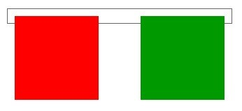

# CSS常用样式汇总速查

## 一、字体样式（font）

```css
.fontStyle {
	font-style: italic;	/*normal：默认值，标准字体; italic：斜体; oblique：倾斜。*/
	font-weight: bold;	/*normal、bold、bolder、lighter、100~900（100的整数倍），400 等价于 normal，而 						    700 等价于 bold*/
	font-size: 14px;	/*也可以用单位em来表示相对大小*/
	font-family: "宋体"；	/*也可以用Unicode十六进制编码\5B8B\4F53表示*/
	font: italic bold 14px "宋体";	/*必须按照：样式(斜体) 粗细 大小 字体 顺序来写，前两个可以省略，后两									   个必须有*/
}
```

## 二、文本样式（text）

```css
.textStyle {
	color: red;	/*也可以用#f36ba2/#f00(简写)表示颜色*/
	color: rgba(0, 0, 0, 0.3);	/*文字颜色半透明，最后个参数取值0~1*/
	line-height: 22px;	/*单位有三种，分别为px，em和%，使用最多的是px,行距比字号大7.8像素*/
	text-align: left;	/*left：左对齐（默认值） right：右对齐  center：居中对齐*/
	text-indent: 2em;	/*首行缩进两字符*/
	text-decoration: none;	/*文本装饰：none无装饰；underline下划线；overline上划线；line-through删除线								*/
	text-shadow: 2px 2px 5px rgba(0, 0, 0, 0.3);	/*文字阴影：水平位置 垂直位置 模糊距离 半透明颜色。												  后两者为可选*/
	letter-spacing: 2px; /*字符间距，默认为normal，可以为负值*/
	word-spacing: 2px;	/*英文单词间距，默认为normal，可以为负值*/
}
```

* 文本不可选中，并不是w3c标准，有些浏览器不支持

```
-moz-user-select:none;/*火狐*/
-webkit-user-select:none;/*webkit浏览器*/
-ms-user-select:none;/*IE10*/
user-select:none;
```

## 三、背景样式（background）

* 背景渐变：
  * 水平背景渐变background: linear-gradient(to right, red, blue)
  * 垂直背景渐变background: linear-gradient(red, blue)


* 背景图像的位置区域：background-origin: content-box, padding-box,和 border-box区域内可以放置背景图像。
  * border-box：背景图像从边框开始放置（背景会显示在边框上）
  * padding-box：背景从内边距开始放置（背景会显示在内边距上，但不会显示在边框上）
  * content-box：背景从内容区域开始放置（背景不会显示在内边距和边框上）
* 背景剪裁：background-clip背景剪裁属性是从指定位置开始绘制。（设置的是裁切，控制的是显示）
  * padding-box：背景在**边框**上的显示会被裁切掉（背景从边框开始但不会在**边框**上显示）
  * content-box：背景在**边框**和**内边距**上的显示会被裁切掉（背景从边框开始但不会在**边框**和**内边距**上显示）

```css
.backgroundStyle {
	background-color: #fff;	/*背景颜色*/
	background: rgba(0, 0, 0, 0.3);	/*背景半透明*/
	background-image: url(image/h.jpg);	/*图片背景：取值：none | url (url)*/
	background-repeat: no-repeat;	/*背景重复，取值：repeat | no-repeat | repeat-x | repeat-y*/
	background-attachment: fixed;	/*背景附着：fixed表示背景固定在页面上，跟随页面一起移动；scroll表示背									景不跟随页面一起移动*/
	background-position: 10px 10px;	/*1.水平位置 垂直位置。可以取百分比、数值、方位词(top | center | 										bottom | left | center | right )。*/
								 /*2.精确单位和方位名字混合使用，必须是x坐标在前，y坐标后面*/
								 /*3.只指定一个值，该值将用于横坐标。纵坐标将默认为50%*/
	background-size: 500px;	/*可以设置像素(x、y可只设置一个，会等比例缩放，溢出隐藏)、百分比(参照盒子的宽							   高，溢出部分则会被隐藏)*/
						  /*cover:自动调整缩放比例，保证图片始终填充满背景区域，如有溢出部分则会被隐藏*/
						  /*contain:自动调整缩放比例，保证图片始终完整显示在背景区域,通常会被拉伸*
	/*背景简写：背景(半透明)颜色 背景图片地址  背景平铺  背景滚动  背景位置/背景缩放 */
	background: #fff url(image/h.jpg) no-repeat fixed 10px 10px/cover;	/*若“背景位置/背景缩放” 只有一																	   组坐标则表示“背景位置”*/
	/*多背景，前面的背景图会覆盖在后面的背景图之上，背景色通常都定义在最后一组上*/
	background:url(h.jpg) no-repeat scroll 10px 20px/50px 60px,
		   	url(h.jpg) no-repeat scroll 10px 20px/70px 90px,
		   	url(h.jpg) no-repeat scroll 10px 20px/110px 130px #aaa;
}
```

## 四、凹凸文字效果

```css
/*凹凸文字效果，必须设置文字和其背景颜色相同*/
div {
	color: #ccc;	/*必须设置文字和其背景颜色相同*/
}
div > h3 {
	color: #ccc;	/*必须设置文字和其背景颜色相同*/
	font: 700 200px "宋体"；
}
.ao {
	text-shadow: 1px 1px 3px #fff, -1px -1px 3px #000;
}
.tu {
	text-shadow: -1px -1px 3px #000, 1px 1px 3px #fff;
}
```

## 五、选择器

### 1.CSS特性

#### 1.1 层叠性

一般情况下，如果出现样式冲突，则会按照CSS书写的顺序，以最后的样式为准。

1. 样式冲突，遵循的原则是就近原则。 那个样式离着结构近，就执行那个样式。
2. 样式不冲突，不会层叠

#### 1.2 继承性

  继承性是指书写CSS样式表时，子标签会继承父标签的某些样式，想要设置一个可继承的属性，只需将它应用于父元素即可。可继承的属性：

1. 文本颜色color
2. text-开头的文本样式
3. font-开头的字体样式
4. line-开头的文本样式

#### 1.3 特殊性

  特殊性是一个衡量CSS值优先级的一个标准，用一个四位的数 字串(CSS2是三位)来表示，更像四个级别，值从左到右，**左面的最大**，一级大于一级，数位之间**没有进制**，**级别之间不可超越**。**权重是可以叠加的** 。

| 选择器                 | 权重      |
| ------------------- | ------- |
| **继承**或者**通配符选择器*** | 0,0,0,0 |
| 每个标签选择器             | 0,0,0,1 |
| 每个类/伪类选择器           | 0,0,1,0 |
| 每个ID选择器             | 0,1,0,0 |
| 每个行内样式              | 1,0,0,0 |
| 每个!important贡献值     | ∞ 无穷大   |

**注意：**

1. 继承样式的权重为0。即在嵌套结构中，不管父元素样式的权重多大，被子元素继承时，他的权重都为0，也就是说子元素定义的样式会覆盖继承来的样式。
2. 行内样式优先。应用style属性的元素，其行内样式的权重非常高，可以理解为远大于100。总之，他拥有比上面提高的选择器都大的优先级。
3. 权重相同时，CSS遵循就近原则。也就是说靠近元素的样式具有最大的优先级，或者说排在最后的样式优先级最大。
4. CSS定义了一个!important命令，该命令被赋予最大的优先级。也就是说不管权重如何以及样式位置的远近，!important都具有最大优先级。

### 1. 基本选择器

```css
/*1.标签选择器，优先级权重:0,0,0,1*/
div {
	color: red;
}
/*2.类选择器，  优先级权重:0,0,1,0*/
.the-class {
	color: red;
}
/*3.id选择器，  优先级权重:0,1,0,0*/
#the-id {
	color: red;
}
/*4.通配符选择器，优先级最低*/
* {
	color: red;
}
/*5.链接伪类选择器(lvha)，优先级权重:0,0,1,0*/
/*其实也可以不是链接标签，其他的亦可*/
/* a:link      未访问的链接 */
/* a:visited   已访问的链接 */
/* a:hover     鼠标移动到链接上 */
/* a:active    选定的链接 */
/* a:focus     获得焦点的链接，即鼠标点击链接后没有点击其他位置之前 */
a:hover {
	color: red;
}
/*6.结构伪类选择器，优先级权重:0,0,1,0*/
li:nth-last-child(2n) {
	color: red;
}
span:first-of-type {
	color: red;
}
li:nth-of-type(3n) {
	color: red;
}
/*7.目标伪类选择器，优先级权重:0,0,1,0*/
:target {
	color: red;
}
/*8.!important，优先级权重:∞*/
.the-class {
	color: red !important;
}
```

### 2. 复合选择器

```css
/*8.交集选择器，优先级根据叠加结果*/
p.the-class {	/*优先级：0,0,1,1*/
	color: red;
}
/*9.并集选择器，优先级根据叠加结果*/
.the-class,
p, {
	color: red;
}
/*10.后代选择器，优先级根据叠加结果*/
div p {		/*选择div标签下的所有p标签*/
	color: red;
}
/*11.子元素选择器，优先级根据叠加结果*/
div > p {	/*只选择div标签紧邻的下一级p标签*/
	color: red;
}
/*12.属性选择器，优先级权重:0,0,1,0*/
/* 获取到 拥有 该属性的元素 */
div[class=font] { /*  class=font 表示选择 class="font" */
	color: pink;
}
div[class^=font] { /*  class^=font 表示属性以 font 开始就行了 */
	color: pink;
}
div[class$=footer] { /*  class$=footer 表示属性以 footer 结束就行了 */
	color: skyblue;
}
div[class*=tao] { /* class*=tao  *=  表示tao 在属性中任意位置都可以 */
	color: green;
}
/*13.伪元素选择器，优先级权重:0,0,1,0，可以取first-letter/first-line/selection(表示选中文本)/before/after*/
p::first-letter {
	color: red;
}
div::before {
  content:"开始";
}
div::after {
  content:"结束";
}
```

## 六、标签显示模式（display）

### 1. 块级元素(block-level)

#### 1.1 常见块级元素

```html
<h1>~<h6>
<p>
<div>
<ul>
<li>
<ol>
```

#### 1.2 块级元素特点

```
（1）总是从新行开始
（2）高度，行高、外边距、内边距都可以控制。
（3）宽度默认是容器的100%
（4）可以容纳内联元素和其他块元素。
```

### 2. 行内块元素（inline-block）

#### 2.1 常见行内块元素

```html

<input />
<td>	<!--表格的单元格-->
```

#### 2.2 行内块元素特点 

```
（1）和相邻行内元素（行内块）在一行上,但是之间会有空白缝隙。
（2）默认宽度就是它本身内容的宽度。
（3）高度，行高、外边距以及内边距都可以控制。
```

### 3. 行内元素(inline-level)

#### 3.1 常见行内元素

```html
<a>
<strong>
<b>
<em>
<i>
<del>
<s>
<ins>
<u>
<span>
```

#### 3.2 行内元素的特点

```
（1）和相邻行内元素在一行上。
（2）高、宽无效，但水平方向的padding和margin可以设置，垂直方向的无效。
（3）默认宽度就是它本身内容的宽度。
（4）行内元素只能容纳文本或则其他行内元素。（a特殊）
```

### 4. 标签显示模式转换 display

```css
/*写在style里*/
块转行内：display:inline;
行内转块：display:block;
块、行内元素转换为行内块： display: inline-block;
```

## 七、盒子样式（border、padding、margin）

### 1. 边框（border）

```css
input.one {
	border-width: 2px;	/*边框的宽度*/
	border-style: solid;	/*边框的样式：none无边框，solid实线边框，dashed虚线边框，dotted点线边框，							double双实线边框*/
	border-color: #f00;	/*颜色*/
	border: 2px solid #f00;	/*简写：宽度 样式 颜色*/
  
	border-top-width: 2px;	/*也可以为left/right/bottom*/
	border-top-style: solid;
	border-top-color: #f00;
	border-top: 2px solid #f00;
	
	border-radius: 50%;		/*相对于边长的50%作为圆角半径，若是正方形则变成一个圆, 长方形则变成一个椭圆*/
	border-radius: 10px;	/*边框圆角的半径，一个值表示四个角一样*/
	border-radius: 10px 20px;	/*左上角-第一个值；/(右上角&左下角)对角-第二个值；右下角-第一个值*/
	border-radius: 10px 20px 30px;	/*左上角-第一个值；/(右上角&左下角)对角-第二个值；右下角-第三个值*/
	border-radius: 10px 20px 30px 40px;	/*顺时针：左上 右上 右下 左下*/
}
/*合并相邻盒子的边框*/
table {		/*表格的cellspacing="0"后两个边框相邻，很粗，border-collapse用于合并表格中相邻的边框*/
	border-collapse: collapse;
}
```

### 2. 内边距（padding）

```css
input.two {
	padding: 10px;	/*上下左右边距都是10px*/
	padding: 10px 20px;	/*上边距-第一个值；——(左右边距)-第二个值；下边距-第一个值*/
	padding: 10px 20px 30px;/*上边距-第一个值；——(左右边距)-第二个值；下边距-第三个值*/
	padding: 10px 20px 30px 40px;/*顺时针：上 右 下 左*/
	padding-top: 10px;
	padding-right: 10px;
	padding-bottom: 10px;
	padding-left: 10px;
}
```

### 3. 外边距（margin）

```css
input.two {
	margin: 10px;	/*上下左右边距都是10px*/
	margin: 10px 20px;	/*上边距-第一个值；——(左右边距)-第二个值；下边距-第一个值*/
	margin: 10px 20px 30px;/*上边距-第一个值；——(左右边距)-第二个值；下边距-第三个值*/
	margin: 10px 20px 30px 40px;/*顺时针：上 右 下 左*/
	margin-top: 10px;
	margin-right: 10px;
	margin-bottom: 10px;
	margin-left: 10px;
}
```

#### 3.1 外边距实现盒子水平居中

```css
/*让一个盒子实现水平居中，需要满足一下两个条件：
1. 必须是块级元素。     
2. 盒子必须指定了宽度（width）*/
.header { 
  width:960px;
  margin:0 auto;
}
```

### 4. CSS3盒模型

* <input type="button" value="查询"> 这样的按钮默认是border-box

```css
/*写在盒子的选择器中*/
box-sizing: content-box  /*盒子大小为 width + padding + border   content-box:此值为其默认值*/
box-sizing: border-box   /*盒子大小为 width    就是说  padding 和 border 是包含到width里面的*/
```

### 5. 盒子阴影

* 紧邻的兄弟盒子会挡住阴影，阴影想要显示出来，可以给盒子加相对定位

```css
div {
	width: 200px;
	height: 200px;
	border: 10px solid red;
	/* box-shadow: 5px 5px 3px 4px rgba(0, 0, 0, .4);  */
	/* box-shadow:水平位置 垂直位置 模糊距离 阴影尺寸（影子大小） 阴影颜色  内/外阴影(inset/outset)； */
	box-shadow: 15px 15px 30px 2px rgba(0, 0, 0, .4);	/*内/外阴影默认为外阴影，常省略*/
}
```

## 八、 浮动（float）

***元素添加浮动后，元素会  脱标  并具有  行内块元素  的特性***

### 1. 用法和特性

```css
div {
  	/*如果子级浮动后没有一行显示，设置父级的宽度(即div父级盒子的宽度)*/
	float: left;	/*或者right，默认是none*/
}
```

```
1.浮动的元素总是找理它最近的父级元素对齐。但是不会超出内边距的范围;
2.由2可以推断出，一个父盒子里面的子盒子，如果其中一个子级有浮动的，则其他子级都需要浮动。这样才能一行对齐显示;
3.元素添加浮动后，元素会具有行内块元素的特性;元素的大小完全取决于定义的大小或者默认的内容多少;
4.浮动的盒子需要和标准流的父级搭配使用
```

#### 1.1 特性

1. 前面的盒子浮动，后面的盒子会向上提升，补充到浮动盒子原来的位置
2. 后面（没有浮动）提升上来的块级元素，会被浮动盒子遮挡，且块级元素的内容只会在未遮挡的部分显示
   * 块级元素的宽度依旧是一整行（浏览器宽度），只不过左右被浮动元素遮挡且不会用于显示子元素

### 2. 清除浮动影响

#### 2.1 clear 属性

  在CSS中，clear属性用于清除浮动，其基本语法格式如下：

```
选择器{clear:属性值;}
```

| 属性值   | 描述                    |
| ----- | --------------------- |
| left  | 不允许左侧有浮动元素（清除左侧浮动的影响） |
| right | 不允许右侧有浮动元素（清除右侧浮动的影响） |
| both  | 同时清除左右两侧浮动的影响         |

#### 2.2 清除浮动

##### (1)额外标签法

  是W3C推荐的做法是通过在浮动元素末尾添加一个空的标签例如 <div style=”clear:both”></div>，或则其他标签br等亦可。

缺点： 添加许多无意义的标签，结构化较差。

##### (2)父级添加overflow

  通过触发BFC的方式，给父级添加： overflow为 hidden|auto|scroll  都可以实现。

缺点：  内容增多时候容易造成不会自动换行导致内容被隐藏掉，无法显示需要溢出的元素。

##### (3)前后伪元素法

1. 给父元素设置**before**和**after**两个伪元素；
2. 给两个伪元素设置**content为空""**，**display为table**；
3. 给**after伪元素设置clear:both**清除浮动
4. 针对IE6、7设置单独父元素***zoom:1**;

  详见下方代码块。

##### (4)后伪元素法

1. 给父元素设置**after**伪元素；
2. after伪元素中内容**content为一个点"."**；
3. after伪元素显示模式**diaplay设置为block**，**高度设为0**；
4. after伪元素清除浮动**clear: both**，显示属性**visibility为隐藏hidden**；
5. 针对IE6、7设置单独父元素***zoom:1**;

  详见下方代码块。

***给浮动元素的父级添加(父级没有高度)***

```css
/*共有4种方法，这里是最常用的*/
/*方法1*/
.clearfix:before,.clearfix:after { 
    content:"";
 	display:table;  /* 这句话可以触发BFC BFC可以清除浮动,BFC我们后面讲 */
}
.clearfix:after {
 	clear:both;		/* 同时清除左右两侧浮动的影响 */
}
.clearfix {
  	*zoom:1;
}	/* IE6、7 专有 */
/*方法2*/
.clearfix:after {
  content: ".";
  display: block;
  height: 0;
  clear: both;		/* 同时清除左右两侧浮动的影响 */
  visibility: hidden; 
}   
.clearfix {
  *zoom: 1;
}   /* IE6、7 专有 */
/*方法3：内清 2高 块隐*/
.clearfix::before,
.clearfix::after{
    content: "";		/* 1.伪元素要设置内容才起作用 */
  	clear: both;		/* 2.清除左右两侧浮动 */
    height: 0;			/* 3.高度和行高设为0，不占位置 */
    line-height: 0px;	/* 4 */
    display: block;		/* 5.伪元素默认为行内元素，不能设置高度 */
    visibility: hidden;	/* 6.设置为不可见 */
}
```

### 3. before和after伪元素(详解)

​	之所以被称为伪元素，是因为他们不是真正的页面元素，html没有对应的元素，但是其所有用法和表现行为与真正的页面元素一样，可以对其使用诸如页面元素一样的css样式，表面上看上去貌似是页面的某些元素来展现，实际上是css样式展现的行为，因此被称为伪元素。是伪元素在html代码机构中的展现，可以看出无法伪元素的结构无法审查。

​	伪元素:before和:after添加的内容默认是**inline元素**；这个两个伪元素的`content`属性，表示伪元素的内容,设置:before和:after时**必须设置其`content`属性**，否则伪元素就不起作用。

&emsp;可以通过css的`attr(标签属性名)`方法来获取标签的属性值作为伪元素的content（进而可以通过属性如data-*来使用js控制content）；可以通过修改类名来控制伪元素的样式

## 九、定位（position）

***元素添加了 absolute  fixed之后， 元素模式也会发生转换， 都转换为 行内块模式***

### 1. 常用语法（子绝父相）

```css
div {	/*父级*/
	position: relative;
}
.topgif {	/*子级*/
	position: absolute;
	top: 0;	/*相对于父级边框的距离*/
	left: 0;
  	/*
  	bottom: 0;
  	right: 0;
  	*/
}
/*定位后重叠盒子的叠放次序*/
.topgif {	/*子级*/
	position: absolute;
	top: 0;
  	z-index: 2;	/*层叠等级属性，默认是0，越大约居上*/
  				/*z-index取值相同，后来者居上*/
}
```

### 2. 四种定位总结

* 以下定位，除了static之外，在同一个层叠上下文中，它们的层叠顺序依赖他们的 先后次序（后来居上，除非使用z-index）
* 定位 + z-index会形成 层叠上下文，但此层叠上下文 只影响此元素自身及其内部元素，它自身的层叠顺序，还是要看他自己所处的层叠上下文 和 层叠顺序
* 虽然相对定位不脱标，但它也会飘起来，到固定定位、绝对定位的同一图层上。不脱标指的是它依然占有原来的位置

| 定位模式         | 是否脱标占有位置         | 是否可以使用边偏移 | 移动位置基准                                                 |
| ---------------- | ------------------------ | ------------------ | ------------------------------------------------------------ |
| 静态static       | 不脱标，正常模式         | 不可以             | 正常模式                                                     |
| 相对定位relative | 不脱标，占有位置         | 可以               | 相对自身位置移动（自恋型）。                                 |
| 绝对定位absolute | 完全脱标，不占有位置     | 可以               | （自身margin外边缘）相对于已定位父级移动位置（拼爹型）高度可以设为100%继承父级 |
| 固定定位fixed    | 完全脱标，不占有位置     | 可以               | （自身margin外边缘）相对于浏览器移动位置（认死理型）高度可以设为100%继承父级，就是视口viewport。==坑：当使用固定定位的元素的任一祖先元素，使用了transform时，固定定位不再脱标== |
| 粘滞定位sticky   | 相对定位和固定定位的结合 | 可以               | 一般用于向上滚动，某个元素滚动到指定位置停靠。未到达指定位置，特性同相对定位，到达指定位置，同固定定位（但其原有位置仍然被占据） |

#### 2.1 特性

1. 绝对定位脱标，无法撑开父级容器的高度！！！
   * 所以使用绝对定位 除了要子绝父相以外，还要给父级设置高度
2. 绝对定位的相对位置
   * 如果给了 left、top，则它相对于 最近的定位父元素（所以需要子绝父相）
   * 如果没有给lef、top、bottom、right，则它会在自己默认位置，而不是直接跑出去
3. 绝对定位 宽度自适应
   * 一个子元素，设置绝对定位给一个left、right（假如各300px），不设宽度，则它会保持左右两边的位置，宽度自适应

## 十、元素的显示与隐藏

```css
/*display 显示：设置或检索对象是否及如何显示*/
div {
  	display: none;	 /*隐藏此盒子，不再保留位置*/
  	display: block;	 /*除了转换为块级元素之外，同时还有显示元素的意思*/
}
/*visibility 可见性:设置或检索是否显示对象*/
div {
  	visibility: visible; 　/*对象可视*/
  	visibility: hidden; 　 /*对象隐藏，隐藏之后，继续保留原有位置*/
}
/*overflow 溢出:检索或设置当对象的内容超过其指定高度及宽度时如何管理内容*/
span {
  	overflow: visible;	/*不剪切内容也不添加滚动条*/
  	overflow: auto;		/*超出自动显示滚动条，不超出不显示滚动条*/
  	overflow: hidden;	/*不显示超过对象尺寸的内容，超出的部分隐藏掉*/
  	overflow: scroll;	/*不管超出内容否，总是显示滚动条*/
}
```

### 1. 隐藏滚动条

* 前提，先有滚动条才行`overflow: auto;`
* 隐藏元素的滚动条(主要面向移动端)

```css
.box {
  height: 200px;
  width: 100px;
  border: 1px solid blue;
  overflow: auto;
  /* 火狐浏览器，隐藏滚动条 */
  scrollbar-width: none;
}
/* webkit内核浏览器，隐藏滚动条 */
.box::-webkit-scrollbar {
  display: none;
}
```

## 十一、CSS高级技巧

### 1. CSS用户界面样式

```css
/*1.鼠标样式cursor:设置或检索在对象上移动的鼠标指针采用何种系统预定义的光标形状*/
.cursor-box {
	width: 80px;
	height: 80px;
	background-color: #aaa;
	cursor: default;		/*默认样式*/
	cursor: pointer;		/*小手形*/
	cursor: move;			/*移动箭头*/
	cursor: text;			/*文本型*/
}
/*2.轮廓线outline:是绘制于元素周围的一条线，位于边框边缘的外围，可起到突出元素的作用*/
.outline-box {
	outline: 1px solid red;
	outline: 0;		/*一般去掉轮廓线，而不是显示*/
	outline: none;	/*一般去掉轮廓线，而不是显示*/
}
/*3.防止拖拽文本域resize：可以防止 火狐 谷歌等浏览器随意的拖动 文本域*/
textarea {	/*文本域标签*/
	resize: none;
}
```

#### (1) 去掉input默认的轮廓线和边框

* input:text 文本框默认会有轮廓线（获得焦点时）可以去掉：

  ```
  input {
  	outline: none;
  }
  ```

* input:text 文本框默认会有边框，且左边框和上边框颜色较深，可以重置或去掉：

  ```
  input {
  	border: 1px solid red;
  }
  ```

### 2. vertical-align 垂直对齐

* 行内块 元素底部 默认与 父级盒子文字基线 对齐，二者高度相同时有些浏览器会在下方留下缝隙
* 方法一：转为块级元素即可
* 方法二：设置顶线/中线对齐亦可
* 方法三：没有文字可以设置文字大小为0

```css
/*******图片、表单等行内块元素与文字对齐*******************************/
img {	/*这里用图片代表行内块元素*/
	vertical-align: baseline;	/*默认,图片 前后的 文字(不放入盒子)的基线 与 图片底部 对齐*/
	vertical-align: bottom;		/*图片 前后的 文字(不放入盒子)的底线 与 图片底部 对齐*/
	vertical-align: middle;		/*图片 前后的 文字(不放入盒子)的中线 与 图片中线 对齐*/
	vertical-align: top;		/*图片 前后的 文字(不放入盒子)的顶线 与 图片顶部 对齐*/
}
/*******去掉行内块与父级盒子底部缝隙（兼容性）*******************/
.no-gap {
	background-color: #bbb;
	height: 160px;
}
.no-gap img {	/*行内块 元素底部 默认与 父级盒子基线 对齐，二者高度相同时有些浏览器会在下方留下缝隙*/
	display: block;		/*方法一：转为块级元素即可*/
	vertical-align: top;/*方法二：设置顶线/中线对齐亦可*/
  	font-size: 0;		/*方法三：没有文字可以设置文字大小为0*/
}
```

```html
<!--用法示例(可直接放入HTML文件中运行查看效果)-->
<!DOCTYPE html>
<html lang="en">
<head>
	<meta charset="UTF-8">
	<title>Document</title>
	<style>
		.area1 {
			width: 100px;
			height: 100px;
			vertical-align: middle;
		}
		.area2 {
			width: 100px;
			height: 100px;
			vertical-align: bottom;
		}
		.area3 {
			width: 100px;
			height: 100px;
			vertical-align: top;
		}
	</style>
</head>
<body>
	用户留言：<textarea ></textarea>默认'baseline'
	<hr>
	用户留言：<textarea class = "area1"></textarea>我是文字middle
	<hr>
	用户留言：<textarea class = "area2"></textarea>我是文字bottom
	<hr>
	用户留言：<textarea class = "area3"></textarea>我是文字top
</body>
</html>
```

### 3. css函数

#### (1) rgb()、rgba()

* 用于设置颜色/半透明颜色

#### (2) cubic-bezier()

* 三次贝塞尔函数：用于设定动画 / 过渡效果的 过程曲线

#### (3) calc()

* 计算函数：用于计算，内部填写表达式
* 例如：计算高度 = 父级盒子高度的100% - 50px，得到以px为单位的数值高度
* `height: calc(100% - 50px);`，假设父级高度时1000px，height就是950px

## 十二、溢出文字隐藏

```
一般盒子中的中文、英文句子会在到达最大宽度时自动换行，但连续的数字和字母不会自动换行，此时需要word-break: break-all样式
```

### 1. word-break:自动换行（主要处理英文）

```css
.class {
 	word-break: normal   	/*使用浏览器默认的换行规则*/
	word-break: break-all   /*允许在单词内换行*/
	word-break: keep-all    /*只能在半角空格或连字符处换行*/
}
```

### 2. white-space:文本显示方式（可以处理中文）

```css
.class {
 	white-space: normal   	/*默认处理方式*/
	white-space: nowrap   	/*强制在同一行内显示所有文本，直到文本结束或者遭遇br标签对象才换行*/
}
```

### 3. text-overflow:文字溢出

***注意：一定要首先 强制一行内 显示，再次和overflow属性  搭配使用***

```css
.class {
 	text-overflow: clip : 　 /*不显示省略标记（...），而是简单的裁切 */
	text-overflow: ellipsis; /*当对象内文本溢出时显示省略标记（...）*/
}
```

### 4. 文本超出隐藏并显示“...”

```html
<!DOCTYPE html>
<html lang="en">
<head>
	<meta charset="UTF-8">
	<title>Document</title>
	<style>
		* {
			margin: 0;
			padding: 0;
		}
		/*情况1：单行显示并在末尾显示...*/
		.a_line {
			margin: 10px;
			border: 1px solid red;
			white-space: nowrap;		/*先强制一行内显示*/
			overflow: hidden;			/*再设置超出部分隐藏*/
			text-overflow: ellipsis;	/*再设置显示...*/
		}
		/*情况2：-webkit-多行文本溢出隐藏并显示省略号*/
		.webkit_serveral_line {
			margin: 10px;
			border: 1px solid red;

			display: -webkit-box;			/*将对象作为弹性的伸缩盒子显示*/
			-webkit-box-orient: vertical;	 /*设置伸缩盒子对象内子对象的排列方式:垂直方式排列*/
			-webkit-line-clamp: 2;			/*限定块元素内文本显示的行数*/
			overflow: hidden;				/*超出部分隐藏*/
			text-overflow: ellipsis;		/*末尾显示省略号*/
		}
		/*情况3：通用多行文本溢出隐藏并显示省略号*/
		.common_serveral_line {
			margin: 10px;
			border: 1px solid red;
			/*使文本正确多行显示，盒子高度应该是行高的整数倍*/
			font-size: 16px;		/*字体高度16px*/
			line-height: 24px;		/*行高24px*/
			height: 3em;			/*盒子高度= 3 * 16px(字高) = 2 * 24px(行高) = 48px*/

			overflow: hidden;		/*超出部分隐藏*/
			position: relative;		/*子绝父相*/
		}
		/*手动在盒子右下角添加一个伪元素，放入“...” */
		.common_serveral_line::after {
			content: "...";
			position: absolute;
			right: 0;
			bottom: 0;
			background-color: #fff;
		}
	</style>
</head>
<body>
	<h4>1.单行文本溢出隐藏并显示省略号</h4>
	<p class="a_line">
		这里是很多文字，限于篇幅省略，运行时将此文本多次复制。
	</p>
	<h4>2.-webkit-多行文本溢出隐藏并显示省略号</h4>
	<p class="webkit_serveral_line">
		-webkit-多行文本溢出隐藏并显示省略号，这里是很多文字，限于篇幅省略，运行时将此文本多次复制。
	</p>
	<h4>3.通用多行文本溢出隐藏并显示省略号</h4>
	<p class="common_serveral_line">
		这里是很多文字，限于篇幅省略，运行时将此文本多次复制。
	</p>
</body>
</html>
```

```ts
// 终极方案
function setEllipsis(h: number, n: number, e: HTMLElement) {
  var text = e.innerHTML
  var t = h * n
  if (e.offsetHeight > t) {
      // 每次去掉4个字符，加上... ，相当于每次缩短1个字符
      e.innerHTML = text.substring(0, text.length - 4) + "..."
      setEllipsis(h , n, e)     
  }else{
    return
  }
}
function resetEllipsis() {
  let els = document.getElementsByClassName('omit-detail')
  if (els.length === 0) return
  itemRefs = [...els] as Array<HTMLElement>
  itemRefs.forEach((item: HTMLElement) => {
    setEllipsis(24, 2, item)
  })
}
```


## 十三、CSS精灵技术（sprite）

```html
<!DOCTYPE html>
<html lang="en">
    <head>
        <meta charset="utf-8">
        <style>
        	body {
        		background-color: pink;
        	}
			div {
				/*盒子大小就是要显示的小图标的大小*/
				width: 17px;
				height: 13px;
				border: solid 1px blue;	/*不需要，为了方便观察*/
				/*主要就是下面2行代码*/
				background: url(images/jd.png) no-repeat;
				background-position: 0 -388px;  /* 因为背景图片往上移动，所以是负值 */
				margin: 100px auto;
			}
        </style>
    </head>
    <body>
    	<!--添加背景图片(精灵图)  background 来控制  size大小   background-position 位置 -->
    	<div></div>
    </body>
</html>
```


## 十四、字体图标

在 http://www.iconfont.cn/（或其他网站）获取字体，下载使用（忘了可以看看视频）

### 1. 获得字体库

1. （UI设计）做好图标，把svg格式的文件给前端（这一步不属于前端的工作），如果图标是大众的，网上本来就有的，就不需要这一步。

2. 上传生成字体包。当UI设计人员给我们svg文件的时候，我们需要转换成我们页面能使用的字体文件， 而且需要生成的是兼容性的适合各个浏览器的。以下网站可以使用：

   * **icomoon字库**
   * **阿里icon font字库**
   * ......

   刚才上传完毕， 网站会给我们把UI做的svg图片转换为我们的字体格式， 然后下载下来就好了。

3. 下载兼容字体包。如果不需要自己专门的图标，是想网上找几个图标使用，以上2步可以直接省略了， 直接到刚才的网站上找喜欢的下载使用吧。

   * 以icomoon字库为例
   * 打开网站，如需上传自己的图标就先上传（import icon）
   * 在selection栏选择自己想要的字体图标，然后点击generate font，点击download
   * 字体图标就准备好了，接下来就是使用

4. 如果工作中，原来的字体图标不够用了，我们需要添加新的字体图标，但是原来的不能删除，继续使用，此时我们需要这样做：把压缩包里面的selection.json 从新上传（import icon），然后，选中自己想要新的图标，从新下载压缩包，替换原来文件即可。

### 2. 使用字体图标

1. 解压，将iconfont.eot、iconfont.svg、iconfont.ttf、iconfont.woff四个文件放入项目中的fonts文件夹；

2. 在样式里面声明字体： 告诉别人我们自己定义的字体

   ```css
   		/*声明要使用的字体，起名字，修改好文件路径*/
   		@font-face {
   		  	font-family: 'icomoonl';	/*这里的名字可以随意更改*/
   		  	src:  url('fonts/icomoon.eot?7kkyc2');
   		  	src:  url('fonts/icomoon.eot?7kkyc2#iefix') format('embedded-opentype'),
   		    url('fonts/icomoon.ttf?7kkyc2') format('truetype'),
   		    url('fonts/icomoon.woff?7kkyc2') format('woff'),
   		    url('fonts/icomoon.svg?7kkyc2#icomoon') format('svg');
   		  	font-weight: normal;
   		  	font-style: normal;
   		}
   ```

3. 给盒子使用字体

   ```css
   		.newfonticon {
   			font-family: "icomoonl";	/*这里使用字体的名字要与 @font-face 里面的一致*/
   			font-size: 100px;
   			color: red;
   		}
   ```

4. 盒子里面添加结构

   ```css
   .newfonticon::before {
   		 content: "\e900";
   	}
   或者  
   <span></span>  
   ```

#### 2.1 字体图标的使用

1. 一般字体图标的使用过程（已制作好图标）：
   - css中定义字体
   - css定义字体基类（一个语义化的类选择器，只定义font-family，指定使用的字体名称）
   - css定义具体字体图标伪元素（一个语义化的类：before选择器，定义content: "\xxxx", font-size等等）
   - 在需要字体图标的地方放一个span，为其添加字体基类，和具体的字体图标类
2. 若使用bootstrap提供的字体，只需到官网找到字体，复制下面的基类和字体类放到指定位置就行了

### 3. 使用案例

```html
<!DOCTYPE html>
<html lang="en">
<head>
	<meta charset="UTF-8">
	<title>字体图标的使用</title>
	<style>
		/*声明要使用的字体，起名字，修改好文件路径*/
		@font-face {
		  	font-family: 'icomoonl';	/*这里的名字可以随意更改*/
		  	src:  url('fonts/icomoon.eot?7kkyc2');
		  	src:  url('fonts/icomoon.eot?7kkyc2#iefix') format('embedded-opentype'),
		    url('fonts/icomoon.ttf?7kkyc2') format('truetype'),
		    url('fonts/icomoon.woff?7kkyc2') format('woff'),
		    url('fonts/icomoon.svg?7kkyc2#icomoon') format('svg');
		  	font-weight: normal;
		  	font-style: normal;
		}
		.newfonticon {
			font-family: "icomoonl";	/*这里使用字体的名字要与 @font-face 里面的一致*/
			font-size: 100px;
			color: red;
		}
		/*方法2：复制demo.html里的代码，这是第二个字体图标*/
		.newfonticon:after {
			content: "\ea9b";
		}
	</style>
</head>
<body>
	<span class="newfonticon"></span>	<!--方法1：复制demo.html里的小方块，这是第一个字体图标-->
</body>
</html>
```

## 十五、滑动门

1. a 设置 背景左侧，padding-left撑开合适宽度(用于显示背景左边缘)。    
2. span 设置背景右侧， padding-right撑开合适宽度(用于显示背景右边缘) 剩下由文字继续撑开宽度。
3. 之所以a包含span就是因为 整个导航都是可以点击的。
4. a包含span，span又包含文字，文字会把span撑开，span又会把a撑开

案例见C:\Users\17936\Desktop\前端资料整理(笔记总结手册)\个人总结\css3总结与案例\部分总结\微信导航栏-滑动门技术.html

```css
/*部分关键代码*/
/*滑动门实现的关键*/
.nav li a {
	display: block;	/*块级元素*/
	height: 33px;	/*行高=盒子高度，文字居中*/
	line-height: 33px;
	text-decoration: none;	/*去掉a标签自带的下划线*/
	color: #fff;	/*文字颜色*/
	/*滑动门实现的关键*/
	background: url(images/wx_ao.png) no-repeat;	/*a中的背景只显示左侧圆弧，其余部分被span盖住*/
	padding-left: 16px;	/*背景图片的左侧圆弧部分会放到padding上，内部盒子span不会放到padding上*/
}
/*滑动门实现的关键*/
.nav li a span {
	display: block;	/*块级元素*/
	height: 33px;	/*行高=盒子高度，文字居中，行高继承*/
	/*滑动门实现的关键*/
	background: url(images/wx_ao.png) no-repeat right center;	/*span中的背景右对齐(背景图片比文字长)，所以只显示右侧*/
	padding-right: 16px;/*背景图片的右侧圆弧部分会放到padding上，span内部的文字不会放到padding上*/
}
```

## 十六、2D、3D变形和动画

### ！！！以下属性注意单位！！！

### 1. 过渡（transition）

* ==切忌同时为一个元素使用多条transition过渡，只有一条会生效==

```
transition: 要过渡的属性  花费时间  运动曲线  何时开始;
如果有多组属性变化，还是用逗号隔开。
```

| 属性                         | 描述                          | CSS  |
| -------------------------- | --------------------------- | ---- |
| transition                 | 简写属性，用于在一个属性中设置四个过渡属性。      | 3    |
| transition-property        | 规定应用过渡的 CSS 属性的名称。all代表所有属性 | 3    |
| transition-duration        | 定义过渡效果花费的时间。默认是 0。必须带单位     | 3    |
| transition-timing-function | 规定过渡效果的时间曲线。默认是 "ease"。     | 3    |
| transition-delay           | 规定过渡效果何时开始。默认是 0。           | 3    |

```css
/* transtion 过渡的意思  这句话写到div里面而不是 hover里面 */
div {
	width: 200px;
	height: 100px;
	background-color: pink;
	/* transition: 要过渡的属性  花费时间  运动曲线  何时开始; */
	transition: width 0.6s ease 0s, height 0.3s ease-in 1s;
  	/* 运动曲线：linear匀速；ease逐渐慢下来；ease-in加速；ease-out减速；ease-in-out先加速后减速 */
}
/* 这里描述了怎样变化*/
div:hover {  /* 鼠标经过盒子，我们的宽度变为400 */
			width: 600px;
			height: 300px
}
```

### 2. 2D变形(CSS3) transform

#### 2.1 平移translate(x px, y px)

```html
<style>
	.box1 {
		height: 300px;
		background: #eee;
		position: relative;
	}
	.box11 {
		width: 100px;
		height: 100px;
		background: pink;
		position: absolute;
		left:50%;
		top:50%;
      	 /*可以是百分比、像素（要带单位）*/
      	 /* translateX(x)仅水平方向移动（X轴移动）*/
 		 /* translateY(Y)仅垂直方向移动（Y轴移动）*/
		transform:translate(-50%,-50%);  /* 走的自己的一半 */
	}
</style>
<body>
	<div class="box1">
		<div class="box11"></div>
	</div>
</body>
```

#### 2.2 缩放scale(x, y)

```html
<style>
	.box1 {
		height: 300px;
		background: #eee;
		position: relative;
	}
	.box11 {
		width: 100px;
		height: 100px;
		background: pink;
		position: absolute;
		left:50%;
		top:50%;
		/*默认参考位置是盒子中心,只写一个参数则水平、垂直方向都缩放*/
		transform:scale(0.5, 0.8);  /* 水平方向缩放为0.5倍，垂直方向缩放为0.8倍 */
	}
</style>
<body>
	<div class="box1">
		<div class="box11"></div>
	</div>
</body>
```

#### 2.3 旋转rotate(n deg)

```html
<style>
	.box1 {
		height: 300px;
		background: #eee;
		position: relative;
	}
	.box11 {
		width: 200px;
		height: 100px;
		background: pink;
		position: absolute;
		left:50%;
		top:50%;
		/*纸面内旋转，默认参考位置是盒子中心，正值为顺时针，负值为逆时针*/
		transform:rotate(45deg);  /* 顺时针旋转45deg（度） */
	}
</style>
<body>
	<div class="box1">
		<div class="box11"></div>
	</div>
</body>
```

#### 2.4 倾斜skew(m deg,n deg)

```html
<style>
	.box1 {
		height: 300px;
		background: #eee;
		position: relative;
	}
	.box11 {
		width: 200px;
		height: 100px;
		background: pink;
		position: absolute;
		left:50%;
		top:50%;
		/*正值：水平方向逆时针，垂直方向顺时针，第二个参数不写默认为0*/
		transform:skew(0deg, 30deg);
	}
</style>
<body>
	<div class="box1">
		<div class="box11"></div>
	</div>
</body>
```

#### 2.5 变形原点transform-origin

```css
div{
  	/* 适用于缩放、旋转、倾斜*/
  	/* 四角的话可以用top、right、bottom、left组合确定*/
    transform-origin: 10px 10px;
    transform: rotate(45deg); 
}  /* 改变元素原点到x 为10  y 为10，然后进行顺时旋转45度 */ 
```

### 3. 3D变形(CSS3) transform

```
坐标系：
X轴--水平向右为正
Y轴--竖直向下为正
Z轴--垂直纸面向外为正
```

#### 3.1 沿X轴旋转rotateX(n deg)

```html
<style>
	.box1 {
		height: 200px;
		width: 400px;
		margin: 90px auto;
		position: relative;
		border: 1px solid #aaa;
      	/*使子盒子的3D动画呈现近大远小的透视效果*/
		perspective: 800px;
	}
	img {
		height: 180px;
		width: 320px;
		position: absolute;
		top: 10px;
		left: 40px;
	  	transition: all 4s ease 0s;
	}
  	/*当鼠标经过父盒子时，它的子盒子img执行动画*/
	.box1:hover img {
      	/*旋转中心：盒子水平中线*/
      	/*从X轴正方向 向负方向看去，正值：顺时针旋转；负值：逆时针旋转*/
	  	transform: rotateX(80deg);
	}
</style>
<body>
	<div class="box1">
		
	</div>
</body>
```

#### 3.2 沿Y轴旋转rotateY(n deg) 

```html
<style>
	.box1 {
		height: 200px;
		width: 400px;
		margin: 90px auto;
		position: relative;
		border: 1px solid #aaa;
      	/*使子盒子的3D动画呈现近大远小的透视效果*/
		perspective: 800px;
	}
	img {
		height: 180px;
		width: 320px;
		position: absolute;
		top: 10px;
		left: 40px;
	  	transition: all 4s ease 0s;
	}
  	/*当鼠标经过父盒子时，它的子盒子img执行动画*/
	.box1:hover img {
      	/*旋转中心：盒子竖直中线*/
      	/*从Y轴正方向 向负方向看去，正值：顺时针旋转；负值：逆时针旋转*/
	  	transform: rotateY(80deg);
	}
</style>
<body>
	<div class="box1">
		
	</div>
</body>
```

#### 3.3 沿Z轴旋转rotateZ(n deg) 

```html
<style>
	.box1 {
		height: 200px;
		width: 400px;
		margin: 90px auto;
		position: relative;
		border: 1px solid #aaa;
      	/*使子盒子的3D动画呈现近大远小的透视效果*/
		perspective: 800px;
	}
	img {
		height: 180px;
		width: 320px;
		position: absolute;
		top: 10px;
		left: 40px;
	  	transition: all 4s ease 0s;
	}
  	/*当鼠标经过父盒子时，它的子盒子img执行动画*/
	.box1:hover img {
      	/*旋转中心：盒子中心点*/
      	/*从Z轴正方向 向负方向看去，正值：顺时针旋转；负值：逆时针旋转*/
	  	transform: rotateZ(80deg);
	}
</style>
<body>
	<div class="box1">
		
	</div>
</body>
```

#### 3.4 透视效果perspective 

```
定义和用法
1.perspective 属性定义 3D 元素距视图的距离，以像素计。该属性允许您改变 3D 元素查看 3D 元素的视图。
2.当为元素定义 perspective 属性时，其子元素会获得透视效果，而不是元素本身。
3.perspective 属性只影响 3D 转换元素。
4.perspective 值越小，透视效果越明显；值越大，透视效果越不明显
5.perspective 相当于设定了屏幕所在平面 在Z轴上的坐标，相当于XY平面沿Z轴负方向平移的距离
6.与 perspective-origin 属性一同使用该属性，这样您就能够改变 3D 元素的底部位置。
```

```
perspective-origin定义了观察者的视角相对于显示元素的位置。通常我们用该属性来定义视线灭点，也即视线消失的位置。
--perspective-origin: x-axis y-axis; 默认是50% 50%，即元素的中心
--就是观察者视线垂直于屏幕看去，视线在屏幕上的落点，呈现出 以此落点看去3D元素的效果
--X轴可以取值left、center、right、length（像素值如20px）、1~100%
--Y轴可以取值top、center、bottom、length（像素值如20px）、1~100%
```

```html
<style>
	.box1 {
		height: 200px;
		width: 400px;
		margin: 90px auto;
		position: relative;
		border: 1px solid #aaa;
      	 /*使子盒子的3D动画呈现近大远小的透视效果*/
		perspective: 800px;
      	/*控制透视效果中观察者的视线落点*/
      	 perspective-origin: left top;
	}
	img {
		height: 180px;
		width: 320px;
		position: absolute;
		top: 10px;
		left: 40px;
	  	transition: all 4s ease 0s;
	}
  	/*当鼠标经过父盒子时，它的子盒子img执行动画*/
	.box1:hover img {
      	/*旋转中心：盒子水平中线*/
      	/*从X轴正方向 向负方向看去，正值：顺时针旋转；负值：逆时针旋转*/
	  	transform: rotateX(80deg);
	}
</style>
<body>
	<div class="box1">
		
	</div>
</body>
```

#### 3.5 X轴方向移动translateX(x px)

```
沿X轴水平移动，可以是像素值，也可以是百分比%
```

#### 3.6 Y轴方向移动translateY(y px)

```
沿Y轴竖直移动，可以是像素值，也可以是百分比%
```

#### 3.7 Z轴方向移动translateZ(z px)

```
1.transformZ的直观表现形式就是大小变化
2.实质是 元素平面 相对于视点的远近变化（说远近就一定会说到离什么参照物远或近，在这里参照物就是perspective属性）。
3.比如设置了perspective为200px;那么transformZ的值越接近200，就是离的越近，看上去也就越大，超过200就看不到了，因为相当于跑到后脑勺（屏幕外面）去了，我相信你正常情况下，是看不到自己的后脑勺（屏幕外面）的。
4.不能是百分比
```

```html
<style>
	.box1 {
		height: 180px;
		width: 320px;
		margin: 90px auto;
		position: relative;
		border: 3px solid #aaa;
     	 /*perspective值应大于translateZ()，否则元素就看不见了*/
		perspective: 160px;
	}
	img {
		height: 180px;
		width: 320px;
		position: absolute;
	  	transition: all 4s ease 0s;
	}
	.box1:hover img {
      	/*正值，表现为元素变大；负值，表现为元素变小*/
	  	transform: translateZ(30px);
	}
</style>
<body>
	<div class="box1">
		
	</div>
</body>
```

#### 3.8 translate3d(x px, y px, z px)

```
1.x和y可以是长度值，也可以是百分比，百分比是相对于其本身元素水平方向的宽度和垂直方向的高度；
2.z只能设置长度值
```

#### 3.9 backface-visibility

```
backface-visibility 属性定义当元素不面向屏幕时是否可见。
```

```html
<style>
	.box1 {
		height: 180px;
		width: 320px;
		margin: 90px auto;
		position: relative;
		border: 3px solid #aaa;
		perspective: 800px;
		/*perspective-origin: 0px bottom;*/
	}
  /*以下代码即可实现开门效果（正面一种颜色或图片，背面一种颜色或图片）*/
	img,
	.backface {
		height: 180px;
		width: 320px;
		position: absolute;
      	 transform-origin: right;
		transition: all 4s ease 0s;
	}
	.backface {
		background-color: #f00;
	}
	img {
		/*设置上层元素背景颜色即可：解决翻转动画完成之后，上层图片恢复显示的问题*/
		background-color: #fff;
		/*当3d变换中元素背对着观察者时，隐藏显示；默认不隐藏*/
		backface-visibility: hidden;
		z-index: 1;
	}
	.box1:hover img,
	.box1:hover .backface {
	  	transform: rotateY(120deg);
	}
</style>
<body>
	<div class="box1">
		<div class="backface"></div>
		
	</div>
</body>
```

#### END 书写位置总结

```
1.2D变形和3D变形写在---->transform 后面，一般放在链接伪类选择器(鼠标悬停div:hover)里面
2.透视效果perspective、perspective-origin写在---->要进行3D变形的元素的父元素里
3.变形原点transform-origin、过渡transition、背对可见性backface-visibility 写在---->要进行2D或3D变形的元素样式里（不是div:hover）
```

### 4. 动画

#### 4.1 创建动画

  @keyframes 规则是创建动画。@keyframes 规则内指定一个 CSS 样式和动画将逐步从目前的样式更改为新的样式。有两种形式，百分比代表时间轴：

  (1)使用from（0%）和to（100%）

```css
@keyframes myfirst
{
    from {background: red;}
    to {background: yellow;}
}
```

  (2)使用百分比（0%~100%）

```
@keyframes car {
    0% {
        transform: translate3d(0, 0, 0);
    }
    50% {
        transform: translate3d(1000px, 0, 0);
    }
    51% {
        transform: translate3d(1000px, 0, 0) rotateY(180deg);
        /*如果多组变形 都属于 tarnsform 我们用空格隔开就好了*/
    }
    100% {
        transform: translate3d(0, 0, 0) rotateY(180deg);
}
```

#### 4.2 绑定动画到选择器

  使用@keyframes 规则创建动画以后，还要给要使用动画的对象（页面元素，盒子）添加`animation` 样式，动画才能生效。一般常用`animation-name`和`animation-duration` 。

* ==切忌同时为一个元素使用多条animation动画，只有一条会生效==

* animate并不支持同时为同一元素同时设置多组动画，但可以计算好时间，让一组动画结束时另一组开始

  ```
  animation: wobble 2s ease 0s alternate,	/*2s播放完毕*/
  						tada 2s ease 2s alternate,/*2s时刻开始，4s时刻播放完毕*/
  						wobble 2s ease 4s alternate;/*4s时刻开始，6s时刻播放完毕*/
  ```

| 属性                                       | 描述                                       |
| ---------------------------------------- | ---------------------------------------- |
| [@keyframes](https://www.runoob.com/cssref/css3-pr-animation-keyframes.html) | 规定动画。                                    |
| [animation](https://www.runoob.com/cssref/css3-pr-animation.html) | 所有动画属性的简写属性。                             |
| [animation-name](https://www.runoob.com/cssref/css3-pr-animation-name.html) | 规定 @keyframes 动画的名称。                     |
| [animation-duration](https://www.runoob.com/cssref/css3-pr-animation-duration.html) | 规定动画完成一个周期所花费的秒或毫秒。默认是 0。                |
| [animation-timing-function](https://www.runoob.com/cssref/css3-pr-animation-timing-function.html) | 规定动画的速度曲线。默认是 "ease"。                    |
| [animation-fill-mode](https://www.runoob.com/cssref/css3-pr-animation-fill-mode.html) | 规定当动画不播放时（当动画完成时，或当动画有一个延迟未开始播放时），要应用到元素的样式。 |
| [animation-delay](https://www.runoob.com/cssref/css3-pr-animation-delay.html) | 规定动画何时开始。默认是 0。                          |
| [animation-iteration-count](https://www.runoob.com/cssref/css3-pr-animation-iteration-count.html) | 规定动画被播放的次数。默认是 1。infinite，指定动画应该播放无限次（永远） |
| [animation-direction](https://www.runoob.com/cssref/css3-pr-animation-direction.html) | 规定动画是否在下一周期逆向地播放。默认是 "normal"。           |
| [animation-play-state](https://www.runoob.com/cssref/css3-pr-animation-play-state.html) | 规定动画是否正在运行或暂停。默认是 "running"。             |

```
/*示例1*/
.animation {
  animation-name: goback;
  animation-duration: 5s;
  animation-timing-function: ease;
  animation-iteration-count: infinite;
}
```

  (1)animation 动画属性简写

```
 /*示例2，一般只需 动画名称 和 动画时间*/
.animation {
  /*animation:动画名称 动画时间 运动曲线  何时开始  播放次数  是否反方向;*/
  animation:  go      2s      ease    0s       infinite alternate; /*引用动画*/
}
```

  (2)animation-timing-function 动画速度曲线

| 值                             | 描述                                      |
| ----------------------------- | --------------------------------------- |
| linear                        | 动画从头到尾的速度是相同的。                          |
| ease                          | 默认。动画以低速开始，然后加快，在结束前变慢。                 |
| ease-in                       | 动画以低速开始。                                |
| ease-out                      | 动画以低速结束。                                |
| ease-in-out                   | 动画以低速开始和结束。                             |
| cubic-bezier(*n*,*n*,*n*,*n*) | 在 cubic-bezier 函数中自定义。可能的值是从 0 到 1 的数值。 |

  `cubic-bezier(x1,y1,x2,y2)`是三次贝塞尔函数，根据设定的两个点P1(x1, y1)和P2(x2, y2)来决定曲线的速度变化（即导数/斜率），x1，x2 ∈ [0, 1]，y1，y2的值没有限制。其实P1规定了起始点P0处贝塞尔函数的斜率`(y1/x1)`，P2规定了结束点P3处贝塞尔函数的斜率`(1-y2)/(1-x2)` 。[三次贝塞尔函数曲线网站](https://cubic-bezier.com/#.15,-0.35,.67,-0.06)


  (3)animation-fill-mode 不播放时样式

| 值         | 描述                                       |
| --------- | ---------------------------------------- |
| none      | 不改变默认行为。                                 |
| forwards  | 当动画完成后，保持最后一个属性值（在最后一个关键帧中定义）。           |
| backwards | 在 animation-delay 所指定的一段时间内，在动画显示之前，应用开始属性值（在第一个关键帧中定义）。 |
| both      | 向前和向后填充模式都被应用。                           |

  (4)animation-direction 下一周期逆向播放

| 值                 | 描述                                       |
| ----------------- | ---------------------------------------- |
| normal            | 默认值。动画按正常播放。                             |
| reverse           | 动画反向播放。                                  |
| alternate         | 动画在奇数次（1、3、5...）正向播放，在偶数次（2、4、6...）反向播放。 |
| alternate-reverse | 动画在奇数次（1、3、5...）反向播放，在偶数次（2、4、6...）正向播放。 |

  (5)animation-play-state 运行或暂停

| 值       | 描述        |
| ------- | --------- |
| paused  | 指定暂停动画    |
| running | 指定正在运行的动画 |

#### 4.3 实现曲线运动

1. 使用transition + left + top

   * 运动元素的样式：必须给定位，必须给使用过渡效果的定位值设置初始值（只要动画开始之前设置过就行，css/js均可）

   * 对left和top属性使用过渡效果

   * 使left和top属性变化，例如点击按钮，改变left和top的值

     ```
     position: absolute;
     left: 30px;
     top: 30px;
     transition: top 1.0s cubic-bezier(.15,-0.35,.67,-0.06), left 1.0s linear;
     ```

2. 使用动画@keyframes

   * 定义两组动画，一组使用定位left或top控制一个方向；另一组使用transform控制另一个方向，总之两组动画中变化的css样式不能重复（即不能两组动画都用transform）

   * 动画中只需设置from和to，可以省略from（对于定位left和top，动画开始之前必须设置初始值，若使用了from则不用）

   * 为动画添加过渡

     ```
     .box {
       position: absolute;
       left: 30px;
       top: 30px;
     }
     @keyframes shuiping {
       to {
         left: 60px;
       }
     }
     @keyframes shuzhi {
       to {
         top: 120px;
       }
     }
     // js
     box.style.animation = 'shuiping 1.0s linear, shuzhi 1.0s cubic-bezier(.15,-0.35,.67,-0.06)';
     ```

     

## 十七、CSS3伸缩布局

  只要不给宽度值，而给父子盒子都使用百分比宽度，就可以实现伸缩布局，但传统的布局方式（不使用flex）会有一些问题，比如要为子盒子设置浮动、要计算好每个盒子所占的宽度，还要计算padding、border、margin等。

  使用了flex的伸缩布局的优势：按比例为每个子盒子分配宽度/高度，不需要浮动和详细计算，但同样要使用百分比宽度/高度。

### 1. flex灵活布局

  要使用flex灵活伸缩布局，就要：

1. 父盒子使用百分比宽度/高度；
2. 给父盒子设置`display: flex;` ，以及其他需要的flex属性；
3. 然后子盒子的选择器中使用`flex:n;` （n为任意正整数）；
4. 每个子盒子的宽度/高度  = (父盒子的内容总宽度/高度)  / 所有子盒子的flex:n之和  * 子盒子的flex:n

```html
省略...
<style>
    section {
        width: 80%;
        height: 200px;
        border: 1px solid pink;
        margin: 100px auto;
        /*父盒子添加 flex*/
        display: flex;  /*伸缩布局模式*/  /*这个盒子就会拥有弹性  弹性布局（弹性盒子）*/
    }
    section div {
        height: 100%;
    }
    section div:nth-child(1) {
        background-color: pink;
        flex: 1;  /*子盒子添加分数 flex:1 不加单位*/
    }
    section div:nth-child(2) {
        background-color: purple;
        margin: 0 5px;
        flex: 2;/*子盒子添加分数*/
    }
    section div:nth-child(3) {
        background-color: pink;
        flex: 3;/*子盒子添加分数*/
    }
</style>
省略...
<body>
	<section>
    	<div></div>
   		<div></div>
    	<div></div>
	</section>
</body>
省略...
```

#### 1.1 flex与inline-flex（待定，根据不同宽度情况分别实验清楚他们的特性）

* 使用display: flex; 的元素，其本身宽度类似于块级元素（如果没给宽度，则会占据一整行）
  * 子元素的flex属性可用，且根据剩余宽度（除去使用固定宽度的子元素）按flex的比例瓜分剩余宽度
* 使用display: inline-flex; 的元素，其本身的宽度由其子元素撑开
  * 子元素的flex属性不可用，用了也没有效果（好像有效果）
  * 1.父级有宽度：
    * 子元素都没有宽度：子元素按照自己的内容撑开
      * 总宽度大于父级，就溢出显示（溢出部分不占位置，即会在外部元素的上方）
    * 子元素 部分有宽度：先让没给宽度的被自己的内容撑开
      * 剩下的部分够用
* 其他方面：
  * 在子元素宽度不够占满父容器时，都是：子元素自身宽度优先
  * 在子元素总宽度大于父容器宽度时，都是：根据子元素宽度的比例分配宽度

#### 1.2 flex嵌套

1. flex布局的子元素也是用flex的话，会导致，小屏幕下，外层flex不能保证其子元素（也使用了flex）能够伸缩，可能会出现，此子元素宽度不正常，导致总宽度大于容器
   * 此现象的原因是子元素的子元素（孙元素）使用了百分比宽度，使用 px宽度即可
   * 使用`flex: 1`的元素都加上`min-width: 0`或`min-height: 0`就行了

### 2. 部分固定宽度

   假如有3个子盒子，给其中一个设置固定宽度/高度，其他的使用flex伸缩布局，没给固定宽度/高度的子盒子会按其flex:n属性来瓜分剩下的宽度/高度。

### 3. 常用属性

#### 3.1 宽度范围

  给父元素设置。

| 属性        | 作用                |
| --------- | ----------------- |
| min-width | 最小宽度  不能小于 280px  |
| max-width | 最大宽度  不能大于 1280px |

#### 3.2 flex-direction 排列方向

  默认主轴方向：水平方向

  默认侧轴方向：垂直方向

* 轴方向就是父盒子中的子盒子的排列方向，默认为主轴（水平）方向。给父元素设置。
* flex-direction设置的方向就是主轴方向

| 属性值                             | 作用                    |
| ------------------------------- | --------------------- |
| flex-direction: column;         | 垂直排列                  |
| flex-direction: column-reverse; | 与 column 相同，但是以相反的顺序。 |
| flex-direction: row;            | 水平排列                  |
| flex-direction: row-reverse;    | 与 row 相同，但是以相反的顺序。    |

  下图是`flex-direction: column;` ：


#### 3.3 justify-content 主轴对齐

* 子盒子如何在父盒子里面在==主轴方向（默认是水平方向，由flex-direction决定）上的==对齐（不起效的话，为子盒子设置固定宽度）:

| 值             | 描述                       | 白话文                            |
| ------------- | ------------------------ | ------------------------------ |
| flex-start    | 默认值。项目位于容器的开头。**左对齐**    | 让子元素从父容器的开头开始排序，盒子顺序不变。        |
| flex-end      | 项目位于容器的结尾。**右对齐**        | 让子元素从父容器的后面开始排序同时盒子顺序不变，从左到右排序 |
| center        | 项目位于容器的中心。**水平居中对齐**     | 让子元素在父容器中间显示                   |
| space-between | 项目位于各行之间留有空白的容器内。        | 左右的盒子贴近父盒子两边，中间的平均分布，留下空白间距    |
| space-around  | 项目位于各行之左、之间、之右都留有空白的容器内。 | 相当于给每个盒子添加了左右margin外边距         |

  下图是`justify-content: space-around;` ：


#### 3.4 align-items 侧轴对齐

  子盒子需全部使用**确定高度** ，（前提是flex-direction: row;**水平排列**，**单行**）子盒子如何在父盒子里面垂直对齐

| 值          | 描述              | 白话文                         |
| ---------- | --------------- | --------------------------- |
| stretch    | 默认值。项目被拉伸以适应容器。 | 让子元素的高度拉伸适用父容器（子元素不给高度的前提下) |
| center     | 项目位于容器的中心。      | **垂直居中**                    |
| flex-start | 项目位于容器的顶部。      | 垂直对齐开始位置 **顶对齐**            |
| flex-end   | 项目位于容器的底部。      | 垂直对齐结束位置 **底对齐**            |

  下图是`align-items: center;` ：


* align-self：用于flex的子元素，控制单个元素的侧轴布局，取值与align-item一样

#### 3.5 flex-wrap 是否换行

  当子盒子内容宽度多于父盒子的时候如何处理（主轴方向和侧轴方向都适用）:

| 值            | 描述                                 | 白话文                          |
| ------------ | ---------------------------------- | ---------------------------- |
| nowrap       | 默认值。规定灵活的项目不拆行或不拆列。                | 不换行， **收缩（压缩）** 显示  强制一行内显示  |
| wrap         | 规定灵活的项目（flex）在必要的时候拆行或拆列。          | 子盒子无法一行内显示的话，无法完整显示的子盒子就向下换行 |
| wrap-reverse | 规定灵活的项目（flex）在必要的时候拆行或拆列，但是以相反的顺序。 | 子盒子无法一行内显示的话，无法完整显示的子盒子就向上换行 |

  若子盒子高度较小（不能占满父盒子的高度，下图盒子正常顺序是红、紫、粉），换行后子盒子在垂直方向上会呈现（下图是wrap顶对齐，wrap-reverse则是底对齐），可用`align-content`设置：


#### 3.6 flex-flow

  flex-flow是flex-direction、flex-wrap的简写形式

```css
/*flex-flow: 排列方向   换不换行; */
flex-flow: flex-direction  flex-wrap;  
```

#### 3.7 align-content多行垂直对齐方式

  align-content是针对flex容器里面多轴(多行)的情况，要使用这个属性：

1. 对父元素设置自由盒属性display: flex
2. 设置排列方式为横向排列 flex-direction:row
3. 设置换行flex-wrap:wrap

| 值             | 描述                       | 白话文                                      |
| ------------- | ------------------------ | ---------------------------------------- |
| stretch       | 默认值。项目被拉伸以适应容器。          | 不设置固定高度则垂直方向拉伸以适应父容器；设置固定高度则不拉伸，如3.5节图中排列。 |
| center        | 项目位于容器的中心。               | 子盒子位于父容器的中心，**垂直居中显示**  挤在一起             |
| flex-start    | 项目位于容器的**开头**。           | 子盒子位于父容器的顶部，**顶对齐**  若使用`flex-wrap:wrap-reverse`则底对齐 |
| flex-end      | 项目位于容器的**结尾**。           | 子盒子位于父容器的底部，**底对齐**  若使用`flex-wrap:wrap-reverse`则顶对齐 |
| space-between | 项目位于各行之间留有空白的容器内。        | 上下的盒子贴近父盒子上下两边，中间的平均分布，留下空白间距            |
| space-around  | 项目位于各行之上、之间、之下都留有空白的容器内。 | 相当于给每个盒子添加了上下margin外边距（这里的上下margin不会合并）  |

  下图是`align-content: space-around;` ：


#### 3.8 order

  order控制子项目的排列顺序，正序方式排序，从小到大。用整数值来定义排列顺序，数值小的排在前面。可以为负值。 默认值是 0

```css
order: 1;
```

#### 3.9 flex-shrink

* flex-shrink: 就是flex的子盒子总宽度超过父盒子时，超出部分依赖flex-shrink来计算子盒子应该收缩多少px，默认是1

例如：5个子盒子总宽度超出父盒子100px，子盒子的flex-shrink分别是1，1，2，2，4（和为10）；

则第一、二个盒子的宽度要减去100 * 10% = 10px

则第三、四个盒子的宽度要减去100 * 20% = 20px

则第五个盒子的宽度要减去100 * 40% = 40px

### 4. 布局技巧

#### 4.1 流式布局，每行3个子元素

* 布局说明：

  1. 外部div，内部放若干直接子元素div（或其他标签）
  2. 子元素，每3个一行，换行显示
  3. 子元素可以适应不同屏幕宽度
  4. 子元素之间（水平方向上）有一定间隙

* 解决方案

  1. 外部div设置flex，允许换行，两边对齐

  2. 内部子元素使用百分比宽度，但要略小于33%，例如设为32%

     * 这时，子盒子会默认==保持统一高度==，即使他们内部的内容高度不同

     ```
     .box-outter {
       display: flex;
       flex-wrap: wrap;
       justify-content: space-between;
       > box-inner {
         width: 32%;
       }
     }
     ```

  3. 也可以使用rem单位来做，但比较麻烦，详见移动web开发的笔记

* 布局示例：

  

#### 4.2 字体图标和文字对齐

* 有些地方需要在一行显示：文字 字体图标 文字 字体图标 ...。对齐水平居中对齐是个麻烦
* 使用flex可以轻松实现

```
/* 父级 */
display: inline-flex;
align-items: center;
```

#### 4.3 一行两种文本+不固定宽度+溢出隐藏

* 布局技巧：一行内显示两种样式的文本，且溢出文本隐藏，且宽度不固定（各级宽度都不固定）

  1. 可以给父级（块级元素）使用溢出隐藏样式

  2. 第一种文本样式放在一个span中

  3. 剩余的第二种文本，直接放在父级元素中（如果使用第二个span，则溢出隐藏不会生效，不会显示...）

* 水平居中使用 行高，==不要使用flex（会导致溢出隐藏失效，除非给溢出隐藏的子元素设置固定宽度）==

  不要使用两个span + flex，会导致：1.文本溢出隐藏必须写在第二个span中；2.进而导致，第二个span必须给一个宽度（仅依赖flex分配宽度，溢出隐藏不会生效）

```
// 实例详见：ele项目AddressItem组件 => 地址文本布局
// p的父级有一个80%的宽度，而且是flex子元素
>p {
  font-size: 12px;
  line-height: 20px;
  white-space: nowrap;
  overflow: hidden;
  text-overflow: ellipsis;
  >span {
    margin-right: 6px;
    border-radius: 3px;
    @Color: #53b0fb;
    color: @Color;
    border: 1px solid @Color;
  }
}
```

#### 4.4 左右固定宽度，中间自适应宽度

1. 使用浮动
2. 使用绝对定位
3. 使用flex
4. 使用table和table-cell
   * 父级display: table; 子级全部display: table-cell
   * table元素是行内块，需要设置宽度，否则会由内容撑开
   * table-cell不设置宽度的元素会自动占据table的剩余宽度
5. 使用grid（网格布局）
   * 父级设置display: grid；
   * 父级使用grid-template-rows: 高度; 来控制网格的每一行的高度
   * 父级使用grid-template-columns: 宽度1 宽度2 auto 宽度3 ...; 来设置每一列的宽度。
     * 这里的列数可以 !== 实际的列数
       * css列数多于 实际结构的列数，则多于的列是空白
       * css列数小于 实际的结构的列数，则多于的盒子会换行

## 十八、BFC块级格式化上下文

### 1.什么是BFC

  BFC(Block formatting context)直译为"块级格式化上下文"。它是一个独立的渲染区域，只有Block-level box参与， 它规定了内部的Block-level Box如何布局，并且与这个区域外部毫不相干。

### 2.产生BFC条件

#### 2.1 Block-level box元素

  *只有display 属性为 block, list-item, table 的元素，会产生BFC。*

#### 2.2 如何创建BFC

##### (1)float的值不是none

##### (2)设置position

  position的值为absolute（绝对定位）或fixed（固定定位）。

##### (3)设置display

  display的值是inline-block、table-cell、table-caption、flex或者inline-flex。

##### (4)overflow不为visible

  `overflow: hidden;`即可。

### 3.BFC布局规则

1. 属于同一个BFC的两个相邻Box的上下margin会发生重叠。不同属于1个BFC的盒子上下margin不会发生重叠
2. BFC的区域不会与float box重叠
3. 计算BFC的高度时，浮动元素也参与计算。
4. 内部的Box会在垂直方向，一个接一个地放置。
5. 在BFC中，每一个盒子的左外边缘（margin-left）会触碰到容器的左边缘(border-left)（对于从右到左的格式来说，则触碰到右边缘）。即使存在浮动也是如此。
6. BFC就是页面上的一个隔离的独立容器，容器里面的子元素不会影响到外面的元素。反之也如此。

| 特性                                                         | 作用                                                         |
| ------------------------------------------------------------ | ------------------------------------------------------------ |
| 内部的Box会在垂直方向，一个接一个地放置。                    |                                                              |
| **属于同一个BFC的两个相邻Box的上下margin会发生重叠。不同属于1个BFC的盒子上下margin不会发生重叠** | 反之**不属于同一个BFC**的两个相邻Box的上下margin**不会**发生重叠，可避免上下margin合并 |
| 在BFC中，每一个盒子的左外边缘（margin-left）会触碰到容器的左边缘(border-left)（对于从右到左的格式来说，则触碰到右边缘）。即使存在浮动也是如此。 |                                                              |
| **BFC的区域不会与float box重叠**                             | 可以使父盒子中的两个子盒子一个浮动无BFC，一个有BFC，从而使两个盒子左右自适应宽度（不固定宽度）。 |
| BFC就是页面上的一个隔离的独立容器，容器里面的子元素不会影响到外面的元素。反之也如此。 |                                                              |
| **计算BFC的高度时，浮动元素也参与计算。**                    | 子盒子浮动，父盒子没有设定高度时，让父盒子产生BFC，清除浮动  |

### 4. BFC的应用

#### 4.1 解决上下margin合并问题

  主要用到 ：

```
盒子垂直方向的距离由margin决定。属于同一个BFC的两个相邻盒子的margin会发生重叠
```

属于同一个BFC的两个相邻盒子的margin会发生重叠，那么我们创建不属于同一个BFC（绿色创建BFC，红色没有BFC），就不会发生margin重叠了。


#### 4.2 清除浮动

  只要把父元素设为BFC就可以清理子元素的浮动了，最常见的用法就是在父元素上设置`overflow: hidden`样式，对于IE6加上`zoom:1`就可以了。

主要用到 

```
计算BFC的高度时，自然也会检测浮动或者定位的盒子高度。
```



#### 4.3 左右自适应两栏布局

  可以使父盒子中的两个子盒子一个有浮动（LEFT），一个有BFC（RIGHT），从而使两个盒子左右自适应宽度（不固定宽度）。用到：

```
1.每个盒子的margin box的左边，与包含块border box的左边相接触(对于从左往右的格式化，否则相反)。即使存在浮动也是如此。
2.BFC的区域不会与float box重叠
```


## 十九、 层叠上下文

### 1. 什么是“层叠上下文”

层叠上下文(stacking context)，是HTML中一个三维的概念。在CSS2.1规范中，每个盒模型的位置是三维的，分别是平面画布上的`X轴`，`Y轴`以及表示层叠的`Z轴`。一般情况下，元素在页面上沿`X轴Y轴`平铺，我们察觉不到它们在`Z轴`上的层叠关系。而一旦元素发生堆叠，这时就能发现某个元素可能覆盖了另一个元素或者被另一个元素覆盖。

如果一个元素含有层叠上下文，(也就是说它是层叠上下文元素)，我们可以理解为这个元素在`Z轴`上就“高人一等”，最终表现就是它离屏幕观察者更近。

> **具象的比喻**：你可以把层叠上下文元素理解为理解为**该元素当了官**，而其他非层叠上下文元素则可以理解为普通群众。凡是“当了官的元素”就比普通元素等级要高，也就是说元素在`Z轴`上更靠上，更靠近观察者。

#### 1.2 产生层叠上下文的条件

满足以下 12 个条件中任意一个的元素会创建一个层叠上下文(来自MDN)

- 文档根元素（`<html>`）；

- **`position` 值为 `absolute`（绝对定位）或 `relative`（相对定位）且 `z-index` 值不为 `auto` 的元素；**

- **`position` 值为 `fixed`（固定定位）或 `sticky`（粘滞定位）的元素（沾滞定位适配所有移动设备上的浏览器，但老的桌面浏览器不支持）；**

- **flex (`flexbox`) 容器的子元素，且 `z-index` 值不为 `auto`；**

- **`opacity` 属性值小于 `1` 的元素**

- **grid (`grid`) 容器的子元素，且 `z-index` 值不为 `auto`；**

- `mix-blend-mode` 属性值不为 `normal` 的元素；

- 以下任意属性值不为 `none` 的元素：

- - **`transform`**
  - `filter`
  - `perspective`
  - `clip-path`
  - `mask` / `mask-image` / `mask-border`

- `isolation` 属性值为 `isolate` 的元素；

- `-webkit-overflow-scrolling` 属性值为 `touch` 的元素；

- `will-change` 值设定了任一属性而该属性在 non-initial 值时会创建层叠上下文的元素

- `contain` 属性值为 `layout`、`paint` 或包含它们其中之一的合成值（比如 `contain: strict`、`contain: content`）的元素。
  (需要特别记忆的已经加粗）

### 2. 什么是“层叠等级”

那么，层叠等级指的又是什么？层叠等级(stacking level，叫“层叠级别”/“层叠水平”也行)

- 在同一个层叠上下文中，它描述定义的是该层叠上下文中的层叠上下文元素在`Z轴`上的上下顺序。
- 在其他普通元素中，它描述定义的是这些普通元素在`Z轴`上的上下顺序。

说到这，可能很多人疑问了，不论在层叠上下文中还是在普通元素中，层叠等级都表示元素在`Z轴`上的上下顺序，那就直接说它描述定义了所有元素在`Z轴`上的上下顺序就OK啊！为什么要分开描述？

为了说明原因，先举个栗子：

> **具象的比喻**：我们之前说到，处于层叠上下文中的元素，就像是元素当了官，等级自然比普通元素高。再想象一下，假设一个官员A是个省级领导，他下属有一个秘书a-1，家里有一个保姆a-2。另一个官员B是一个县级领导，他下属有一个秘书b-1，家里有一个保姆b-2。a-1和b-1虽然都是秘书，但是你想一个省级领导的秘书和一个县级领导的秘书之间有可比性么？甚至保姆a-2都要比秘书b-1的等级高得多。谁大谁小，谁高谁低一目了然，所以根本没有比较的意义。只有在A下属的a-1、a-2以及B下属的b-1、b-2中相互比较大小高低才有意义。

**再类比回“层叠上下文”和“层叠等级”，就得出一个结论：**

1. 普通元素的层叠等级优先由其所在的层叠上下文决定。
2. 层叠等级的比较只有在当前层叠上下文元素中才有意义。不同层叠上下文中比较层叠等级是没有意义的。

### 3. 例子

**栗子1:** **有两个div，p.a、p.b被包裹在一个div里，p.c被包裹在另一个盒子里，只为.a、.b、.c设置`position`和`z-index`属性**

```
<style>
  div {  
    position: relative;  
    width: 100px;  
    height: 100px;  
  }  
  p {  
    position: absolute;  
    font-size: 20px;  
    width: 100px;  
    height: 100px;  
  }  
  .a {  
    background-color: blue;  
    z-index: 1;  
  }  
  .b {  
    background-color: green;  
    z-index: 2;  
    top: 20px;  
    left: 20px;  
  }  
  .c {  
    background-color: red;  
    z-index: 3;  
    top: -20px;  
    left: 40px;  
  }
</style>

<body>  
  <div>  
    <p class="a">a</p>  
    <p class="b">b</p>  
  </div> 

  <div>  
    <p class="c">c</p>  
  </div>  
</body> 
```

效果：


因为p.a、p.b、p.c三个的父元素div都没有设置`z-index`，所以不会产生层叠上下文，所以.a、.b、.c都处于由`<html></html>`标签产生的“根层叠上下文”中，属于同一个层叠上下文，此时谁的`z-index`值大，谁在上面。

**栗子2：** **有两个div，p.a、p.b被包裹在一个div里，p.c被包裹在另一个盒子里，同时为两个div和.a、.b、.c设置`position`和`z-index`属性**

```
<style>
  div {
    width: 100px;
    height: 100px;
    position: relative;
  }
  .box1 {
    z-index: 2;
  }
  .box2 {
    z-index: 1;
  }
  p {
    position: absolute;
    font-size: 20px;
    width: 100px;
    height: 100px;
  }
  .a {
    background-color: blue;
    z-index: 100;
  }
  .b {
    background-color: green;
    top: 20px;
    left: 20px;
    z-index: 200;
  }
  .c {
    background-color: red;
    top: -20px;
    left: 40px;
    z-index: 9999;
  }
</style>

<body>
  <div class="box1">
    <p class="a">a</p>
    <p class="b">b</p>
  </div>

  <div class="box2">
    <p class="c">c</p>
  </div>
</body>
```

效果：


我们发下，虽然`p.c`元素的`z-index`值为9999，远大于`p.a`和`p.b`的`z-index`值，但是由于`p.a`、`p.b`的父元素`div.box1`产生的层叠上下文的`z-index`的值为2，`p.c`的父元素`div.box2`所产生的层叠上下文的`z-index`值为1，所以`p.c`永远在`p.a`和`p.b`下面。

同时，如果我们只更改`p.a`和`p.b`的`z-index`值，由于这两个元素都在父元素`div.box1`产生的层叠上下文中，所以，谁的`z-index`值大，谁在上面。

### 4. 什么是“层叠顺序”

说完“层叠上下文”和“层叠等级”，我们再来说说“层叠顺序”。“层叠顺序”(stacking order)表示元素发生层叠时按照特定的顺序规则在`Z轴`上垂直显示。**由此可见，前面所说的“层叠上下文”和“层叠等级”是一种概念，而这里的“层叠顺序”是一种规则。**


在不考虑CSS3的情况下，当元素发生层叠时，层叠顺讯遵循上面途中的规则。 **这里值得注意的是：**

1. 左上角"层叠上下文`background/border`"指的是层叠上下文元素的背景和边框。
   * 当父级==没有==使用定位时，`z-index < 0` 的子元素（紫色）在父级的 ==背景/边框==（紫红色）的==下面==（即和上图相反）
2. `inline/inline-block`元素的层叠顺序要高于`block`(块级)/`float`(浮动)元素。
3. 单纯考虑层叠顺序，`z-index: auto`和`z-index: 0`在同一层级，但这两个属性值本身是有根本区别的。

> 对于上面第2条，为什么`inline/inline-block`元素的层叠顺序要高于`block`(块级)/`float`(浮动)元素？这个大家可以思考一下！ 其实很简单，像`border/background`属于装饰元素的属性，浮动和块级元素一般用来页面布局，而网页设计之初最重要的就是文字内容，所以在发生层叠时会优先显示文字内容，保证其不被覆盖。

### 5. 判断套路

1. 首先先看要比较的两个元素是否处于同一个层叠上下文中：

   1.1 如果是，谁的层叠顺序大，谁在上面（怎么判断层叠顺序大小呢？——看“层叠顺序”图）。 

   1.2 如果两个元素不在统一层叠上下文中，请先比较他们所处的层叠上下文的层叠等级。

2. 当两个元素层叠等级相同、层叠顺序相同时，在DOM结构中后面的元素层叠等级在前面元素之上。

3. 两个兄弟元素（或者祖先是兄弟，假设祖先处于同一个层叠上下文），各自开启了自己的层叠上下文，他们依旧是 处于同一个层叠上下文的。他们内部的元素不处于同一个层叠上下文

### 6. 例子

**栗子3：**

```
<style>
  .box1, .box2 {
    position: relative;
    z-index: auto;
  }
  .child1 {
    width: 200px;
    height: 100px;
    background: #168bf5;
    position: absolute;
    top: 0;
    left: 0;
    z-index: 2;
  }
  .child2 {
    width: 100px;
    height: 200px;
    background: #32c292;
    position: absolute;
    top: 0;
    left: 0;
    z-index: 1;
  }
</style>
</head>

<body>
  <div class="box1">
    <div class="child1"></div>
  </div>

  <div class="box2">
    <div class="child2"></div>
  </div>
</body>
```

效果：


**说明：**`.box1/.box2`虽然设置了`position: relative`，但是`z-index: auto`的情况下，这两个`div`还是普通元素，并没有产生层叠上下文。所以，`child1/.child2`属于`<html></html>`元素的“根层叠上下文”中，此时，**谁的`z-index`值大，谁在上面**。

**栗子4：**

对于栗子1中的CSS代码，我们只把`.box1/.box2`的`z-index`属性值改为`数值0`，其余不变。

```
.box1, .box2 {
  position: relative;
  z-index: 0;
}
```

效果：


**说明：** 此时，我们发现，仅仅修改了`.box1/.box2`的`z-index`属性值改为`数值0`，最终结果完全相反。这时`.child2`覆盖在了`.child1`上面。原因是什么呢？很简单：因为设置`z-index: 0`后，`.box1/.box2`产生了各自的层叠上下文，这时候要比较`.child1/.child2`的层叠关系完全由父元素`.box1/.box2`的层叠关系决定。但是`.box1/.box2`的`z-index`值都为`0`，都是块级元素（所以它们的层叠等级，层叠顺序是相同的），这种情况下，在`DOM`结构中**后面的覆盖前面的**，所以`.child2`就在上面。

**栗子5：**

```
<style>
  .box {
  }
  .parent {
    width: 200px;
    height: 100px;
    background: #168bf5;
    /* 虽然设置了z-index，但是没有设置position，z-index无效，.parent还是普通元素，没有产生层叠上下文 */
    z-index: 1;
  }
  .child {
    width: 100px;
    height: 200px;
    background: #32d19c;
    position: relative;
    z-index: -1;
  }
</style>
</head>

<body>
  <div class="box">
    <div class="parent">
      parent
      <div class="child">child</div>
    </div>
  </div>
</body>
```

效果：


**说明：** 我们发现，`.child`被`.parent`覆盖了。按照“套路”来分析一下： 虽然`.parent`设置了`z-index`属性值，但是没有设置`position`属性，`z-index`无效，所以没有产生层叠上下文，`.parent`还是普通的块级元素。此时，在层叠顺序规则中，`z-index`值小于`0`的`.child`会被普通的`block`块级元素`.parent`覆盖。

**栗子6：**

对于上面的栗子，我们只修改.box的属性，设置display: flex，其余属性和DOM结构不变。

```
.box {
  display: flex;
}

1234
```

效果：


**说明：** 当给`.box`设置`display: flex`时，`.parent`就变成层叠上下文元素，根据层叠顺序规则，层叠上下文元素的`background/border`的层叠等级小于`z-index`值小于`0`的元素的层叠等级，所以`z-index`值为`-1`的`.child`在`.parent`上面。

### 小测试

下面的代码，我会把最终页面渲染的结果放在代码之后，有兴趣的“童鞋”可以分析一下，各个元素的层叠等级，最后来确定这些元素哪个在上哪个在下。

```
<style>
  .parent {
    width: 100px;
    height: 200px;
    background: #168bf5;
    position: absolute;
    top: 0;
    left: 0;
    z-index: 0;
  }
  .child1 {
    width: 100px;
    height: 200px;
    background: #32d19c;
    position: absolute;
    top: 20px;
    left: 20px;
    z-index: 1;
  }
  .child2 {
    width: 100px;
    height: 200px;
    background: #e4c950;
    position: absolute;
    top: 40px;
    left: 40px;
    z-index: -1;
  }
  .child2-1 {
    width: 100px;
    height: 200px;
    background: #e45050;
    position: absolute;
    top: 60px;
    left: 60px;
    z-index: 9999;
  }
  .child2-2 {
    width: 100px;
    height: 200px;
    background: #db68a7;
    position: absolute;
    top: 80px;
    left: 40px;
    z-index: -9999;
  }
</style>
</head>

<body>
  <div class="parent">
    parent
    <div class="child1">child1</div>
    <div class="child2">
      child2
      <div class="child2-1">child2-1</div>
      <div class="child2-2">child2-2</div>
    </div>
  </div>
</body>
```

效果：


## 二十、盒子水平和垂直居中

### 1. 盒子水平居中

#### 1.1 定位法（首选）

  定位到父盒子的一半宽度，再控制外边距为自己宽度的负一半（具体值而非百分比）/`transform: translateX(-50%);`。

#### 1.2 行内块居中法

  将子盒子设置为行内块`display: inline-block;`，然后对父盒子设置`text-align: center;` 居中。

#### 1.3 外边距法

  直接上源代码：

```html
<!DOCTYPE html>
<html lang="en">
<head>
	<meta charset="UTF-8">
	<title>Document</title>
	<style>
		/** {
			margin: 0;
			padding: 0;
		}*/

		/*方法1：定位到父盒子的一半宽度，再控制外边距为自己宽度的负一半*/
		.outside1 {
			width: 300px;
			height: 300px;
			border: 1px solid red;
			position: relative;
		}
		.inside1 {
			width: 100px;
			height: 50px;
			border: 1px solid red;
			position: absolute;
			left: 50%;
			/*margin-left: -50px;*/		/*这一句和下一句都可以*/
			transform: translateX(-50%);
		}
		/*.inside11 {
			width: 50px;
			height: 100px;
			border: 1px solid red;
		}*/

		/*方法2：将子盒子设置为行内块，然后对父盒子设置text-align: center;*/
		.outside2 {
			width: 300px;
			height: 300px;
			border: 1px solid red;
			text-align: center;
		}
		.inside2 {
			width: 100px;
			height: 50px;
			border: 1px solid red;
			display: inline-block;
		}
		/*.inside21 {
			width: 50px;
			height: 100px;
			border: 1px solid red;
		}*/
		/*方法3：直接调整左右外边距margin*/
		.outside3 {
			width: 300px;
			height: 300px;
			border: 1px solid red;
		}
		.inside3 {
			width: 100px;
			height: 50px;
			border: 1px solid red;
			margin: 0 auto;	/*这一句和下一句都可以*/
			/*margin: 0 100px;*/
		}
		/*.inside31 {
			width: 50px;
			height: 100px;
			border: 1px solid red;
		}*/

	</style>
</head>
<body>
	<div class="outside1">
		<!-- <div class="inside11">123</div> -->
		<div class="inside1"></div>
	</div>
	<hr>
	<div class="outside2">
		<!-- <div class="inside21">123</div> -->
		<div class="inside2"></div>
	</div>
	<hr>
	<div class="outside3">
		<!-- <div class="inside31">123</div> -->
		<div class="inside3"></div>
	</div>
</body>
</html>
```

### 2. 盒子垂直居中

#### 2.1 定位法（首选）

  定位到父盒子的一半高度，再控制外边距为自己高度的负一半（具体值而非百分比）/`transform: translateY(-50%);`。

#### 2.2 表格法

  将父盒子的display设置为table-cell(表格)形式显示，然后设置表格的`vertical-align: middle;`属性。

#### 2.3 外边距法

  直接上源代码：

```html
<!DOCTYPE html>
<html lang="en">
<head>
	<meta charset="UTF-8">
	<title>Document</title>
	<style>
		/** {
			margin: 0;
			padding: 0;
		}*/

		/*方法1（首选）：定位到父盒子的一半高度，再控制外边距为自己的负一半*/
		.outside1 {
			width: 300px;
			height: 300px;
			border: 1px solid red;
			position: relative;
		}
		.inside1 {
			width: 50px;
			height: 100px;
			border: 1px solid red;
			position: absolute;
			top: 50%;
			/*margin-top: -50px;*/		/*这一句和下一句都可以*/
			transform: translateY(-50%);
		}
		/*.inside11 {
			width: 50px;
			height: 100px;
			border: 1px solid red;
		}*/

		/*方法2：将父盒子的display设置为table-cell(表格)形式显示，然后设置表格的vertical-align属性*/
		.outside2 {
			width: 300px;
			height: 300px;
			border: 1px solid red;
			display: table-cell;
			vertical-align: middle;
		}
		.inside2 {
			width: 50px;
			height: 100px;
			border: 1px solid red;
		}
		/*方法2如有多个子元素，则在垂直方向上共同占据中间位置（上下挤在一起垂直居中），类似于表格居中对齐*/
		/*.inside21 {
			width: 50px;
			height: 100px;
			border: 1px solid red;
		}*/

		/*方法3：直接调整外边距margin*/
		.outside3 {
			width: 300px;
			height: 300px;
			border: 1px solid red;
		}
		.inside3 {
			width: 50px;
			height: 100px;
			border: 1px solid red;
			margin: 100px 0;
		}
		/*方法3如有多个子元素，会导致原来居中的元素被挤开，再次居中要重新计算*/
		/*.inside31 {
			width: 50px;
			height: 100px;
			border: 1px solid red;
		}*/

	</style>
</head>
<body>
	<div class="outside1">
		<!-- <div class="inside11">123</div> -->
		<div class="inside1"></div>
	</div>
	<hr>
	<div class="outside2">
		<!-- <div class="inside21">123</div> -->
		<div class="inside2"></div>
	</div>
	<hr>
	<div class="outside3">
		<!-- <div class="inside31">123</div> -->
		<div class="inside3"></div>
	</div>
</body>
</html>
```

### 3. flex布局法

```css
section { /* 容器 */
	display: flex;
	justify-content: center;
	align-items: center;
}
```

### 4. grid布局法

```css
section { /* 容器 */
	display: grid;
	justify-content: center;
	align-content: center;
}
```

## Ⅰ. 补充

### 1. 浏览器前缀

| 浏览器前缀    | 浏览器                                    |
| -------- | -------------------------------------- |
| -webkit- | Google Chrome, Safari, Android Browser |
| -moz-    | Firefox                                |
| -o-      | Opera                                  |
| -ms-     | Internet Explorer, Edge                |
| -khtml-  | Konqueror                              |

### 2. 背景渐变

  在线性渐变过程中，颜色沿着一条直线过渡：从左侧到右侧、从右侧到左侧、从顶部到底部、从底部到顶部或着沿任何任意轴。如果你曾使用过制作图件，比如说Photoshop，你对线性渐变并不会陌生。

  兼容性问题很严重，这里只讲解线性渐变

语法格式： 

```css
background: -webkit-linear-gradient(渐变的起始位置, 起始颜色, 结束颜色);
```

```css
background: -webkit-linear-gradient(渐变的起始位置, 颜色 位置, 颜色 位置, 颜色 位置, ....);
```

### 3. CSS W3C 统一验证工具

  CssStats 是一个在线的 CSS 代码分析工具

```
网址是：  http://www.cssstats.com/
```

  如果你想要更全面的，这个神奇，你值得拥有：

* W3C 统一验证工具：    http://validator.w3.org/unicorn/ 

因为它可以检测本地文件哦！！

### 4. CSS 压缩

  通过上面的检测没有错误，为了提高加载速度和节约空间（相对来说，css量很少的情况下，几乎没啥区别），可以通过css压缩工具把css进行压缩。

 w3c css压缩   http://tool.chinaz.com/Tools/CssFormat.aspx   网速比较慢

 还可以去站长之家进行快速压缩。

 http://tool.chinaz.com/Tools/CssFormat.aspx  

### 5. CSS样式表

#### 5.1 行内样式表

  写在HTML标签的属性里面的，如：

```html
<div style="width:300px; height:600px;">111</div>
```

#### 5.2 内部样式表

  内嵌式是将CSS代码集中写在HTML文档的head头部标签中，并且用style标签定义，其基本语法格式如下：

```html
<head>
<style type="text/CSS">
    选择器 {
      属性1:属性值1; 
      属性2:属性值2; 
      属性3:属性值3;
    }
</style>
</head>
```

语法中，style标签一般位于head标签中title标签之后，也可以把他放在HTML文档的任何地方。

  type="text/CSS"  在html5中可以省略， 写上比较符合规范。

#### 5.3 外部样式表

  外部样式表是将所有的样式放在一个或多个以.CSS为扩展名的外部样式表文件中，通过link标签将外部样式表文件链接到HTML文档中，其基本语法格式如下：

```html
<head>
  <link href="CSS文件的路径" type="text/CSS" rel="stylesheet" />
</head>
```

**注意**：  link 是个单标签哦!!!

该语法中，link标签需要放在head头部标签中，并且必须指定link标签的三个属性，具体如下：

* href：定义所链接外部样式表文件的URL，可以是相对路径，也可以是绝对路径。
* type：定义所链接文档的类型，在这里需要指定为“text/CSS”，表示链接的外部文件为CSS样式表。
* rel：定义当前文档与被链接文档之间的关系，在这里需要指定为“stylesheet”，表示被链接的文档是一个样式表文件。

