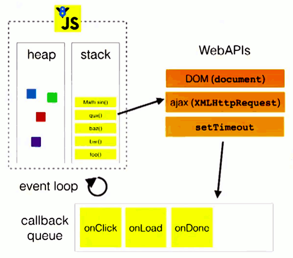
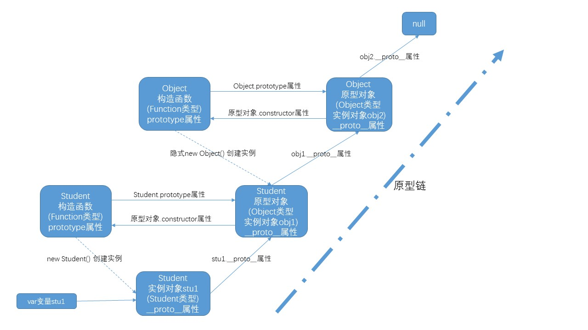
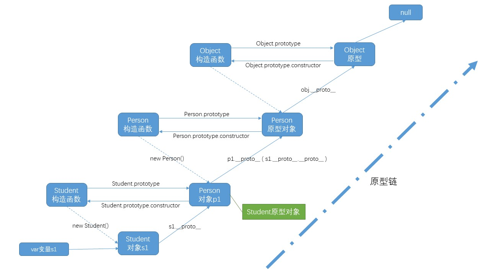

# JavaScript 高级

## 〇、重新介绍 JavaScript

### 1. JavaScript 的特点

- 解析执行：轻量级解释型的 

- 语言特点：

  *  动态特性，可以在执行过程中随意给对象增加属性和方法（编译型语言不具备）

  + js中最重要的是函数 (First-class Function)，又称函数是 JavaScript 中的一等公民

- 执行环境：在宿主环境（host environment）下运行，浏览器是最常见的 JavaScript 宿主环境
  
  + 但是在很多非浏览器环境中也使用 JavaScript ，例如 node.js


### 2. JavaScript 的组成

- ECMAScript  - 语法规范
  - 变量、数据类型、类型转换、操作符
  - 流程控制语句：判断、循环语句
  - 数组、函数、作用域、预解析
  - 对象、属性、方法、简单类型和复杂类型的区别
  - 内置对象：Math、Date、Array，基本包装类型String、Number、Boolean
- Web APIs
  - BOM
    - onload页面加载事件，window顶级对象
    - 定时器
    - location、history
  - DOM
    - 获取页面元素，注册事件
    - 属性操作，样式操作
    - 节点属性，节点层级
    - 动态创建元素
    - 事件：注册事件的方式、事件的三个阶段、事件对象 

### 3. 装X定律

> 阿特伍德定律：
>
> Any application that can be written in JavaScript, will eventually be written in JavaScript.  
>
> 任何可以用*JavaScript*来写的应用，最终都将用*JavaScript*来写
>
> *阿特伍德 stackoverflow的创始人之一

### 4. 浏览器是如何工作的


[参考链接](http://www.2cto.com/kf/201202/118111.html)

* User Interface：用户界面，我们所看到的浏览器
* Browser engine：浏览器引擎，用来查询和操作渲染引擎
* **Rendering engine** ：渲染引擎，用来显示请求的内容，负责解析HTML、CSS，并把解析的内容显示出来
* **JavaScript Interpreter**：JavaScript解析器，负责执行JavaScript的代码
* Networking：网络，负责发送网络请求及接受数据
* UI Backend：UI后端，用来绘制类似组合框和弹出窗口
* Data Persistence(持久化)：数据持久化，数据存储  cookie、HTML5中的sessionStorage

### 5. JavaScript 执行过程

  JavaScript 运行分为两个阶段：

- 预解析
  + 全局预解析（所有变量和函数声明都会提升；同名的函数和变量，函数的优先级高）
  + 函数内部预解析（所有的变量、函数和形参都会参与预解析）
    * 函数
    * 形参
    * 普通变量
- 执行

1. 先预解析全局作用域，然后执行全局作用域中的代码，
2. 在执行全局代码的过程中遇到函数调用就会先进行函数预解析，然后再执行函数内代码。

#### 5.1 JavaScript任务队列

* [并发模型与事件循环](https://developer.mozilla.org/zh-CN/docs/Web/JavaScript/EventLoop)


* 线程、事件循环和任务

  Javascript是单线程的，但是却能执行异步任务，这主要是因为 JS 中存在**事件循环（Event Loop）和任务队列（Task Queue）**。

  **事件循环**：JS 会创建一个类似于 `while (true)` 的循环，每执行一次循环体的过程称之为`Tick`。每次`Tick`的过程就是查看是否有待处理事件，如果有则取出相关事件及回调函数放入执行栈中由主线程执行。待处理的事件会存储在一个任务队列中，也就是每次`Tick`会查看任务队列中是否有需要执行的任务。

  **任务队列**：异步操作会将相关回调添加到任务队列中。而不同的异步操作添加到任务队列的时机也不同，如`onclick`, `setTimeout`,`ajax` 处理的方式都不同，这些异步操作是由浏览器内核的`webcore`来执行的，`webcore`包含下图中的3种 webAPI，分别是`DOM Binding`、`network`、`timer`模块。

- **DOM Binding** 模块处理一些DOM绑定事件，如`onclick`事件触发时，回调函数会立即被`webcore`添加到任务队列中。
- **network** 模块处理`Ajax`请求，在网络请求返回时，才会将对应的回调函数添加到任务队列中。
- **timer** 模块会对`setTimeout`等计时器进行延时处理，当时间到达的时候，才会将回调函数添加到任务队列中。


  **主线程**：JS 只有一个线程，称之为主线程。而事件循环是主线程中执行栈里的代码执行完毕之后，才开始执行的。所以，主线程中要执行的代码时间过长，会阻塞事件循环的执行，也就会阻塞异步操作的执行。只有当主线程中执行栈为空的时候（即同步代码执行完后），才会进行事件循环来观察要执行的事件回调，当事件循环检测到任务队列中有事件就取出相关回调放入执行栈中由主线程执行。



## 一、JavaScript 面向对象编程

### 1. 面向对象介绍

#### 1.1 什么是对象

  对象到底是什么，我们可以从两次层次来理解。

**(1) 对象是单个事物的抽象。**

  一本书、一辆汽车、一个人都可以是对象，一个数据库、一张网页、一个与远程服务器的连接也可以是对象。当实物被抽象成对象，实物之间的关系就变成了对象之间的关系，从而就可以模拟现实情况，针对对象进行编程。

**(2) 对象是一个容器，封装了属性（property）和方法（method）。**

  属性是对象的状态，方法是对象的行为（完成某种任务）。比如，我们可以把动物抽象为animal对象，使用“属性”记录具体是那一种动物，使用“方法”表示动物的某种行为（奔跑、捕猎、休息等等）。

  在实际开发中，对象是一个抽象的概念，可以将其简单理解为：**数据集或功能集**。

> ECMAScript-262 把对象定义为：**无序属性的集合，其属性可以包含基本值、对象或者函数**。严格来讲，这就相当于说对象是一组没有特定顺序的值。对象的每个属性或方法都有一个名字，而每个名字都映射到一个值。


  提示：每个对象都是基于一个引用类型创建的，这些类型可以是系统内置的原生类型，也可以是开发人员自定义的类型。


#### 1.2 什么是面向对象

> 面向对象不是新的东西，它只是过程式代码的一种高度封装，目的在于提高代码的开发效率和可维护性。

  面向对象编程 —— Object Oriented Programming，简称 OOP ，是一种编程开发思想。它将真实世界各种复杂的关系，抽象为一个个对象，然后由对象之间的分工与合作，完成对真实世界的模拟。

  在面向对象程序开发思想中，每一个对象都是功能中心，具有明确分工，可以完成接受信息、处理数据、发出信息等任务。
  因此，面向对象编程具有**灵活**、代码可**复用**、高度**模块**化等特点，容易**维护**和**开发**，比起由一系列函数或指令组成的传统的过程式编程（procedural programming），更适合多人合作的大型软件项目。

Tips：灵复模维开

  面向对象与面向过程： 

* 面向过程就是亲力亲为，事无巨细，面面俱到，步步紧跟，有条不紊

- 面向对象就是找一个对象，指挥得结果
- 面向对象将执行者转变成指挥者
- 面向对象不是面向过程的替代，而是面向过程的封装

  面向对象的特性：

- 封装性：函数、类都是封装的表现，为了让代码可复用，体现模块化思想
- 继承性：为了让类可复用，即父类拥有的属性和方法，子类也需要，通过继承可以避免子类把父类的代码再写一遍
- [多态性]抽象（JavaScript很少体现多态，这里理解为抽象）
  * 多态：父类只定义一个子类都要使用的方法，但不去决定这个方法的具体实现，把这个方法的实现交给子类去决定
  * 例如父类是动物，动物都要有叫声，但不同的动物（子类）的叫声又不一样，于是，父类就定义一个叫声方法，但不做具体实现，继承动物类的子类，要去实现这个方法

扩展阅读：

- [知乎：如何用一句话说明什么是面向对象思想？](https://www.zhihu.com/question/19854505)
- [知乎：什么是面向对象编程思想？](https://www.zhihu.com/question/31021366)

#### 1.3 程序中面向对象的基本体现

  在 JavaScript 中，所有数据类型都可以视为对象，当然也可以自定义对象。自定义的对象数据类型就是面向对象中的类（ Class ）的概念。

以一个例子来说明面向过程和面向对象在程序流程上的不同之处：

* 面向过程

  * 假设我们要处理学生的成绩表，为了表示一个学生的成绩，面向过程的程序可以用一个对象表示：

    ```javascript
    var std1 = { name: 'Michael', score: 98 }
    var std2 = { name: 'Bob', score: 81 }
    ```

    而处理学生成绩可以通过函数实现，比如打印学生的成绩：

    ```javascript
    function printScore (student) {
      console.log('姓名：' + student.name + '  ' + '成绩：' + student.score)
    }
    ```

* 面向对象：采用面向对象的程序设计思想，我们首选思考的不是程序的执行流程，而是：

  *  `Student` 这种数据类型应该被视为一个对象，这个对象拥有 `name` 和 `score` 这两个属性（Property）。

  *  如果要打印一个学生的成绩，首先必须创建出这个学生对应的对象，

  *  然后，给对象发一个 `printScore` 消息，让对象自己把自己的数据打印出来。

                   抽象数据行为模板（Class）：

     ```javascript
                   function Student(name, score) {
                     this.name = name;
                     this.score = score;
                     this.printScore = function() {
                       console.log('姓名：' + this.name + '  ' + '成绩：' + this.score);
                     }
                   }
     ```

                   根据模板创建具体实例对象（Instance）：

     ```javascript
                   var std1 = new Student('Michael', 98)
                   var std2 = new Student('Bob', 81)
     ```

                   实例对象具有自己的具体行为（给对象发消息）：

     ```javascript
                   std1.printScore() // => 姓名：Michael  成绩：98
                   std2.printScore() // => 姓名：Bob  成绩 81
     ```

  面向对象的设计思想是从自然界中来的，因为在自然界中，类（Class）和实例（Instance）的概念是很自然的。Class 是一种抽象概念，比如我们定义的 Class——Student ，是指学生这个概念，而实例（Instance）则是一个个具体的 Student ，比如， Michael 和 Bob 是两个具体的 Student 。

所以，面向对象的设计思想是：

- 抽象出 Class(构造函数)
- 根据 Class(构造函数) 创建 Instance
- 指挥 Instance （执行方法）得结果

#### 1.4 面向对象的设计思想

- 抽象出 Class(构造函数)
- 根据 Class(构造函数) 创建 Instance
- 指挥 Instance （执行方法）得结果

  面向对象的抽象程度又比函数要高，因为一个 Class 既包含数据，又包含操作数据的方法。

### 2. 创建对象

#### 2.1 简单方式

##### (1) 对象字面量

```javascript
// 构造函数是Object()
var o = {
  name: 'zf',
  age: 25
}
```

##### (2) 通过new Object()创建

```javascript
var person = new Object()
person.name = 'Jack'
person.age = 18

person.sayName = function () {
  console.log(this.name)
}
```

##### (3) 工厂函数

  可以写一个函数，解决代码重复问题：

```javascript
function createPerson (name, age) {
  var obj = new Object();
  obj.name = name；
  obj.age = age;
  obj.sayName = function () {
    console.log(this.name)
  }
  return obj;
}
```

然后生成实例对象：

```javascript
var p1 = createPerson('Jack', 18)
var p2 = createPerson('Mike', 18)
```

工厂模式没有解决对象识别的问题（即怎样知道一个对象的类型）。

### 3. 构造函数

* 构造函数是根据具体的事物抽象出来的抽象模板
* 实例对象是根据抽象的构造函数模板得到的具体实例对象

#### 3.1 构造函数的语法

```javascript
function Person (name, age) {
  this.name = name
  this.age = age
  this.sayName = function () {
    console.log(this.name)
  }
}

var p1 = new Person('Jack', 18)
p1.sayName() // => Jack

var p2 = new Person('Mike', 23)
p2.sayName() // => Mike
```

#### 3.2 构造函数的特别之处

  1. 构造函数与工厂函数有以下不同：

- 函数名使用的是大写的 `Person`
- 使用了this，直接将属性和方法赋给了 `this` 对象
- 没有 `return` 语句
- 没有显式地创建对象

  2. 构造函数与普通函数在形式上有以下不同：

- 函数名使用的是大写的 `Person`
- 使用了this，直接将属性和方法赋给了 `this` 对象
- 没有 `return` 语句

**其实从数据类型上来讲，构造函数与普通函数本质上是一样的。**

#### 3.3 new的工作过程

  要创建实例，则必须使用 `new` 操作符。以这种方式调用构造函数会经历以下 4 个步骤：

1. 创建一个新对象
2. 将构造函数的作用域赋给新对象（因此 this 就指向了这个新对象）
3. 执行构造函数中的代码
4. 返回新对象

下面是具体的伪代码：

```javascript
function Person (name, age) {
  // 当使用 new 操作符调用 Person() 的时候，实际上这里会先创建一个对象
  // var instance = {}
  // 然后让内部的 this 指向 instance 对象
  // this = instance
  // 接下来所有针对 this 的操作实际上操作的就是 instance

  this.name = name
  this.age = age
  this.sayName = function () {
    console.log(this.name)
  }

  // 在函数的结尾处会将 this 返回，也就是 instance
  // return this
}
```

#### 3.4 构造函数和实例对象的关系

  使用构造函数的好处不仅仅在于代码的简洁性，更重要的是我们可以识别对象的具体类型了。

* 在每一个实例对象中（其实在它的原型对象中）同时有一个 `constructor` 属性，该属性指向创建该实例的构造函数：

```javascript
console.log(p1.constructor === Person) // => true
console.log(p2.constructor === Person) // => true
console.log(p1.constructor === p2.constructor) // => true
```

* 如果要检测对象的类型，使用 `instanceof` 操作符：

```javascript
console.log(p1 instanceof Person) // => true
console.log(p2 instanceof Person) // => true
```

##### (1) instanceof

* `obj(对象) instanceof Obj(构造函数)` 实际上是检查obj对象的obj.\__proto__ 是否严格等于Obj.prototype，且会沿着obj对象的原型链一直向上找

  ```javascript
  function instance_of(L, R) {//L 表示左表达式，R 表示右表达式
    var O = R.prototype;// 取 R 的显示原型
    L = L.__proto__;// 取 L 的隐式原型
    while (true) {
      if (L === null)
        return false;
      if (O === L)// 这里重点：当 O 严格等于 L 时，返回 true
        return true;
      L = L.__proto__;
    }
   }
  ```

#### 3.5 构造函数的问题

  使用构造函数带来的最大的好处就是创建对象更方便了，但是其本身也存在一个浪费内存的问题：

```javascript
function Person (name, age) {
  this.name = name
  this.age = age
  this.type = 'human'
  this.sayHello = function () {
    console.log('hello ' + this.name)
  }
}

var p1 = new Person('Tom', 18)
var p2 = new Person('Jack', 16)
```

在该示例中，从表面上好像没什么问题，但是实际上这样做，有一个很大的弊端。那就是对于每一个实例对象，`type` 和 `sayHello` 都是一模一样的内容，每一次生成一个实例，都必须为重复的内容，多占用一些内存，如果实例对象很多，会造成极大的内存浪费。

```javascript
console.log(p1.sayHello === p2.sayHello) // => false
```

#### 3.6 静态成员和实例成员

* 实例成员：构造函数中this上添加的成员（这些成员属于实例对象）
* 静态成员：构造函数本身上添加的成员（这些成员属于构造函数（这个对象）本身）

```javascript
// 下面的name、age、sayHi就是实例成员
function Person(name,age){ 
	this.name = name ; 
	this.age = age; 
	this.sayHi = function(){ 
		console, log ('Hello…');
}
// 下面的hobby和climb就是静态成员
Person.hobby = 'running';
Person.climb = function () { 
	console.log('Climbing...');
}
// 对象字面量中的成员也是静态成员
var obj = {
  	width: 30,
  	height: 50,
  	sayHi: function () {
      	console.log('sayHi!');
  	}
}
```

其实**实例成员**这个概念是**相对于构造函数**（Class）来说的，**静态成员**这个概念是相对于具体的**实例对象**来说的。

## 二、原型

内容引导：

- 使用 prototype 原型对象解决构造函数的问题
- 分析 构造函数、prototype 原型对象、实例对象 三者之间的关系
- 属性成员搜索原则：原型链
- 实例对象读写原型对象中的成员
- 原型对象的简写形式
- 原生对象的原型
  + Object
  + Array
  + String
  + ...
- 原型对象的问题
- 构造的函数和原型对象使用建议

### 1. 函数的 prototype 属性

  JavaScript 规定，每一个构造函数（其实每一个函数都有）都有一个 `prototype` 属性，指向另一个对象（原型）。
这个对象的所有属性和方法，都会被构造函数的所拥有。

  这也就意味着，我们可以把所有对象实例需要共享的属性和方法直接定义在 `prototype` 对象上。

```javascript
function Person (name, age) {
  this.name = name
  this.age = age
}
Person.prototype.type = 'human';
Person.prototype.sayName = function () {
  console.log(this.name);
}
var p1 = new Person(...)
var p2 = new Person(...)
// p1.sayName和p1.sayName是同一个引用（地址）
console.log(p1.sayName === p1.sayName) // => true
```

这时所有实例的 `type` 属性和 `sayName()` 方法，其实都是同一个内存地址，指向 `prototype` 对象，因此就提高了运行效率。

### 2. 原型链

#### 2.1 构造函数、实例、原型对象三者关系


* **构造函数（其实是所有函数）都具有一个 `prototype` 属性，该属性是一个对象。**

```javascript
function F () {}
console.log(F.prototype) // => object

F.prototype.sayHi = function () {
  console.log('hi!')
}
```

* **构造函数的 `prototype` 对象默认都有一个 `constructor` 属性，指向 `prototype` 对象所在构造函数。**

```javascript
console.log(F.prototype.constructor === F) // => true
```

* **通过构造函数得到的实例对象内部会包含一个指向构造函数的 `prototype` 对象的指针 `__proto__`。**

```javascript
var instance = new F()
console.log(instance.__proto__ === F.prototype) // => true
```

* `__proto__` 是非标准属性。

**实例对象可以直接访问（相应的构造函数的）原型对象成员。**

```javascript
instance.sayHi() // => hi!
```

总结：

- 任何函数都具有一个 `prototype` 属性，该属性是一个对象
- 构造函数（任何函数）的 `prototype` 对象默认都有一个 `constructor` 属性，指向 `prototype` 对象所在函数
- 通过构造函数得到的实例对象内部会包含一个指向构造函数的 `prototype` 对象的指针 `__proto__`
- 所有实例都直接或间接继承了（相应的构造函数的）原型对象的成员

#### 2.2 原型链



#### 2.3 属性成员的搜索原则

  了解了 **构造函数-实例-原型对象** 三者之间的关系后，接下来我们来解释一下为什么实例对象可以访问原型对象中的成员。

1. 每当代码读取某个对象的某个属性时，都会执行一次搜索，目标是具有给定名字的属性
   * 搜索首先**从对象实例本身开始**
   * **如果在实例中找到了**具有给定名字的属性，则返回该属性的值
   * **如果没有找到**，则继续搜索指针指向的原型对象，在原型对象中查找具有给定名字的属性
   * **如果在原型对象中找到了**这个属性，则返回该属性的值
   * **如果没有找到**，则沿着原型链继续向上找
2. 也就是说，在我们调用 `person1.sayName()` 的时候，会先后执行两次搜索：
   * 首先，解析器会问：“实例 person1 有 sayName 属性吗？”答：“没有。
   * ”然后，它继续搜索，再问：“ person1 的原型有 sayName 属性吗？”答：“有。
   * ”于是，它就读取那个保存在原型对象中的函数。
   * 当我们调用 person2.sayName() 时，将会重现相同的搜索过程，得到相同的结果。

而这正是多个对象实例共享原型所保存的属性和方法的基本原理。

总结：

- 先在自己身上找，找到即返回
- 自己身上找不到，则沿着原型链向上查找，找到即返回
- 如果一直到原型链的末端还没有找到，则返回 `undefined`

### 3. 实例对象读写原型对象成员

1. 所有类型读取：
   * 先在自己身上找，找到即返回
   * 自己身上找不到，则沿着原型链向上查找，找到即返回
   * 如果一直到原型链的末端还没有找到，则返回 `undefined`
2. **值类型成员**和**引用类型成员**写入（`实例对象.值类型成员 = xx` 和`实例对象.引用类型成员 = xx`）：
   * 当实例（对象）期望重写原型对象中的某个**值类型成员**和**引用类型成员**时，实际上会把该成员（新建）添加到自己身上
   * 也就是说该行为实际上会屏蔽掉对原型对象成员的访问
3. ***复杂类型成员***的**属性**写入（`实例对象.成员.xx = xx`）：
   * 同样会先在自己身上找该成员，如果自己身上找到则直接写入
   * 如果自己身上找不到，则沿着原型链继续查找，如果找到则写入
   * 如果一直到原型链的末端还没有找到该成员，则报错（`实例对象.undefined.xx = xx`）

### 4. 更简单的原型语法

  我们注意到，前面例子中每添加一个属性和方法就要敲一遍 `Person.prototype` 。为减少不必要的输入，更常见的做法是用一个包含所有属性和方法的对象字面量来重写整个原型对象：

```javascript
function Person (name, age) {
  this.name = name
  this.age = age
}

Person.prototype = {
  type: 'human',
  sayHello: function () {
    console.log('我叫' + this.name + '，我今年' + this.age + '岁了')
  }
}
```

在该示例中，我们将 `Person.prototype` 重置到了一个新的对象。这样做的好处就是为 `Person.prototype` 添加成员简单了，**但是也会带来一个问题**，那就是原型对象丢失了 `constructor` 成员。

  所以，我们为了保持 `constructor` 的指向正确，建议的写法是：

```javascript
function Person (name, age) {
  this.name = name
  this.age = age
}

Person.prototype = {
  constructor: Person, // => 手动将 constructor 指向正确的构造函数
  type: 'human',
  sayHello: function () {
    console.log('我叫' + this.name + '，我今年' + this.age + '岁了')
  }
}
```

手动重新设置的Person的原型对象（Person.prototype指向的对象）的\__proto__属性依然会指向正确的原型对象（Object的原型），因为通过字面量创建的原型对象是Object类型的对象。

### 5. 原生对象的原型

  所有函数（原生对象的构造函数）都有 prototype 属性对象。

- Object.prototype
- Function.prototype
- Array.prototype
- String.prototype
- Number.prototype
- Date.prototype
- ...

#### 5.1 扩展内置对象

* 原生（内置）对象的prototype属性是不能重新设置的（不能更改它的引用，但可以给它添加成员）

  可以通过以下方式为内置对象添加方法成员：

```javascript
// 以Array为例
Array.prototype.getSum = function () {
  	// 求数组中所有元素的和，bug：内有检查数组元素类型
  	var sum = 0;
  	for(var i = 0; i < this.length; i++) {
      	sum += this[i];
  	}
  	return sum;
}
```

### 6. 原型对象使用建议

- 私有成员（一般就是非函数成员）放到构造函数中
- 共享成员（一般就是函数）放到原型对象中
- 如果重置了 `prototype` 记得修正 `constructor` 的指向

## 三、面向对象案例

### 1. 随机方块

  从随机方块案例看面向对象的基本方法：

1. 分析问题，抽象出对象。共抽象出两个对象：工具对象和方块对象
2. 分析对象的属性和方法：
   * 工具对象（方法：生成指定范围内的随机整数）
   * 方块对象（属性：div盒子的大小、位置、颜色）
3. 写出构造函数：
   * 工具对象只有一个方法，以静态（字面量）方式实现
   * 方块对象：
     1. 给构造函数传递参数（父元素, 储存属性的对象），为参数准备默认值（以防没有参数传入）
     2. 设置实例对象的属性（**三类：基本属性（this.样式）、父元素属性（this.parent）、自身元素属性（this.div）**），为每个属性准备默认值
     3. 创建页面元素，把页面元素的引用也作为对象的属性（例如this.div），将其追加到父元素
     4. 执行初始化方法（this.init() 根据对象的属性设置DOM元素样式）
   * 编写初始化方法（构造函数.prototype.init），将对象的属性设置为实际的样式
   * 根据需要补充对象的行为方法（设置自身位置等）：构造函数.prototype.setPosition
4. 利用已经写好的构造函数和方法编写main.js解决问题

### 2. 面向对象游戏案例：贪吃蛇

#### 2.1 贪吃蛇游戏对象

  面向对象编程中抽象出来的对象（例如食物、蛇、游戏对象）的属性只负责其本身的特性（尺寸、颜色、位置、方向...），不用考虑DOM元素的样式设置（一般 交给初始化/渲染方法 根据这些属性来创建元素）

1. 食物对象---食物
2. 蛇对象---蛇
3. 游戏对象---控制游戏逻辑
4. 地图---由于地图过于简单，不需要作为对象，但后续要用到DOM中的地图元素

#### 2.2 食物对象

  由于food对象的DOM元素结构较为简单（只有一个div），所以把渲染方法取消（也可以单独写，先remove再渲染），把渲染过程放在构造函数中，这样创建food对象时就直接完成了渲染（添加DOM元素、设置样式）。

1. 构造函数中的属性

   * 大小、颜色、位置、父元素（this.parent）、自身元素（this.div）

2. 构造函数中执行的代码

   * 动态创建div，并追加到DOM树
   * 对div设置其样式

   ```javascript
   // 本作用域的私有变量
   var size = 20;
   var position = 'absolute';
   // 食物构造函数
   function Foods(map, options) {
       options = options || {};
     	// 1.构造函数的属性
       // 大小
       this.width = options.width || size;
       this.height = options.height || size;
       // 颜色
       this.color = options.color || 'yellow';
       // 位置
       this.x = options.x || Tools.getRandom(0, map.offsetWidth / this.width - 1);
       this.y = options.y || Tools.getRandom(0, map.offsetHeight / this.height - 1);
       // 父元素
       this.parent = map || null;
     
   	// 2.构造函数中执行的代码
       // 创建食物dom元素
       this.div = document.createElement('div');
       this.parent.appendChild(this.div);
       // 设置食物的样式
       this.div.style.position = position;
       this.div.style.backgroundColor = this.color;
       this.div.style.width = this.width + 'px';
       this.div.style.height = this.height + 'px';
       this.div.style.left = this.x * this.width + 'px';
       this.div.style.top = this.y * this.height + 'px';
   }
   ```

3. 方法（外部可访问）：randomPos()重新随机设置食物的位置

   * 利用随机数方法重新设置food对象的位置属性
   * 重新设置div元素的定位（left、top）

   ```javascript
   // 方法（外部可访问）：重新随机获取食物的位置
   Foods.prototype.randomPos = function () {
       // 随机获取食物的坐标
       this.x = Tools.getRandom(0, this.parent.offsetWidth / this.width - 1);
       this.y = Tools.getRandom(0, this.parent.offsetHeight / this.height - 1);
       this.div.style.left = this.x * this.width + 'px';
       this.div.style.top = this.y * this.height + 'px';
   }
   ```

#### 2.3 蛇对象

  蛇对象由多个蛇节（div）组成，需要移动和改变身体长度（**移动和改变身体长度只改变蛇对象本身的属性**），所以使用独立的渲染方法（render）来渲染蛇身（先remove原来的蛇身元素，再逐个添加新的蛇身元素并设置样式）。（每次**移动/吃食** （move方法）都**删除旧蛇**，**渲染新蛇** （render方法））。

  本例使用了一个私有的随机颜色方法randomColor()，因简单且不影响游戏逻辑，故未具体说明。

1. 构造函数中的属性

   * 蛇节大小（和食物一样大）、蛇的运动方向、蛇身（数组，每个元素是一个对象，储存蛇节的位置和颜色）

   ```javascript
   // 蛇构造函数
   function Snake(options) {
   	options = options || {};
   	// 蛇节大小
   	this.width = options.width || size;
   	this.height = options.height || size;
   	// 蛇的运动方向
   	this.direction = options.direction || 'left';
   	// 蛇身, body[0]是蛇头
   	this.body = [
   		{x: 3, y: 2, color: 'red'},
   		{x: 2, y: 2, color: randomColor()},
   		{x: 1, y: 2, color: randomColor()}
   	];
   }
   ```

2. 方法（外部可访问）：render()渲染蛇

   * 先remove旧蛇身
   * 遍历蛇身，逐个创建新的div，加入DOM树，设置样式即可

   ```javascript
   // 方法（外部可访问）：渲染蛇
   // 遍历蛇身，创建div，设置样式即可
   Snake.prototype.render = function (map) {
   	// 先删除蛇，否则渲染出来的新蛇会越来越长（因为旧的div还在）
   	remove();
   	// 遍历蛇身，创建div，加入DOM树，设置样式
   	for (var i = 0, len = this.body.length; i < len; i++) {
   		// 创建div
   		var div = document.createElement('div');
   		map.appendChild(div);
   		// 设置样式
   		div.style.position = position;
   		div.style.width = this.width + 'px';
   		div.style.height = this.height + 'px';
   		div.style.left = this.body[i].x * this.width + 'px';
   		div.style.top = this.body[i].y * this.height + 'px';
   		div.style.backgroundColor = this.body[i].color;
   		// 记录组成蛇身的每一个div，方便删除
   		elements.push(div);
   	}
   }
   ```

   - 为了remove旧蛇身，要使用一个数组elements来储存每一节蛇身的div（elements具有自调用函数作用域）。

   ```javascript
   // 私有（只能在本自调用函数作用域使用）：储存蛇节对象每一节的div
   var elements = [];
   // 私有（只能在本自调用函数作用域使用）：删除蛇（遍历蛇身的div（elements[]）,逐个从DOM树上删除div，再逐个删除数组元素）
   function remove() {
   	for (var i = elements.length - 1; i >= 0; i--) {
   		// 删除蛇节div移出的DOM树
   		elements[i].parentNode.removeChild(elements[i]);
   		// 删除蛇节数组中的引用
   		elements.splice(i, 1);
   	}
   }
   ```

3. 方法（外部可访问）：move()移动蛇（实现时可以先不考虑检测蛇吃食，先实现蛇移动，再考虑蛇吃食）

   * 每调用一次，蛇就向当前方向移动一格
   * 蛇身移动：从最后一节开始，每一节移动到它的前一节的位置（只改变蛇对象的属性值，不考虑渲染）
   * 蛇头移动：根据方向决定x或y，±1（只改变蛇对象的属性值，不考虑渲染）
   * 每次移动后检测 吃食（蛇头与食物是否重合），所以要传递food对象作为参数
     * 若重合，则吃到食物，就在蛇身最后加一节（向body中加一个新的蛇节对象）
     * 新蛇节的位置就是蛇身移动之前的最后一节的位置（所以每次蛇身移动之前都要临时保存最后一节的信息）
     * 食物重新设置位置

   ```javascript
   // 方法（外部可访问）：移动蛇，每调用一次，蛇就向当前方向移动一格
   Snake.prototype.move = function (food) {
   	// 记录一下最后一节的位置，当蛇吃到食物时会用到
   	var last = this.body[this.body.length - 1];
   	// 从最后一个蛇节开始，把每一个蛇节移动到前一个蛇节的位置，蛇头单独处理
   	for (var i = this.body.length - 1; i > 0; i--) {
   		this.body[i].x = this.body[i - 1].x;
   		this.body[i].y = this.body[i - 1].y;
   	}
   	// 蛇头要根据当前方向移动
   	switch (this.direction) {
   		case 'left':
   			this.body[0].x += 1;
   			break;
   		case 'right':
   			this.body[0].x -= 1;
   			break;
   		case 'up':
   			this.body[0].y -= 1;
   			break;
   		case 'down':
   			this.body[0].y += 1;
   			break;
   	}
   	// 如果蛇头与食物重合，就：
   	// 1.把蛇增加一节（就是last----本次移动前原最后一节的位置）
   	// 2.食物重新设置位置
   	if (this.body[0].x === food.x && this.body[0].y === food.y) {
   		this.body[this.body.length] = {
   			x: last.x,
   			y: last.y,
   			color: randomColor()
   		}
   		food.randomPos();
   	}
   }
   ```

#### 2.4 游戏对象

  游戏对象的作用：处理游戏逻辑。整个游戏过程只有一个蛇对象和一个食物对象，蛇对象的身体元素（div）随着移动/吃食不断地删除再重新创建；食物对象的组成元素（div）只有一个，被吃后只改变自身位置。

* 蛇的连续移动，由动画（定时器setInterval()）实现，每隔一定时间，就执行一次**蛇.move**方法和**蛇.render** 方法
  * 检测到蛇头超出地图边界，则取消定时器，游戏结束。
* 键盘控制蛇的移动，由键盘按下事件（keydown）触发，当键盘按下时，修改蛇对象的方向

1. 构造函数中的属性

   * 地图（使用参数传递）
   * 食物对象（在构造函数中new Foods(map)）
   * 蛇对象（在构造函数中new Snake()）
   * 地图的最大格数（一格是一个蛇节/食物的大小）

   ```javascript
   // that记录game对象，当前作用域下，that是undefined，直至new Game()，that才是game对象
   // 所以蛇移动动画runSnake()和键盘控制keyDirection()都要在start()里面执行
   var that;
   // 游戏逻辑构造函数
   function Game(map) {
   	this.map = map || null;
   	this.food = new Foods(map);
   	this.snake = new Snake();
   	// 地图的最大格数
   	this.maxX = map.offsetWidth / this.snake.width;
   	this.maxY = map.offsetHeight / this.snake.height;

   	that = this;
   }
   ```

   

2. 方法（外部可访问）：start()开始游戏（由game对象调用，故已有蛇和食物对象）

   * 先渲染蛇（和食物）
   * 调用私有函数runSnake()设置动画，让蛇跑起来
   * 调用私有函数keyDirection()注册事件，让键盘可以控制蛇的方向

   ```javascript
   // 开始游戏
   Game.prototype.start = function () {
   	// 渲染蛇
   	this.snake.render(this.map);
   	// 游戏逻辑1：让蛇自己移动起来，动画
   	runSnake();
   	// 游戏逻辑2：使用键盘控制蛇的方向
   	keyDirection();
   }
   ```

3. 私有（只能在本作用域使用）：runSnake()让蛇自己移动起来，动画

   * 动画处理函数由js引擎调用，无法人为传递参数，所以它无法访问game对象
   * 可以对**动画处理函数** 调用bind()函数，使其内部的this重新指向that
   * that是本作用域中的一个私有变量（Game构造函数可以访问），由构造函数设置其指向game对象，本作用域的私有函数runSnake()可以直接访问that

   ```javascript
   // 要访问蛇对象，就要访问game对象，但game对象不在当前作用域中，也不在全局作用域中，所以要用一个本作用域变量that来记录game对象
   // 使用函数的bind()方法将function中的this重新指向至that（game对象）
   // 到游戏对象start才开始让蛇移动，而不是在这里（自调用函数作用域里还没有游戏对象）
   function runSnake() {
   	var timeId = setInterval((function () {
   		// 蛇移动
   		this.snake.move(this.food);
   		// 重新渲染蛇
   		this.snake.render(this.map);
   		// 当蛇头碰到边界，游戏结束
   		var headX = this.snake.body[0].x;
   		var headY = this.snake.body[0].y;
   		if (headX < 0 || headX >= this.maxX || headY < 0 || headY >= this.maxY) {
   			clearInterval(timeId);
   			alert('Game Over!');
   		}
   	}).bind(that), 150);
   }
   ```

4. 私有（只能在本作用域使用）：keyDirection()使用键盘控制蛇的方向（只改变蛇对象的方向属性，具体实现交给**蛇.move** 方法和**蛇.render**方法）

   * 事件处理函数由js引擎调用，无法人为传递参数，所以它无法访问game对象
   * 可以对**事件处理函数** 调用bind()函数，使其内部的this重新指向that
   * that是本作用域中的一个私有变量（Game构造函数可以访问），由构造函数设置其指向game对象，本作用域的私有函数keyDirection()可以直接访问that

   ```javascript
   // 要访问蛇对象，就要访问game对象，但game对象不在当前作用域中，也不在全局作用域中，所以要用一个本作用域变量that来记录game对象
   // 使用函数的bind()方法将function中的this重新指向至that（game对象）
   // 到游戏对象start才开始控制蛇的方向，而不是在这里（自调用函数作用域里还没有游戏对象）
   function keyDirection() {
   	document.addEventListener('keydown', (function (e) {
   		// 当键盘按下时，修改蛇对象的方向
   		switch (e.keyCode) {
   			case 38:
   				if (this.snake.direction !== 'down') {
   					this.snake.direction = 'up';
   				}
   				break;
   			case 40:
   				if (this.snake.direction !== 'up') {
   					this.snake.direction = 'down';
   				}
   				break;
   			case 39:
   				if (this.snake.direction !== 'right') {
   					this.snake.direction = 'left';
   				}
   				break;
   			case 37:
   				if (this.snake.direction !== 'left') {
   					this.snake.direction = 'right';
   				}
   				break;
   		}
   	}).bind(that), false);
   }
   ```

5. that变量详解

   * that位于game.js的私有作用域（用**作用域g**表示）中，在**作用域g** 中的**函数**和**方法**可以直接访问that
   * 构造函数可以通过this访问game对象（无论它在那个作用域），又可以访问**作用域g** 中的that变量
   * 所以用构造函数将that和game对象联系起来，这样**作用域g** 中的函数就可以通过that访问game对象
   * 再通过bind()方法就可以将**事件/动画处理函数中的this** 指向that（game对象）

#### 2.5 执行游戏

  上述对象全部实现后，只需：

1. 获取地图map元素；
2. 创建game对象，传入map
3. 执行game.start() 方法，开始游戏

```javascript
var map = document.getElementById('map');
var game = new Game(map);
game.start();
```

#### 2.6 bind()初识

* 函数也是一个对象，它有个一bind()方法；bind()方法可以改变**调用它的函数**中的this的指向。**不会直接调用函数**

* bind()的第一个参数： **设置调用它的函数**的this的指向

* bind()的第2、3、......个参数：**设置调用它的函数**的参数，调用bind()返回的新函数时，这些参数已经传递，不需要再次传递

* fn.bind(obj)会返回一个**与fn函数具有相同函数体**的新函数（即fn.bind(obj)就是一个新函数，其中的this指向obj）

  ```javascript
  function fn(x, y) {
    	console.dir(this);
    	console.log(x + y);
  }
  var obj = {
    	name: 'ls'
  }
  var fn1 = fn.bind(obj, 2, 3);
  fn1();	// 打印obj对象，和 5
  ```


### 3.代码技巧

#### 3.1 自调用函数

* 每一个js文件都通过**自调用函数**开启一个函数作用域，这样就可以避免不同js文件命名冲突的问题；

* 为了让这个函数作用域之外的其他js文件能够访问到某些应该共享的数据（如构造函数）把构造函数单独的添加到window中

  ```javascript
  // Food.js文件
  // 自调用函数
  (function () {
    代码...
    function Food() {
      
    }
    window.Food = Food;
  })();
  ```

#### 3.2 js文件合并和压缩

  开发时不同模块使用不同的js文件，浏览器在向服务器请求数据时，是每个js文件都要进行一次请求，所以发布时为了提高访问速度，要：

1. 把多个js文件合并到一个js文件中

   * 自调用函数之间要用;分隔，否则有语法错误（没有;的话两个语句会跨过空白合并成一个语句）

     ```javascript
     (function () {
       
     })()	// 返回undefined
     (function () {
       
     })()
     // 在js解释器看来：
     undefined(function () {
       
     })()
     // 变成了一个叫做undefined的函数 传入一个匿名函数 作为参数，然后调用
     ```

     

   * 在自调用函数的前面写;表示自调用函数与前面的代码没有关系（避免两个语句跨过空白合并成一个语句）

   * 正确的做法：

     ```javascript
     ;(function () {
       
     })()	// 返回undefined
     ;(function () {
       
     })()
     ```

     

2. 利用代码压缩工具对js文件进行压缩（去掉空白、注释、把变量名替换成更简短的标识符），减小代码的体积

#### 3.3 给自调用函数传递参数

  自调用函数会使用window对象和undefined，如果不把window和undefined作为参数传递，压缩代码时就不能对其进行压缩，所以为了：

1. 让自调用函数中使用的window（形参）可以被压缩

   ```
   ;(function(window, undefined) {
     window.xxx = xxx;
     window.aaa = aaa;
     window.ccc = ccc;
     window.bbb = bbb;
   })(window, undefined)
   // 压缩后，a就是window的引用：
   ;(function(a, b) {
     a.xxx = xxx;
     a.aaa = aaa;
     a.ccc = ccc;
     a.bbb = bbb;
   })(window, undefined)
   ```

2. 让自调用函数中使用的undefined（形参）可以被压缩

3. 老版本浏览器中undefined可以被重新赋值（就不是未定义了），给自调用函数传入undefined，可以保证在自调用函数的作用域中使用undefined就是未定义（新版本中undefined不可重新定义，这个是一个代码习惯）


## 四、继承

  JavaScript中的继承一般在做页面的时候不常用，因为可以继承的属性较少，使用继承反而会让代码更加复杂；在做复杂项目（如框架）的时候才会使用。

### 1. 对象拷贝（并非继承）

  继承是相对于类（class）来说的，但对象之间有时也需要把一个对象的属性拷贝给另一个对象，可以把这个过程封装成一个函数：

```javascript
function extend(parent, child) {
  	for (var key in parent) {
      	// 不复制同名属性
      	if (child[key]) {
          	continue;
      	}
      	child[key] = parent[key];
  	}
}
```

### 2. 原型继承（方法继承）

  利用原型的特性实现继承，让子类型构造函数的原型prototype指向一个父类型的对象。这种方式不能灵活设置继承的属性（在原型对象中只有一份），所以不实用。

* 可以继承父类型的方法，子类型的原型是一个父类型的对象，这个父类型对象的原型中有父类型的方法
* **无法设置构造函数的参数**，如果有多个学生对象（子类型）就只能重名了

```javascript
// 父类型
function Person (name, age) {
  	this.name = name;
  	this.age = age;
}
Person.prototype.sayHi = function () {
  	console.log('大家好，我是' + this.name);
}
// 子类型
function Student () {
  	this.score = 100;
}
// 原型继承
Student.prototype = new Person();
Student.ptototype.constructor = Student;
// 可以通过原型访问父类型的方法
s1.sayHi();	// 大家好，我是ls
```

### 3. 借用构造函数（属性继承）

#### 3.1 call()初识

* 函数也是一个对象，它有个一call()方法；call()方法可以改变**调用它的函数**中的this的指向。**会直接调用函数**

* call()的第一个参数： **设置调用它的函数**的this的指向

* call()的第2、3、......个参数：**设置调用它的函数**的参数，这些参数会传递给调用call()的函数，不需要再次传递

  ```javascript
  function fn(x, y) {
    	console.dir(this);
    	console.log(x + y);
  }
  var obj = {
    	name: 'ls'
  }
  fn.call(obj, 2, 3);	// 打印 obj对象 和 5
  ```

#### 3.2 借用构造函数

1. 可以在子类型中使用**父类型构造函数.call()** 的方式“借用”父类型的构造函数；
2. 利用call()方法对**父类型构造函数** 中的this重新指向，使**其**指向**new 子类型构造函数()** 时创建的**子类型对象**；
3. 这时**父类型构造函数** 就成了一个普通函数，仅仅为**子类型的对象**添加属性。
4. **无法继承父类型的方法**

```javascript
// 父类型
function Person (name, age) {
  	this.name = name
  	this.age = age
}
// 子类型
function Student (name, age) {
  	// 借用构造函数继承属性成员 
  	// Student中的this => student对象
  	// call使得Person中的this => student对象
  	Person.call(this, name, age)
  
  	this.score = 100;
}
// 测试
var s1 = Student('张三', 18)
console.log(s1.name, s1.age) // => human 张三 18
```

### 4. 组合继承（属性+方法）

  组合继承就是利用：**借用构造函数，继承属性；原型继承，继承方法**，来实现对父类型的属性和方法的继承。

* 易出问题点1：父类型的构造函数不要忘了暴露给window
* 易出问题点2：父类型的构造函数的参数要做默认值处理（原型继承时不传参数）

1. 父类型：

   ```javascript
   // 父类型
   function Person (name, age) {
     	this.name = name
     	this.age = age
   }
   // 父类型的方法
   Person.prototype.sayHi = function () {
     	console.log('大家好，我是' + this.name);
   }
   ```

2. 借用构造函数，继承属性；

   ```javascript
   function Student (name, age) {
     	// 借用构造函数继承属性成员 
     	Person.call(this, name, age)
   }
   ```

3. 原型继承，继承方法。如下，构造函数中不用传递任何参数，Person对象（原型）中的父类型属性都是undefined即可。

   ```javascript
   // 原型继承
   Student.prototype = new Person();
   Student.ptototype.constructor = Student;
   ```

4. ```javascript
   // 父类型
   function Person (name, age) {
     	this.name = name
     	this.age = age
   }
   // 父类型的方法
   Person.prototype.sayHi = function () {
     	console.log('大家好，我是' + this.name);
   }
   // 子类型
   function Student (name, age) {
     	// 借用父构造函数继承属性成员 
     	Person.call(this, name, age)
   }
   // 原型继承
   Student.prototype = new Person();
   Student.prototype.constructor = Student;
   ```

### 5. 组合继承后的原型链

  组合继承把子类型的原型改变为父类型的实例对象（加上了constructor），相当于把子类型的原型三角关系接在了父类型的原型链下端，这就是子类型组合继承后可以使用父类型的方法的原因。

* 利用这种继承方式可以将原型链继续向下延伸



### 6. 组合继承优化

1. 借用构造函数：即在子类的构造函数中调用父类的构造函数（当然要通过call修改this指向）
   * 优点：可以继承父类的实例属性，这些属性会作为子类的实例属性（在子类实例自己身上）
   * 缺点：无法继承父类的实例方法，因为实例方法一般会放在原型上
2. 原型继承：即修改子类构造函数的prototype属性，使之为 父类的1个实例
   * 优点：解决了父类实例方法的继承问题，因为子类实例调用方法时，会沿着原型链向上找
   * 缺点：每创建1个子类的实例，父类构造函数就要被调用两次；且父类的实例属性会残留在子类的prototype上，其实并没有什么作用
3. 优化1：子类构造函数.prototype = Object.create(父类构造函数.prototype)
   * 利用Object.create()，创建1个新的空对象，作为子类的 prototype；由于此方法的特点，这个空对象的\__proto__就是父类的prototype
   * 优点：解决了 以父类实例作为子类原型的问题（构造函数重复调用；父类属性残留在子类原型）
   * 缺点：无法判断一个子类的实例 是父类还是子类的实例（instanceof 和 实例.constructor 都不行）
4. 优化2：修改 子类构造函数.prototype.constructor = 子类构造函数
   * 优点：解决了 子类的类型判断问题
   * 缺点：其实没啥了，非要说缺点的话，就是不够优雅，所以可以用ES6

```js
// 父类型
function Person (name, age) {
  	this.name = name
  	this.age = age
}
// 父类型的方法
Person.prototype.sayHi = function () {
  	console.log('大家好，我是' + this.name);
}
// 子类型
function Student (name, age) {
  	// 借用父构造函数继承属性成员 
  	Person.call(this, name, age)
}
// 原型继承
Student.prototype = Object.create(Person.prototype); // 替代了父类实例，避免残留的父类属性
Student.prototype.constructor = Student; // 保证 子类实例 instanceof Student时可以得到true
// 子类型的方法
Student.prototype.study = function () {
    console.log(this.name + '正在学习...');
}
```

## 五、函数进阶

### 1.函数定义方式

#### 1.1 函数声明

- 函数声明必须有名字
- 函数声明**会参与预解析，函数声明**会提升**

```javascript
function fn() {
  	console.log('函数声明');
}
```

#### 1.2 函数表达式

- 函数表达式可以没有名字，例如匿名函数
- 函数表达式类似于变量赋值
- 函数表达式没有变量提升，在执行阶段创建，必须在表达式执行之后才可以调用

```javascript
var fn1 = function () {
  	console.log('函数表达式');
}
```

#### 1.3 new Function()

基本不使用这种方式声明函数，原因：

- 代码可读性差
- 执行效率低，要先把参数中的字符串解析成代码才能执行

构造函数Function()的参数（都是字符串）：

- 第1、2、... 、n-1个参数是要定义的函数的形参
- 第n个（最后一个）参数是函数体

```javascript
var fn = new Function('a', 'b', 'console.log(a + b)');
fn(1, 2);
```

#### 1.4 根据条件声明函数

- 现代浏览器中if语句中的函数声明不会提升
- 老版本IE中if语句中的函数声明也会提升

```javascript
var bl = true;
if (bl) {
  	function fn() {
	  	console.log('fn-true');
  	}
} else {
  	function fn() {
	  	console.log('fn-false');
  	}
}
fn();
// 现代浏览器中，bl为true时执行第一个（打印fn-true），bl为false时执行第二个（打印fn-false）
// 老版本IE中，无论bl为true还是false，都执行第二个（打印fn-false），因为进行了函数提升
```

为了统一，根据if条件声明函数时，使用函数表达式：

```javascript
var fn;
var bl = true;
if (bl) {
  	fn = function () {
	  	console.log('fn-true');
  	}
} else {
  	fn = function () {
	  	console.log('fn-false');
  	}
}
fn();
```

### 2. 函数调用方式

#### 2.1 普通函数调用

- 由window调用


- this：指向window

```javascript
function fn() {
  console.log(this)
}
fn();
```

#### 2.2 作为方法调用

- 由对象调用
- this：指向调用该方法的对象

```javascript
var obj = {
  fn: function () {
    console.log(this)
  }
}
obj.fn();
```

#### 2.3 作为构造函数调用

- this：构造函数内部的this指向由该构造函数创建的对象

```javascript
new Student()
```

#### 2.4 作为事件处理函数调用

- this：触发这个事件的元素（事件处理函数所属的对象）

```javascript
ele.addEventListener('click', function () {
  
})
```

#### 2.5 作为定时器的参数

- 由window调用


- this：指向window

```javascript
setInterval(function () {
  
}, 1000)
```

#### 2.6 this指向总结

函数内部的this指向，不是书写时决定的，而是调用时决定的。

### 3. 函数的内置方法

函数是一种对象，它的原型（fn.\__proto__）中有一些方法供函数类型的对象调用。

#### 3.1 call()

- 功能：调用函数，并改变其内部的this指向
- 参数：
  - 第一个参数：在 fun 函数运行时指定的 this 值，如果指定了 null 或者 undefined 则内部 this 指向 window
  - 其他参数arg1, arg2, ...：传递给fun的参数列表
- 返回值：就是调用它的函数的返回值

##### (1) call()应用

1. **让普通对象可以借用其他对象（内置对象）的方法**

- 让Array内置方法可以处理伪数组（属性为数字索引，带length属性的对象）

```javascript
// 伪数组，可以用obj[2]的形式访问属性
var obj = {
  	0: 100,
  	1: 58,
  	2: 90,
  	3: 60,
  	length: 4
};
// 利用call给push中的this重定向，让其处理obj
Array.prototype.push.call(obj, 30);	// obj增加了一项4: 30，同时length变成了5
// 利用call给splice中的this重定向，让其处理obj
Array.prototype.splice.call(obj, 0, 3);	// obj删除了前三项，剩下后两项，length也随之改变
```

- 让数组调用字符串的toString方法（数组自身重写了toString方法，与字符串的toString不同）

```javascript
var arr = [5, 9];
console.log(arr.toString());	// 输出5, 9
console.log(Object.prototype.toString.call(arr));	// 输出[object Array]
```

##### (2) 检查复杂类型

* 可以通过给Object的toString方法调用call方法来检测类型
* [object Array]第一个object是所有对象的根原型，第二个Array是构造函数

```javascript
Object.prototype.toString.call([]);
// "[object Array]"
Object.prototype.toString.call({});
// "[object Object]"
Object.prototype.toString.call(Math);
// "[object Math]"
Object.prototype.toString.call(new Date());
// "[object Date]"
```

#### 3.2 apply()

- 功能：调用函数，并改变其内部的this指向
- 参数：
  - 第一个参数：在 fun 函数运行时指定的 this 值，如果指定了 null 或者 undefined 则内部 this 指向 window
  - 第二个参数argsArray：传递给fun的包含多个参数的数组(数组会被展开成参数列表)
- 返回值：就是调用它的函数的返回值

##### (1) apply()应用

1. **把数组展开成参数列表传递给函数**(让处理参数列表（一个一个传递参数）的函数可以直接处理数组)

- Math.max() 不能接受数组为参数，只能接受若干个数值
- 利用apply()可以把数组中的每一项展开传递给函数Math.max() 
- 由于不需要改变Math.max()中this的指向，所以第一个参数写Math

```javascript
var arr = [5, 10, 3, 26, 23];
console.log(Math.max.apply(Math, arr));	// 打印26
```

- 让console.log()打印数组时**像打印多个数值一样**输出

```javascript
var arr = [5, 10, 3, 26, 23];
console.log(arr);	// 输出：(5) [5, 10, 3, 26, 23]
console.log(5, 10, 3, 26, 23);		// 输出：5 10 3 26 23
console.log.apply(console, arr);	// 输出：5 10 3 26 23
```

#### 3.3 bind()

  为了表述方便，约定：`fn2 = fn1.bind(obj, arg1, arg2, ...)`

- 功能：改变原函数fn1内部的this指向，**不调用函数fn1**，返回一个新的绑定函数fn2（与原函数有相同的函数体），调用fn2时它内部的this就指向obj对象
- 参数：
  - 第一个参数：当绑定函数fn2被调用时，该参数指定函数fn2运行时的 this 指向。当使用new 操作符调用绑定函数时，该参数无效。
  - 其他参数arg1, arg2, ...：当绑定函数fn2被调用时，这些参数将置于实参之前传递给被绑定的方法。
- 返回值：返回由**指定的this值**和**初始化参数**改造的原函数拷贝。
- bind()提供给绑定函数fn2的参数列表(arg1, arg2) 与 调用fn2时的参数列表(arg3, arg4)会合并为(arg1, arg2, arg3, arg4)：

```javascript
function fn1(x, y) {
	console.log(x + y);
	console.log(arguments);
}
var fn2 = fn1.bind(window, 2, 3);
fn2(5, 6);
// 5
// Arguments(4) [2, 3, 5, 6, callee: ƒ, Symbol(Symbol.iterator): ƒ]
```

##### (1)bind()应用

  定时器的处理函数，还有事件处理函数，一般难以直接传递参数，可以使用bind()改变它们内部的this指向让它们访问到原本无法访问的对象，或向其中传递参数（储存在argument中）

1. **让定时器中的this指向bind()指定的对象**

- 定时器的处理函数fun中的this指向window，但有时需要让这个函数处理对象obj
- 可以让这个函数fun调用bind(obj)，这样window调用fun时，fun中的this就指向obj

```javascript
var obj = {
  	name: 'zs',
  	tim: function () {
      	setInterval(function () {
          	console.log(this.name);	// 匿名函数调用了bind()，这里的this就指向bind()设置的对象
      	}.bind(this), 1000);	// tim()由obj调用，这里的this就是obj
  	}
}
obj.tim();	// 1.调用tim()时才会设置定时器；2.设置定时器时才会执行bind()；3.时间到才会执行匿名函数
```

1. **让事件处理函数中的this指向指定对象**

- 事件处理函数中的this是触发事件的元素（对象）
- 可以使用bind()对其重定向到指定对象

```javascript
var obj = {
  	name: 'zs'
}
btn.onclick = function () {
  	console.log(this.name);
}.bind(obj);

// 点击btn，打印 zs
```

### 4. 函数的其他成员

  函数对象fn1的属性可以在它自己的函数体内部被访问（例如fn1.length，作为方法时要使用this.fn1.length）。

- fn1.arguments（了解即可）
  - 函数对象fun的一个属性：实参集合，伪数组
  - 没有实参的话，fn1.arguments是null
- fn1.caller（了解即可）
  - 函数的调用者（这里的调用者指的是调用fun时所在的函数作用域），会返回一个函数
  - 没有被调用时fun.caller是null
  - 在全局作用域中被调用时fun.caller也是null
- fn1.length（了解即可）
  - 形参的个数
- fn1.name（了解即可）
  - 函数的名称

1. 读取一个函数对象fn1：`console.dir(fn1);`，它的属性均是默认值，无论fun是否正在被调用

2. fn1.arguments、fn1.caller属性只有在自身内部访问才有意义（此时fn1当然正在被调用）

3. fn1.name、fn1.length是固定的，不受是否调用影响

   ```javascript
   function fn1(x, y) {
   	console.dir(fn1);
     	console.log(fn1.length);	// 2
     	console.log(fn1.name);		// fn1
     	console.log(fn1.arguments);	// Arguments(3) [1, 2, 3, ...
     	console.log(fn1.caller);	// null
   }
   fn1(1, 2, 3);	// fn1正在被调用，读取fn1对象如下（默认值）
   // fn1()
   // length: 2
   // name: "fn1"
   // arguments: null
   // caller: null
   // -------------------被调用时读取的属性：-------------------
   // 2
   // fn1
   // Arguments(3) [1, 2, 3, ...
   // null
   
   console.dir(fn1);// fn1没有被调用，读取fn1对象如下（默认值）
   // fn1()
   // length: 2
   // name: "fn1"
   // arguments: null
   // caller: null
   
   console.log(fn1.length);	// 2（默认值）
   console.log(fn1.name);		// fn1（默认值）
   console.log(fn1.arguments);	// null（默认值）
   console.log(fn1.caller);	// null（默认值）
   ```

#### 4.1 私有变量arguments

  除了以上的属性外，函数内部还有一个arguments：

- 私有变量arguments（不同于fn1.arguments）
- 它只能在函数内部使用
- 是一个伪数组，储存所有实参（形式上和fn1.arguments一样）
- 有一个类似于数组的length属性

利用arguments可以让函数接受不同于形参个数的实参（多于或少于均可），从而方便地实现变参函数。

### 5.高阶函数

  作为另一个函数的参数或返回值的函数称为高阶函数。

#### 5.1 函数作为参数

- 典型应用，数组排序，根据传入函数的返回值 决定从大到小排序还是从小到大排序

```javascript
// 数组排序：重写数组的sort方法，实现相同的功能
Array.prototype.mySort = function (fn) {
	// this就是要排序的数组
	for (var i = 0; i < this.length - 1; i++) {
		// 记录是否排好序了，假设排好了。如果内层循环发生数组元素交换就是没排好
		var isSort = true;
		// 第一轮比较this.length - 1次，每一轮比较次数都比上一轮减1
		for (var j = 0; j < this.length - 1 - i; j++) {
          	// 高阶函数fn在这里调用
			if (fn(this[j], this[j + 1]) > 0) {
				this[j] = this[j] + this[j + 1];
				this[j + 1] = this[j] - this[j + 1];
				this[j] = this[j] - this[j + 1];
				isSort = false;
			}
		}
		if (isSort) {
			break;
		}
	}
}

var arr = [3, 6, 43, 23, 17, 5];
arr.mySort(function (a, b) {
	return a - b;
});
console.log(arr);	// [3, 5, 6, 17, 23, 43]
```

#### 5.2 函数作为返回值

- 把外层函数fout作为一个函数生成器，每次调用都返回一个的函数fin（fin使用了一些fout中声明的变量foutVar）
- 每次调用fout生成的函数**fin中的外层变量foutVar**都不同，且彼此之间互不影响

##### (1)案例1

- 生成随机数函数，之后每次调用都得到和第一次相同的随机数
- 下例中：调用fn1时fn1中的random是第一次调用getRandom()时的变量random
- 下例中：调用fn2时fn2中的random是第二次调用getRandom()时的变量random

```javascript
function getRandom(min, max) {
	var random = Math.floor(Math.random() * (max - min + 1) + min);
	return function () {
		return random;
	}
}
// fn1、fn2处于不同的作用域
var fn1 = getRandom(1, 10);
var fn2 = getRandom(31, 40);
console.log(fn1());	// 10
console.log(fn2());	// 31
console.log(fn1());	// 10
console.log(fn2());	// 31
console.log(fn1());	// 10
console.log(fn2());	// 31
console.log(fn1());	// 10
console.log(fn2());	// 31
console.log(fn1());	// 10
console.log(fn2());	// 31
```

##### (2) 案例2

- 求两个数的和，其中一个不常变化（在几个固定值中取值），另一个随意

```javascript
function getSumFun(a) {
	return function (b) {
		return a + b;
	}
}
// fn1、fn2、fn3处于不同的作用域
var fn1 = getSumFun(10);
var fn2 = getSumFun(100);
var fn3 = getSumFun(1000)
console.log(fn1(5));	// 15
console.log(fn2(5));	// 105
console.log(fn3(5));	// 1005
console.log(fn1(5));	// 15
console.log(fn2(5));	// 105
console.log(fn3(5));	// 1005
console.log(fn1(5));	// 15
console.log(fn2(5));	// 105
console.log(fn3(5));	// 1005
console.log(fn1(5));	// 15
console.log(fn2(5));	// 105
console.log(fn3(5));	// 1005
console.log(fn1(5));	// 15
console.log(fn2(5));	// 105
console.log(fn3(5));	// 1005
```

### 6. 闭包

- **词法作用域** ：根据源代码中声明变量的位置来确定该变量在何处可用。嵌套函数可访问声明于它们外部作用域的变量。
- **执行上下文** ：JavaScript在解析至一段可执行代码的时候便会创建一个执行期上下文；主要包括三种情况：全局代码，函数代码以及eval代码（很少用）。同一个函数每次调用都会产生一个执行上下文。
- **执行上下文栈**：从全局上下文（位于栈底）开始，每创建一个执行上下文就会被压入执行上下文栈，函数执行完毕，它所创建的执行上下文会从栈中弹出。
- **变量对象(缩写为VO)** ：是一个与执行上下文相关的特殊对象，它存储着在上下文中声明的以下内容：
  - 变量 (var)
  - 函数声明
- **活动对象** ：当执行上下文是一个函数时，其变量对象就是函数的活动对象（反之亦然），除了变量和函数声明外，还包括：
  - 函数的形参
  - arguments对象
- **[[Scope]]属性** ：每一个函数都有一个Scope属性（所有**本函数访问的“*父执行上下文中变量* ”**的层级链（**闭包就绑定在这里**），包括全局变量）。
- **作用域链** ：由[[Scope]]属性和函数自身的活动对象拼接而成。

#### 6.1 概念

1. MDN中的描述：（内部）函数和对其周围状态（**词法环境，外部函数作用域**）的引用（变量）捆绑在一起构成**闭包**（**closure**）。也就是说，闭包可以让你从内部函数访问外部函数作用域（中的变量）。在 JavaScript 中，每当函数被创建，就会在函数创建时生成闭包。
   - **闭包是一种绑定关系**
2. 把闭包作为一种“物”来理解，它就是一个函数（子函数，Scope属性绑定了本函数访问的父上下文的变量）
3. 把闭包作为一种“事”来理解，它就是一种现象，当通过子函数访问了它（子函数）定义时的环境（父函数作用域）的变量时，就发生闭包。

```javascript
function fn1() {
    var a = 1;
    var a1 = 2;
    return function () {
        var b = a + 1;
        var b1;
        return function () {
        	var c = a + b + 1;
        }
    }
}
console.dir(fn1()());
// 最内层函数的Scope属性
// ...
// [[Scopes]]: Scopes[3]
// 0: Closure
// 	b: 2
// 1: Closure (fn1)
// 	a: 1
// 2: Global {parent: Window,...
```

#### 6.2 闭包案例

##### (1)点击列表获取索引

```html
<body>
	<ul id="personul">
		<li>李白</li>
		<li>白居易</li>
		<li>杜甫</li>
		<li>王勃</li>
	</ul>
	<script>
		var personul = document.getElementById('personul');
		var person = personul.children;
		for (var i = 0; i < person.length; i++) {
			var li = person[i];
          	// 内部事件处理函数使用了外部匿名函数的i变量，产生闭包
          	// 不同的li的事件处理函数位于不同的作用域，访问到与自身对应的i
			(function (i) {
				li.onclick = function () {
					console.log(i);
				}
			})(i);
		}
	</script>
</body>
```

##### (2)点击按钮改变字体大小

```html
<body>
	点击按钮改变字体大小
	<div id="box">
		<button size="12">按钮1</button>
		<button size="14">按钮2</button>
		<button size="16">按钮3</button>
	</div>
	<script>
		function getFun(size) {
			return function () {
				document.body.style.fontSize = size + 'px';
			}
		}

		var box = document.getElementById('box');
		var btns = box.children;
		for (var i = 0; i < btns.length; i++) {
			var btn = btns[i];
			var size = btn.getAttribute('size');
          	// 闭包：每次调用getFun，外部函数接收的size值都与返回的事件处理函数绑定
          	// 所以不同的事件处理函数具有不同的size值
			btn.onclick = getFun(size);
		}
	</script>
</body>
```

##### (3)方法返回的函数中的this

- 方法中返回的函数中的this就是普通函数中的this
- 相当于没有闭包

```javascript
var name = "the window";
var obj = {
	name: 'the obj',
	getNameFun: function () {
		return function () {
			return this.name
		}
	}
}
console.log(obj.getNameFun()());	// the window
// obj.getNameFun()是一个普通函数fn
// 调用fn()，相当于调用了一个普通函数
```

- 要在**方法中返回的函数**中访问调用方法的对象

```javascript
var name = "the window";
var obj = {
	name: 'the obj',
	getNameFun: function () {
		var that = this;
		return function () {
          	// 通过that使用了闭包
			return that.name
		}
	}
}
console.log(obj.getNameFun()());
```

### 7. 递归

#### 7.1 递归

- 递归就是在函数内部调用它自身，一般用于具有明显层次性的问题
- 递归一定要使用判断设置递归结束条件

1. 求阶乘

   ```javascript
   function fn(n) {
   	if (n === 1) {
   		return 1
   	}
   	return n * fn(n - 1)
   }
   console.log(fn(5)); // 120
   ```

2. 求斐波那契数列

   ```javascript
   // 1, 1, 2, 3, 5, 8, ...
   function fn(n) {
   	if (n === 1 || n === 2) {
   		return 1
   	}
   	return fn(n - 1) + fn(n - 2)
   }
   console.log(fn(6));	// 8
   ```

#### 7.2 浅拷贝

- 浅拷贝就是只对 对象的简单类型属性进行（值）拷贝，而复杂类型属性只拷贝了其引用（没有拷贝值）

- 浅拷贝用for-in就可以

  ```javascript
  var obj1 = {
  	name: 'zs',
  	age: 18
  }
  function copy(o1, o2) {
  	for (var key in o1) {
  		o2[key] = o1[key];
  	}
  }
  var obj2 = {};
  copy(obj1, obj2);
  obj2.name = 'xxx';
  console.dir(obj1);	// name是"zs"
  console.dir(obj2);	// name是"xxx"
  ```

#### 7.3 深拷贝

- 深拷贝就是在拷贝过程中遇到复杂类型，就进入其内部拷贝其属性，多层复制

- 使用递归

- 下面的deepCopy是有问题的

  - 无法处理方法
  - `o1[key] instanceof Object` 中`o1[key]` 只要是复杂类型（数组、函数）都返回true

  ```javascript
  var obj1 = {
  	name: 'zs',
  	age: 18,
  	dog: {
  		name: 'jm',
  		age: 2
  	},
  	arr: [1, 2, 3, 4],
  }
  function deepCopy(o1, o2) {
  	for (var key in o1) {
  		// 如果是数组，就进入其内部拷贝
  		if (o1[key] instanceof Array) {
  			o2[key] = [];
  			deepCopy(o1[key], o2[key]);
  		} else if (o1[key] instanceof Object) {
  			// 如果不是数组，是对象，就进入其内部拷贝
  			o2[key] = {};
  			deepCopy(o1[key], o2[key]);
  		} else {
  			// 如果是简单类型
  			o2[key] = o1[key];
  		}
  	}
  }
  var obj2 = {};
  deepCopy(obj1, obj2);
  obj2.dog.name = 'xxx';
  obj2.arr[2] = 1000;
  console.dir(obj1);
  console.dir(obj2);	// obj2.dog.name是xxx，obj2.arr[2] = 1000
  ```

#### 7.4 遍历DOM树

- 遍历DOM树这样的具有层级结构的数据，适合使用递归

```javascript
<body>
	点击按钮改变字体大小
	<div id="box">
		<button size="12">按钮1</button>
		<button size="14">按钮2</button>
		<button size="16">按钮3</button>
	</div>
	<script>
        // 遍历DOM树中parent的所有子元素
		function loadTree(parent, callback) {
			// 这个递归的for循环就是结束递归的条件：如果某元素没有子元素，则无法进入for循环，递归开始返回
			for (var i = 0; i < parent.children.length; i++) {
				var child = parent.children[i];
				if (callback instanceof Function) {
					// 如果传入了回调函数，就对child元素执行指定的操作
					callback(child);
				}
				// 再遍历child的子元素
				loadTree(child, callback);
			}
		}
		var box = document.getElementById('box');
		loadTree(box, function (element) {
			// 为element元素注册点击事件
			element.addEventListener('click', function () {
				var size = this.getAttribute('size');
				document.body.style.fontSize = size + 'px';
			})
		})
	</script>
</body>
```


---

## 六、正则表达式

- 了解正则表达式基本语法
- 能够使用JavaScript的正则对象

### 1. 正则表达式简介

#### 1.1 什么是正则表达式

* 用于匹配规律规则的表达式。正则表达式通常被用来检索、替换那些符合某个模式(规则)的文本。
* 正则表达式是对**字符串操作**的一种逻辑公式，就是用事先定义好的一些特定字符、及这些特定字符的组合，组成一个“规则字符串”，这个“规则字符串”用来表达对字符串的一种过滤逻辑。

#### 1.2 正则表达式的作用

1. 给定的字符串是否符合正则表达式的过滤逻辑(匹配)
2. 可以通过正则表达式，从字符串中获取我们想要的特定部分(提取)
3. 强大的字符串替换能力(替换)

#### 1.3 正则表达式的特点

1. 灵活性、逻辑性和功能性非常的强
2. 可以迅速地用极简单的方式达到字符串的复杂控制

#### 1.4 正则表达式的测试

- [在线测试正则](https://c.runoob.com/front-end/854)
- 工具中使用正则表达式
  + sublime/vscode/word
  + 演示替换所有的数字

### 2. 正则表达式的组成

- 普通字符abc  123
- 特殊字符(元字符)：正则表达式中有特殊意义的字符\d  \w

示例演示：

- `\d` 匹配数字
- `ab\d` 匹配 ab1、ab2

#### 2.1元字符

##### (1) 常用元字符串

| 元字符  | 说明                                       |
| ---- | ---------------------------------------- |
| \d   | 匹配一个数字字符。等价于 [0-9]。                      |
| \D   | 匹配一个非数字字符。等价于\[^0-9]。                    |
| \w   | 匹配字母、数字、下划线。等价于'[A-Za-z0-9_]'。           |
| \W   | 匹配非字母、数字、下划线。等价于 '\[^A-Za-z0-9_]'。       |
| \s   | 匹配任何空白字符，包括空格、制表符、换页符等等。等价于 [ \f\n\r\t\v]。 |
| \S   | 匹配任何非空白字符。等价于 \[^ \f\n\r\t\v]。           |
| .    | 匹配除换行符（\n、\r）之外的任何单个字符。要匹配包括 '\n' 在内的任何字符，请使用像"**(.\|\n)**"的模式。 |
| ^    | 表示匹配行首的文本(以谁开始)                          |
| $    | 表示匹配行尾的文本(以谁结束)                          |

##### (2) 限定符

| 限定符   | 说明       |
| ----- | -------- |
| *     | 重复零次或多次  |
| +     | 重复一次或多次  |
| ?     | 出现零次或一次  |
| {n}   | 正好出现n次   |
| {n,}  | 至少出现n次   |
| {n,m} | 出现n ~ m次 |

##### (3) 修饰符

| 修饰符  | 含义                 | 描述                                       |
| ---- | ------------------ | ---------------------------------------- |
| i    | ignore - 不区分大小写    | 将匹配设置为不区分大小写，搜索时不区分大小写: A 和 a 没有区别。      |
| g    | global - 全局匹配      | 查找所有的匹配项。                                |
| m    | more - 多行匹配        | 使边界字符 ^ 和 $ 匹配每一行的开头和结尾，记住是多行，而不是整个字符串的开头和结尾。 |
| s    | 特殊字符圆点 . 中包含换行符 \n | 默认情况下的圆点 . 是 匹配除换行符 \n 之外的任何字符，加上 s 修饰符之后, . 中包含换行符 \n。 |

##### (4) 其它元字符

* 特殊字符写在[]会被当成普通字符来匹配。例如[(a)]，会匹配(、a、)、这三个字符。

| 元字符          | 作用                                                         |
| --------------- | ------------------------------------------------------------ |
| x\|y            | 匹配 x 或 y。例如，'z\|food' 能匹配 "z" 或 "food"。'(z\|f)ood' 则匹配 "zood" 或 "food"。 |
| [xyz]           | 字符集合。匹配所包含的任意一个字符。例如， '[abc]' 可以匹配 "plain" 中的 'a'。 |
| [^xyz]          | 负值字符集合。匹配未包含的任意字符。例如， '\[^abc]' 可以匹配 "plain" 中的'p'、'l'、'i'、'n'。 |
| [a-z]           | 字符范围。匹配指定范围内的任意字符。例如，'[a-z]' 可以匹配 'a' 到 'z' 范围内的任意小写字母字符。 |
| [^a-z]          | 负值字符范围。匹配任何不在指定范围内的任意字符。例如，'\[^a-z]' 可以匹配任何不在 'a' 到 'z' 范围内的任意字符。 |
| [a-o&&[def]]    | 代表字母d、e、f（交运算）                                    |
| [a-d&&\[^bc]]   | 代表字母a、d（差运算）                                       |
| \               | 转义符。序列 '\\\\\' 匹配 "\\" 而 "\\(" 则匹配 "("。         |
| ()              | ()内的内容表示的是一个子表达式，代表分组提取中的一个$n       |
| [\u4e00-\u9fa5] | 匹配汉字                                                     |

##### (5) 圆括号()

1. (abc|bcd|cde)，表示这一段是abc、bcd、cde三者之一均可，顺序也必须一致
2. (abc)?，表示这一组要么一起出现，要么不出现，出现则按此组内的顺序出现
3. (?:abc)表示找到这样abc这样一组，但不记录，不保存到\$变量中，否则可以通过\$x取第几个括号所匹配到的项，比如：(aaa)(bbb)(ccc)(?:ddd)(eee)，可以用\$1获取(aaa)匹配到的内容，而\$3则获取到了(ccc)匹配到的内容，而$4则获取的是由(eee)匹配到的内容，因为前一对括号没有保存变量
4. a(?=bbb) 顺序环视 表示a后面必须紧跟3个连续的b
5. (?i:xxxx) 不区分大小写 (?s:.*) 跨行匹配.可以匹配回车符


#### 2.2 贪婪和非贪婪模式

* 贪婪模式（默认）：贪婪模式则尽可能多的匹配所搜索的字符串（如果有多个结束字符则一直匹配到最后一个）。
* 例如，对于字符串 "oooo"，'o+?' 将匹配单个 "o"，而 'o+' 将匹配所有 'o'。
* 当?紧跟在任何一个其他限制符 (*,  +,  ?,  {n},  {n,},  {n,m}) 后面时，匹配模式是非贪婪的。
* 例如在html文档中查找所有标签（不包括标签包含的文本），使用`<.*?>` 。


### 3. 案例

3.1 验证手机号

```javascript
^(13[0-9]|14[5|7]|15[0|1|2|3|4|5|6|7|8|9]|18[0|1|2|3|5|6|7|8|9])\d{8}$
```

3.2 验证邮编

```javascript
[1-9]\d{5}(?!\d) (中国邮政编码为6位数字)
```

3.3 验证日期 

2012-5-01 

```javascript
^\d{4}-\d{1,2}-\d{1,2}
```

3.4 验证邮箱

xxx@itcast.cn：

```javascript
^\w+([-+.]\w+)*@\w+([-.]\w+)*\.\w+([-.]\w+)*$
```

3.5 验证IP地址

192.168.1.10

```javascript
((?:(?:25[0-5]|2[0-4]\\d|[01]?\\d?\\d)\\.){3}(?:25[0-5]|2[0-4]\\d|[01]?\\d?\\d))
```

### 4. JavaScript 中使用正则表达式

#### 4.1 创建正则对象

1. 方式1：new RegExp()

   * 第一个参数：匹配模式pattern，即字符串类型的正则表达式
   * 第一个参数：匹配模式，常用的是'i'和'g'，字符串类型
   * 正则对象.test(字符串)

   ```javascript
   var regularExpression = new RegExp('ab[a-z]', 'gi');
   var str = 'aBc';
   console.log(regularExpression.test(str));	// true
   ```

2. 方式2：/正则表达式/模式

   ```javascript
   var regularExpression = /ab[a-z]/gi;
   var str = 'aBc';
   console.log(regularExpression.test(str));	// true
   ```

3. 参数

| 标志   | 说明         |
| ---- | ---------- |
| i    | 忽略大小写      |
| g    | 全局匹配       |
| gi   | 全局匹配+忽略大小写 |

#### 4.2 正则匹配

##### (1) reg.test(str)

* reg.test(string)：根据正则对象在string中搜索符合条件的子串，如果找到就返回true
* test()方法返回值：如果匹配到子字符串，返回true，否则返回false

```javascript
// 匹配日期
var dateStr = '2015-10-10';
var reg = /^\d{4}-\d{1,2}-\d{1,2}$/
console.log(reg.test(dateStr));
```

##### (2) string.search(reg)

* string.search(reg)：根据正则表达式在string中搜索符合条件的子串，如果找到就返回其首次出现的索引
* search()方法返回值：如果匹配到子字符串，返回其首次出现的索引，否则返回-1

#### 4.3 正则提取

##### (1) reg.exec(string)

* reg.exec(string)：
  * 返回一个数组，数组中的第一项是匹配到的字符串，
  * 每次调用只提取一次，若要全部提取要用循环多次调用
  * 不使用全局匹配，每次都只提取第一个匹配的结果；
  * 使用全局匹配，第n次调用exec()就提取第n个匹配的结果

##### (2) string.match(reg)

* string.match(reg)

  * 返回一个数组，若不使用全局匹配，则只提取第一项（为数组的第一项）
  * 若使用全局匹配，则把所有匹配到的结果放入数组

  ```javascript
  // 提取工资
  var str = "张三：1000，李四：5000，王五：8000。";
  var array = str.match(/\d+/g);
  console.log(array);	// ["1000", "5000", "8000"]
  ```

##### (3) 分组提取

* 分组提取

  * 正则表达式中的()作为分组来使用，获取分组匹配到的结果用Regex.\$1  \$2  \$3 ... \$9来获取
  * 只要通过正则对象的方法或字符串方法匹配到字符串，就可以使用Regex.\$n
  * \$1, ..., \$9 属性是静态的, 他不是独立的的正则表达式属性. 所以, 我们总是像这样子使用他们`RegExp.$1`, ..., `RegExp.$9` 
  * \$1, ..., \$9 属性是非标准的，请尽量不要在生产环境中使用它！
  * 括号匹配项是无限的, 但是RegExp对象能捕获的只有九个. 你可以通过返回一个数组索引来取得所有的括号匹配项.
  * 这些属性可以在`String.replace`方法中替换字符串. 在这种情况下, 不用在前面加上RegExp。当正则表达式中不包含括号, 脚本中的 `$n`就是字面上的意思 (当n是正整数).

  ```javascript
  // 分别提取日期中的年、月、日部分  2015-5-10
  var dateStr = '2015-5-10';
  var reg = /(\d{4})-(\d{1,2})-(\d{1,2})/;
  if (reg.test(dateStr)) {
    console.log(RegExp.$1);	// 2015
    console.log(RegExp.$2);	// 5
    console.log(RegExp.$3);	// 10
  }
  ```

#### 4.4 正则替换

##### (1) string.replace(reg, str)

* string.replace(reg, str)：替换在string中找到的子串

  * 字符串的replace方法第一个参数除了可以是子字符串外，还可以是正则表达式
  * 第二个参数可以是字符串，也可以是\$1  \$2  \$3 ... \$9（匹配到的子串），如`'$2, $1'`

  ```javascript
  var re = /(\w+)\s(\w+)/;
  var str = "John Smith";
  var newstr = str.replace(re, "$2, $1");	// "$2, $1"就是"Smith, John"
  console.log(newstr);
  ```

##### (2) string.split(reg, nums)

* string.split(reg, nums)：用在string中找到的reg所代表的子串分割字符串并把结果放入数组，nums限制分割段数

  * 字符串的split方法第一个参数除了可以是子字符串外，还可以是正则表达式

  ```javascript
  var names = "Harry Trump ;Fred Barney; Helen Rigby ; Bill Abel ;Chris Hand ";
  // (?:;|$)是匹配分号或行尾
  var re = /\s*(?:;|$)\s*/;
  var nameList = names.split(re);
  console.log(nameList);
  // [ "Harry Trump", "Fred Barney", "Helen Rigby", "Bill Abel", "Chris Hand", "" ]
  ```

* 替换所有,|，

  ```javascript
  // 2. 替换所有,|，
  var str = "abc,efg,123，abc,123，a";
  str = str.replace(/,|，/g, ".");
  console.log(str);
  ```

##### (3) 去掉所有空白

* 使用replace

  ```javascript
  var str = "   123AD  asadf   asadfasf  adf ";
  str = str.replace(/\s/g,"xx");
  console.log(str);
  ```

* 使用split+join

  ```javascript
  var str = "   123AD  asadf   asadfasf  adf ";
  str = str.split(/\s/).join('');
  console.log(str);
  ```

### 5. 案例：表单验证

* 通过给元素增加自定义验证属性对表单进行验证：
* `data-rule="qq"` 自定义属性可以通过DOM元素element.dataset.rule访问

```html
<form id="frm">
  QQ号：<input type="text" name="txtQQ" data-rule="qq"><span></span><br>
  邮箱：<input type="text" name="txtEMail" data-rule="email"><span></span><br>
  手机：<input type="text" name="txtPhone" data-rule="phone"><span></span><br>
  生日：<input type="text" name="txtBirthday" data-rule="date"><span></span><br>
  姓名：<input type="text" name="txtName" data-rule="cn"><span></span><br>
</form>
```

```javascript
// 所有的验证规则
var rules = [
  {
    name: 'qq',
    reg: /^\d{5,12}$/,
    tip: "请输入正确的QQ"
  },
  {
    name: 'email',
    reg: /^\w+@\w+\.\w+(\.\w+)?$/,
    tip: "请输入正确的邮箱地址"
  },
  {
    name: 'phone',
    reg: /^\d{11}$/,
    tip: "请输入正确的手机号码"
  },
  {
    name: 'date',
    reg: /^\d{4}-\d{1,2}-\d{1,2}$/,
    tip: "请输入正确的出生日期"
  },
  {
    name: 'cn',
    reg: /^[\u4e00-\u9fa5]{2,4}$/,
    tip: "请输入正确的姓名"
  }];

addCheck('frm');


//给文本框添加验证
function addCheck(formId) {
  var i = 0,
      len = 0,
      frm =document.getElementById(formId);
  len = frm.children.length;
  for (; i < len; i++) {
    var element = frm.children[i];
    // 表单元素中有name属性的元素添加验证
    if (element.name) {
      element.onblur = function () {
        // 使用dataset获取data-自定义属性的值
        var ruleName = this.dataset.rule;
        var rule =getRuleByRuleName(rules, ruleName);

        var span = this.nextElementSibling;
        //判断验证是否成功
        if(!rule.reg.test(this.value) ){
          //验证不成功
          span.innerText = rule.tip;
          span.style.color = "red";
        }else{
          //验证成功
          span.innerText = "";
          span.style.color = "";
        }
      }
    }
  }
}

// 根据规则的名称获取规则对象
function getRuleByRuleName(rules, ruleName) {
  var i = 0,
      len = rules.length;
  var rule = null;
  for (; i < len; i++) {
    if (rules[i].name == ruleName) {
      rule = rules[i];
      break;
    }
  }
  return rule;
}
```

---

## 附录

### A 代码规范

#### 代码风格

- [JavaScript Standard Style ](https://github.com/feross/standard)
- [Airbnb JavaScript Style Guide() {](https://github.com/airbnb/javascript)

#### 校验工具

- [JSLint](https://github.com/douglascrockford/JSLint)
- [JSHint](https://github.com/jshint/jshint)
- [ESLint](https://github.com/eslint/eslint)

### B Chrome 开发者工具

### C 文档相关工具

- 电子文档制作工具: [docute](https://github.com/egoist/docute)
- 流程图工具：[DiagramDesigner](http://logicnet.dk/DiagramDesigner/)
