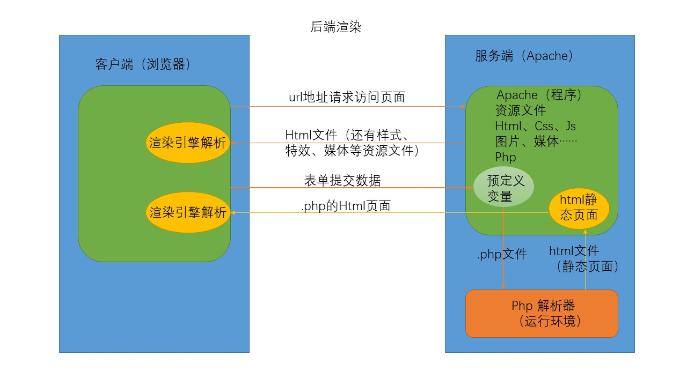
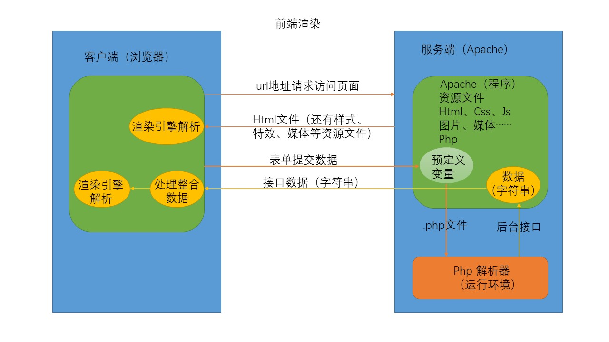

## 一、Ajax简介

  术语ajax最早产生于2005年，Ajax表示Asynchronous JavaScript and XML(异步JavaScript和XML)，但是它不是像HTML、JavaScript或CSS这样的一种“正式的”技术，它是表示一些技术的混合交互的一个术语（JavaScript、Web浏览器和Web服务器），它使我们可以获取和显示新的内容而不必载入一个新的Web页面。增强用户体验，更有桌面程序的感觉。Ajax可以做什么？

* 显示新的HTML内容而不用载入整个页面
* 提交一个表单并且立即显示结果
* 登录而不用跳转到新的页面
* 星级评定组件
* 遍历数据库信息加载更多而不刷新页面

### 1. 服务器环境wamp

#### 1.1 网页资源存放目录

* 默认目录：F:\wamp\www
* 可以修改默认目录：
  * 打开F:\wamp\bin\apache\Apache2.4.4\conf\httpd.conf文件（或者wamp菜单/Apache/httpd.conf）
  * 搜索DocumentRoot，修改路径为自己想要的路径（下面那一行也要修改）
  * 重启服务

#### 1.2 修改访问权限

* wamp的资源访问权限默认只有本机（localhost，127.0.0.1）可以访问，修改权限可以使局域网内的其他主机也可以访问（根据安装wamp的主机的局域网ip地址）
  * 打开F:\wamp\bin\apache\Apache2.4.4\conf\httpd.conf文件（或者wamp菜单/Apache/httpd.conf）
  * 搜索Deny from all，把Deny改为Allow
  * 重启服务

#### 1.3 Apache配置虚拟主机

  Apache可以配置多个虚拟主机（多个网站）。域名和网站目录对应

* 开启虚拟主机配置，在httpd.conf 中找到如下位置,然后把前面的井号去掉

  ```
  # Virtual hosts
  #Include conf/extra/httpd-vhosts.conf
  ------>
  # Virtual hosts
  Include conf/extra/httpd-vhosts.conf
  ```

* 配置虚拟主机，打开F:\wamp\bin\apache\Apache2.4.4\conf\extra\httpd-vhosts.conf

* 可以将如下内容复制多份，修改，就可以配置多个虚拟主机

  ```
  <VirtualHost *:80>
      ServerAdmin webmaster@dummy-host.example.com
      DocumentRoot "c:/Apache24/docs/dummy-host.example.com"
      ServerName dummy-host.example.com
      ServerAlias www.dummy-host.example.com
      ErrorLog "logs/dummy-host.example.com-error.log"
      CustomLog "logs/dummy-host.example.com-access.log" common
  </VirtualHost>
  ```

* 分别修改以下三项，其它项无需指定。其中E:/www是Apache的资源存放目录，不同的虚拟主机就是这个目录下的子目录；ServerName是域名（当然只能本地使用）；ServerAlias是域名的别名

  - DocumentRoot "E:/www/example"
  - ServerName "example.com "
  - ServerAlias "www.example.com"

* 修改DNS（本地hosts）文件(C:\Windows\System32\drivers\etc\hosts),
  添加如下内容（每一个虚拟主机要两条，分别对应域名和别名）：
  127.0.0.1  example.com 
  127.0.0.1  www.example.com

  127.0.0.1  example1.com 
  127.0.0.1  www.example1.com

* 重启apache服务

* 访问http://www.example.com或者http://example.com


### 2. 静态网站与动态网站

#### 2.1 静态网站

* 就是提前写好的html页面（包括图片、媒体文件。。。静态资源文件），并且部署到服务器上。静态网站主要存在的问题：
* 随着网站规模的增大可维护性逐渐降低
* 没有交互性

#### 2.2 动态网站

- 动态：指的是html页面是动态生成的，这里的动态生成的不一定是一个完整的页面，可能仅仅是页面的一部分，或者仅仅是数据(普通字符串、json、xml)。

```php
// index.php
// 这就是一个简单的动态网页，echo后面的内容由服务器动态地生成到页面中，再发送给客户端
<!DOCTYPE html>
<html lang="en">
<head>
	<meta charset="UTF-8">
	<title>PHP 首页</title>
</head>
<body>
	<div>我是一个.php文件</div>
	<?php 
  		// 所有的php代码都放在这里
  		// echo 的作用就是向页面中输出字符串
		echo '<div>Hello World</div>'
	?>
</body>
</html>
```

## 二、php基础

- PHP 文件可包含文本、HTML、JavaScript代码和 PHP 代码
- PHP 代码在服务器上执行，结果以纯 HTML 形式返回给浏览器
- PHP 文件的默认文件扩展名是 ".php"
- PHP 脚本可以放在文档中的任何位置。
- PHP 脚本以\<?php开始，以 **?>** 结束

### 1. 变量声明和字符串拼接

* ## PHP 是一门弱类型语言

* PHP 没有声明变量的命令。变量在您第一次赋值给它的时候被创建：

* 变量以$开头 字母/数字/下划线 不能以数字开头，大小写敏感。

#### 1.1 局部变量和全局变量

* 在**函数内**创建的变量就是**局部变量**

* 在**所有函数外**创建的变量就是**全局变量**

* 除了函数外，全局变量可以被脚本中的任何部分访问，要在一个函数中访问一个全局变量，需要使用 global 关键字。

  ```php
  <?php
  $x=5;
  $y=10;
  function myTest()
  {
      global $x,$y;
      $y=$x+$y;
  }
  myTest();
  echo $y; // 输出 15
  ?>
  ```

* PHP 将**所有全局变量**存储在一个名为 \$GLOBALS[*index*] 的数组中。 *index* 保存变量的名称。这个数组可以在函数内部访问，也可以直接用来更新全局变量。

  ```php
  <?php
  $x=5;
  $y=10;
  function myTest()
  {
      $GLOBALS['y']=$GLOBALS['x']+$GLOBALS['y'];
  } 
  myTest();
  echo $y;	// 输出15
  ?>
  ```

#### 1.2 static变量

* 当一个函数完成时，它的所有（局部）变量通常都会被删除。

* 使用static可以延长局部变量的**生存期** ，使之在函数调用结束后依然保留，且下次调用这个函数的时候它不会被重复创建，而是使用上次调用结束时的值。

* static变量的作用域依然是局部作用域

  ```php
  <?php
  function myTest()
  {
      static $x=0;
      echo $x;
      $x++;
      echo PHP_EOL;    // 换行符
  }
  myTest();	// 0
  myTest();	// 1
  myTest();	// 2
  ?>
  ```

#### 1.3 字符串拼接

* 字符串拼接使用.符号

```php
$y = 3;
echo '<div>Hello'.$y.' World</div>';	// Hello3 World
```

#### 1.4 ''和""

* ''包裹的字符串中的变量会被php认为是普通字符串
* ""包裹的字符串中的变量会被php认为是变量值

```php
$y = 3;
echo '<div>Hello $y World</div>';// Hello $y World
echo "<div>Hello $y World</div>";// Hello 3 World
```

### 2. 内容输出

#### 2.1 echo

* 向页面中输出字符串（输出内容就放在html页面中，标签会被解析）
* 输出简单数据类型，如字符串、数值、数组的元素（$arr[0]）
* 不能输出复杂类型（数组、对象）

```php+HTML
$arr1 = array("name"=>"zs", "age"=>19, "sex"=>"man");
echo $arr1['age'];	// 19
```

#### 2.2 print_r()

* 输出复杂数据类型，如数组

```php
$arr1 = array("name"=>"zs", "age"=>19, "sex"=>"man");
print_r($arr1);	// Array ( [name] => zs [age] => 19 [sex] => man )
```

#### 2.3 var_dump()

* 输出详细信息，如对象、数组

```php
$arr1 = array("name"=>"zs", "age"=>19, "sex"=>"man");
var_dump($arr1);

// array (size=3)
//   'name' => string 'zs' (length=2)
//   'age' => int 19
//   'sex' => string 'man' (length=3)
```

### 3. 数组

#### 3.1 定义数组

* 使用array()方法声明数组
* 参数是一个一个的值，就是索引为0，1，2，...的数组

```php
$arr = array(1, 2, 3, 4);
print_r($arr);	// Array ( [0] => 1 [1] => 2 [2] => 3 [3] => 4 )
```

* 参数是键值对，就是索引为“键”的数组

```php
$arr1 = array("name"=>"zs", "age"=>19, "sex"=>"man");
echo $arr1['age'];	// 19
echo '<br>';
print_r($arr1);	// Array ( [name] => zs [age] => 19 [sex] => man )
echo '<br>';
var_dump($arr1);

// array (size=3)
//   'name' => string 'zs' (length=2)
//   'age' => int 19
//   'sex' => string 'man' (length=3)
```

#### 3.2 访问数组元素

* 数值数组：对于索引是数值（0,1,2,3）的使用`$arr[1]` 即可
* 关联数组：对于索引是字符串的“键值对”数组，[]中的键必须带引号''或""：`$arr["age"]` 
* **数值形式的索引和字符串形式的键可以共存。**

#### 3.3 二维数组

* 让数组中的元素的值是一个数组，就是二维数组

```php
$arr = array(123);	// 123的索引是0
$arr['apple'] = array('color'=>'red', 'shape'=>'round');
$arr['orange'] = array('color'=>'orange', 'shape'=>'round');
print_r($arr);
// Array ( [0] => 123 
// [apple] => Array ( [color] => red [shape] => round ) 
// [orange] => Array ( [color] => orange [shape] => round ) )
```

#### 3.4 遍历数组

* 遍历数值数组，for循环即可
* count()函数可以获得数组长度

```php
<?php
$cars=array("Volvo","BMW","Toyota");
$arrlength=count($cars);
 
for($x=0;$x<$arrlength;$x++)
{
    echo $cars[$x];
    echo "<br>";
}
?>
```

* 遍历关联数组，使用`foreach($array as $x=>$value)`

```php
<?php
$age=array("Peter"=>"35","Ben"=>"37","Joe"=>"43");
// $x就是键，$x_value就是值，如果as后面只有一个变量，那就是数组的值
foreach($age as $x=>$x_value)
{
    echo "Key=" . $x . ", Value=" . $x_value;
    echo "<br>";
}
?>
```

### 4. 函数

* php中的函数声明与js中完全相似
* php中函数名不区分大小写
* php中函数也有类似于js中的预解析（即可以把函数调用写在函数声明前面）

```php
function fnn($val) {
		$val += 1;
		return $val;
}
echo fnn(5);	// 6
```

#### 4.1 json_encode()

* json_encode()对php数据变量（数组、对象）进行 JSON 编码
* 详情待续

```php
$arr = array(1, 2, 3);
$ret = json_encode($arr);
print_r($arr);	// Array ( [0] => 1 [1] => 2 [2] => 3 )
echo '<br>';
echo $ret;		// [1,2,3]---->json标准形式
echo '<br>';

$arr1 = array('a'=>1, 'b'=>2, 'c'=>3);
$ret1 = json_encode($arr1);
print_r($arr1);	// Array ( [a] => 1 [b] => 2 [c] => 3 )
echo '<br>';
echo $ret1;		// {"a":1,"b":2,"c":3}---->json标准形式
```

#### 4.2 json_decode()

* json_decode()对 JSON数据进行解码，变成php数据变量
* 详情待续

```php
<?php
   $json = '{"a":1,"b":2,"c":3,"d":4,"e":5}';	// 这是一个字符串，不是对象
   // 当第二个参数为 TRUE 时，将返回数组，FALSE 时返回对象。
   var_dump(json_decode($json));
   // object(stdClass)[1]
   // public 'a' => int 1
   // public 'b' => int 2
   // public 'c' => int 3
   // public 'd' => int 4
   // public 'e' => int 5
   
   var_dump(json_decode($json, true));
	// array (size=5)
	// 'a' => int 1
    // 'b' => int 2
    // 'c' => int 3
	// 'd' => int 4
	// 'e' => int 5
?>
```

### 5. 预定义变量

php中有两个预定义变量（内置的）：

* $_GET：用来获取（客户端请求数据时）url中?后面的参数（query(查询字段)）的值
* $_POST：表单提交数据时，根据表单中的“name属性值”获取表单的输入内容

#### 5.1 http常用的请求方式

* (增删改查)
* get    用来从服务器获取数据(参数一般作为查询条件)------**查**
* post   用来添加数据------**增**
* put    用来修改数据------**改**
* delete 用来删除数据------**删**

#### 5.2 $_GET

* url `http://localhost/php/page4-get.php?abc=1` 访问服务器，`$_GET['abc']` 可以得到url地址中传递的参数的值1

```php
$f = $_GET['abc'];	// 1
if($f == 1){
    echo "得到数据";
}else{
    echo "参数错误";
}
```

#### 5.3 $_POST

* form表单默认请求方式就是get请求，get请求会把表单数据作为url的参数，需要设置`method='post'`

* 表单中的标签设置其name属性，标签的name值会作为$_POST["键"]中的“键”来获取表单数据

* php中的header()方法可以设置服务器响应的文件类型，和字符集，让客户端浏览器根据指定的信息显示内容

  ```php
  // 设置服务器响应的文件类型（可百度查询），和字符集
  header("Content-Type:text/plain; charset=utf-8");
  ```

  

1. 用户在客户端的页面中点击**提交**按钮后，用户输入的内容会以post方式发送给服务端
2. 服务端的会将表单的**name值**和**对应的用户输入内容** 组成的**键值对**放在预定义变量$_POST中
3. 可以在php代码中使用`$_POST['username'];` 和`$_POST['password'];` 这样的形式获取这些数据（用户输入的内容）
4. 再处理这些数据

```html
<!-- 客户端的页面 -->
<body>
    <div>
        <form action="./page5-post.php" method="post">
            用户名：<input type="text" name="username"><br>
            密码：<input type="text" name="password">
            <input type="submit" value="登录">
        </form>
    </div>
</body>
```

```php
// 服务器的处理，会返回给客户端
<?php 
    // 这里根据表单中的name属性获取值
    $uname = $_POST['username'];
    $pw = $_POST['password'];
    // 设置服务器响应的文件类型
    header("Content-Type:text/plain; charset=utf-8");
    if($uname == 'admin' && $pw == '123'){
        echo '登录成功';
    }else{
        echo '用户名或者密码错误';
    }

 ?>
```

### 6. 动态网页案例

- 简化版成绩查询

#### 6.1 客户端页面

* 客户端输入考号，点击查询，数据{"code": "考号"}会发送给表单的action目标（即服务端的giveScore.php文件）
* 数据{"code": "考号"}（未必是这样的形式）会保存在服务端的$_POST预定义变量中

```html
<!DOCTYPE html>
<html lang="en">
<head>
	<meta charset="UTF-8">
	<title>成绩查询</title>
</head>
<body>
	<div>
		<form action="./giveScore.php" method="post">
			<span>输入考号查询成绩：</span><br>
			考号：<input type="text" name="code"><br>
			<input type="submit" value="查询">
		</form>
	</div>
</body>
</html>
```

#### 6.2 服务端响应

* 这种属于**后端渲染**，即服务器端处理完数据，直接把数据放入HTML结构中，返回给客户端的是**完整页面**
* 服务端接收到数据{"code": "考号"}，使用$_POST['code']预定义变量读取客户端提交的数据
* 根据数据内容做响应的处理（从数据库取数据，或把数据放入数据库）（增查改删）
* echo内容会被放入<?php  ?>所在标签中与HTML结构一起形成新的页面返回客户端，呈现给用户
* <?php  ?>可以放在任何需要动态添加数据的标签中

```php
<!DOCTYPE html>
<html lang="en">
<head>
	<meta charset="UTF-8">
	<title>成绩查询</title>
</head>
<body>
	<?php 
		// 二维数组，暂代数据库保存数据
		$arr = array();
        $arr['123'] = array("username"=>"张三","chinese"=>"130","math"=>"149","english"=>"146","summary"=>"298");
        $arr['124'] = array("username"=>"李四","chinese"=>"100","math"=>"140","english"=>"136","summary"=>"298");
        $arr['125'] = array("username"=>"王五","chinese"=>"90","math"=>"139","english"=>"126","summary"=>"298");
        $arr['126'] = array("username"=>"赵六","chinese"=>"30","math"=>"50","english"=>"80","summary"=>"100");

        $code = $_POST['code'];
        if ($code == 'admin') {
        	foreach ($arr as $key => $value) {
        		echo "<ul><li>姓名：$value[username]</li>
        				  <li>考号：$key </li>
        				  <li>语文：$value[chinese]</li>
        				  <li>数学：$value[math]</li>
        				  <li>英语：$value[english]</li>
        				  <li>综合：$value[summary]</li></ul>";
        	}
        } else {
        	$score = $arr[$code];
        	echo "<ul><li>姓名：$score[username]</li>
        			  <li>考号：$code </li>
        			  <li>语文：$score[chinese]</li>
        			  <li>数学：$score[math]</li>
        			  <li>英语：$score[english]</li>
        			  <li>综合：$score[summary]</li></ul>";
        }
	 ?>
</body>
</html>
```

### 7. 后台接口

#### 7.1 服务端渲染

* 服务端渲染就是**后端渲染**，即服务器端处理完数据，直接把数据放入HTML结构中，返回给客户端的是**完整页面** ，例如上面的查询成绩案例
* 流程如下：



#### 7.2 返回数据（前端渲染）

* 更多时候后端并不返回完整的HTML页面
* 而是根据前端通过get或post方式传来的数据做一些处理后，只返回一些数据（可以是数值、字符串、json数据、html片段等），本质上这些数据都是字符串。
* 前端根据这些数据内容来渲染页面，将信息呈现给用户

```php
// 这就是一个后台接口
<?php 
	$arr = array("username"=>"张三","age"=>"12","sex"=>"male");
	echo json_encode($arr);// 浏览器收到字符串：
							// {"username":"\u5f20\u4e09","age":"12","sex":"male"}
?>
```

* 流程如下



#### 7.3 header()

* header()方法用来设置服务器响应的文件类型（可百度查询），和字符集
* 参数：字符串`"Content-Type:text/plain; charset=utf-8"`
* MIME类型 `Content-Type:text/plain;` 是纯文本类型，可以修改，如`Content-Type:text/html;` 浏览器就会把php的echo输出的内容当做HTML来解析
  * MIME(Multipurpose Internet Mail Extensions)多用途互联网邮件扩展类型。是设定某种扩展名的文件用一种应用程序来打开的方式类型，当该扩展名文件被访问的时候，浏览器会自动使用指定应用程序来打开。多用于指定一些客户端自定义的文件名，以及一些媒体文件打开方式。
* `charset=utf-8` 指定响应文件的字符集，解决乱码

```php
header("Content-Type:text/plain; charset=utf-8");
```

## 三、前后端分工

### 1、前端

* 前端做出静态页面（html、css）和页面特效（js），此时页面中都是假数据
* 前端写出的（拿给后端的）页面（简略版）：

```html
<!DOCTYPE html>
<html lang="en">
<head>
    <meta charset="UTF-8">
    <title>图书列表</title>
    <style type="text/css">
    th,td{
        border-left: 1px solid red;
        border-top:1px solid red;
    }
    table{
        border-right: 1px solid red;
        border-bottom: 1px solid red;
    }
    </style>
</head>
<body>
    <table cellspacing="0" cellpadding="0">
        <thead>
            <tr>
                <th>名称</th>
                <th>作者</th>
                <th>分类</th>
                <th>描述</th>
            </tr>
        </thead>
        <tbody>
            <tr>
                <td>三国演义</td>
                <td>罗贯中</td>
                <td>古典文学</td>
                <td>一个封建王朝的缩影</td>
            </tr>
            <tr>
                <td>水浒传</td>
                <td>施耐庵</td>
                <td>古典文学</td>
                <td>108好汉的故事</td>
            </tr>
            <tr>
                <td>西游记</td>
                <td>吴承恩</td>
                <td>古典文学</td>
                <td>佛教与道教的斗争</td>
            </tr>
            <tr>
                <td>红楼梦</td>
                <td>曹雪芹</td>
                <td>古典文学</td>
                <td>一个封建王朝的缩影</td>
            </tr>
        </tbody>
    </table>
</body>
</html>
```

### 2、后端

* 后端拿到前端做好的页面，使用后端语言（如php、java、.net）把假数据替换为数据库中的真实数据
* 把资源文件整合到程序中放到服务器上就可以提供服务了
* 后端写入数据的页面：

```php
<!DOCTYPE html>
<html lang="en">
<head>
    <meta charset="UTF-8">
    <title>图书列表</title>
    <style type="text/css">
    th,td{
        border-left: 1px solid red;
        border-top:1px solid red;
    }
    table{
        border-right: 1px solid red;
        border-bottom: 1px solid red;
    }
    </style>
</head>
<body>
    <?php 
    sleep(3);//执行到这里的时候等待3秒
    /*这里的数据是假数据，真正的场景中数据基本上都是来自数据库。*/
    $arr = array();
    $arr[0] = array("name"=>"三国演义","author"=>"罗贯中","category"=>"古典文学","desc"=>"一个封建王朝的缩影");
    $arr[1] = array("name"=>"水浒传","author"=>"施耐庵","category"=>"古典文学","desc"=>"108好汉的故事");
    $arr[2] = array("name"=>"三国演义","author"=>"吴承恩","category"=>"古典文学","desc"=>"佛教与道教的斗争");
    $arr[3] = array("name"=>"三国演义","author"=>"曹雪芹","category"=>"古典文学","desc"=>"一个封建王朝的缩影");
     ?>
    <table cellspacing="0" cellpadding="0">
        <thead>
            <tr>
                <th>名称</th>
                <th>作者</th>
                <th>分类</th>
                <th>描述</th>
            </tr>
        </thead>
        <tbody>
       		<!-- 多个php标签中的代码是连续的，可以把一段代码分成很多段，分别放到合适的位置 -->
       		<!-- 只有echo语句中的输出值会放到页面上 -->
            <?php foreach ($arr as $value) {?>
               <tr>
                <td><?php echo $value["name"]; ?></td>
                <td><?php echo $value["author"]; ?></td>
                <td><?php echo $value["category"]; ?></td>
                <td><?php echo $value["desc"]; ?></td>
               </tr>
            <?php } ?>
        </tbody>
    </table>
</body>
</html>
```

## 四、Ajax

### 1. Ajax发送请求流程

* 写在js中，放在某事件处理函数中。

1. 创建XMLHttpRequest对象

   `var xhr = new XMLHttpRequest();`

   * XMLHttpRequest有兼容问题，IE6不支持

     ```javascript
     if (window.XMLHttpRequest) {
       var xhr = new XMLHttpRequest();	// 标准
     } else {
       var xhr = new ActiveXObject("Micorsoft.XMLHTTP")	// IE6
     }
     ```

2. 准备发送

   `xhr.open('get','./01check.php?username='+uname+'&password='+pw,true);`

3. 执行发送动作

    `xhr.send(null);`

4. 指定回调函数：接收到服务端返回的数据时，由浏览器调用，对数据进行处理

   ```javascript
   xhr.onreadystatechange = function(){
       if(xhr.readyState == 4){
           if(xhr.status == 200){
               var data = xhr.responseText;
               var info = document.getElementById('info');
               if(data == '1'){
                   info.innerHTML = '登录成功';
               }else if(data == '2'){
                   info.innerHTML = '用户名或者密码错误';
               }
           }
       }
   }
   ```

#### 1.1 open()方法

* XMLHttpRequest的open()方法用于做发送准备
* 参数1：请求方式（get获取数据；post提交数据）
* 参数2：请求地址url（get请求请求参数必须在url中传递（拼接字符串，查询参数以`?键=值&键=值...` 的方式**拼接在url后面**））
* 参数3：同步或者异步标志位，默认是true表示异步，false表示同步（一般不用）

#### 1.2 send()方法

* XMLHttpRequest的send()方法用于执行请求发送动作
* 参数：请求方式为get时，参数为null（有些浏览器必须写null，有些不用，为保持兼容，一般写入null）
* 参数：请求方式为post时，把要发送的数据（字符串`键=值&键=值...`）放入send()的参数中

#### 1.3 onreadystatechange事件

* XMLHttpRequest的onreadystatechange事件：readyState状态发生变化（不包括从0变为1）时调用回调函数

#### 1.4 readyState属性

  XMLHttpRequest对象的readyState属性是**浏览器对接收到的服务端数据的处理状态** ，有5个值：

* 0：xhr.readyState=0表示xhr对象创建完成（对应Ajax请求流程的第一步结束）
* 1：xhr.readyState=1表示已经发送了请求（对应Ajax请求流程的第二、三步结束）
* 2：xhr.readyState=2表示浏览器**已经收到**了服务器响应的**数据**（发生onreadystatechange事件）
* 3：xhr.readyState=3表示正在**解析数据**（发生onreadystatechange事件）
* 4：xhr.readyState=4表示数据已经**解析完成**，可以使用了（发生onreadystatechange事件）

#### 1.5 status属性

  XMLHttpRequest对象的status属性是http协议的状态码，常见的状态码：

* 200：表示响应成功（数据正确）
* 404：没有找到请求的资源
* 500：服务器端错误

#### 1.6 responseText属性

  XMLHttpRequest对象的responseText属性是浏览器接收到的JSON数据。

* 还有一个属性是xhr.responseXML（浏览器接收到的XML数据，现在用的较少）

#### 1.7 XML

##### (1) XML数据格式（了解）

  XML是可扩展标记语言，其结构类似于html，由标签包裹数据（标签称为元数据。即描述数据的数据）

* 元数据内容随意，但必须有一对相同标识符的开始和结束标签
* 缺点1：元数据占用大量内容，不利于大量数据的网络传输，效率较低
* 缺点2：解析不太方便
* 其格式如下：

```xml
<?xml version="1.0" encoding="utf-8" ?>
<booklist>
    <book>
        <name>三国演义</name>
        <author>罗贯中</author>
        <desc>一个杀伐纷争的年代</desc>
    </book>
    <book>
        <name>水浒传</name>
        <author>施耐庵</author>
        <desc>108条好汉的故事</desc>
    </book>
</booklist>
```

##### (2) XML数据解析（了解）

  XML的数据解析其实就是根据其树状DOM结构获取指定节点的内容，十分类似于html的DOM操作（一系列DOM API），同样的也比较麻烦，幸好它已经不是主流了。

* 这段代码就是获取到1.9中的xml数据后的处理，获取第一条book信息

```javascript
xhr.onreadystatechange = function(){
    if(xhr.readyState == 4){
        if(xhr.status == 200){
            var data = xhr.responseXML;
            var bookList = data.getElementsByTagName('booklist');
            var books = bookList[0].children;

            var book1 = books[0];

            var name = book1.children[0].firstChild.wholeText;
            var author = book1.children[1].firstChild.wholeText;
            var desc = book1.children[2].firstChild.wholeText;
            console.log(name,author,desc);
        }
    }
}
```

##### (3) php开发XML（了解）

  可以使用php（或其他变编程语言）根据数据库中的数据动态生成xml格式的数据：

* 客户端（js进行http请求）请求这个文件就会获得一个具有XML格式的数据

```php
<?php 
    header("Content-Type:text/xml;");//这里设置响应头信息，保证浏览器可以把相应内容识别为xml文件类型

    $arr = array();
    $arr[0] = array("name"=>"三国演义","author"=>"罗贯中","desc"=>"一个杀伐纷争的年代");
    $arr[1] = array("name"=>"水浒传","author"=>"施耐庵","desc"=>"108条好汉的故事");
    $arr[2] = array("name"=>"西游记","author"=>"吴承恩","desc"=>"佛教与道教斗争");
    $arr[3] = array("name"=>"红楼梦","author"=>"曹雪芹","desc"=>"一个封建王朝的缩影");
 ?>
<?xml version="1.0" encoding="utf-8" ?>
<booklist>
    <?php for ($i = 0; $i < count($arr); $i++) { ?>
        <?php echo '<book>' ?>
            <name><?php echo $arr[$i]['name'] ?></name>
            <author><?php echo $arr[$i]['author'] ?></author>
            <desc><?php echo $arr[$i]['desc'] ?></desc>
        <?php echo '</book>' ?>
    <?php } ?>
</booklist>
```

### 2. get方式发送请求

  使用get方式在**第二步（xhr.open()）** 和**第三步（xhr.send()）**与post方式不同。

1. get请求请求参数必须在url中传递（拼接字符串，查询参数以`?键=值&键=值...` 的方式**拼接在url后面**）
2. 当传递的参数中有中文时，要用encodeURI()对中文参数进行编码，防止乱码（IE中会乱码，出现错误）

```javascript
// 3、准备发送
var param = 'username='+uname+'&password='+pw;
xhr.open('get','03get.php?'+encodeURI(param),true);
// 3、执行发送动作
xhr.send(null);//get请求这里需要添加null参数
```

### 3. post方式发送请求

  使用post方式在**第二步（xhr.open()）** 和**第三步（xhr.send()）**与get方式不同。

1. 必须设置请求头信息`xhr.setRequestHeader("Content-Type","application/x-www-form-urlencoded");`
2. post请求参数通过send传递，不需要通过encodeURI()转码，把要发送的数据（字符串`键=值&键=值...`）放入send()的参数中即可

```javascript
// 2、准备发送
xhr.open('post','04post.php',true);
// 3、执行发送动作
// 设置请求头信息
xhr.setRequestHeader("Content-Type","application/x-www-form-urlencoded");
// 发送数据
var param = 'username='+uname+'&password='+pw;
xhr.send(param);//post请求参数在这里传递，并且不需要转码
```

### 4. JSON

- JSON 指的是 JavaScript 对象表示法（**J**ava**S**cript **O**bject **N**otation）
- JSON 是轻量级的文本数据交换格式
- JSON 独立于语言：JSON 使用 Javascript语法来描述数据对象，但是 JSON 仍然独立于语言和平台。JSON 解析器和 JSON 库支持许多不同的编程语言。 目前非常多的动态（PHP，JSP，.NET）编程语言都支持JSON。
- JSON 具有自我描述性，更易理解

#### 4.1 JSON数据格式

  JSON的数据表示类似于JavaScript的对象，不同点在于：

1. json数据没有变量
2. json形式的数据结尾没有分号
3. json数据中的键必须用双引号包住

```json
{
    "name":"zhansan",
    "age":12,
    "lover":["coding","swimming","singing"],
    "friend":{
        "high":"180cm",
        "weight":"80kg",
        "lover":["swimming","singing","dancing"],
        "friend":{}
    }
}
```

以上的数据结构可以无限嵌套。

  JSON还支持JavaScript数组形式的数据，后端可以直接把数组使用其对应的json API（例如php的json_encode()）转换成json数组（就是字符串，例如`'[1,2,3]'`）。

* JSON 不能存储 Date 对象。
* JSON 不允许包含函数，JSON.stringify() 会删除 JavaScript 对象的函数，包括 key 和 value。

#### 4.2 JSON数据解析

  许多编程语言都提供了原生的JSON API，JavaScript也不例外。浏览器接收到的服务端json数据可以通过XMLHttpRequest对象xhr的属性xhr.responseText获得。

##### (1) JSON.parse()

* JSON.parse(jsonData)方法用于把json数据解析成JavaScript对象。

* 参数：json数据（符合json数据格式的字符串），如果不是json类型的字符串，就会报错。

  ```
  '[1,2,3]'
  或者
  '{
      "name":"zhansan",
      "age":12,
      "lover":["coding","swimming","singing"],
      "friend":{
          "high":"180cm",
          "weight":"80kg",
          "lover":["swimming","singing","dancing"],
          "friend":{}
      }
  }'
  ```

* 返回值：JavaScript对象

##### (2) JSON.stringify()

* JSON.stringify(jsonData)的作用于JSON.parse()相反，是把JavaScript对象转换成json数据（字符串）
* 参数：JavaScript对象
* 返回值：json格式的数据（字符串）

  JSON 不能存储 Date 对象。JSON.stringify() 会将所有日期转换为字符串。之后你可以再将字符串转换为 Date 对象。

  JSON 不允许包含函数，JSON.stringify() 会删除 JavaScript 对象的函数，包括 key 和 value。我们可以在执行 JSON.stringify() 函数前将函数转换为字符串来避免以上问题的发生。

##### (3) eval()

* eval("(" + jsonData + ")")的作用就是把字符串解析成js代码并执行，所以也可以用来解析json（用的较少）
* 参数：js表达式，"(" + str + ")"，必须对字符串拼接上()，固定用法
* 返回值：当str是json数据时，返回一个JavaScript对象
* eval() 函数可编译并执行任何 JavaScript 代码。这隐藏了一个潜在的安全问题。

#### 4.3 php开发json

  后端（如php）开发json，向前端发送数据：

* 可以把数据库中的数据放入数组或对象
* 使用其json API（如php中的json_encode()）将数组或对象转换成json数据
* 将json数据发送到前端（php中的echo）

前端接收到json数据后，将其解析成数组或对象，就可以访问这些数据了。

### 5. 封装Ajax（模拟$.ajax()）

  由于原生Ajax请求的代码具有高度一致性，所以可以将其封装为一个ajax()函数，接收一定的参数，来发送ajax请求。

* url：要请求的文件url（不能跨域）
* type：http请求类型，'get'或'post'
* data：查询参数，'code=123'
* dataType：预期的服务器响应数据类型，'text'或'json'
* success：onreadystatechange回调函数，处理服务器返回的数据，success应接收一个data参数（服务器返回数据）服务器返回数据为1.纯字符串，2.json类型字符串（已转换为对象），3.jsonp跨域数据

```javascript
function ajax(obj) {
	// 默认值
	var defaults = {
		url: '#',
		type: 'get',
		data: {},
		dataType: 'text',
		success: function (data) {console.log(data);}
	}
	// 根据传入参数替换、添加默认值
	for (var key in obj) {
		defaults[key] = obj[key];
	}

	// 1.创建XMLHttpRequest对象
	var xhr = null;
	if (window.XMLHttpRequest) {
		xhr = new XMLHttpRequest();
	} else {
		xhr = new ActiveXObject("Microsoft.XMLHTTP");
	}
	// 处理查询参数
	var query = '';
	for (var key in defaults.data) {
		if (query) {
			query += '&' + key + '=' + defaults.data[key];
		} else {
			query += key + '=' + defaults.data[key];
		}
	}

	// 2.准备发送请求
	if (defaults.type === 'get') {
		defaults.url += '?' + encodeURI(query);
	}
	xhr.open(defaults.type, defaults.url, true);

	// 3.发送请求
	var sendArg = null;
	if (defaults.type === 'post') {
		sendArg = query;
		xhr.setRequestHeader("Content-Type", "application/x-www-form-urlencoded");
	}
	xhr.send(sendArg);

	// 4.回调函数
	xhr.onreadystatechange = function () {
		if (xhr.readyState === 4) {
			if (xhr.status === 200) {
				var data = xhr.responseText;
				if (defaults.dataType === 'json') {
					data = JSON.parse(data);
				}
				defaults.success(data);
			}
		}
	}
}
```

## 五、跨域

* **同源策略**

1. 同源策略是浏览器的一种安全策略，所谓同源指的是请求URL地址中的**协议**、**域名**和**端口**都相同，**只要其中之一不相同就是跨域**
2. 同源策略主要为了保证浏览器的安全性
3. 在同源策略下，浏览器不允许Ajax跨域获取服务器数据
4. **\<script>标签中的src属性可以跨域**

### 1. 静态script标签获取跨域数据

1. 页面中放入一个\<script>标签1通过其src属性访问跨域站点的数据；
2. 服务端应该返回一段字符串形式的js代码（可以直接请求js文件，也可以是其他，如php）；（例如php中`echo 'var data = '.json_encode(arr)`）
3. 接收到的数据（js代码）会被放入\<script>标签1中执行；
4. 在它后面的\<script>标签2就可以直接访问服务器返回的js变量。

* 问题1：静态，url地址写死，不能灵活传递参数；
* 问题2：同步，必须等待\<script>标签1请求的数据返回，才能继续向下执行（不能异步）

```html
<script /*async*/ type="text/javascript" src="http://tom.com/data.php?flag=1">
    // 相当于在这里执行了以下代码：
  	// var data ={"username":"zhangsan","password":"123456"}
</script>
<script type="text/javascript">
    /*
    script标签里面的async属性表示异步加载资源，默认情况下是同步加载
    这种方式存在的两个主要的问题：
    1、必须保证加载的顺序
    2、不方便通过程序传递参数
    */
    console.log(data.username);
    console.log(data.password);
</script>
```

```php
<?php 
	$arr = array("username"=>"zhangsan","password"=>"123456");
    echo 'var data = '.json_encode(arr);
 ?>
```

### 2. 动态script标签获取跨域数据

#### jsonp原理

1. 操作DOM，在head标签中动态追加一个srcipt标签
2. 设置srcipt标签属性为`srcipt.src = url` （这样的url就可以灵活传递参数了）
3. 在html中预先声明一个回调函数（例如`function foo(data) {}`），后端返回的数据就在这里处理（数据形式事先约定好），**这个函数应该是由window调用**。
   * 这个函数名称可以灵活定义：
   * 在url中加一个参数`callback=foo` ，其中callback是后端规定的参数的键，foo是前端使用的回调函数的函数名
   * 后端在返回js函数调用时，会用\$_GET['\_callback']获取到前端回调函数名，把这个函数名拼接到返回的字符串（js代码）中
   * 前端只要保证传递的参数中的foo与回调函数名foo一致即可
4. 这种方式是异步的（无法改变），所以服务端通常返回一个字符串形式的js函数调用，可以传递参数（字符串形式的参数只要符合json格式，就会自动装换为js对象）（`'foo('.json_encode(arr).')'`）
5. 这样就是实现了跨域、异步、灵活传递参数的数据请求。
6. jsonp方式的请求都是GET方式

* 这种方式的本质：就是在head标签（也可以是body）最后加了一个srcipt标签，其中的函数调用代码是服务器返回的数据，由于是异步的，所以当服务器返回函数调用代码时，代码被填入srcipt标签中执行，就完成了异步数据请求和处理
  * 添加srcipt标签
  * 设置url
  * 声明回调函数（函数名通过参数传递给后端）
  * 后端返回带参数的函数调用

```html
<head>
    <meta charset="UTF-8">
    <title>Document</title>
    <script type="text/javascript">
        /* 原生jsonp
        动态创建script标签发出去的请求是异步请求
        服务器响应的内容是【函数调用】  foo(实参)
        */
      	// 1.回调函数
        function foo(data){
            console.log(data.username,data.password);
        }
        var flag = 1;
      	// 2.动态添加script标签
        var script = document.createElement('script');
        script.src = 'http://tom.com/data.php?_callback=foo&flag='+flag;
        var head = document.getElementsByTagName('head')[0];
        head.appendChild(script);
    </script>
</head>
```

```php
<?php 
	$arr = array("username"=>"zhangsan","password"=>"123456");
	$cb = $_GET['_callback'];	// 'foo'
    echo $cb.'('.json_encode(arr).')';
 ?>
```

### 3. 封装jsonp（模拟$.ajax()）

* jsonp跨域请求只能是get方式
* url：跨域的url地址
* data：查询参数，对象形式
* dataType：预期返回的数据类型，这里用'jsonp'
* jsonp：与后端约定的回调函数的键，后端可以据此获得前端自定义的回调函数名
* jsonpCallback：自定义的回调函数的函数名
* success：成功返回数据时，调用回调函数，回调函数调用success

```javascript
function ajax(obj) {
	// 1.默认值
	var defaults = {
		url: '#',
		data: {},
		dataType: 'text',
		jsonp: 'callBack',
		success: function (data) {}
	};
	// 根据传入参数替换、添加默认值
	for (var key in obj) {
		defaults[key] = obj[key];
	}
	// 处理url中要传递的参数
	var query = '';
	for (var key in defaults.data) {
		query += '&' + key + '=' + defaults.data[key];
	}
	// 如果指定了回调函数名，就用指定的值，如果没有指定，就随机生成一个
	var callBack = '';
	if (defaults.jsonpCallback) {
		callBack = defaults.jsonpCallback;
	} else {
		// 模拟随机生成回调函数名
		callBack = 'jQuery' + ('3.5.1' + Math.random()).replace(/\D/g, '') + '_' + (new Date()).getTime();
	}
	// 2.声明回调函数，小技巧，把回调函数作为window的一个方法，服务器返回数据时调用callback(data)方法，callback再调用success
	window[callBack] = function (data) {
		defaults.success(data);
	}
	// 3.创建一个script标签
	var script = document.createElement('script');
	script.src = defaults.url + '?' + defaults.jsonp + '=' + callBack + query;
	var head = document.getElementsByTagName('head')[0];
	head.appendChild(script);
}
```

## 六、模板引擎artTemplate

* 模板引擎用于：渲染服务端返回的数据时，使用模板化的语法替代拼接字符串，便于维护
* 目的：得到静态HTML片段<=模板+数据
* 官方文档：[https://aui.github.io/art-template/zh-cn](https://aui.github.io/art-template/zh-cn)

### 1. 基本语法

#### 1.1 引入模板引擎

1. 引入template.js文件

```html
<script type="text/javascript" src="./template.js"></script>
<script type="text/html" id="temp">
	// artTemplate代码
	// 这里面可以直接使用传入的对象的属性，例如：city是传入对象data1的属性
	{{if city}}
	{{/if}}
	// 若要直接使用传入的对象，例如data1，使用预定义变量$data即可
	{{if $data}}
	{{/if}}
</script>
```

#### 1.2 语法

1. 输出

   ```
   {{value}}
   {{data.key}}
   {{data['key']}}
   {{a ? b : c}}
   {{a || b}}
   {{a + b}}
   ```

2. 原文输出

   * 原文输出语句不会对 `HTML` 内容进行转义处理，可能存在安全风险，请谨慎使用。

   ```
   {{@ value }}
   ```

3. 条件

   * 可以用==来判断值是否相等（!=同理）
   * 在模板最外层的if是判断传入template()的对象中有没有value属性，而不是判断传入template()的对象

   ```
   {{if value}} ... {{/if}}
   {{if v1}} ... {{else if v2}} ... {{/if}}
   {{if v1}} ... {{else}} ... {{/if}}
   ```

4. 循环

   * `target` 支持 `array` 与 `object` 的迭代，其默认值为 `$data`。

   * `$value` 与 `$index`  是循环中的预定义变量，分别是索引: 值。可以自定义：

     `{{each target val key}}`。

   * `$data` 是artTemplate中的预定义变量，代表传入template函数的对象，即2.1中的content

   ```
   {{each target}}
       {{$index}} {{$value}}
   {{/each}}
   ```

5. 变量

   ```
   {{set temp = data.sub.content}}
   ```

6. 在字符串中输出
   
   * 照常以{{value}}的形式写在字符串中即可，可以正确解析

### 2. API

#### 2.1 template(filename, content)

根据模板名渲染模板。

- **参数**：`{string} filename`
- **参数**：`{Object,string} content`
- **返回值**：**如果 `content` 为 `Object`，则渲染模板并返回 `string` （HTML片段）；**如果 `content` 为 `string`，则编译模板并返回 `function`

> **浏览器版本无法加载外部文件，`filename` 为存放模板的元素 `id`**

```html
<script type="text/javascript" src="./template.js"></script>
<script type="text/html" id="weather">
    {{if weather}}
        {{each weather as value}}
            <div>
                <span>日期：{{value.date}}</span>
                <ul>
                    <li>白天天气{{value.info.day[1]}}</li>
                    <li>白天温度{{value.info.day[2]}}</li>
                    <li>白天风向{{value.info.day[3]}}</li>
                    <li>白天风速{{value.info.day[4]}}</li>
                </ul>
                <ul>
                    <li>夜间天气{{value.info.night[1]}}</li>
                    <li>夜间温度{{value.info.night[2]}}</li>
                    <li>夜间风向{{value.info.night[3]}}</li>
                    <li>夜间风速{{value.info.night[4]}}</li>
                </ul>
            </div>
        {{/each}}
    {{/if}}
</script>
<script type="text/javascript">
  	var data = {
      	weather: [...]
  	}
    var html = template('weather',data);
    $('#info').html(html);
</script>
```

#### 2.2 template.compile(source)

编译模板并返回一个渲染函数。

- **参数** （主要）：`{string} source` ，把模板代码做成一个字符串。用compile编译
- **参数** （可选）：`{Object} options`
- **返回值**：`{function}` ，把数据（对象）传入这个返回的函数，生成HTML片段

```javascript
<script type="text/javascript" src="./template.js"></script>

<script type="text/javascript">
  	var data = {
      	weather: [...]
  	}
	var sourse = '  {{if weather}}'
      +'      {{each weather as value}}'
      +'          <div>'
      +'              <span>日期：{{value.date}}</span>'
      +'              <ul>'
      +'                  <li>白天天气{{value.info.day[1]}}</li>'
      +'                  <li>白天温度{{value.info.day[2]}}</li>'
      +'                  <li>白天风向{{value.info.day[3]}}</li>'
      +'                  <li>白天风速{{value.info.day[4]}}</li>'
      +'              </ul>'
      +'              <ul>'
      +'                  <li>夜间天气{{value.info.night[1]}}</li>'
      +'                  <li>夜间温度{{value.info.night[2]}}</li>'
      +'                  <li>夜间风向{{value.info.night[3]}}</li>'
      +'                  <li>夜间风速{{value.info.night[4]}}</li>'
      +'              </ul>'
      +'          </div>'
      +'      {{/each}}'
      +'  {{/if}}';
    var render = template.compile(sourse);
    var html = render(data);
    $("#info").html(html);
</script>
```


