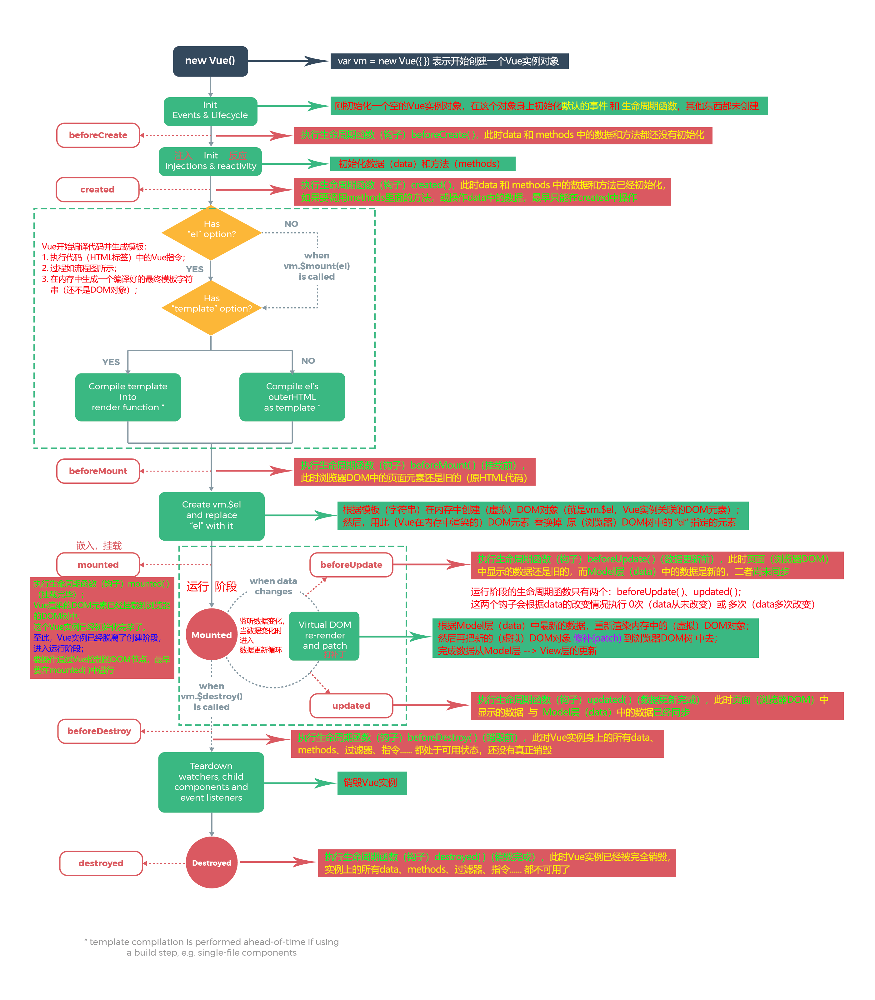

# Vue.js

## 〇. Vue基本了解

### 1. 什么是Vue.js

+ Vue.js 是目前最火的一个前端框架，React是最流行的一个前端框架（React除了开发网站，还可以开发手机App， Vue语法也是可以用于进行手机App开发的，需要借助于Weex）

+ Vue.js 是前端的**主流框架之一**，和Angular.js、React.js 一起，并成为前端三大主流框架！

+ Vue.js 是一套构建用户界面的框架，**只关注视图层**，它不仅易于上手，还便于与第三方库或既有项目整合。（Vue有配套的第三方类库，可以整合起来做大型项目的开发）

+ 前端的主要工作？主要负责MVC中的V这一层；主要工作就是和界面打交道，来制作前端页面效果；

### 2. 为什么要学习流行框架

 + 企业为了提高开发效率：在企业中，时间就是效率，效率就是金钱；
   * 企业中，使用框架，能够提高开发的效率；

 + 提高开发效率的发展历程：原生JS -> Jquery之类的类库 -> 前端模板引擎 -> Angular.js / Vue.js（能够帮助我们减少不必要的DOM操作；提高渲染效率；双向数据绑定的概念【通过框架提供的指令，我们前端程序员只需要关心数据的业务逻辑，不再关心DOM是如何渲染的了】）
 + 在Vue中，一个核心的概念，就是**让用户不再操作DOM元素**，解放了用户的双手，让程序员可以更多的时间去关注业务逻辑；

### 3. 框架和库的区别

 + 框架：是一套完整的解决方案；
   * 对项目的侵入性较大，项目如果需要更换框架，则需要重新架构整个项目。
   * node 中的 express；

 + 库（插件）：提供某一个小功能，
   * 对项目的侵入性较小，如果某个库无法完成某些需求，可以很容易切换到其它库实现需求。
   * 从Jquery 切换到 Zepto
   * 从 EJS 切换到 art-template

### 4.Node（后端）中的 MVC 与 前端中的 MVVM 之间的区别

 + MVC 是后端的分层开发概念；
 + MVVM是前端视图层的概念，主要关注于 视图层分离，也就是说：MVVM把前端的视图层，分为了 三部分 Model, View , VM ViewModel
 + 为什么有了MVC还要有MVVM


### 5. 第一个Vue页面

#### 5.1 helloworld

1. html页面中引入Vue.js。引入Vue之后，渲染页面时，window对象就多了一个Vue构造函数
   * ==Vue会将Vue添加给window，创建的Vue实例vm也在window上==
2. html页面结构中指定需要使用Vue.js的页面元素**（v，view层）**
   * 插值表达式：数据使用{{msg}}来填充
3. 创建vue实例，此vue实例就是**（vm层）**`var vm = new Vue({对象})`
   * 传入Vue构造函数的对象，基本属性：
     * el：根据选择器，指定html结构中的元素
     * data**（m层）**：对象，包含要渲染到页面中的数据，它的每一个属性都是可以直接在html结构中的模板字符串中使用，形如{{msg}}

```html
<!DOCTYPE html>
<html lang="en">
<head>
	<meta charset="UTF-8">
	<meta name="viewport" content="width=device-width, initial-scale=1.0">
	<title>Document</title>
    <!-- 引入vue.js -->
	<script type="text/javascript" src="./lib/vue.js"></script>
</head>
<body>
    <!-- v层，对应HTML结构，是Vue要控制的区域 -->
	<div id="app">
		<p>{{temp}}</p>
	</div>
	<script>
        // vm层，调度者，负责v层和m层数据交换的桥梁，其实就是new Vue()创建的对象
		var vm = new Vue({
			el: '#app',	// 选择器，选中页面元素
			data: {	// m层，数据层，是单个页面中对应的数据
				temp: 'helloworld'
			}
		})
	</script>
</body>
</html>
```

### 6. Vue调试

#### 6.1 Vue.js devtools插件

* Chrome浏览器插件，可以方便地在控制台实时看到Vue中的model层数据

## 一、Vue指令

Vue有如下特性：

* 每当Vue指令中绑定的数据发生变化，Vue就会重新渲染相应的元素，包括但不限于
  * v-bind、v-model、v-for等等
* vue指令中均可以执行js代码，例如基本运算、函数调用等，这些代码中的变量、函数、实参会去model模块（data对象）中寻找
* 只要是当前Vue组件（实例）对象的属性，都可以在 Vue指令/插值表达式 中直接使用（相当于this.属性）

### 1. 内容填充

#### 1.1 插值表达式{{}}

* 插值表达式可以直接放入HTML标签中，作为占位符，使用Vue渲染页面时，Vue会把对应的数据填充到{{}}的位置
  * 优点：只会把插值表达式替换为指定的数据（标识符），一个标签内部的插值表达式**前后的内容不受影响**
  * 缺点：闪烁问题，网速较慢时，在Vue加载之前，插值表达式会显示在页面之中，然后再被替换，就会出现闪烁

```html
<p>{{temp}}</p>
<!-- Vue的数据层有一个temp属性，它的值就会被填充到{{temp}}的位置-->
```

#### 1.2 v-cloak指令

* v-cloak写在HTML标签中，当Vue成功渲染相应的标签时，v-cloak属性就会被删除
  * 格式：`<p v-cloak>aaa{{msg}}bbb</p>`，作为HTML标签的属性
* 使用v-cloak配合插值表达式，可以结决插值表达式闪烁的问题
  * 根据属性选择器，在css中设置[v-cloak] {display: none;}
  * Vue 加载成功之前，有v-cloak属性存在，对应的元素是隐藏的
  * Vue 加载成功之后，v-cloak属性被删除，对应的元素是显示的

```html
<style>
	[v-cloak] {
		display: none;
	}
</style>
...
<div>
    <!-- 假设msg的值是'ccc'，填充完成就是aaacccbbb -->
	<p v-cloak>aaa{{msg}}bbb</p>
</div>
```

#### 1.3 v-text指令

* v-text指令用于向HTML元素中（覆盖）填充文本内容
  * 格式：`<p v-text="msg">aaabbb</p>`，作为HTML标签的属性，值是要填充的数据的变量名
  * 优点：没有闪烁问题
  * 缺点：会把相应标签中的内容全部替换为v-text指定的内容（文本+标签都会被覆盖）

#### 1.4 v-html指令

* v-html指令用于向HTML元素中（覆盖）填充HTML结构，即填充的字符串中的HTML标签会被解析
  * 格式：`<p v-html="msg">aaabbb</p>`，作为HTML标签的属性，值是要填充的数据的变量名
  * 会把相应标签中的内容全部替换为v-html指定的内容

### 2. 为HTML属性绑定JS表达式

#### 2.1 v-bind指令

* v-bind可以为HTML标签的属性绑定JS表达式，使HTML标签属性后面的值是一个可解析的JS表达式
  * 格式：`<input type="button" value="按钮" v-bind:title="btnTitle">`，使用了v-bind，Vue会把属性的值作为JS代码来执行，变量就对应Vue数据模块的属性
    * 单独一个标识符，就是把Vue数据模块的对应的属性值放在这里
    * 可以进行JS运算，比如+、-、*、/等等
  * 格式（简写）：可以省略`v-bind`，只保留`:属性名称`
    * `<input type="button" value="按钮" :title="btnTitle">`

#### 2.2 v-model表单双向数据绑定

* 表单元素中使用v-model="vue数据变量名"，就可以实现：

  * vue数据变量的值改变，表单元素中的值跟着改变（同v-bind）
  * 表单元素中的值改变，vue数据变量的值跟着改变，同时会重新渲染相关的数据

* ==只能运用在表单元素中==

* 对于select标签，把v-model运用在select中，其值对应的是选中的option的value属性的值

  ```html
  <!-- 当M（数据模块）中的opt变化时，选中的option也发生相应变化 -->
  <!-- 当选中的option发生变化时， M（数据模块）中的opt也发生相应变化-->
  <select v-model="opt">
  	<option value="+">+</option>
  	<option value="-">-</option>
  	<option value="*">*</option>
  	<option value="/">/</option>
  </select>
  ```
  
* v-model的本质

  ```html
  <input v-model="parentData">
  <!-- 相当于： -->
  <input 
      :value="parentData"
      @input="parentData = $event.target.value"
  >
  ```

#### 2.3 vue的data中的属性值变化事件

* vm对象会监听data中的属性变化，只要data中的属性变化，就会对相应的页面内容重新渲染
* 其实data中的属性就是vm对象的属性
* 要修改挂载在data上的数组arr的某一项，==使用`this.arr[index]= newValue` 的方式不能触发Vue更新数据操作==，如有这样的需求，要使用一个新数组，将其整体赋值给arr

#### 2.4 Vue不能检测到的变化

##### (1) 数组

* 以下两种情况，vue不能检测到数组的变化
  1. 当你==直接设置一个项的索引==时，例如： `vm.items[indexOfItem] = newValue`
  2. 当你==修改数组的长度==时，例如： `vm.items.length = newLength`

1. 若要修改数组的 指定索引的值，可以：

   * vue实例/组件  的  `$set()`方法：
     * 参数1：通过this指定要修改的数组/对象
     * 参数2：要 修改/添加 的索引/属性
     * 参数3：要 修改/添加 的索引/属性 的值

   ```javascript
   // 方法1：使用vue组件的$set方法
   // 设置数组索引0的值为100
   this.$set(this.arr, 0, 100)
   // 方法2：对数组使用变异方法（即会改变数组本身）将指定的索引的值替换
   // 替换掉索引0的值，使之为100
   this.arr.splice(0, 1, 100)
   ```

2. 修改数组的长度

   ```javascript
   // newLength应该大于现有长度，其实是设置从nowLength ~ newLength - 2 都是undefined，newLength - 1是100
   this.$set(this.arr, newLength - 1, 100)
   // 适用于newLength小于现有长度，其实是把newLength索引（包含）和以后的元素都删除了
   this.arr.splice(newLength)
   ```

##### (2) 对象

* ==vue不能检测到 data身上 的  对象的属性 的添加或删除==
* 通过`vm.newProperty = newValue` 添加的属性，没有set和get方法，即vue无法检测到其变化

1. 为data上的对象添加属性，使用this.$set()方法

   ```javascript
   // 为当前vue实例/组件 添加一个新属性，'d'，值为4
   this.$set(this.obj, 'd', 4)
   ```

2. 把data上的对象的属性删除，使用this.$delete()方法

   ```javascript
   // 把当前vue实例/组件身上的 obj对象的a属性删除
   this.$delete(this.obj, 'a')
   ```

##### (3) set和delete方法

* Vue.set()和Vue.delete()方法用于给指定的  vue实例/组件  身上的 数组/对象 添加/修改/删除 数据，这种数据操作可以保证vue能够检测到数据的变化

1. Vue.set()：对于vue实例/组件 this.$set就是Vue.set()的另一个引用
   * 参数1：指定要设置数据的  vue实例及其身上的数组/对象，即vm.arr 或 vm.obj
   * 参数2：指定属性名 或 索引，若 属性名 或 索引 已经存在，则修改；若 属性名 或 索引 不存在，则创建
   * 参数3：要设置的值
2. Vue.delete()：对于vue实例/组件 this.$delete就是Vue.delete()的另一个引用
   * 参数1：要进行删除操作的 vue实例及其身上的数组/对象，即vm.arr 或 vm.obj
   * 参数2：要删除的 属性名 或 索引

### 3. 事件绑定

#### 3.1 v-on指令

* v-on指令可以为HTML元素绑定事件
  * 格式：`<input type="button" value="按钮" v-on:click="hello">`
    * 写在HTML标签的属性里面，v-on:事件名="事件处理函数名"
    * "事件处理函数名()"可以加"()"，这样可以给事件处理函数传参
      * vue事件处理函数的实参可以直接从Model模块（data对象）中获得，也可以从v-for遍历得到
  * 格式（简写）：省略`v-on:`，只保留`@事件名称`
    * `<input type="button" value="按钮" @click="hello">`
    * 若事件处理函数只有一行代码，则可以将js代码写在`@click="js code"`中
  * 事件处理函数：定义在Vue构造函数**参数对象**里的methods属性中
    * methods：对象，每一个属性都是一个函数，Vue会在这里搜索v-on绑定的事件的处理函数

```html
<body>
	<div id="app">
		<input type="button" value="按钮" v-on:click="hello">
	</div>
	<script>
		var vm = new Vue({
			el: '#app',
			data: {
				temp: 'helloworld',
			},
			methods: {
				hello: function () {
					console.log('hello');
				}
			}
		})
	</script>
</body>
```

#### 3.2 vue中的事件修饰符

##### (1) 常见通用修饰符

* .stop：用于子元素，阻止冒泡

* .prevent：取消默认操作，例如a标签的点击跳转操作

* .capture：事件捕获，使用.capture的元素的事件处理函数在事件捕获阶段执行

* .self：用于父元素，只在使用了.self的元素本身触发事件时才执行事件处理函数

* .once：事件只触发一次（处理函数只执行一次）

  * 若配合.prevent使用，则只在第一次触发事件时阻止默认操作，之后不再阻止默认操作（即.prevent只在第一次触发事件时生效）

* .native：在 Vue 2.0 中，为自定义组件绑定原生事件必须使用 .native 修饰符

* 以上修饰符均可串接使用，例如：

  ```html
  <div @click.stop.once="fun">abc</div>
  ```

##### (2) 键盘事件的按键修饰符

&emsp;&emsp;键盘事件keydown、keyup可以通过按键修饰符来限定键盘事件只在指定按键上响应，按键修饰符就是按键对应的keyCode编码，Vue提供了常用按键的别名

* `@keyup.enter="method"`，捕获回车键弹起

- `.enter`
- `.tab`
- `.delete` (捕获 "删除" 和 "退格" 键)
- `.esc`
- `.space`
- `.up`
- `.down`
- `.left`
- `.right`
- `.ctrl`
- `.alt`
- `.shift`
- `.meta`
- `.13` 同`.enter`，可以为其他keyCode编码值

##### (3) 自定义按键修饰符

* 可以通过配置Vue对象的config属性为自己需要的按键自定义别名
* `Vue.config.keyCode.f2 = 113;` 为F2键自定义别名

#### 3.3 事件对象

* vue事件中的事件对象同原生DOM中的事件对象
  * e.eventPhase事件的阶段：(值 = 1捕获阶段；2目标阶段；3冒泡阶段)
  * e.target真正触发事件的对象，老版本中是e.srcElement, 通过var target = e.target || e.srcElement解决
  * e.currentTarget事件处理函数所属的对象，跟this一样
  * e.type获取事件名称：当多个类型的事件使用同一个事件处理函数fn时，可以获取当前事件的名称，如‘click’
  * e.clientX/e.clientY:获取事件触发时鼠标的位置（坐标原点：可视区域左上角）
  * e.pageX/e.pageY:获取事件触发时鼠标的位置（坐标原点：页面的左上角）
    * e.pageX/e.pageY有兼容性问题，需要用clientY + 页面滚动距离 来替代
  * document.body.scrollLeft/Top页面滚动出去的距离(大部分浏览器使用)
    * document.documentElement.scrollLeft/Top页面滚动出去的距离(有些浏览器使用)
    * documentElement是文档的根元素，即HTML标签
    * 二者配合可处理兼容性问题
  * e.keyCode键盘码(ASCII码)就是按下键盘输入的字符
* vue中可以使用touch事件的事件对象，但若使用事件对象的同时，需要向事件处理函数中传递其他参数，就无法获取事件对象
  * 可以这样，不在v-on指令中向方法传递实参，使用形参 e 获取事件对象，使用html元素的dataset属性为元素绑定数据，在方法中使用e.target.dataset.dataname获取自定义数据
  * 这种方式（使用dataset）传递的标签身上的数据，==是字符串==
  * 更好的解决：`<div @click="addClickEvent($event, 1)">`

### 4. vue样式操作

#### 4.1 操作class属性

1. v-bind:class=数组形式，不推荐

   * 数组元素是要使用的类样式，字符串形式

   ```html
   <div v-bind:class="['classname1', 'classname2']">abc</div>
   ```

2. v-bind:class=数组形式，数组元素可用三元表达式`flag?'classname':''`，不推荐

   * flag是M（数据）模块中的一个属性，布尔值

   ```html
   <!-- 若data中的flag属性为true，使用类样式'classname2'，否则不使用 -->
   <div v-bind:class="['classname1', flag?'classname2':'']">abc</div>
   ```

3. v-bind:class=数组形式，数组元素可用对象`{'classname':flag}`

   * flag是M（数据）模块中的一个属性，布尔值
   * 数组中的对象==也可以是Model模块的属性对象==
     * ==对于固定使用的类样式，使用字符串作为数组的元素==
     * ==对于要动态添加/删除的类样式，使用对象，由标志位控制==

   ```html
   <!-- 若data中的flag属性为true，使用类样式'classname2'，否则不使用 -->
   <div v-bind:class="['classname1', {'classname2':flag}]">abc</div>
   ```

4. v-bind:class="对象"

   * 对象可以是一个对象字面量

   ```html
   <!-- 使用classname1，不使用classname2 -->
   <div v-bind:class="{classname1:true, classname2:false}">abc</div>
   ```

   * 对象可以是M（数据）模块中的一个属性（值为对象）
     * ==推荐，这样只要改变`vm.classopt.classname`的值就可以改变类样式==

   ```html
   <!-- 使用classname1，不使用classname2 -->
   <div v-bind:class="classopt">abc</div>
   <script>
   	var vm = new Vue({
   		// ...
   		data: {
   			classopt: {classname1:true, classname2:false}
   		}
   	})
   </script>
   ```

#### 4.2 操作style属性

1. v-bind:style="对象"，设置样式，不推荐

   * 对象的内容就是css属性，其中有“-”的属性名必须用''，例如'font-size'

   ```
   <div v-bind:style="{color: 'red', 'font-size': '20px'}"></div>
   ```

2. v-bind:style="对象"，对象是M（数据）模块中的一个属性（值为对象）

   * ==推荐，这样只要改变`vm.styleopt.css属性`的值就可以改变类样式==
   * 要控制形如'font-size'这样的css属性，须使用`this.styleopt['font-size']` 的形式

   ```html
   <!-- 使用classname1，不使用classname2 -->
   <div v-bind:style="styleopt">abc</div>
   <script>
   	var vm = new Vue({
   		// ...
   		data: {
   			styleopt: {color: 'red', 'font-size': '20px'}
   		}
   	})
   </script>
   ```

3. v-bind:style="[对象1, 对象2]"，对象是M（数据）模块中的一个属性（值为对象）

   * ==推荐，这样可以使用多个对象控制元素的行内样式==

   ```html
   <!-- 使用classname1，不使用classname2 -->
   <div v-bind:style="[styleopt1, styleopt2]">abc</div>
   <script>
   	var vm = new Vue({
   		// ...
   		data: {
   			styleopt1: {color: 'red', 'font-size': '20px'},
   			styleopt2: {'font-weight': '200'}
   		}
   	})
   </script>
   ```

### 5. vue遍历

#### 5.1 v-for循环创建元素

1. 使用v-for遍历数组，`v-for="(val, i) in array"`或`v-for="val in array"`

   * v-for指令写在要循环创建的html元素中
   * array是M（数据）模块中的一个属性（值为数组）
   * ==数组元素可以是对象==

   ```html
   <!-- vue渲染后得到： -->
   <!-- <p>1</p> -->
   <!-- <p>2</p> -->
   <!-- <p>3</p> -->
   <!-- <p>4</p> -->
   <p v-for="(val, i) in arr">{{val}}</p>
   <script>
   	var vm = new Vue({
   		// ...
   		data: {
   			arr: [1, 2, 3, 4]
   		}
   	})
   </script>
   ```

2. 使用v-for遍历对象，`v-for="(val, key) in obj"`或`v-for="val in obj"`

   * 可以使用`v-for="(val, key, i) in obj"` 中的 i 获取到索引，了解即可
   * v-for指令写在要循环创建的html元素中
   * obj是M（数据）模块中的一个属性（值为对象）

3. 使用v-for迭代数字，`v-for="count in 10"`

   * count从1开始，循环十次
   * v-for指令写在要循环创建的html元素中
   
4. v-for的遍历内容可以由函数调用获得，`v-for="(val, i) in fun(args)"`

   * 函数fun应返回一个对象、数组或数值
   * ==函数fun在methods中定义==

#### 5.2 v-for对应的key属性

* 在使用v-for循环创建元素时，可以使用key属性将  元素的innerHTML(内容)与元素本身（DOM对象）绑定起来，一荣俱荣，一损俱损。
  * ==使用`v-for="item in obj" v-bind:key="item.id"`将v-for创建的元素  使用唯一的标识  标记==
    * ==key的值只能是string/number==
    * key不能是一个易变的内容，必须是data中的数据中的变量或属性
      * 例如把key设置为Date.now()，则每当obj数据变化时，已存在的列表元素的key在data中不见了，Vue就会把整个列表重新渲染
* 没有key：Vue只是在列表末尾增加一项DOM元素（即使实际的数据是插入到数据列表的开头），然后把内容根据数据列表的顺序重新填入
* 有key：列表插入新元素时，Vue在相应的位置插入一个新的DOM元素及其内容，而其余列表项    DOM元素    和    内容    还有    它们的对应关系     均不变

* 应用：当Vue的v-for指令创建的一系列元素的innerHTML中有复选框<input type="checkbox">时，若不使用key，会遇到如下问题：
  * 比如第3个复选框被选中，然后在数据列表的开头新增一项，根据没有key时的处理过程，新增的DOM元素在最后，然后仅仅对列表数据重新填入
  * 被选中的复选框的位置没有变化，而原数据整体向下移动了一格，复选框选中的内容就错误了

### 6. vue条件渲染

#### 6.1 v-if

* v-if="flag"，当flag为true时，创建并显示v-if所控制的元素，当flag为false时，不创建（或删除）v-if控制的元素
  * flag是M（数据）模块中的一个属性
  * 有较高的切换性能消耗，对于频繁切换显示隐藏的元素，最好不用v-if，而用v-show
  * 对于flag初始值为false，且很少会显示出来的元素，使用v-if更好
  
* v-if可以配合v-else使用，当条件为真时，显示v-if控制的元素，否则显示v-else控制的元素

  ```html
  <transition>
    <button v-if="isEditing">
      Save
    </button>
    <button v-else>
      Edit
    </button>
  </transition>
  ```

#### 6.2 v-show

* v-show="flag"，当flag为true时，创建并显示v-show所控制的元素，当flag为false时，隐藏v-show所控制的元素
  * flag是M（数据）模块中的一个属性
  * ==v-show隐藏元素是通过`disable:none` 实现的==
  * 对于flag初始值为false，且很少会显示出来的元素，使用v-if更好，最好不用v-show

### 7. Vue过滤器

* Vue可以自定义过滤器，可以对**插值表达式** | **v-bind表达式** 的值（一般是字符串）进行格式化
* 过滤器应该放在js表达式的结尾
* 使用管道符"|"可以将js表达式的值作为过滤器的参数传递给过滤器
* 过滤器可以嵌套，即`{{js表达式 | Vue过滤器1() | Vue过滤器2()}}` 
* 基本语法：`{{js表达式 | Vue过滤器()}}` 或`v-bind:title="js表达式 | Vue过滤器()"`

#### 7.1 全局过滤器

* 全局过滤器就是所有Vue控制的HTML区域（通过不同的vue实例控制）都可以使用的过滤器
* `Vue.filter('filterName', function(data, arg){})`：Vue的静态方法filter()可以添加全局过滤器，可以添加多个全局过滤器，只要不重名
  * 参数1：过滤器名称，相当于第二个参数的匿名函数的名称，作为函数名使用
  * 参数2：过滤器函数，默认有一个形参，接收管道符传递进来的实参
    * 形参1：必须，接收管道符传递进来的实参
    * 形参2+：接收过滤器被调用时传递的实参。可以有多个

#### 7.2 私有过滤器

* 私有过滤器在Vue实例内部定义，只能作用于该实例所控制的HTML区域，==遵循就近原则==（私有过滤器和全局过滤器重名时，使用私有过滤器）
* 在构造函数Vue()的参数对象中的==filters==对象中定义，形式同一般对象的静态方法
  * 私有过滤器的参数规则同全局过滤器

```javascript
var vm2 = new Vue({
	el: '#app2',
	data: {
		// ...
	},
	methods: {
		// ...
	},
	filters: {
		dateFormat(data, arg1, arg2) {
			// ...
			return newdata
		}
	}
})
```

### 8. Vue自定义指令

* Vue可以自定义指令，我们可以通过自定义指令将项目中常用DOM操作（Vue未提供相应指令的）封装为Vue指令，方便使用，同时也遵循Vue不操作DOM的思想
* Vue自定义指令的指令名固定以"v-"开头，但定义指令时不用自己添加"v-"
* Vue为自定义指令提供了几个钩子函数，具体的DOM操作在合适的钩子函数中实现

#### 8.1 自定义全局指令

* 全局指令就是所有Vue控制的HTML区域（通过不同的vue实例控制）都可以使用的指令
* `Vue.directive('指令名称', {钩子函数})`：Vue的静态方法directive()可以定义全局指令，可以添加多个全局指令，可以不同名
  * 参数1：指令名称，不带"v-"
  * 参数2：对象，此对象有几个方法，就是Vue提供的钩子函数

#### 8.2 自定义私有指令

* 私有指令在Vue实例内部定义，只能作用于该实例所控制的HTML区域，==遵循就近原则==（私有指令和全局指令重名时，使用私有指令）
* 在构造函数Vue()的参数对象中的==directives==对象中定义，形式同一般对象的静态方法
  * directives对象的每一个属性就是一个私有指令
  * 私有指令的值是一个对象
  * 其中有几个方法，就是Vue提供的钩子函数

```javascript
var vm2 = new Vue({
	el: '#app2',
	data: {
		// ...
	},
	methods: {
		// ...
	},
	filters: {
		// ...
	},
	directives: {	// 私有指令
		setColor: {	// 这是一个指令
			bind: function () {},
			inserted: function () {}
			// ...
		},
		focus: {	// 这是一个指令
			bind: function () {},
			inserted: function () {}
			// ...
		}
	}
})
```

#### 8.3 钩子函数

1. ==bind==（常用）：只调用一次，指令第一次绑定到元素时调用，用这个钩子函数可以定义一个在绑定时执行一次的初始化动作。
   * 调用bind时，元素只是在内存中被创建，还没有添加到DOM树中
   * 一般用于样式相关的操作（不受元素还未插入到DOM中的影响）
2. ==inserted==：被绑定元素插入父节点时调用（父节点存在即可调用，不必存在于 document 中）。
   * 一般用于对元素的动作进行操作，如获取焦点
3. ==update==（常用）：被绑定元素所在的模板（即指令的绑定值，data中的属性）更新时调用，而不论绑定值是否变化。通过比较更新前后的绑定值，可以忽略不必要的模板更新（详细的钩子函数参数见下）。
4. componentUpdated（不常用）：被绑定元素所在模板完成一次更新周期时调用。
5. unbind（不常用）：只调用一次， 指令与元素解绑时调用。
6. 钩子函数的参数
   * **el**: 指令所绑定的元素，原生的DOM对象，可以用来直接操作 DOM 。
   * binding: 一个对象，包含以下属性：
     - **name**: 指令名，不包括 `v-` 前缀。
     - ==**value**==: 指令的绑定值， 例如： `v-my-directive="1 + 1"`, value 的值是 `2`。
     - **oldValue**: 指令绑定的前一个值，仅在 `update` 和 `componentUpdated` 钩子中可用。无论值是否改变都可用。
     - **expression**: 绑定值的表达式或变量名。 例如 `v-my-directive="1 + 1"` ， expression 的值是 `"1 + 1"`。
     - **arg**: 传给指令的参数。例如 `v-my-directive:foo`， arg 的值是 `"foo"`。
     - **modifiers**: 一个包含修饰符的对象。 例如： `v-my-directive.foo.bar`, 修饰符对象 modifiers 的值是 `{ foo: true, bar: true }`。
   * **vnode**: Vue 编译生成的虚拟节点。
   * **oldVnode**: 上一个虚拟节点，仅在 `update` 和 `componentUpdated` 钩子中可用。

#### 8.4 自定义指令的简写

* 钩子函数中bind和update较常用，可以通过简写形式添加指令，默认把function定义到bind和update

* 全局

  ```javascript
  Vue.directive('指令名', function () {});
  ```

* 私有

  ```javascript
  var vm2 = new Vue({
  	el: '#app2',
  	data: {
  		// ...
  	},
  	methods: {
  		// ...
  	},
  	filters: {
  		// ...
  	},
  	directives: {	// 私有指令
  		setColor: function () {},	// 这是一个指令
  		focus: function () {},	// 这是一个指令
  	}
  })
  ```


### 9. Vue实例的生命周期

* 生命周期：Vue实例从创建、运行到销毁期间，伴随着各种各样的事件，这些事件，统称为生命周期
* 生命周期事件  ==  生命周期钩子  ==  生命周期函数
  * 在Vue()构造函数的参数对象中定义（作为此对象的方法）
  * beforeCreate()
  * created()
  * beforeMount()
  * mounted()
  * beforeUpdate()
  * updated()
* Vue实例（就是vm）从创建到销毁的流程如下图所示



#### 9.1 Vue实例的创建阶段

1. new Vue({})
2. 初始化  事件  和  生命周期函数
3. ==beforeCreate()钩子==：在  初始化事件和生命周期函数之后，初始化数据data和方法methods  之前  被调用
   * 此时不能访问数据data和方法methods
4. 初始化  数据data  和  方法methods
5. ==created()钩子==：在  初始化数据data和方法methods  之后  被调用
   * （最早在）此时可以（通过this）访问数据data和方法methods
6. 执行HTML页面中的Vue指令，生成模板（字符串）
7. ==beforeMount()钩子==：在  将模板渲染成虚拟DOM元素，并替换进浏览器DOM树  之前  被调用
   * 此时页面中（受Vue控制）的DOM节点还是旧的（源代码对应的DOM）
8. 将模板渲染成虚拟DOM元素，并放入浏览器DOM树
9. ==mounted()钩子==：在  Vue渲染的虚拟DOM元素挂载到浏览器DOM树  之后  被调用
   * （最早在）此时页面中（受Vue控制）的DOM节点是新的（经过Vue渲染的）
   * 至此，Vue实例的创建阶段结束，进入运行阶段

#### 9.2 Vue实例的运行阶段

1. 在运行阶段Vue实例会监听数据data（Model层）的变化，一旦有数据变化，就会进入数据更新流程
2. ==beforeUpdate()钩子==：在  数据变化之后，Vue重新渲染虚拟DOM元素  之前  被调用
   * 此时Model层（data）中的数据是新的，但页面中相应的数据还是旧的
3. Vue重新渲染虚拟DOM元素，并把新的DOM对象  修补(patch)  到浏览器DOM中
4. ==updated()钩子==：在  新的DOM对象  修补(patch)  到浏览器DOM中  之后  被调用
   * 此时Model层（data）中的数据  和  页面中相应的数据  都是新的
5. 运行阶段一般会持续到页面被关闭，然后执行销毁阶段

#### 9.3 vue实例的缓存和激活

* 使用keep-alive组件可以使其内部包裹的组件在 离开后被缓存而非被销毁
* 有两个钩子函数会在这个过程中被调用
  * activated()：被 keep-alive 缓存的组件激活时调用。
  * deactivated()：被 keep-alive 缓存的组件停用时调用。

### 10. Vue过渡和动画

* Vue 在插入、更新或者移除 DOM 元素时，提供多种不同方式的应用过渡效果。
* Vue 提供了内置的过渡封装组件<transition>，该组件用于包裹要实现过渡效果的组件。
* Vue并不直接提供动画，只是控制css类实现动画效果，这些类可以自己定义，也可以使用第三方css库

#### 10.1 Vue过渡组件的基本使用

1. 需要Vue控制过渡（淡入淡出）的   DOM元素   应放入过渡封装组件transition中
   * 且此DOM元素通过v-if、v-show、v-for或其他vue指令控制显示或隐藏
   * Vue将在此DOM元素从隐藏到显示的过程中应用入场动画
   * Vue将在此DOM元素从显示到隐藏的过程中应用离场动画
2. transition的name属性可以设置当前过渡组件所使用的Vue过渡类名称
3. transition若不使用name属性，则默认受  v-开头  的Vue过渡类控制
4. transition可以使用自定义（过渡）类属性名，这样就可以摆脱对Vue过渡类形式上的依赖，使用任意的自定义类名
   * `enter-class`、`enter-active-class`、`enter-to-class` 、`leave-class`、`leave-active-class`、`leave-to-class` ，作用分别对应6个Vue过渡类（v-enter等）

```html
<!-- 此时下方的过渡组件的6个Vue过渡类名称应该由mytrans-开头，而不再以v-开头 -->
<transition name="mytrans">
   <div v-show="flag">我是要使用过渡效果的元素</div>
</transition>
```

#### 10.2 Vue过渡类

1. 过渡其实就是一个淡入淡出的效果。Vue把元素的显示隐藏分为入场阶段和离场阶段

   * 元素==从隐藏到显示==为  ==入场阶段==，由3个class控制动画效果：
     * `v-enter`：定义元素由隐藏到显示（即淡入、入场阶段）的css效果（透明度、大小、位置等等）。
       * ==若使用css动画，则相当于动画（@keyframes）的第一帧（0%）。不用设置`v-enter`==
     * `v-enter-active`：定义元素在入场阶段的过渡过程，由css属性transition来控制。
     * `v-enter-to`: **2.1.8版及以上** 定义入场阶段过渡的结束状态。==可以不设置，元素会达到其正常显示的默认状态（即不受这6个Vue过渡类控制时的状态）==
   * 元素==从显示到隐藏==为  ==离场阶段==，由3个class控制动画效果：
     * `v-leave`: 定义离开过渡的开始状态。==等同于`v-enter-to`的状态，可以不设置==
     * `v-leave-active`：定义元素在离场阶段的过渡过程，由css属性transition来控制。
     * `v-leave-to`: 定义元素由显示到隐藏（即淡出、离场阶段）的css效果（透明度、大小、位置等等）。
       * ==若使用css动画，则相当于动画（@keyframes）的最后一帧。不用设置`v-enter`==

2. 入场开始`v-enter`和离场结束`v-leave-to` 通常是相同的（css）状态，可以使用并集选择器一起设置

3. `v-enter-to`和`v-leave`最好不设置，若设置了不同于元素最终默认形态的css样式，也会在过渡结束后一瞬间跳到默认样式

4. 入场阶段`v-enter-active`和离场阶段`v-leave-active`一般使用==css过渡transition== 或 ==css动画animation==

   * css过渡transition   和   css动画animation可以同时使用
   * Vue会监听transitionend 或 animationend，一般Vue可以自动识别，但同时使用css过渡transition   和   css动画animation时，且二者时长不同时，需要使用<transition>的type属性来设置Vue监听的对象（较晚结束的那个）

5. 以上6个CSS类均不需要手动添加给元素，会由Vue在[合适的时机](https://www.runoob.com/vue2/vue-transitions.html)添加到其控制的元素（即transition组件包裹的元素）

   

#### 10.3 自定义过渡的类名和时长

1. 我们可以通过以下特性来自定义过渡类（的属性）名，这样就可以使用任意css类名了：

   * 以下6个都是transition组件的属性名，它们的值是css类名
   * 它们的值（CSS类）与v-开头的6个Vue过渡类作用相同

   - `enter-class`
   - `enter-active-class`：这里使用的css类只要包含了css过渡  和  一组css动画，即可完成入场过渡
   - `enter-to-class` (2.1.8+)
   - `leave-class`
   - `leave-active-class`：这里使用的css类只要包含了css过渡  和  一组css动画，即可完成离场过渡
   - `leave-to-class` (2.1.8+)

   自定义过渡的类名优先级高于普通的类名（v-enter等），这样就能很好的与第三方（如：animate.css）的动画库结合使用。

2. 为<transition>使用 :duration="毫秒值" 来统一设置 入场 和 离场 时候的动画时长

   * v-bind:duration="200"

   分别设置 入场 和 离场 时候的动画时长

   * v-bind:duration="{ enter: 100, leave: 100 }"

#### 10.4 使用css过渡

##### (1) 使用css过渡实现Vue过渡

1. 通过`.v-enter` 和`.v-leave-to`类设置入场初始状态和离场最终状态
   * 一般的css样式皆可
2. 通过`.v-enter-active`和`.v-leave-active`类控置入场过渡和离场过渡的 css属性、时长、曲线
   * css transition属性
3. 页面中有多个过渡组件，可以使用<transition>的name属性设置不同的Vue过渡类名

```html
<!DOCTYPE html>
<html lang="en">
<head>
  <meta charset="UTF-8">
  <meta name="viewport" content="width=device-width, initial-scale=1.0">
  <meta http-equiv="X-UA-Compatible" content="ie=edge">
  <title>Document</title>
  <script src="./lib/vue-2.4.0.js"></script>
  <style>
    /* v-enter 【这是一个时间点】 是进入之前，元素的起始状态，此时还没有开始进入 */
    /* v-leave-to 【这是一个时间点】 是动画离开之后，离开的终止状态，此时，元素 动画已经结束了 */
    .v-enter,
    .v-leave-to {
      opacity: 0;
      transform: translateX(150px);
    }
    /* v-enter-active 【入场动画的时间段】 */
    /* v-leave-active 【离场动画的时间段】 */
    .v-enter-active,
    .v-leave-active{
      transition: all 0.8s ease;
    }
  </style>
</head>
<body>
  <div id="app">
    <input type="button" value="toggle" @click="flag=!flag">
    <transition>
      <h3 v-if="flag">这是一个H3</h3>
    </transition>
  </div>
  <script>
    var vm = new Vue({
      el: '#app',
      data: {
        flag: false
      },
      methods: {}
    });
  </script>
</body>
</html>
```

##### (2) 使用css动画实现Vue过渡

1. 使用@keyframes定义动画，0%或from帧相当于v-enter，100%或to帧相当于v-enter-to
2. 通过`.v-enter-active`和`.v-leave-active`类的css animation属性控制入场和离场动画名、持续时间、曲线、方向等属性
   * 若要只使用一组动画完成入场 + 离场，可以在离场动画（`.v-leave-active`类animation属性）中设置让动画反向

```html
<!DOCTYPE html>
<html>

<head>
    <meta charset="utf-8">
    <title>Vue 测试实例 - 菜鸟教程(runoob.com)</title>
    <script src="https://cdn.staticfile.org/vue/2.2.2/vue.min.js"></script>
    <style>
        .bounce-enter-active {
  			animation: bounce-in .5s;
		}
		.bounce-leave-active {
		  	animation: bounce-in .5s reverse;	/* 反向执行动画 */
		}
		@keyframes bounce-in {
		  	0% {
		  	  	transform: translateX(150px);
		  	}
		  	50% {
		  	  	transform: translateX(100px);
		  	}
		  	100% {
		  	  	transform: translateX(0px);
		  	}
		}
	</style>
</head>

<body>
    <div id="databinding">
        <button v-on:click="show = !show">点我</button>
        <transition name="bounce">
            <p v-if="show">菜鸟教程 -- 学的不仅是技术，更是梦想！！！</p>
        </transition>
    </div>
    <script type="text/javascript">
    	var vm = new Vue({
       		el: '#databinding',
        	data: {
            	show: false
        	}
    	})
    </script>
</body>

</html>
```

##### (3) 使用css动画库实现Vue过渡

1. 引入要使用的css动画库，如animate.css

   * animate.css的animated类定义了动画的时长，默认是1s，然后再配合一种动画类即可
   * 默认动画只执行一次，使用infinite类可以让动画无限循环
   * animate.css使用translate控制元素的移动，所以给元素设置静态位置时，最好不用translate属性

2. Vue过渡一般使用==淡入淡出==类的动画

   * 非淡入淡出类的动画  配合Vue过渡<transition>无意义，直接事件控制类样式添加动画，定时器删除类样式即可

3. 为<transition>使用自定义过渡类名，在`enter-active-class`和`leave-active-class` 分别使用淡入阶段和淡出阶段要使用的动画即可

   * 以animate.css为例：

     ```html
     <transition
     enter-active-class="animated wobble"
     leave-active-class="animated bounceOutDown"
     :duration="{enter: 500, leave: 500}"
     >
     	<div v-show="flag3" class="anidiv" v-text="msg"></div>
     </transition>
     ```

4. 可以使用`v-bind:duration="{enter: 毫秒值, leave: 毫秒值}"`控制动画时长

#### 10.5 JavaScript 钩子函数

* 除了使用css来实现过渡外，还可以使用Vue提供的动画生命周期函数（钩子函数）来控制过渡

* 动画钩子函数由相应的Vue事件来控制执行时机

  ```
  <transition
  v-on:before-enter="beforeEnter"
  v-on:enter="enter"
  v-on:after-enter="afterEnter"
  v-on:enter-cancelled="enterCancelled"
  
  v-on:before-leave="beforeLeave"
  v-on:leave="leave"
  v-on:after-leave="afterLeave"
  v-on:leave-cancelled="leaveCancelled">
  	<!-- 过渡元素 -->
  </transition>
  ```

* 8个事件：以下8个事件的事件处理函数第一个参数均是el——绑定过渡的原生DOM元素

  * 入场阶段：
    * before-enter：入场之前触发，动画尚未开始，可以在这里设置元素的起始样式
    * enter：动画开始之后触发，可以设置入场动画的最终状态，并设置过渡效果transition（必须）
      * 第二个参数：done，当只用js钩子过渡时必须传入done，且必须调用，如果只传入不调用，after-enter的处理函数就不会执行
      * 如果不使用done，这些事件会随着动画的进行以同步的方式执行，会造成动画结束后停顿一下才执行after-enter的处理函数。（形参不指定 done ，则表明 用户不会手动控制 动画的结束，而转由节点的transition或者animationEnd 来标识动画结束，开始回调 afterEnter.）
      * 而使用done的话，这些事件的处理函数会一下子执行完毕，当过渡结束（事件发生），会立即执行after-enter，可以==简单理解为done是一个指向after-enter处理函数的引用（其实没这么简单，以后再深究）==
      * 必须在enter事件处理函数中加上`el.offsetWidth;` ，强制刷新动画，否则没有过渡效果
    * after-enter：在动画结束后触发，==在这里让完成入场过渡的元素消失，即可完成半场动画==
      * ==半场动画的重点：在afterEnter事件处理函数中使用   this.flag = !this.flag;==
      * 这样可以让入场动画结束后，元素立即消失，相当于已经进行了离场阶段（只是没有过渡）
    * enter-cancelled：取消过渡，不知怎么用！
  * 离场阶段：同入场阶段
    * before-leave：
    * leave
    * after-leave
    * leave-cancelled：取消过渡，不知怎么用！

```javascript
methods: {
	beforeEnter(el) {
        // 过渡元素的初始位置
		el.style.transform = 'translate(0, 0)';
	},
	enter(el, done) {
        // 刷新动画
		el.offsetWidth;
        // 过渡元素的结束位置
		el.style.transform = 'translate(50px, 200px)';
        // 过渡时长
		el.style.transition = 'transform 1s ease';
        // 调用done
		done();
	},
	afterEnter() {
        // 动画结束执行
		this.flag1=!this.flag1;
	}
}
```

##### (1) el.offsetWidth

* 不在enter函数中加上这么一句`el.offsetWidth`，过渡就会立即结束（）直接到预定位置

* 实验发现：使用一个10ms的setTimeout，让过渡结束的el.style延时10ms执行，可以达到同样的效果

  ```javascript
  setTimeout(() => {
    // 过渡控制定位属性，这是期望的过渡结束时的位置
    el.style.left = '233px';
    el.style.top = '631px';
  }, 10)
  ```

* 猜测：

* > `el.offsetWidth`和定时器延时，都是为了让  ==在最终样式生效前，刷新动画==（刷新动画应该需要时间），否则  在动画刷新前  最终样式  就己经生效了
  >
  > 至于css的刷新动画机制，并不了解

##### (2) 使用done

* 官方文档对于done的介绍有些模棱两可，实验发现它的作用如下：

  1. 相当于指向afterEnter方法的指针（引用），调用done，就相当于调用了afterEnter()
  2. 所以使用了done，入场阶段的三个钩子（beforeEnter，enter，afterEnter），一下子就调用完了（实测只间隔1~2ms）
     * 所以，对于半场动画，元素显示flag在动画开始后就被置为false了，但动画会正常结束
  3. 使用了done，只要在afterEnter中设置标志，使过渡的元素消失（flag为false），就可以了（过渡结束，afterEnter不会再执行，但过渡动画会正常结束）
  4. 如果传入了done，但没有调用，就糟糕了，因为afterEnter不会被执行

  ```javascript
  // 使用done，有个问题，就是动画结束前 重复执行ballGotoCar（例如快速点击按钮触发click事件）
  // if条件语句并不能阻止this.ballFlag标志翻转的再次执行，导致动画再次开始（上一次还没结束），动画出现跳动
  // 点击事件触发时执行
  ballGotoCar(e) {
    // ...
    if (!this.ballFlag) {
      this.ballFlag = !this.ballFlag;
    }
  },
  beforeEnter(el) {
    // 动画开始时，小球的位置，这里被设置为鼠标点击的位置（通过点击事件，及事件对象）
    el.style.left = this.posOfBall.x + 'px';
    el.style.top = this.posOfBall.y + 'px';
  },
  enter(el, done) {
    el.offsetWidth;
    el.style.transition = 'left 1.0s linear, top 1.0s cubic-bezier(.23,-0.43,.33,-0.36)';
    // 动画结束时小球的位置，把以下两句放在一个10ms的setTimeout中，就可以不要el.offsetWidth;
    el.style.left = '233px';
    el.style.top = '631px';
    done()	// 调用afterEnter
  },
  afterEnter(el) {
    this.ballFlag = !this.ballFlag;
  }
  ```

##### (3) 不使用done

* 不使用done也是可以的（当然不能给enter传递done，否则afterEnter不会执行），只需在afterEnter中把enter中添加的过渡效果取消`el.style.transition = '';`
* 此时，入场阶段的三个钩子（beforeEnter，enter，afterEnter）的执行顺序是：
  * 过渡开始前，执行beforeEnter
  * 过渡开始时，立即执行enter（几乎紧接着beforeEnter执行）
  * 过渡结束后（例如1000ms后），执行afterEnter
* 这样可以在触发动画的js函数中（例如点击事件的处理函数），通过条件判断，阻止小球显示标志在  过渡结束前再次被置为true，保证同一时间只有一个过渡动画

```javascript
ballGotoCar(e) {
  // ...
  if (!this.ballFlag) {
    this.ballFlag = !this.ballFlag;
  }
},
beforeEnter(el) {
  // 动画开始时，小球的位置，这里被设置为鼠标点击的位置（通过点击事件，及事件对象）
  el.style.left = this.posOfBall.x + 'px';
  el.style.top = this.posOfBall.y + 'px';
},
enter(el) {
  el.offsetWidth;
  el.style.transition = 'left 1.0s linear, top 1.0s cubic-bezier(.23,-0.43,.33,-0.36)';
  // 动画结束时小球的位置，把以下两句放在一个10ms的setTimeout中，就可以不要el.offsetWidth;
  el.style.left = '233px';
  el.style.top = '631px';
},
afterEnter(el) {	// 动画结束后调用
  el.style.transition = '';	// 不用done的情况下，保证过渡结束后小球立即消失，没有这句，小球会停顿一下再消失
  this.ballFlag = !this.ballFlag;
}
```

##### (4) 钩子函数实现全场动画

* 待补充

##### (5) Velocity.js动画库的使用

* 待补充

#### 10.6 初始渲染的过渡

* 使用css类过渡   还有使用  js钩子过渡  均只能控制元素的显示/隐藏过程，不能==处理页面刚加载时的过渡==（元素由无到有）

* 只需在<transition appear>中使用appear属性，就可以把当前过渡元素的入场效果应用在页面刚加载时

* 若在页面刚加载时   想使用不同的   过渡效果，appear也提供了自定义css类名

  ```html
  <transition
    appear
    appear-class="custom-appear-class"
    appear-to-class="custom-appear-to-class" (2.1.8+)
    appear-active-class="custom-appear-active-class"
  >
    <!-- ... -->
  </transition>
  ```

* 若想使用js钩子，可以：

  * 无论是 `appear` 属性 还是 `v-on:appear` 钩子都会生成初始渲染过渡。

  ```html
  <transition
    appear
    v-on:before-appear="customBeforeAppearHook"
    v-on:appear="customAppearHook"
    v-on:after-appear="customAfterAppearHook"
    v-on:appear-cancelled="customAppearCancelledHook"
  >
    <!-- ... -->
  </transition>
  ```

#### 10.7 多个元素切换的过渡

&emsp;&emsp;多个元素的过渡指的是：同一位置上有多个待显示元素，但同一时刻只显示1个，在这几个元素互相切换时的过渡效果

&emsp;&emsp;必要条件：

* 使用v-if  ——   v-else控制两个元素（可以是不同类型标签）的切换（当然要有事件，如click，控制标志位的转换）

  * 也可以使用多个v-if并列

    ```html
    <transition>
      <button v-if="docState === 'saved'" key="saved">
        Edit
      </button>
      <button v-if="docState === 'edited'" key="edited">
        Save
      </button>
      <button v-if="docState === 'editing'" key="editing">
        Cancel
      </button>
    </transition>
    ```

  * 上面的代码也可以通过给同一个元素的 `key` attribute 设置不同的状态来代替 `v-if` 和 `v-else`。[详情见Vue文档](https://cn.vuejs.org/v2/guide/transitions.html#多个元素的过渡)

* 当同名标签切换时，要==为每一个标签指定唯一的key属性==，否则Vue为了节省性能，只会对内容进行改变，而不重新渲染DOM元素，这样就没有过渡效果了

* ==设置过渡效果：Vue css过渡类、自定义过渡类名、js钩子等==

##### (1) 过渡模式mode

&emsp;&emsp;多个元素的过渡会遇到一个问题：一个元素消失的过程和另一个元素出现的过程同时发生，过渡过程中页面上同一位置有两个元素，布局会被打乱，而且过渡过程很难看（新元素会被旧元素挤开，过渡完成后又回到正常位置）。

&emsp;&emsp;解决方案：

1. 为这两个元素添加绝对定位（脱标），css样式中控制好位置，即可

   * Tips：过渡类中让入场动画从右侧一定距离开始，离场动画到左侧一定距离结束，这样会实现一个轮播效果

2. 为过渡组件<transition mode="out-in">添加过渡模式：

   * out-in（常用）：让离场的元素进行完离场动画，入场的元素再进行入场动画
   * in-out：与out-in相反，不常用

3. 示例

   ```html
   <style>
   	.v-enter,
   	.v-leave-to {
   		opacity: 0.1;
   	}
   	.v-enter-active,
   	.v-leave-active {
   		transition: all 1s ease;
   	}
   </style>
   <!-- ...... -->
   <transition mode="out-in">
   	<button v-if="flag1" key="on" v-on:click="flag1=!flag1">
   		on
   	</button>
   	<button v-else key="off" v-on:click="flag1=!flag1">
   		off
   	</button>
   </transition>
   ```

#### 10.8 列表的过渡

&emsp;&emsp;列表过渡指的是：使用v-for指令渲染多个相同元素，这些元素的添加、删除、移动的过渡效果

##### (1) transition-group组件

&emsp;&emsp;要控制多个元素的过渡，需要使用<transition-group>组件，组件内部使用v-for循环创建元素，注意事项：

1. \<transition-group\>会被渲染为一个真实的HTML标签，默认是span，可以使用tag属性控制
   * \<transition-group tag="ul"\>，使此组件作为  ul  标签渲染
2. \<transition-group\>内部的列表元素必须指定唯一的key
3. 过渡模式mode不可用
4. CSS 过渡的类将会应用在内部的元素中，而不是这个组/容器本身。
5. 可以使用appear属性实现初始渲染的过渡

##### (2) 同一个元素身上多种过渡/动画

&emsp;&emsp;同一个元素身上多种过渡：可以在指向此元素的选择器中使用一句transition，分别为多个css属性添加过渡（此时可省略v-enter-active、v-leave-active）

* 切忌同时为一个元素使用多条transition过渡，只有一条会生效
* 例如  li元素  的v-move、v-enter-active、v-leave-active、li:hover都需要过渡效果，且过渡的属性不同，只需把它们用到的过渡属性写在  li选择器  的一句transition中即可（此时可省略v-enter-active、v-leave-active、v-move）
* ==动画animation同理==（多组动画不能同时执行（同时的话只会执行最后一个），要设置好时间，依次执行）

##### (3) v-move过渡类

* 对于由<transition-group>控制的列表，当其内容的位置==因列表数据变化（包括删除数据、数据排序、插入数据）==发生位置移动时，Vue会对位置发生变化的元素使用v-move
  * 位置移动开始时添加v-move类
  * 位置移动结束时移除v-move类
  * 在v-move中使用css  transition过渡，即可为元素移动过程加入过渡效果
  * ==若已在其他指向移动元素的选择器中添加了过渡效果，则可以省略v-move==
  * 像之前的类名一样，可以通过 `name` 属性 来自定义前缀，也可以通过 `move-class` 属性 手动设置自定义的类名。

##### (4) 列表的增删改操作

* 删除操作：对应离场过程，在`.v-leave-active` 中加上`position: absolute;`
  * 可使被删元素离场过程中不占位置，它下方的元素要向前补位，会执行v-move过渡（只要已经有了过渡transition属性，不用再定义v-move）
  * 要给删除的元素设置宽度，否则，在删除时，绝对定位生效（变成行内块），宽度会由内容撑开，会有问题
* 增加操作：对应入场过程，不需要特殊处理即可
* 修改操作：对应删除和增加操作，只要删除操作和增加操作没问题，这个也不会有问题
  * ==使用`this.arr[index]= newValue` 的方式不能触发Vue更新数据操作==，如有这样的需求，要使用一个新数组，将其整体赋值给arr，修改的内容也会有过渡效果
  * ==更改对象的属性值可以触发Vue更新数据操作==

```html
<!DOCTYPE html>
<html lang="en">
<head>
	<meta charset="UTF-8">
	<meta name="viewport" content="width=device-width, initial-scale=1.0">
	<title>Document</title>
	<script type="text/javascript" src="./lib/vue.js"></script>
	<style>
		#app li{
			width: 100%;
			/*过渡的关键，位置移动过渡的关键*/
			transition: opacity 5s ease,
						transform 5s ease,
						background-color 1.5s ease;
		}
		/*省略.v-move*/
		li:hover {
			background-color: lightgreen;
		}
		.my-enter {
			opacity: 0;
			transform: translateY(-50px);
		}
		.my-leave-to {
			transform: translateX(50px);
			opacity: 0;
		}
		/*删除特效的关键*/
		.my-leave-active {
			position: absolute;
		}
	</style>
</head>
<body>
	<div id="app">
		<label>
			Id:
			<input type="text" v-model="id">
		</label>
		<label>
			Name:
			<input type="text" v-model="name">
		</label>
		<input type="button" value="添加" @click="add">
		<input type="button" value="交换" @click="change">
		<hr>
		<!-- 列表动画的关键，html部分只有这三行 -->
		<transition-group appear tag="ul" name="my">
			<li v-for="(item, i) in list" :key="item.id" @click="del(i)">{{item.id}}----------{{item.name}}</li>
		</transition-group>
	</div>
	<script>
		var vm = new Vue({
			el: '#app',
			data: {
				id: '',
				name: '',
				list: [
					{id:1, name: '寝室慌'},
					{id:2, name: '韩舞弟'},
					{id:3, name: '糖太粽'},
					{id:4, name: '怂糕粽'}
				]
			},
			methods: {
				add() {
					this.list.unshift({id: this.id, name: this.name});
					// this.list.push({id: this.id, name: this.name});
					this.id = '';
					this.name = '';
				},
				del(i) {
					this.list.splice(i, 1);
				},
				change() {
					this.list = [
						{id:1, name: '寝室慌'},
						{id:3, name: '糖太粽'},
						{id:2, name: '韩舞弟'},
						{id:4, name: '怂糕粽'}
					]
					// this.list[1].id = 12;
				}
			}
		})
	</script>
</body>
</html>
```

### 11. 获取DOM元素/Vue组件的引用

#### 11.1 ref属性

* ref是reference（引用）的缩写
* 将ref属性写在HTML标签  或  Vue组件中，其值为一个标识符（字符串），就可以通过这个标识符得到  其所在的  DOM元素/Vue组件  对象的引用

#### 11.2 vm.$refs对象

* 一个Vue实例（组件）内部的所有  通过ref属性设置了引用的  DOM元素/Vue组件  都在  Vue实例的$refs对象中
* 在Vue实例的方法中，通过`this.$refs.ref属性设置的标识符` 就可以访问  设置了ref属性的  DOM元素/Vue组件

```html
<body>
	<div id="app">
		<h3 ref="myh3" @click="getDom">hahahahah</h3>
		<mycom ref="mycom"></mycom>
	</div>
	<script>
		var vm = new Vue({
			el: '#app',
			data: {},
			methods: {
				getDom() {
					console.log(this.$refs);
                    // 点击“hahahahah”(h3)时输出：
                    // {myh3: h3, mycom: VueComponent}
                    // 		mycom: VueComponent {_uid: 1, ..._self: VueComponent, …}
                    // 		myh3: h3
				}
			},
			components: {
				mycom: {
					template: '<div>mycom</div>'
				}
			}
		})
	</script>
</body>
```

### 12. watch属性

* watch是Vue实例配置对象的属性，本身是一个对象，内部包含一些方法
* watch的主要功能是：监听Vue实例（组件）的数据变化，当监听的数据变化时，调用指定的方法
* 要监听的数据名  作为watch对象的  键，只要是能用`this.`出来的数据都可以监听
  * 不符合标识符命名规范的属性名要使用`''`，例如'$route.path'、'first-name'
* 每一个  键  所对应的值，都是一个方法，在  键  所指定的数据变化时 被调用

#### 12.1 监听路由

* 每一个监听器的方法都接收两个参数：
  * newValue：监听的数据的新值
  * oldValue：监听的数据的旧值

```html
<div id="app">
	<router-link to="/login">登录</router-link>
	<router-link to="/register">注册</router-link>
	<router-view></router-view>
</div>
<script>
	var login = {
		template: '<div>登录</div>'
	};
	var register = {
		template: '<div>注册</div>'
	};
	var router = new VueRouter({
		routes: [
			{path: '/login', component: login},
			{path: '/register', component: register}
		]
	})
	var vm = new Vue({
		el: '#app',
		data: {},
		watch: {
            // 每当当前Vue实例内部的路由变化（当前组件作为路由目标组件被加载），都会触发以下方法
			'$route.path': function (newVal, oldVal) {
				console.log(newVal);
				console.log(oldVal);
			}
		},
		router
	})
</script>
```

#### 12.2 监听vuex状态

1. 简单类型的状态，直接监听即可
2. 复杂类型的状态，需要注意：
   * 只有监听的对象本身改变了（例如重新赋值），才能够监听到，如果只是改变了对象内部的属性，则无法监听到
   * 所以对于复杂类型的状态，最好mutation中直接通过解构的方式对 对象重新赋值

* 要监听到vuex的状态改变的话，需要

### 13. computed属性

* computed属性是Vue实例配置对象的一个属性，本身是一个对象，内部包含一些方法
* computed的主要功能是：将自己内部的属性的  键，作为Vue实例（组件）的数据（同data中的数据），此数据的值  通过调用其对应的方法得到
* 特点：
  1. 键（数据）对应的值必须为一个函数，且这个函数必须有返回值；
  2. 当上述函数中  使用的Vue实例的数据  变化时，就会调用这个函数，重新计算返回值；
  3. computed定义的数据，只有当其对应的函数中使用的数据变化  才会重新计算（相当于计算结果被缓存了）
  4. 隐藏特点，当computed数据==没有被放置在视图层==时，即使它所依赖的数据变化了，它也不会重复计算（只会计算1次）
* computed中的属性名，不应作为方法去调用，而应作为像data中的数据一样去使用

```html
<div id="app">
	<input type="text" v-model="firstname"> +
	<input type="text" v-model="lastname"> =
	<input type="text" v-model="fullname">
</div>
<script>
	var vm = new Vue({
		el: '#app',
		data: {
			firstname: '',
			lastname: ''
		},
		computed: {
            // 相当于在data中加了一条数据fullname
            // 每当this.firstname和this.lastname变化，就会对fullname重新求值
			fullname: function () {
				return this.firstname + '-' + this.lastname;
			}
		}
	})
</script>
```

#### 13.1 getter和setter

* 当computed的属性 仅指定了一个函数时，这个函数默认就是`getter`方法，即 根据vue实例的数据 获取`computed变量`的值
* computed的属性可以是一个对象，包含两个方法：`get()` 和`set(newValue)`
  * 当`get()`方法中  所依赖的 `vue实例的数据`  变化时，会调用`get()`方法，重新计算`computed变量`的值
  * 当使用`vm.computed的属性 = newValue` 或 `this.computed的属性 = newValue`  的时候，会调用`set(newValue)`方法，将`newValue`传入`set()`方法，可以在`set()`方法中操作（改变）vue实例的数据
  * `vm.computed的属性 = newValue` 或 `this.computed的属性 = newValue`并不会改变计算属性（即computed的属性）的值，只是将`newValue`的值 传递给`set()`，让`set()`可以操作 vue实例/组件的数据

```javascript
export default {
  data() {
    return {
      count: 1,
      msg: "1",
    };
  },
  methods: {},
  computed: {
    result: {
      // 当this.count，改变时，调用get，重新计算result的值
      get: function () {
        return "当前的count是：" + this.count;
      },
      // 当 this.result = newValue 或 vm.result = newValue 时，将newValue 传递给set(),来改变vue组件/实例的数据
      set: function (newVal) {
        this.msg = newVal;
      }
    }
  }
};
```

#### 13.2 methods、watch、computed的区别

1. methods：表示一个具体的操作，一般用于逻辑业务。即当 某某情况下，调用方法执行操作
2. watch：监听特定数据的变化，执行相应的逻辑操作
3. computed：用于定义数据，此数据依赖于其他数据，当其所依赖的数据变化时，computed数据跟着变化

### 14. vuex全局数据仓库

1. Vuex 和单纯的全局对象有以下两点不同：
   1. Vuex 的状态存储是==响应式==的。当 Vue 组件从 store 中读取状态的时候，若 store 中的状态发生变化，那么相应的组件也会相应地得到高效更新。
   2. 你不能直接改变 store 中的状态。改变 store 中的状态的唯一途径就是显式地**提交 (commit) mutation**。这样使得我们可以方便地跟踪每一个状态的变化，从而让我们能够实现一些工具帮助我们更好地了解我们的应用。

#### 14.1 安装vuex

1. 使用vuex.js，即通过script标签引入，在 Vue 之后引入 `vuex` 会进行自动安装

   ```html
   <script src="/path/to/vue.js"></script>
   <script src="/path/to/vuex.js"></script>
   ```

2. 在模块化应用程序中，使用npm安装：`cnpm i vuex -S`

   * 必须使用Vue.use(Vuex)显式地安装

   ```javascript
   // 1. 导入并安装vuex
   import Vuex from 'vuex';
   Vue.use(Vuex);
   // 2. 创建store实例
   const store = new Vuex.Store({
     state: {
       count: 1
     },
     mutations: {
       optCountAdd(state) {
         state.count++;
       },
       optCountSub(state) {
         state.count--;
       }
     },
     getters: {
       countMsg: function(state) {
         return '仓库中的count是：' + state.count;
       }
     }
   })
   var vm = new Vue({
     el: '#app',
     render: ce => ce(app),
     store // 3. 把store挂载到vue实例上
   })
   ```

#### 14.2 $store.state.***

1. 需要在多个组件中共享的数据，可以放在 store实例的`state`对象中

   ```javascript
   const store = new Vuex.Store({
     state: {
       count: 1
     }
   }
   ```

2. 可以在 任意组件中 通过==`this.$store.state.***`==读取store中的共享数据（因为store实例被挂载到了根组件（vue实例vm）上，此根组件下的所有vue组件都会有一个$store属性，指向store实例）

#### 14.3 mutations操作数据

* mutations（转变）内部不能有异步操作，跟devtool有关
  * 每一次触发mutations，devtool都会捕捉到前一状态和后一状态的快照，以方便我们调试复杂应用，如果有异步操作，则快照无法完成

1. 为了方便对Vuex中的数据进行跟踪，==不能使用赋值==的方式直接操作state中的数据

   * v-model可以操作`$store` 中的数据，所以要在v-model中使用vuex的数据时，最好用getters包装一下，这样，v-model操作的就只是getters数据，state数据并没有变化

2. 要操作state中的数据，必须通过==提交（commit）==调用mutations中定义的方法，进而操作state中的数据

3. mutations中的方法的参数：

   1. state：即vuex的状态对象，里面保存着所有共享数据，通过它来操作（修改）vuex的数据
   2. 唯一的自定义参数：mutations中的方法 只能接受 除state之外的 唯一 一个参数，若要传递多个参数，可以使用对象

   ```javascript
   const store = new Vuex.Store({
     state: {
       count: 1
     },
     mutations: {
     	optCountAdd(state) {
         state.count++;
       },
       optCountSub(state) {
         state.count--;
       }
     }
   }
   ```

4. 在组件中 操作 state中的 共享数据：`this.$store.commit('mutations方法名', 唯一的额外参数)`

   * commit方法用于提交一次  数据操作，执行指定的 mutations方法，可以最多传递 1个额外的参数

##### 1）技巧

1. vue的组件的状态响应 的 坑 在vuex中也是存在的，例如：不能往state中的对象身上直接添加属性；不能通过索引修改数组的值

   * 最好提前在你的 store 中初始化好所有所需属性。
   * 当需要在对象上添加新属性时，你应该

   - 使用 `Vue.set(obj, 'newProp', 123)`, 或者

   - 以新对象替换老对象。例如，利用[对象展开运算符 (opens new window)](https://github.com/tc39/proposal-object-rest-spread)我们可以这样写：

     ```js
     state.obj = { ...state.obj, newProp: 123 }
     ```

#### 14.4 getters包装数据

* getters的作用类似于 computed，即定义一个新的变量（属性），此变量依赖于  state中的数据

* getters变量 对应的计算函数 默认接受一个参数state，并将逻辑计算后的结果`return`

  * 只要getters依赖的state数据变换，就会重新计算getters变量的值，并响应式地 更新使用该值的组件

  * getters变量同样具有缓存机制，即它所依赖的数据未变化时，不会重新计算，而是使用缓存的值

  * ==技巧==：可以让 getters变量 对应的计算函数 返回一个函数，这样就可以 接受其他参数了

    ```html
    <script>
    // getters定义
    getters: {
      countMsg: function(state) {
        // countMsg的值是一个函数，通过this.$store.getters.countMsg(str) 向getters传递参数
        return (str) => {
          return str + state.count;
        }
      }
    }
    </script>
    // 使用countMsg
    <div>{{ $store.getters.countMsg('app仓库中的count是：') }}</div>
    ```

* 在组件中使用 `this.$store.getters.***` 使用getters变量

```javascript
var store = new Vuex.Store({
  state: {
    count: 1
  },
  mutations: {
    optCountAdd(state) {
      state.count++;
    },
    optCountSub(state) {
      state.count--;
    }
  },
  getters: {
    // 组件中 通过this.$store.getters.countMsg使用countMsg
    countMsg: function(state) {
      return '仓库中的count是：' + state.count;
    }
  }
})
```

##### 1）技巧

1. 像这样的数据流：state(vuex) => getters(vuex) => computed(组件) => 在视图中使用computed属性
   * 只有computed属性应用到视图中，vue才会在（有效的）state变化后，重新计算computed
   * 如果只是在computed中使用了状态，而没有把结果用于视图渲染，则（在相关数据变化时）vue不会重新计算computed

#### 14.5 actions异步动作

* Action 类似于 mutation，不同在于：
  - Action 提交的是 mutation，而不是直接变更状态。
  - Action 可以包含任意异步操作。

1. 配置actions，actions是一个对象，包含一系列方法

   * Action方法接收一个参数：context，与 store 实例具有相同方法和属性的 context 对象，可以访问store实例的所有属性和方法
   * 在Action内部，使用store实例的`commit()`方法来提交一个`mutation`
   * 通常可以使用对象的解构赋值简化代码

   ```javascript
   var store = new Vuex.Store({
     state: {
       count: 1
     },
     mutations: {
       optCountAdd(state) {
         state.count++;
       }
     },
     actions: {
       optCountAdd({commit}) {
         // 使mutations可以异步进行
         setTimeout(() => {
           commit('optCountAdd')
         }, 3000)
       }
     },
     getters: {}
   })
   ```

2. 分发（触发）Action：使用`store.dispatch('actions名称', 参数对象)` 或 `this.$store.dispatch('actions名称', 参数对象)`

   * 也可以把 'actions名称'和 参数 放在一个对象中`this.$store.dispatch({ type: 'actions名称', 其他参数 })`

3. Action可以使用Promise，即在actions的方法中返回一个promise实例（配置为异步操作，如在定时器中commit）

   *  `store.dispatch` 可以处理被触发的 action 的处理函数返回的 Promise，并且 `store.dispatch` 仍旧返回 Promise：

     ```js
     actions: {
       actionA ({ commit }) {
         // 调用dispatch触发actionA时，创建一个promise实例，并执行异步操作，在异步操作回调中提交一次mutation
         return new Promise((resolve, reject) => {
           setTimeout(() => {
             commit('someMutation')
             resolve()
           }, 1000)
         })
       }
     }
     ```

     现在你可以：

     ```js
     // actionA中的异步操作结束时，调用then指定的resolve()
     store.dispatch('actionA').then(() => {
       // ...
     })
     ```

     在另外一个 action 中也可以：

     ```js
     actions: {
       // ...
       // 调用dispatch触发actionB时，先触发actionA，在actionA的异步回调中执行someMutation，再执行resolve，在resolve中执行someOtherMutation
       actionB ({ dispatch, commit }) {
         return dispatch('actionA').then(() => {
           commit('someOtherMutation')
         })
       }
     }
     ```

## 二、Vue组件

* Vue组件是对UI代码块的封装，可以实现功能复用，同时避免Vue实例的代码过于庞杂
* 组件化和模块化的区别：
  * 模块化：是从代码逻辑的角度划分的
  * 组件化：是从UI界面（功能块）的角度划分的
* 组件：就是预设的一段HTML片段（字符串），绑定了一些数据data和一些方法
* 组件也拥有生命周期，同Vue实例的生命周期

### 1. Vue组件基础

#### 1.1 Vue内置的组件

1. \<transition></transition>：单个元素的过渡组件，详见[10.1 Vue过渡组件的基本使用](####10.1 Vue过渡组件的基本使用)
2. \<transition-group></transition-group>：列表（多个元素的过渡组件），详见[(1) transition-group组件](#####(1) transition-group组件)
3. \<component></component>：灵活组件，用于占位，即同一位置有多个组件待显示，但同一时刻只显示一个
4. \<template></template>：模板组件，用于自定义组件时，定义组件的模板字符串

##### (1) \<component>组件

* \<component :is="组件名字符串">组件用于在一个位置需要多个组件切换时 占位
* v-bind指令绑定is属性为一个model层（data）的一个变量，当变量值为一个组件时，\<component>的位置就被渲染为指定的组件
* 通过改变is绑定的变量值为不同的组件名，就可以实现同一位置，多个组件切换
* Tips：将\<component>组件放入\<transition>组件中，就可以给   多组件切换   添加过渡效果了

```html
<!-- v-enter, v-leave-to等样式略 -->
<transition mode="out-in">
    <!-- useCom是当前Vue实例或组件中的数据，其值是一个组件名 -->
	<component :is="useCom"></component>
</transition>
```

##### (2) Vue实例

* Vue组件树：Vue实例vm也是一个组件，每一个vm都是一个Vue组件树的根，它挂载在window上
  * vm.$children：数组，包含vm的子组件（自定义组件）
    * 每一个子组件也有一个$children数组，包含它的子组件
* 每一个Vue组件的data、methods都直接挂载在组件对象上

#### 1.2 创建全局组件

1. Vue.component('组件名', 组件配置对象)：用来创建一个全局组件（所有Vue实例控制的HTML区域都可以使用）。

   * 参数1：字符串，组件名，作为   类HTML标签   使用`<comp></comp>`
     * 定义组件名的时候，如果使用了驼峰命名法，如comApp，在使用这个组件时，要拆分成\<com-app>
   * 参数2：对象，组件配置的重点，其属性包括：
     * template：模板==字符串==，内容为HTML标签，就是使用组件时要渲染的HTML元素
       * 可以使用==id选择器==（'#idname'），然后在页面HTML结构中使用Vue内置组件\<template id="idname"></template>将模板包裹在内，这样就可以享用智能补全了
       * 无论哪种方式，template模板有且只能有一个根元素
         * template: '\<div></div>\<div></div>'非法，会报错
     * data：匿名函数，创建组件实例时被调用，返回值就是组件的model层，有一些列属性，性质同vm实例的data
       * 函数的作用，因为组件是会多次使用的，若直接给data一个对象，那么每次使用组件时，组件实例的data都指向同一个对象（data的值是这个对象的引用），这样组件实例的数据是共享的
       * 而使用函数的话，每创建一个组件实例，都会调用一次函数，函数返回一个对象字面量，多个组件实例data指向的对象字面量是独立的，互不影响
     * methods：方法，子组件内部使用的方法
     * ...

2. 组件配置对象的来源：

   * Vue.extend({组件配置对象的属性})：返回一个对象，可以直接放入Vue.component()中创建组件
   * 使用Vue内置组件\<template id="idname"></template>定义模板
     * template标签必须写在body里面，作为body的直接子元素
     * 模板并不包括template标签  本身

   ```html
   <div id="app">
   	<mytemp></mytemp><!-- 使用组件 -->
   </div>
   <template id="temp">
   	<div>我是一个自定义组件</div>
   </template>
   <script>
   	Vue.component('mytemp', {
   		template: '#temp'
   	})
   </script>
   ```

#### 1.3 创建私有组件

* 通过Vue实例vm配置对象的components属性，可以为Vue实例创建私有组件（只有它创建时所在的Vue实例控制的HTML区域内部可用）

  ```javascript
  var vm = new Vue({
  	el: '#app',
  	data: {},
  	methods: {},
  	filters: {},
  	directives: {},
  	components: {
          // 私有组件名: 组件配置对象(同全局组件)
      },
  	// 生命周期钩子...
  })
  ```

#### 1.4 组件中的data和methods

1. data：组件中的data必须是一个方法，这个方法内部，还必须返回一个对象（方法内部创建的对象）才行;
   * 返回的对象不能是data方法外部的引用
   * 组件中的data中的数据，使用方式和Vue实例中的data完全一样
2. methods：使用方法和Vue实例中的methods完全一样

### 2. 父子组件数据传递

* 子组件不能直接访问父组件data中的数据，要通过配置对象的props属性传递
  * 通过props属性传递的父组件数据   对于子组件来说是   只读的，不能修改
* 子组件不能直接调用父组件methods中的方法，要通过自定义事件获取父组件的方法，
* 子组件可以通过自定义事件  获取的父组件的方法   操作父组件的数据
* ==.vue文件的模块化组件也可以通过以下两种方法传递数据==
  * 子组件通过router-view占位的话，自定义事件  和  props属性  可以写在router-view中

#### 2.1 父组件向子组件传递数据

* 如果要传递的对象比较复杂，最好在子组件内重新请求一下，以免使用props导致数据丢失

##### (1) 获取组件标签中自定义属性的值

* props属性：在组件的配置对象中使用，和data同级，是一个数组
  * props数组元素：字符串，指向组件实例标签中的自定义属性
  * 使用：在当前组件的模板字符串中可以使用props中的属性名，可以是  插值表达式、v-text、v-html
* props的作用分析：
  * props为组件声明了一系列自定义属性
  * 使组件标签<my-com msg="123"><my-com>中的属性msg（`props: ['msg']`）变成一个变量名
  * 可以在组件内部访问msg（值为'123'，字符串），访问方式同data中的数据
  * 可以在方法中使用`this.msg`访问，也可以在模板字符串中使用{{msg}}、v-text、v-html访问

```html
<div id="app">
    <!-- 2.使用自定义属性 -->
	<mytemp msg="qwer"></mytemp>
</div>

<template id="mytemp">
    <!-- 3.在当前组件的   模板字符串中   使用自定义属性的值：qwer -->
	<div>我是一个自定义组件{{msg}}</div>
</template>

<script>
	Vue.component('mytemp', {
		template: '#mytemp',
        // 1.自定义属性列表
		props: ['msg'],
		data: function () {
			return {}
		}
	})
    var vm = new Vue({
		el: '#app',
		data: {}
	})
</script>
```

##### (2) 在子组件中访问父组件data中的数据

* 自定义组件的实例<my-com :msg="fatherdata"><my-com>是父组件中的一个普通标签，可以使用v-bind指令将它的属性值与父组件中的数据（data中的）绑定起来，这样就可以访问父组件中的数据了
  * 1.子组件自定义属性列表`props: ['msg']`
  * 2.使用自定义属性 msg 绑定父组件vm中的数据 fatherdata  `<mytemp :msg="fatherdata"></mytemp>`
  * 3.在当前组件中   使用自定义属性msg（可以在方法中使用`this.msg`访问，也可以在模板字符串中使用{{msg}}、v-text、v-html访问）
* props具有双重作用：既是组件的自定义属性名，又是组件的数据变量名
* 这样绑定之后，父组件中的数据fatherdata变化，也会传递到子组件
  * 这样绑定过的props变量，在子组件中  ==只读==，不可修改，否则vue会报错
  * 也就是说==这种绑定是单向的==

```html
<div id="app">
    <!-- 2.使用自定义属性 msg 绑定父组件vm中的数据 fatherdata -->
    <!-- 子组件就可以通过msg访问父组件中 fatherdata的值：123 -->
	<mytemp :msg="fatherdata"></mytemp>
</div>

<template id="mytemp">
    <!-- 3.在当前组件的   模板字符串中   使用自定义属性的值：123 -->
	<div>我是一个自定义组件{{msg}}</div>
</template>

<script>
	Vue.component('mytemp', {
		template: '#mytemp',
        // 1.自定义属性列表
		props: ['msg'],
		data: function () {
			return {}
		}
	})
    var vm = new Vue({
		el: '#app',
		data: {fatherdata: 123}
	})
</script>
```

##### (3) 验证自定义属性

* prop 是一个对象而不是字符串数组时，它包含验证要求：==键就是自定义属性的名字==
  * propA、propB...就是自定义属性的名字

```javascript
Vue.component('example', {
  props: {
    // 基础类型检测 （`null` 意思是任何类型都可以）
    propA: Number,
    // 多种类型
    propB: [String, Number],
    // 必传且是字符串
    propC: {
      type: String,
      required: true
    },
    // 数字，有默认值
    propD: {
      type: Number,
      default: 100
    },
    // 数组／对象的默认值应当由一个工厂函数返回，利用字面量的值（避免引用传递的问题）
    propE: {
      type: Object,
      default: function () {
        return { message: 'hello' }
      }
    },
    // 自定义验证函数
    propF: {
      validator: function (value) {
        return value > 10
      }
    }
  }
})
```

#### 2.2 子组件访问父组件中的方法

##### (1) 自定义事件：子组件向父组件传递数据

* this.emit('自定义事件名', 参数2, 参数3, ...)：触发自定义事件，调用自定义事件的处理函数
  * 参数1：字符串，指定要触发的自定义事件名称，==事件名不能使用驼峰命名法==
  * 参数2+：要传入自定义事件处理函数（父组件的方法）的参数
* 自定义事件的使用：
  1. 在子组件的方法beClick()中  调用this.$emit('事件名', 实参1, 实参2, ...)   触发自定义事件（当子组件的方法beClick()被调用，就触发自定义事件）
  2. 在自定义组件实例（标签）上通过v-on或@绑定自定义事件`<mytemp @runfun="show"></mytemp>`
     * 指定事件处理函数 为 父组件的一个方法show()
  3. 父组件中定义  自定义事件的事件处理函数show()
     * 此方法接收$emit传递来的`show(实参1，实参2)`
  4. 这样就可以通过自定义事件的==参数传递==和==调用父组件的方法==，使子组件拥有了访问和==修改父组件的数据==的能力

```html
<!-- 本例实现了：点击子组件中的按钮，修改父组件中的数据fatherdata -->
<body>
  <div id="app">
    <!-- 2.在自定义组件实例上通过v-on或@绑定自定义事件 -->
    <!-- 指定事件处理函数 为 父组件的一个方法 -->
    <mytemp @runfun="show"></mytemp>
    <p>{{fatherdata}}</p>
  </div>

  <template id="mytemp">
    <div>
      <p>自定义组件</p>
      <!-- 4.在自定义组件  模板标签  内部  使用click事件调用一下beClick()方法 -->
      <input type="button" value="按钮" @click="beClick">
    </div>
  </template>

  <script>
    Vue.component('mytemp', {
      template: '#mytemp',
      data: function () {
        return {}
      },
      methods: {
        beClick() {
          // 1.在子组件的方法中  调用this.$emit('事件名')  触发自定义事件
          // 1将传递给show方法的data1, 2将传递给show方法的data2
          this.$emit('runfun', 1, 2);
        }
      }
    })

    var vm = new Vue({
      el: '#app',
      data: {
        fatherdata: 1001
      },
      methods: {
        // 3.父组件中定义  自定义事件的事件处理函数
        show(data1, data2) {
          this.fatherdata += data1;
        }
      }
    })
  </script>
</body>
```

##### (2) 自定义组件的v-model

* 当我们自定义的组件中有 input 表单元素时，我们的自定义组件也可以使用v-model进行双向数据绑定
* 由于v-model向表单元素设置值是通过 `:value="vue父组件中的变量"`实现
  * 所以，只需在子组件中使用props声明一个 value自定义属性，就可以在 v-model指令中把vue父组件中的变量传递给子组件的value
* 由于v-model把表单元素的值（value）更新到 `vue父组件中的变量` 通过监听 input事件 实现
  * 所以，在子组件中的input标签发生input事件时，触发子组件的自定义事件（也命名为input事件），并把input标签的值传递给 自定义的input事件，就可以完成子组件input标签的值更新到`vue父组件中的变量`

```html
<div id="app">
    <!-- 父组件中使用子组件，相当于 -->
    <!-- <input 
    	:value="num"
    	@input="num = $event.target.value"
	> -->
4.    <runoob-input v-model="num"></runoob-input>
    <p>输入的数字为:{{num}}</p>
</div>
<script>
// 定义子组件
Vue.component('runoob-input', {
    template: `
    <p>   <!-- 包含了名为 input 的事件 -->
      <input
       ref="input"
	   <!-- 前一个value是input标签的原生属性；后一个value是子组件的props属性 -->
	   <!-- 即实现由 props属性value控制input的值，props属性value的值由v-model从父组件得到 -->
2.       :value="value"
	   <!-- 当input的input事件触发时，触发子组件的自定义input事件 -->
	   <!-- 把原生input的值传递到 自定义input事件 的处理函数中 -->
3.       @input="$emit('input', $event.target.value)"
      >
    </p>
    `,
1.    props: ['value'], // 名为 value 的 prop
})
new Vue({
    el: '#app',
    data: {
        num: 100,
    }
})
</script>
```

* 由于 v-model 默认传的是 value，不是 checked，所以对于对于复选框或者单选框的组件时，我们需要使用 model 选项，model 选项可以指定当前的事件类型和传入的 props。

  * 子组件的props属性 不再是value 而是 checked
  * 事件不再是input而是change
  * $event.target.checked
  * 详见[菜鸟教程](https://www.runoob.com/vue2/vue-component-custom-event.html)

  ```javascript
  // vue组件配置对象的属性，类似于data和methods
  model: {
    prop: 'checked',	// 指定当前组件的v-model指令 把父组件的变量的值绑定到 子组件的checked（props）属性
    event: 'change'  // 指定当前组件的v-model指令通过 onchange 事件 使用使用其checked属性 为父组件的变量赋值
  }
  ```

### 3. 使用render属性渲染组件

* render是Vue实例的配置对象的一个属性，用于渲染组件

#### 3.1 基本使用

1. 定义一个组件模板对象

   ```javascript
   var login = {
     template: '<h3>这是登录组件---{{name}}</h3>',
     data: function () {
       return {
         name: 'zhangsan'
       }
     }
   };
   ```

2. 使用render属性：render是一个方法，接收一个参数createElements

   * createElements：是一个方法，功能是根据指定的模板对象，返回虚拟节点
     * 返回值：VNode类型对象，包含要渲染的组件对象VNode.componentInstance
   * Vue会把render方法返回的对象  中的  组件  替换到  当前Vue实例（组件）的位置
     * 即会用渲染出来的组件  把  `el: '#app'`指定的组件替换掉

   ```javascript
   var vm = new Vue({
     el: '#app',
     data: {
       name: 'zhangsan'
     },
     methods: {},
     render: function (createElements) {
       var com = createElements(login);
       // com是一个VNode对象，包含要渲染的组件对象VNode.componentInstance
       return com;
     }
   })
   ```

#### 3.2 特性

1. render渲染的组件会把  `<div id="app"></div>` 及其内容  替换为  新组件（对应模板对象）
2. 使用了render后，原Vue实例（组件）中的data、methods等  都不可被  新（子）组件使用
   * 新组件只能使用自己模板对象中的数据、方法...

#### 3.3 render深入

* render的作用是，替代模板语法创建 组件的HTML结构
* 实际上 vue的模板语法，在编译时，也是编译成了render函数及其相关的api调用
* 实例：ele项目 => components => componentsjs => Toast.js（函数式提示消息）

##### 1）一个例子

* 下方例子来源于vue文档 -- 渲染函数&jsx
* 解释：下方的anchored-heading组件是为了：
  * 根据level传递的数字，渲染出指定的 h1 ~ h6标签，并在标题中放置一个a链接，把插槽内容放置到a链接中
  * getChildrenTextContent函数只是为了提取 组件插槽中的文本（除去标签）

```html
<body>
	<div id="app">
		<anchored-heading :level="1">
			*123 456 789*
			<span>haHa</span>
		</anchored-heading>
	</div>
	<script>
		// 就是只获取 VNode节点内部的文本，不要标签
		// 参数：children是组件插槽中的DOM元素对应的VNode数组
		// 返回值：插槽中的DOM元素的内部的文本拼接 而成的字符串
		var getChildrenTextContent = function (children) {
			// console.log(children)
			var text = children.map(function (node) {
				return node.children
					? getChildrenTextContent(node.children)
					: node.text
			}).join('')
			// console.log(text)
			return text
		}

		Vue.component('anchored-heading', {
			render: function (createElement) {
				// 创建 kebab-case 风格的 ID
				// 提取到组件插槽中的字符串（不带标签），把所有非数字、非字母、非下划线的字符替换为-（多个会合并为1个）
				// 再把开头和结尾的 - 都去掉
				var headingId = getChildrenTextContent(this.$slots.default)
					.toLowerCase()
					.replace(/\W+/g, '-')
					.replace(/(^-|-$)/g, '')
				// this.$slots.default就是未具名插槽的 虚拟节点数组（有文本节点、DOM元素节点）
				console.log(this.$slots.default)
				// 创建一个虚拟节点，类型是 hx（标题）
				// 子元素是由 一个虚拟节点（VNode）创建的DOM元素（a标签）
				var ce = createElement(
					'h' + this.level,
					[
						// 标题元素的子元素，有createElement提供
						// 返回一个包含a标签的虚拟节点，此a标签拥有this.$slots.default包含的子节点（对应的DOM元素）
						createElement('a', {
							attrs: {
								name: headingId,
								href: '#' + headingId
							}
						}, this.$slots.default)
					]
				)
				console.log(ce)
				return ce
			},
			props: {
				level: {
					type: Number,
					required: true
				}
			}
		})
		var vm = new Vue({
			el: '#app'
		})
	</script>
</body>
```

### 4. v-slot

#### 4.1 slot插槽

1. 基本使用

   * 在父组件中以 双标签 形式使用子组件时，要在 子组件标签中包裹一些内容（文本、html标签、其他组件）

     ```html
     <template>
       <div id="app">
         <slot-child>	<!--这是子组件名字-->
           abc,也可以是html标签，其他vue组件
         </slot-child>
       </div>
     </template>
     ```

   * 可以在子组件的html模板中使用slot标签 作为槽位，代表父组件中的子组件标签中 包裹的内容要放置的位置

     * 子组件中每有一个`<slot></slot>`，就会把 “父组件 在子组件双标签内部放置的内容”放置一遍
     * 如果是具名插槽，则子组件有多少个 名称匹配（一样）的slot，就会把相应的template放置多少遍

     ```html
     <template>
       <div class="slotchild">
         <h3>这是演示slot的子标签</h3>
         <slot></slot>	<!-- 父组件在本组件标签中包裹的内容将放在这里，替换掉<slot></slot> -->
       </div>
     </template>
     ```

   * 数据和css的作用域： ==父组件中的子组件标签中 包裹的内容== 中的 数据、样式均属于父组件，这些内容虽然包裹在子组件的标签中，但无法访问子组件的数据；他们的样式也在父组件中设置

   * ==父级模板里的所有内容都是在父级作用域中编译的；子模板里的所有内容都是在子作用域中编译的。==

2. slot插槽的默认内容：可以在子组件的 ==内部==的 slot标签中 放置默认要显示的内容，这些内容仅在 父组件使用子组件标签但没有包裹内容时 显示

   ```html
   <!-- 子组件 -->
   <template>
     <div class="slotchild">
       <h3>这是演示slot的子标签</h3>
       <slot>hello</slot>	<!-- 父组件没有设置插槽内容，这里显示：hello；否则显示父组件指定的内容 -->
     </div>
   </template>
   ```

#### 4.2 具名插槽

* 当有多个插槽时，通过名称来使他们一 一对应

* 在子组件的模板中，为slot标签使用name属性，来指定它 接受的内容的名称

  ```html
  <template>
    <div class="slotchild">
      <h3>这是演示slot的子标签</h3>
      <slot name="hello"></slot> <!-- 父组件中使用v-slot:hello指定名称的内容将会放在这里 -->
      <hr>
      <slot name="world"></slot> <!-- 父组件中使用v-slot:world指定名称的内容将会放在这里 -->
      <slot></slot> <!-- 它有默认的名字：default -->
      <!-- 若父组件没有 -->
    </div>
  </template>
  ```

* 父组件 在子组件双标签内部 使用template标签 包裹 要放置到插槽的内容，使用`v-slot:name`指令来指定内容的名称

  * template内部的内容 会被放到 名称匹配的 slot中（子组件）

  ```html
  <slot-child>
    <template v-slot:hello>
      hello
    </template>
    <template v-slot:world>
      world
    </template>
  </slot-child>
  ```

* 父组件（在子组件双标签内部）没有（使用v-slot）指定名字的 所有内容（不管在不在template中），都会（按顺序）被放到 子组件模板中 没有指定名字的slot标签的位置（它有默认的名字default）

  * 父组件（在子组件双标签内部）==没有使用== `<template v-slot:default>`，则所有没有名字的内容，都会被放到子组件模板中 没有指定名字的slot标签的位置
  * 父组件（在子组件双标签内部）==使用了== `<template v-slot:default>`，则它的内容，会被放到子组件模板中 没有指定名字的slot标签的位置，==其余没有名字的统统忽略==

  > 独占默认插槽的缩写写法
  >
  > ```html
  > <slot-child v-slot="slotProps">
  >   {{ slotProps.user.firstName }}
  > </slot-child>
  > ```
  >
  > 相当于
  >
  > ```html
  > <slot-child>
  >   <template v-slot:default="slotProps">
  >     {{ slotProps.user.firstName }}
  >   </template>
  > </slot-child>
  > ```

#### 4.3 插槽prop对象

* `v-slot:name="插槽prop对象"`可以用于接收 子组件中的数据

  * `插槽prop对象.slot自定义属性`就是`子组件数据`
  * 如果template在子组件中被使用了多次，则每次传递的`插槽prop对象` 都可以不一样
  * ==可以把`<template v-slot:hello="abc">` 看做函数定义，abc看做函数形参==

  ```html
  <slot-child>
    <!-- 当没有名称时，可以这样写：v-slot="abc" -->
    <template v-slot:hello="abc">
      hello---{{abc}}
    </template>
  </slot-child>
  <!--
  abc是 插槽prop对象
  abc: {
    qwe: {
      firstName: 'Jiahao',
      lastName: 'Tu'
    }
  }
  -->
  ```

* `<slot name="hello" :qwe="user"></slot>` 子组件的数据通过 `v-blnd:slot自定义属性="子组件数据"`的方式传递\

  * 这样的属性可以有 多个，每一个都会作为父组件中的插槽prop对象 的属性
  * ==可以把`<slot name="hello" :qwe="user">`看做函数调用，`qwe`是传递的实参==

  ```html
  <slot name="hello" :qwe="user"></slot>
  <!--
  user是子组件的data中的数据
  user:  {
    firstName: 'Jiahao',
    lastName: 'Tu'
  }
  -->
  ```

##### 1）作用域插槽

1. 子组件通过`<slot name="hello" :qwe="user"></slot>` 的形式，“告诉”父组件：你可以通过“你自己的插槽prop对象” 来 指定你要使用的 我（子组件）内部的数据
   * 子组件的数据并没有传递给父组件，只是把标识符暴露出去，让父组件可以指定在 插槽中 放置子组件的某数据
2. 父组件通过`<template v-slot:hello="abc">{{ abc.qwe.user.firstName }}</template>`的形式，通过插槽，告诉子组件：插槽里放置的是：你内部的 `user.firstName`

##### 2）render&作用域插槽

* 在使用render函数代替 模板语法，创建组件时，与上述过程对应的形式变化为：

1. 子组件调用 父组件指定的作用域插槽函数，并为其传递参数（实参）

   ```javascript
   props: ['message'],
   // 这是子组件的模板，创建一个div，div的子节点由作用域插槽提供
   render: function (createElement) {
     // `<div><slot :text="message"></slot></div>`
     return createElement('div', [
       // 这个函数在父组件中的scopedSlots定义，返回一个span虚拟节点，内部填入 实参.text
       this.$scopedSlots.default({
         text: this.message
       })
     ])
   }
   ```

2. 父组件，定义一个函数，访问形参的属性（这些属性都是父子组件约定好的），相当于告诉了子组件，我在插槽中放置的是：你传递给这个函数的实参的哪一个属性（这个实参及其属性，由子组件自己决定）

   ```javascript
   render: function (createElement) {
     // `<div><child v-slot="props"><span>{{ props.text }}</span></child></div>`
     return createElement('div', [
       createElement('child', {
         // 在数据对象中传递 `scopedSlots`
         // 格式为 { name: props => VNode | Array<VNode> }
         scopedSlots: {
           // 这里是函数定义，这个函数会被传递给子组件的$scopedSlots.default
           default: function (props) {
             // 被调用时，返回一个span虚拟节点，内部填入 实参.text
             return createElement('span', props.text)
           }
         }
       })
     ])
   }
   ```

### 5. 动态组件

#### 5.1 component动态组件

* \<component :is="组件名字/变量">组件用于在一个位置需要多个组件切换时 占位
* v-bind指令绑定is属性为一个model层（data）的一个变量，当变量值为一个组件时，\<component>的位置就被渲染为指定的组件
  * is属性的值可以是：
    * 一个已经注册过的组件的名称，字符串，如果注册组件时使用了驼峰命名，组件的名字应该为变为小写+短横线（AbcDef => abc-def）
    * 一个组件的选项对象
* 通过 改变is绑定的变量值 为不同的组件名，就可以实现同一位置，多个组件切换
* Tips：将\<component>组件放入\<transition>组件中，就可以给   多组件切换   添加过渡效果了
* Tips：动态组件的自定义属性的值，会作为props传递给它的位置上显示的组件（可以在其内部接收）

```html
<!-- v-enter, v-leave-to等样式略 -->
<transition mode="out-in">
    <!-- useCom是当前Vue实例或组件中的数据，其值是一个组件名 -->
	<component :is="useCom"></component>
</transition>
```

#### 5.2 keep-alive

* 针对 动态组件\<component> 和 路由组件\<router-view>，可以使用\<keep-alive>组件包裹，使其中被渲染的组件被缓存（同一位置的其他组件正在显示的时候），以保证下次切换到缓存过的组件时，其保留上次的状态（数据）

  ```html
  <div id="app">
    <button @click="componentId = 'slot-child'">slotChild</button>
    <button @click="componentId = 'alive'">alive</button>
    <keep-alive :include="/a|b/">
      <component :is="componentId"></component>
    </keep-alive>
  </div>
  ```

* keep-alive 的属性

  * `include` - 字符串或正则表达式。只有名称匹配的组件会被缓存。
    * 匹配首先检查组件自身的 `name` 选项，如果 `name` 选项不可用，则匹配它的局部注册名称 (父组件 `components` 选项的键值)。匿名组件不能被匹配。
  * `exclude` - 字符串或正则表达式。任何名称匹配的组件都不会被缓存。
  * `max` - 数字。最多可以缓存多少组件实例。
    * 最多可以缓存多少组件实例。一旦这个数字达到了，在新实例被创建之前，已缓存组件中最久没有被访问的实例会被销毁掉。

### 6. 自定义组件的v-model

#### 6.1 v-model的原理

* v-model双向数据绑定，是通过

  1. 向表单元素的value属性 绑定指定的vue变量(data中的)`:value="mycode"`
  2. 为表单元素注册input事件，将表单元素的值赋值给指定的vue变量(data中的)：`@input="mycode=$event.target.value"`

  ```html
  <input type="text" 
    :value="mycode"
    @input="mycode=$event.target.value"
  />
  ```

#### 6.2 自定义组件v-model

* 根据v-model的原理，只要
  1. 给自定义组件一个 自定义属性props，也命名为value，即可解决`:value="mycode"`
  2. 给自定义组件一个 自定义事件，也命名为input，即可解决`@input="mycode=$event.target.value"`
     * 这个自定义事件，通过内部表单元素的input事件触发，并传入参数`$event.target.value`
* 就可以让封装了原生表单元素的自定义组件 使用v-model进行双向数据绑定

```html
<template>
  <div>
    <input type="text" :value="value" @input="$emit('input', $event.target.value)">
  </div>
</template>
<script>
export default {
  props: {
    value: String
  }
}
</script>
<!-- 父组件中使用，假设上述组件名是 <myinput />，mycode是父组件的一个变量 -->
<myinput v-model="mycode"/>
```

#### 6.3 checkbox的v-model

* 由于单选框、复选框的value并不是他们的选中状态，它们的选中状态与 checked属性有关，所以要把
  1. v-model绑定的value属性 改变为 checked
  2. v-model绑定的input事件 改变为 change

```html
<template>
  <div>
    <input type="checkbox" :checked="checked" @change="$emit('change', $event.target.checked)">
  </div>
  <!--  -->
</template>
<script>
export default {
  model: {
    prop: 'checked',	// 让本组件的v-model指令绑定checked属性而非value
    event: 'change'		// 让本组件的v-model指令绑定change事件而非input
  },
  props: {
    checked: Boolean
  }
}
</script>
<!-- 父组件中使用，假设上述组件名是 <mycheckbox />，mycheck是父组件的一个变量 -->
<mycheckbox v-model="mycheck"/>
```

## 三、Vue路由

1. **后端路由：**对于普通的网站，所有的超链接都是URL地址，所有的URL地址都对应服务器上对应的资源；

2. **前端路由：**对于单页面应用程序来说，主要通过URL中的hash(#号)来实现不同页面之间的切换，同时，hash有一个特点：HTTP请求中不会包含hash相关的内容；所以，单页面程序中的页面跳转主要用hash实现；

3. 在单页面应用程序中，这种通过hash改变来切换页面的方式，称作前端路由（区别于后端路由）；

### 1. 路由的基本使用

#### 1.1 使用vue-router.js

1. 在vue.js之后导入vue-router.js组件类库

   * 导入vue-router.js之后，当前页面的url末尾会自动加上hash：url#/
   * 当 导入 vue-router 包之后，在 window 全局对象中，就有了一个 路由的构造函数，叫做 VueRouter

   ```html
   <script type="text/javascript" src="./lib/vue.js"></script>
   <script type="text/javascript" src="./lib/vue-router.js"></script>
   ```

2. 创建路由的组件模板对象

   * 路由所使用的组件并非Vue组件名称，只需模板对象即可

   ```javascript
   var login = Vue.extend({
   	template: '<h3>登录</h3>'
   });
   var reg = {
   	template: '<h3>注册</h3>'
   };
   ```

3. new 一个路由对象router

   * 路由对象的配置对象基本属性：
     * routes：数组，==路由匹配规则==。每一个元素都是对象，必须有：
       * path：监听的路径，url中跟在hash（#）后面的路径
       * component：指定路由 要展示的组件，==必须是模板对象，不能是Vue组件名==

   ```javascript
   var routerObj = new VueRouter({
   	routes: [
   		{path: '/login', component: login},
   		{path: '/reg', component: reg}
   	]
   });
   ```

4. 在Vue实例中添加路由，绑定路由对象

   * Vue实例的配置对象 的router属性，指定本Vue实例使用的路由对象

   ```javascript
   var vm = new Vue({
   	el: '#app',
   	data: {},
   	methods: {},
   	router: routerObj
   })
   ```

5. 在Vue对象控制区域，使用router-view组件来显示匹配到的组件

   * router-view是vue-router提供的组件
   * 专门用来 当作占位符的，路由规则匹配到的组件，就会展示到这个 router-view 中去（根据组件模板替换掉router-view ）

6. 使用router-link组件来导航

   * router-link是vue-router提供的组件，可以代替a标签（渲染时会被替换为a标签）
   * 使用a标签来导航的话，href中必须加`#/`，router-link的to属性中可以省略`#/`
   * tag属性，可以设置router-link组件要替换成的元素，例如`<router-link to="/login" tag="span">登录</router-link>` 就会把router-link组件替换为span标签，但仍然有点击跳转事件

   ```html
   <div id="app">
   	<router-link to="/login">登录</router-link>
   	<router-link to="/reg">注册</router-link>
   	<router-view></router-view>
   </div>
   ```

#### 1.2 路由的工作过程

1. 点击导航链接（超链接），修改浏览器地址栏中的url地址（加上hash，即url==#/path==）
2. 注册到vm对象身上的路由（对象）就会监听到url地址的改变（基于事件）
3. 路由对象  进行路由规则的匹配（匹配路由配置对象中的routes数组中指定的路由路径）
4. 如果匹配到路由规则，则把路由规则中指定的 组件（模板对象） 渲染到页面上的指定位置（就是touter-view的位置）

#### 1.3 路由重定向

* 在 路由的配置对象 中的 路由规则 中使用 redirect属性 可以指定当该路由规则匹配时，重定向到指定的路由

* 例如，当路由为根路径`/` 时（页面打开时），重定向到  登录 组件

  ```javascript
  var routerObj = new VueRouter({
  	routes: [
  		{path: '/', redirect: '/login'},
  		{path: '/login', component: login},
  		{path: '/reg', component: reg}
  	]
  });
  ```

#### 1.4 导航链接router-link样式

* 当路由导航链接被点击 触发路由 时，vue-router会自动为  当前路由的导航链接  添加一个css类

  * 这种机制  类似于  Vue过渡类v-enter等

* 默认类名是`touter-link-active`，可以在路由配置对象中自定义

* 应用程序中，所有路由激活样式的类名都是一样的（只有一个），通过==复合选择器==，进行区别

  ```html
  <style>
  	.router-link-active,
  	.myrouterlink {
  		color: red;
  	}
  </style>
  ...
  <script>
  var routerObj = new VueRouter({
  	routes: [
  		{path: '/', redirect: '/login'},
  		{path: '/login', component: login},
  		{path: '/reg', component: reg}
  	],
  	linkActiveClass: 'myrouterlink'
  });
  </script>
  ```

#### 1.5 路由中使用动画

* 将==router-view==组件放在Vue过渡组件==transition==中，即可
* 当然Vue过渡类不能忘了

#### 1.6 路由懒加载

* 在router.js中使用如下语法，可实现路由懒加载

  * 不必再使用`import xxx from 'xxx.vue'`，导入组件对象（这样导入组件对象会直接把组件对象/组件打包到app.js中，app.js会比较大）
  * 在路由对象中，为component属性指定一个箭头函数，返回import导入结果
  * vue和webpack会把路由 使用到的组件打包成单独的js文件，只有相应的路由被匹配的时候才会加载 组件的js文件（一般命名为0.js、1.js等）

  ```javascript
  {	// 路由对象
    path: '/login',
    name: 'login',
    component: () => import('../views/Login.vue')
  }
  ```

#### 1.7 history模式

* history模式使得前端路由不再使用难看的hash，但是它有一些坑需要注意

* 在路由配置对象中配置history模式即可开启history模式

  ```
  const router = new VueRouter({
    mode: 'history',
    base: process.env.BASE_URL,
    routes
  })
  ```

##### * 坑

1. history模式下，后端要对（不存在的路径的）请求进行处理，否则会报404
   * 至于怎么处理，慢慢研究
2. 二级路由，刷新时，在HTML文件中通过相对路径引用的css样式文件（一般是公共样式），会出现丢失错乱的问题
   * 浏览器报错：Resource interpreted as Stylesheet but transferred with MIME type text/html
   * 解决方案：对html文件中引入的公共样式使用绝对路径（vue-cli / webpack打包后，这些css文件就是在服务器根目录下的）
     * 对于非history模式，则应该使用相对路径

### 2. 路由参数传递

* 最好不要传递复杂类型

#### 2.1 使用query字符串传递参数

1. 在  路由导航链接  的路径 中 使用查询字符串（?key1=value1&key2=value2）  来向  路由的目标组件  传递参数

   ```html
   <router-link to="/login?id=5&name=zhangsan">登录</router-link>
   ```

2. 可以在  路由导航链接url所对应的路由  的  目标Vue组件  中通过this.$route来得到query参数

   * 使用了vue-router.js之后，每一个Vue组件对象都会有一个$route属性，接收并保存  路由链接中传递的参数
   * this.$route.query：查询参数对象，包含本组件  通过路由  接收到的查询参数

   ```javascript
   var login = {
   	template: '<h3>登录---{{$route.query.id}}---{{$route.query.name}}</h3>',
   	data() {
   		return {
   			// ...
   		}
   	},
   	created() {
   		console.log(this.$route.query);
   	}
   };
   var routerObj = new VueRouter({
   	routes: [
           // 路由导航链接url中的查询字符串中的参数会被传入login组件中
   		{path: '/login', component: login}
   	]
   });
   ```

#### 2.2 使用restful风格的url传递参数

* 如果涉及==路由嵌套==，则不能使用restful（params）传参，因为子路由路径和参数冲突
* 路由嵌套时，只能通过query参数向父路由传参
  * 如果父路由涉及重定向（到某一个子路由），则这两个路由（父子）都可以接收到query参数

1. 在 路由导航链接  的路径 中 使用restful风格的url（#/login/5/zhangsan）  来向  路由的目标组件  传递参数

   ```html
   <router-link to="/login/5/zhangsan">登录</router-link>
   ```

2. 在路由配置对象中的  路由规则中的path属性  也要使用对应的restful形式

   * 注意：path中的路径  应与  路由导航链接中的路径  完全对应，才算是路由匹配
   * 如果router-link中的路径缺少 id或name属性，则路由无法匹配到login

   ```javascript
   var routerObj = new VueRouter({
   	routes: [
   		// 路由导航链接url中的参数会被传入login组件中
   		{path: '/login/:id/:name', component: login}
   	]
   });
   ```

3. 同样可以在  路由导航链接url所对应的路由  的  目标Vue组件  中通过this.$route来得到params参数

   * this.$route.params：参数对象，包含通过路由中的restful参数传递到  当前组件的  参数

#### 2.3 this.$route

* 当前Vue实例也会通过vm.$route属性得到vm内部的  当前路由  传递的参数
* this.$route的属性
  * fullPath：字符串，当前路由的完整路径（#后面的）
  * matched：数组，包含当前路由的匹配规则对象
  * params：对象，包含通过restful风格的url传递到当前组件的  参数
  * query：对象：包含通过查询字符串传递到当前组件的  参数
  * path：fullPath除去查询字符串后的路径
    * 对于restful风格的url，path=fullPath

### 3. 路由嵌套

* 一个路由的目标组件中  还有一些子路由，就构成了路由嵌套
  * 子路由的组件一定要在 父路由组件内部（使用了router-view），不能是一个独立的页面
* 例如，父路由指向account组件，而account组件中包含login和register路由，当点击 登录 时，展示登录组件；当点击注册时，展示注册组件
  * 登录组件 和 注册组件  必须在account组件的子级，否则，点击登录或注册，会把account组件的内容覆盖掉

#### 3.1 路由规则的children属性

1. 在路由配置对象中

   * 嵌套的子路由规则，通过父路由规则的children属性（数组）写在  父路由规则配置对象中
   * 子路由的path属性：不能以/开头，只写子路由路径的后半段即可
   * 如果==子路由涉及重定向==，即进入父路由后，默认展示一个子路由，则重定向的路由对象写在children中（这样的话，父路由不能是命名路由）
     * 也可以这样：在父路由规则中直接写`redirect: '/父/子'`

   ```javascript
   // 父路由的目标组件
   var account = {
   	template: '#temp'
   }
   // 子路由/account/login的目标组件
   var login = {
   	template: '<h3>登录</h3>'
   };
   // 子路由/account/register的目标组件
   var reg = {
   	template: '<h3>注册</h3>'
   };
   var routerObj = new VueRouter({
   	routes: [
   		{
               // 父路由指向account组件
   			path: '/account',
   		 	component: account,
   		 	children: [
                   // 子路由重定向，只要进入/account，就重定向至/account/login
                    {path: '', redirect: 'login'},
                   // 当hash路径为/account/login时，路由指向login组件
   		 		{path: 'login', component: login},
                   // 当hash路径为/account/register时，路由指向reg组件
   		 		{path: 'register', component: reg}
   		 	]
   		}
   	]
   });
   ```

2. 在HTML结构中

   * 子路由的导航链接router-link  和  占位标签router-view  写在  父路由指向的组件  的  模板字符串中
   * 子路由的导航链接中的to属性，要写完整的路由路径

   ```html
   <div id="app">
       <!-- 父路由的  导航链接  和  占位符 -->
   	<router-link to="/account">账户界面</router-link>
   	<router-view></router-view>
   </div>
   <!-- 父路由指向的组件account的模板字符串，里面是子路由的  导航链接  和  占位符 -->
   <template id="temp">
   	<div>
   		<h3>用户账户组件</h3>
           <!-- 子路由的  导航链接  和  占位符 -->
   		<router-link to="/account/login">登录</router-link>
   		<router-link to="/account/register">注册</router-link>
   		<router-view></router-view>
   	</div>
   </template>
   ```

#### 3.2 路由显示规则

* 根路由规则：就是在routes对象的直接子节点中定义的路由规则
  * 配匹配成功后，显示在vue组件树的自顶向下 找到的第一个 router-view 中
* 子路由规则：就是定义在children中的路由规则
  * 匹配成功后，显示在它的父路由规则 对应的组件中的 router-view 中

### 4. 命名视图——一个路由多个组件

* 有时，需要在一个路由中，显示多个目标组件，每个组件都应该有一个<router-view>
* 此时，可以在<router-view name="com1">中使用name属性，区别每一个组件的占位符

#### 4.1 一对多的 路由规则

* 要使路由的  多个目标组件分别对应指定的<router-view name="com1">，只需将：
* 路由规则对象  中的component变为components，成为一个==对象==，根据  ==名称：组件==，指定具有相应名称的<router-view>使用对应的组件
* components的属性：
  * default：默认组件，路由匹配时，对于没有name属性的所有<router-view>将应用的组件
  * nameValue：可以有若干个，路由匹配时，有相应的name属性的<router-view>将应用的组件

```html
<div id="app">
	<router-link to="/login">登录</router-link>
	<router-view></router-view>
    <!-- 若匹配的路由中没有“lg1”所对应的组件，则此router-view不会被渲染 -->
	<router-view name="lg1"></router-view>
</div>

<script>
	var login = {
		template: '<h3>登录1</h3>'
	};
	var login2 = {
		template: '<h3>登录2</h3>'
	};
	var routerObj = new VueRouter({
		routes: [
			{path: '/login', components: {
				default: login,
				lg1: login2
			}}
		]
	});
</script>
```

### 5. 编程式导航

* 编程式导航，通过js操作BOM进行跳转（原生）
  * 原生代码：window.location.href='url' 或 window.location.assign('url')
* vue中的vue-router提供了编程式导航的接口，通过this.$router.push()可以实现路由跳转

#### 5.1 this.$router.push()

* $router是每一个vue实例（组件）的 路由导航对象（全局挂载了路由）
* 如果涉及路由嵌套，则不能使用restful（params）传参，因为子路由路径和参数冲突
* 路由嵌套时，只能通过query参数向父路由传参
  * 如果父路由涉及重定向（到某一个子路由），则这两个路由都可以接收到query参数

1. 方式1：字符串指定 路由路径

   * 参数需要拼接

   ```javascript
   this.$router.push('/home/goodslist/' + id)
   ```

2. 方式2：对象指定路由路径

   * 参数同样需要拼接

   ```javascript
   this.$router.push({path: '/home/goodslist/' + id})
   ```

3. 方式3：为路由规则起别名，使用别名进行路由跳转，使用params属性指定restful参数

   * 在 路由规则 中，添加一个name属性，即可在这里使用name来代替路由  路径
   * 可以通过params属性传递restful参数
   * 如果提供了  path，params 会被忽略，所以如果要使用params设置参数，就要为路由规则起别名

   ```javascript
   // router.js路由规则中这样设置:
   // { path: '/home/goodslist/:id', component: goodsinfo, name: 'goodsInfo'}
   this.$router.push({name: 'goodsInfo', params: {id}})
   ```

4. 方式4：使用path和query属性为路由 传递query参数

   ```javascript
   // 带查询参数，变成 /register?plan=private
   router.push({ path: 'register', query: { plan: 'private' }})
   ```

#### 5.2 $router的其他方法

1. $router.replace()：跟 `router.push` 很像，唯一的不同就是，它不会向 history 添加新记录，而是跟它的方法名一样 —— 替换掉当前的 history 记录。
   * 可以在router-link标签中使用replace属性，启用replace功能
2. $router.go(n)：这个方法的参数是一个整数，意思是在 history 记录中向前或者后退多少步，类似 `window.history.go(n)`。

### 6. 路由导航守卫

* 路由导航：就是路由从==触发 => 组件渲染完毕== 的过程
* 导航守卫：就是在上述过程中 会被自动调用的函数（类似于生命周期钩子）

####  6.1 完整的导航解析流程

1. 导航被触发。
2. 在==失活的组件==里调用 `beforeRouteLeave` 守卫。    >>> *可以访问（要挂掉的）组件实例 `this`*
   * 新的组件开始进入导航
3. 调用==全局==的 `beforeEach` 守卫。    >>> *每一次路由导航都会执行*
4. 在==重用的组件==里调用 `beforeRouteUpdate` 守卫 (2.2+)。    >>> *可以访问（已经存在的）组件实例 `this`*
5. 在==路由配置==里调用 `beforeEnter`。
6. 解析异步路由组件。
7. 在==被激活的组件==里调用 `beforeRouteEnter`。    >>> *不！能！获取（即将创建的）组件实例 `this`*
8. 调用==全局==的 `beforeResolve` 守卫 (2.5+)。
9. 导航被确认。
10. 调用==全局==的 `afterEach` 钩子。    >>> *不会接受 `next` 函数也不会改变导航本身*
11. 触发 DOM 更新。
12. 调用 `beforeRouteEnter` 守卫中传给 `next` 的回调函数，创建好的组件实例会作为回调函数的参数传入。

#### 6.2 全局前置守卫

你可以使用 `router.beforeEach` 注册一个全局前置守卫：

```js
const router = new VueRouter({ ... })

router.beforeEach((to, from, next) => {
  // ...
})
```

当一个导航触发时，全局前置守卫按照创建顺序调用。守卫是异步解析执行，此时导航在所有守卫 resolve 完之前一直处于 **等待中**。

每个守卫方法接收三个参数：

- **`to: Route`**: 即将要进入的目标 [路由对象](../../api/index.htm#路由对象)
- **`from: Route`**: 当前导航正要离开的路由
- **`next: Function`**: 一定要调用该方法来 **resolve** 这个钩子。执行效果依赖 `next` 方法的调用参数。
  - **`next()`**: 进行管道中的下一个钩子。如果全部钩子执行完了，则导航的状态就是 **confirmed** (确认的)。
  - **`next(false)`**: 中断当前的导航。如果浏览器的 URL 改变了 (可能是用户手动或者浏览器后退按钮)，那么 URL 地址会重置到 `from` 路由对应的地址。
  - **`next('/')` 或者 `next({ path: '/' })`**: 跳转到一个不同的地址。当前的导航被中断，然后进行一个新的导航。你可以向 `next` 传递任意位置对象，且允许设置诸如 `replace: true`、`name: 'home'` 之类的选项以及任何用在 [`router-link` 的 `to` prop](../../api/index.htm#to) 或 [`router.push`](../../api/index.htm#router-push) 中的选项。
  - **`next(error)`**: (2.4.0+) 如果传入 `next` 的参数是一个 `Error` 实例，则导航会被终止且该错误会被传递给 [`router.onError()`](../../api/index.htm#router-onerror) 注册过的回调。

**确保 `next` 函数在任何给定的导航守卫中都被严格调用一次。它可以出现多于一次，但是只能在所有的逻辑路径都不重叠的情况下，否则钩子永远都不会被解析或报错。**这里有一个在用户未能验证身份时重定向到 `/login` 的示例：

```js
// BAD
router.beforeEach((to, from, next) => {
  if (to.name !== 'Login' && !isAuthenticated) next({ name: 'Login' })
  // 如果用户未能验证身份，则 `next` 会被调用两次
  next()
})
// GOOD
router.beforeEach((to, from, next) => {
  if (to.name !== 'Login' && !isAuthenticated) next({ name: 'Login' })
  else next()
})
```

#### 6.3 全局解析守卫

> 2.5.0 新增

在 2.5.0+ 你可以用 `router.beforeResolve` 注册一个全局守卫。这和 `router.beforeEach` 类似，区别是在导航被确认之前，**同时在所有组件内守卫和异步路由组件被解析之后**，解析守卫就被调用。

#### 6.4 全局后置钩子

你也可以注册全局后置钩子，然而和守卫不同的是，这些钩子不会接受 `next` 函数也不会改变导航本身：

```js
router.afterEach((to, from) => {
  // ...
})
```

#### 6.5 路由独享的守卫

你可以在路由配置上直接定义 `beforeEnter` 守卫：

```js
const router = new VueRouter({
  routes: [
    {
      path: '/foo',
      component: Foo,
      beforeEnter: (to, from, next) => {
        // ...
      }
    }
  ]
})
```

这些守卫与全局前置守卫的方法参数是一样的。

#### 6.6 组件内的守卫

最后，你可以在路由组件内直接定义以下路由导航守卫：

- `beforeRouteEnter`
- `beforeRouteUpdate` (2.2 新增)
- `beforeRouteLeave`

```js
const Foo = {
  template: `...`,
  beforeRouteEnter (to, from, next) {
    // 在渲染该组件的对应路由被 confirm 前调用
    // 不！能！获取组件实例 `this`
    // 因为当守卫执行前，组件实例还没被创建
  },
  beforeRouteUpdate (to, from, next) {
    // 在当前路由改变，但是该组件被复用时调用
    // 举例来说，对于一个带有动态参数的路径 /foo/:id，在 /foo/1 和 /foo/2 之间跳转的时候，
    // 由于会渲染同样的 Foo 组件，因此组件实例会被复用。而这个钩子就会在这个情况下被调用。
    // 可以访问组件实例 `this`
  },
  beforeRouteLeave (to, from, next) {
    // 导航离开该组件的对应路由时调用
    // 可以访问组件实例 `this`
  }
}
```

`beforeRouteEnter` 守卫 **不能** 访问 `this`，因为守卫在导航确认前被调用，因此即将登场的新组件还没被创建。

不过，你可以通过传一个回调给 `next`来访问组件实例。在导航被确认的时候执行回调，并且把组件实例作为回调方法的参数。

```js
beforeRouteEnter (to, from, next) {
  next(vm => {
    // 通过 `vm` 访问组件实例
  })
}
```

注意 `beforeRouteEnter` 是支持给 `next` 传递回调的唯一守卫。对于 `beforeRouteUpdate` 和 `beforeRouteLeave` 来说，`this` 已经可用了，所以**不支持**传递回调，因为没有必要了。

```js
beforeRouteUpdate (to, from, next) {
  // just use `this`
  this.name = to.params.name
  next()
}
```

这个离开守卫通常用来禁止用户在还未保存修改前突然离开。该导航可以通过 `next(false)` 来取消。

```js
beforeRouteLeave (to, from, next) {
  const answer = window.confirm('Do you really want to leave? you have unsaved changes!')
  if (answer) {
    next()
  } else {
    next(false)
  }
}
```

## 十、Vue http请求

### 1. vue-resource库

* 使用Vue进行异步http请求，可以使用vue-resource库
* 除jsonp外，其他API均不可跨域

#### 1.1 引入vue-resource.js

* 在vue.js文件之后引入vue-resource.js即可

* Vue会将Vue添加给window，创建的Vue实例也在window上

  * window对象
    * Vue属性：Vue的构造函数，对象
      * http属性：vue-resource添加到Vue对象上的属性
        * 一系列http请求方法：get、post、jsonp...

* vue-resource会把$http添加到Vue类的prototype属性中，即存在于Vue实例vm的原型对象中

  * window对象
    * vm对象（Vue实例）：通过new Vue({})创建
      * $http属性：vue-resource添加到Vue对象的prototype上的属性，可通过Vue实例vm访问
        * 一系列http请求方法：get、post、jsonp...

* 所以调用vue-resource的http方法有两种形式

  * 在全局作用域下，通过`Vue.http.get()`调用
  * 在vm实例的方法中（methods等），通过`this.$http.get()` 调用
  * 在http请求方法后面跟then方法，异步处理服务器返回数据
    * then(callback)：

  ```javascript
  this.$http.get('http://localhost:3000/user/1').then(resp => {
  	console.log(resp);
  })
  ```

##### (1) npm安装

1. 安装

   ```
   cnpm i vue-resource -S
   ```

2. 在入口文件main.js中导入

   ```
   import VueResource from 'vue-resource'
   Vue.use(VueResource)
   ```

3. 然后所有vue组件（包括.vue组件）中都可以通过this.$http.get()使用vue-resource

#### 1.2 常用API

* get(url, [options])
* head(url, [options])
* delete(url, [options])
* jsonp(url, [options])：jsonp的option对象中可以使用jsonp属性设置回调函数的键，默认是callback
* post(url, [body], [options])：body是http请求中的数据，对象形式
  * 最好在option中指明`emulateJSON: true`。作用：把请求数据格式化为application/x-www-form-urlencoded，以防有些Web服务器无法处理编码为 application/json 的请求
* put(url, [body], [options])：body是http请求中的数据，对象形式
* patch(url, [body], [options])：body是http请求中的数据，对象形式
* this.$http.get().then(callback, fun_error)：当服务器成功返回数据时调用callback，失败时调用fun_error
  * callback的参数：对象，包含响应数据，详见 [1.4 response](####1.4 response)

```javascript
var vm = new Vue({
	el: '#app',
	data: {
		// ...
	},
	methods: {
		sendGet() {
			this.$http.get('http://localhost:3000/user/1').then(resp => {
				console.log(resp);
			})
		},
		sendPost() {
			this.$http.post('http://localhost:3000/user', {id: 2, name: 'wangwu'}, {emulateJSON: true}).then(resp => {
				console.log(resp);
			})
		},
		sendPut() {
			this.$http.put('http://localhost:3000/user', {id: 1, name: 'zhaoliu'}, {emulateJSON: true}).then(resp => {
				console.log(resp);
			})
		},
		sendDelete() {
			this.$http.delete('http://localhost:3000/user/2').then(resp => {
				console.log(resp);
			})
		},
		sendJsonp() {
			this.$http.jsonp('http://localhost:3000/jsonp', {
				jsonp: 'cb'	// vue-resource的jsonp请求，默认回调函数参数键是callback
							// 回调函数名自动生成，
							// then中的回调2  在  jsonp请求自动生成的回调函数1  内部被调用
			}).then(resp => {
				console.log(resp);
			})
		},
	}
})
```

#### 1.3 options

options 参数说明:

| 参数        | 类型                           | 描述                                                         |
| :---------- | :----------------------------- | :----------------------------------------------------------- |
| url         | `string`                       | 请求的目标URL                                                |
| body        | `Object`, `FormData`, `string` | 作为请求体发送的数据                                         |
| headers     | `Object`                       | 作为请求头部发送的头部对象                                   |
| params      | `Object`                       | 作为URL参数的参数对象                                        |
| method      | `string`                       | HTTP方法 (例如GET，POST，...)                                |
| timeout     | `number`                       | 请求超时（单位：毫秒） (`0`表示永不超时)                     |
| before      | `function(request)`            | 在请求发送之前修改请求的回调函数                             |
| progress    | `function(event)`              | 用于处理上传进度的回调函数 ProgressEvent                     |
| credentials | `boolean`                      | 是否需要出示用于跨站点请求的凭据                             |
| emulateHTTP | `boolean`                      | 是否需要通过设置`X-HTTP-Method-Override`头部并且以传统POST方式发送PUT，PATCH和DELETE请求。 |
| emulateJSON | `boolean`                      | 设置请求体的类型为`application/x-www-form-urlencoded`        |

#### 1.4 response

通过如下属性和方法处理一个请求获取到的响应对象：

| 属性       | 类型                       | 描述                                                |
| :--------- | :------------------------- | :-------------------------------------------------- |
| url        | `string`                   | 响应的 URL 源                                       |
| body       | `Object`, `Blob`, `string` | 响应体数据                                          |
| bodyText   | json字符串                 | 响应体数据json字符串形式                            |
| headers    | `Header`                   | 请求头部对象                                        |
| ok         | `boolean`                  | 当 HTTP 响应码为 200 到 299 之间的数值时该值为 true |
| status     | `number`                   | HTTP 响应码                                         |
| statusText | `string`                   | HTTP 响应状态                                       |
| **方法**   | **类型**                   | **描述**                                            |
| text()     | `约定值`                   | 以字符串方式返回响应体                              |
| json()     | `约定值`                   | 以格式化后的 json 对象方式返回响应体                |
| blob()     | `约定值`                   | 以二进制 Blob 对象方式返回响应体                    |

#### 1.5 vue-resource配置

* 可以通过Vue.http对vue-resource进行一些配置，例如配置默认的域名，默认开启{emulateJSON: true}

1. 配置默认的域名：

   * 如果要让配置的默认域名生效，http请求方法中的url必须使用相对路径（不能以/开头）

   ```
   Vue.http.options.root = 'http://www.baidu.com/';
   ```

2. 配置默认开启{emulateJSON: true}，保证数据以表单格式（application/x-www-form-urlencoded）传输

   ```
   Vue.http.options.emulateJSON = true;
   ```

3. 更多配置详见[vue-resource配置文档](https://github.com/pagekit/vue-resource/blob/develop/docs/config.md)

## 十一、原理

### 1. 响应式原理

Vue的双向数据绑定是 通过 ==数据劫持== 和 ==发布者-订阅者== 的方式实现的，下方是原理图：


1. observer：监听者（对每一个data中的属性设置setter和getter）。负责监听数据的变化，把变化告知dependence
2. dependence：依赖（保存着 data中的属性 和 与之对应的watchers）。遍历变化的属性对应的watcher，把消息传递给每一个依赖此属性的watcher
3. watcher：每一个data中的属性，在模板（template）中使用一次，就会有一个对应的watcher。Watcher负责接收dependence传递过来的数据更新消息，然后使用新的数据更新DOM（视图）
4. compile：解析器，负责解析模板中的vue指令，对每一个依赖数据的指令（插值表达式、v-model等等）创建watcher，并将其保存至dependence

#### 1.1 过程分析

1. observer 递归遍历data中的属性，利用Object.defineProperty()方法添加setter和getter，对数据进行劫持。当数据变化时，其对应的setter会通知dependence
2. compile 初始化视图，并解析模板中的vue指令，对每一个依赖数据的指令（插值表达式、v-model等等）创建watcher，并将其添加至dependence
3. 当dependence收到 observer传递过来的消息，就遍历 变化的数据所对应的watcher，通知每一个watcher使用新数据更新视图

```html
<script>
	/**
	 * 构造函数
	 * @param {Object} options    选项
	 */
	function myVue(options) {
		this._init(options);
	}

	// 初始化
	myVue.prototype._init = function (options) {
		this.$options = options;
		this.$el = document.querySelector(options.el);
		this.$data = options.data;
		this.$methods = options.methods;

		// _binding 其实就是observer，存的是每个属性的观察者，在setter方法中获取到之后通知观察者进行更新。扮演一个导演者的角色
		/* 
		{
			"$data属性1": {
				_directives: [watcher1, watcher2, ...]
			},
			"$data属性2": {
				_directives: [watcher1, watcher2, ...]
			},
			// ...
		}
		*/
		this._binding = {};
		this._observe(this.$data);
		this._complie(this.$el);
	}

	// 观察者：拦截对象(劫持get、set方法，绑定每个属性的观察者到_binding属性)
	myVue.prototype._observe = function (obj) {
		var value;
		for (key in obj) {
			// Object的hasOwnProperty()方法返回一个布尔值，判断对象是否包含特定的自身（非继承）属性。
			// 如果是自身的属性就绑定监听者
			if (obj.hasOwnProperty(key)) {
				this._binding[key] = {
					_directives: []
				};
				value = obj[key];
				if (typeof value === 'object') {
					this._observe(value);
				}
				// data 中的属性，即key对应的watcher数组
				var binding = this._binding[key];

				// 劫持get、set方法
				Object.defineProperty(this.$data, key, {
					enumerable: true,
					configurable: true,
					get: function () {
						console.log(`获取${value}`);
						return value;
					},
					set: function (newVal) {
						console.log(`更新${newVal}`);
						if (value !== newVal) {
							value = newVal;

							// 通知订阅者更新自身
							binding._directives.forEach(function (item) {
								item.update();
							})
						}
					}
				})
			}
		}
	}

	/**
	 * 解析DOM结构
	 * @param {Object} root    元素
	 */
	myVue.prototype._complie = function (root) {
		// 当前vue实例
		var _this = this;
		// root是当前vue实例控制的DOM元素（即$el：'#app'）
		// 获取'#app'的子元素数组
		var nodes = root.children;
		// 遍历'#app'的所有子元素，解析这些子元素身上的每一个指令
		for (var i = 0; i < nodes.length; i++) {
			var node = nodes[i];
			// 如果子元素还有子元素，就递归去遍历子元素的子元素
			if (node.children.length) {
				this._complie(node);
			}

			// 解析v-on指令：仅仅识别click事件
			if (node.hasAttribute('v-on:click') || node.hasAttribute('@click')) {
				// 如果当前DOM元素有v-on:click指令（其实就是DOM元素的自定义属性名），则为其添加click事件
				node.onclick = (function () {
					// attrVal就是v-on:click="方法名"中的方法名
					var attrVal = nodes[i].getAttribute('v-on:click');
					if (!attrVal) {
						attrVal = nodes[i].getAttribute('@click');
					}

					// fun.bind是绑定一个函数，语法是fun.bind(thisArg[, arg1[, arg2[, ...]]])
					// 绑定了_this.$data的vue实例身上的方法，作为click事件的处理函数
					return _this.$methods[attrVal].bind(_this.$data);
				})();
			}

			// 解析v-model指令
			if (node.hasAttribute('v-model') && (node.tagName == 'INPUT' || node.tagName == 'TEXTAREA')) {
				node.addEventListener('input', (function (key) {
					var attrVal = node.getAttribute('v-model');
					_this._binding[attrVal]._directives.push(new Watcher(
						'input',
						node,
						_this,
						attrVal,
						'value'
					))

					return function () {
						_this.$data[attrVal] = nodes[key].value;
					}
				})(i));
			}

			// 解析v-bind指令，缩写:。
			if (node.hasAttribute('v-bind:title') || node.hasAttribute(':title')) {
				var attrVal = node.getAttribute('v-bind:title');
				if (!attrVal) {
					attrVal = node.getAttribute(':title');
				}
				_this._binding[attrVal]._directives.push(new Watcher(
					'text',
					node,
					_this,
					attrVal,
					'title'
				))
			}

			// 解析innerHtml，替换{{}}里面的数据
			if (node.innerHTML) {
				let innerHTMLStr = node.innerHTML;
				var matchReg = /(?<={{).*?(?=}})/g;
				if (innerHTMLStr.match(matchReg)) {
					for (let attrVal of innerHTMLStr.match(matchReg)) {
						_this._binding[attrVal]._directives.push(new Watcher(
							'text',
							node,
							_this,
							attrVal,
							'innerText'
						))
					}
				}
			}
		}
	}

	// 观察者（其实是订阅者）
	function Watcher(name, el, vm, exp, attr) {
		this.name = name; //指令名称，例如文本节点，该值设为"text"
		this.el = el; //指令对应的DOM元素
		this.vm = vm; //指令所属myVue实例
		this.exp = exp; //指令对应的值，本例如"number"(就是data的属性)
		this.attr = attr; //绑定的DOM元素的属性值

		// 创建watcher时初始化视图
		this.update();
	}

	Watcher.prototype.update = function () {
		this.el[this.attr] = this.vm.$data[this.exp];
	}

	// 类似vue的运行方法
	var app = new myVue({
		el: '#app',
		data: {
			number: 0
		},
		methods: {
			increment: function () {
				this.number++;
			},
		}
	})
</script>
```


