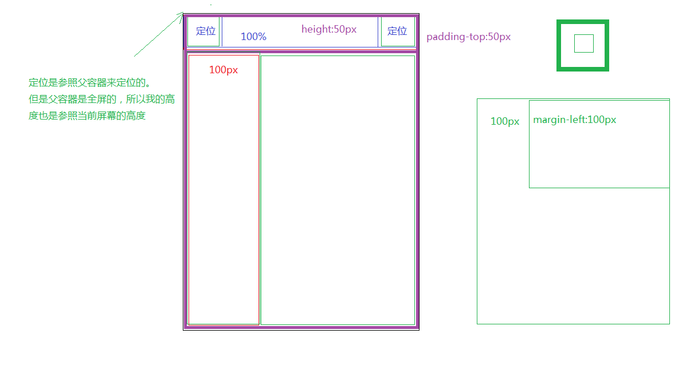

# 移动web开发

## 一、基础知识

### 1. 基本概念

1. 手机屏幕尺寸：英寸（in）指的是手机屏幕对角线的长度

2. 长度单位：

   * 相对长度：px（像素）、em、pt（点，ios）、dp（点，安卓）
   * 绝对长度：in（英寸）、cm（厘米）

3. 像素密度：PPI（Pixels Per Inch）来表示屏幕每英寸的像素数量，计算公式：

   * x是水平像素数量，y是垂直像素数量，l是对角线长度（英寸）
   * 屏幕尺寸固定时，当PPI 越大，像素的实际大小就会越小，当PPI越小，像素实际大小就越大。

   $$
   PPI = √(x^2+y^2 )/l
   $$

4. **设备独立像素**（pt、dp）：设备独立像素是为了让图像内容在不同的PPI设备看上去大小差不多

   * 即对于PPI较大的设备，可能1pt = 3px
   * 对于PPI较小的设备，可能1pt = 1px
   * dp同px是有一个对应（比例）关系的，这个对应（比例）关系是操作系统确定并处理，目的是确保不同PPI屏幕所能显示的图像大小是一致的
   * 通过window.devicePixelRatio可以获得该比例值（**设备像素比**）。
   * dp（或pt）和px并不总是绝对的倍数关系（并不总能保证能够整除），而是**window.devicePixelRatio ~= 物理像素/独立像素**，然而这其中的细节我们不必关心，因为操作系统会自动帮我们处理好（保证1dp在不同的设备上看上去大小差不多）

5. 像素

   * **物理像素**：物理像素指的是屏幕渲染图像的最小单位，属于屏幕的物理属性，不可人为进行改变，其值大小决定了屏幕渲染图像的品质，我们以上所讨论的都指的是物理像素。
   * **CSS像素（就是设备独立像素）**：与设备无关像素，指的是通过CSS进行网页布局时用到的单位，其默认值(PC端)是和物理像素保持一致的（1个单位的CSS像素等于1个单位的物理像素），但是我们可通缩放来改变其大小。
   * 1个物理像素并不总是等于一个CSS像素，通过调整浏览器缩放比例（就是浏览器的百分比缩放功能），可以有：
     * 1个物理像素 = 一个CSS像素
     * 1个物理像素 < 一个CSS像素
     * 1个物理像素 > 一个CSS像素

### 2. 调试

#### 2.1 模拟调试

  现代主流浏览器均支持移动开发模拟调试，通常按F12可以调起，其使用也比较简单，可以帮我们方便快捷定位问题。

#### 2.2 真机调试

  模拟调试可以满足大部分的开发调试任务，但是由于移动设备种类繁多，环境也十分复杂，模拟调试容易出现差错，所以真机调试变的非常必要。

有两种方法可以实现真机调试：

1、将做好的网页上传至服务器或者本地搭建服务器，然后移动设备通过网络来访问。（重点）

2、借助第三方的调试工具，如weinre、debuggap、ghostlab(比较)等

真机调试必须保证移动设备同服务器间的网络是相通的。

### 3. 视口viewport

  视口（viewport）是用来约束网站中最顶级块元素<html>的，即它决定了<html>的大小。

#### 3.1 PC浏览器视口

  在PC设备上viewport的大小取决于浏览器窗口的大小，以CSS像素（设备独立像素）做为度量单位。

获取viewport的大小：

* document.documentElement.clientWidth;
* document.documentElement.clientHeight;

在PC端，我们通过**调整浏览器窗口**可以改变viewport的大小，为了保证网页布局不发生错乱，需要给元素设定（容得下子元素的）固定宽度。

#### 3.2 移动设备

* 移动设备上viewport**不再受限于**浏览器的窗口，而是允许开发人员**自由设置**viewport的大小

* **默认视口**：通常手机浏览器会设置一个默认大小的viewport，为了能够正常显示那些专为PC设计的网页，一般这个值的大小会大于屏幕的尺寸（由厂商设定，比如980pt，**单位是设备独立像素**）。

  * 由于默认视口是为了能够显示PC网页的，一般大于手机屏幕，会出现以下两种情况：
    * 自动缩小内容（相当于手指向内捏操作），使之在屏幕内完整显示
    * 出现水平滚动条
    * 这两种情况都不是很好的视觉效果

* layout viewport（布局视口）：是我们可以进行网页布局区域的大小，以设备独立像素PT、DP（CSS像素）做为计量单位，可以通过下面方式获取：

  * document.documentElement.clientWidth;
  * document.documentElement.clientHeight;
  * **默认视口就是layout viewport。**

  

* ideal viewport（理想视口）：设备屏幕区域，以设备独立像素PT、DP（CSS像素）做为单位，其大小是不可能被改变，通过下面方式可以获取：

  * 新设备
    * window.screen.width;
    * window.screen.height;
  * 老设备
    * window.screen.width/ window.devicePixelRatio;
    * window.screen.height/ window.devicePixelRatio;
  * 这个值并不总是正确的，然而在实际开发我们一般无需获取这个值具体大小。

#### 3.3 理想视口/设备独立像素比/物理像素

* ideal viewport（理想视口，以设备独立像素PT、DP为单位） * 设备独立像素比 = 物理像素
* 下图是小米9的结果，小米9的物理像素是：1080x2340，**下图中的单位dp应该为pt**


### 4. 移动浏览器

* 系统浏览器：指跟随移动设备操作系统一起安装的浏览器
* 应用内置浏览器：通常在移动设备上都会安装一些APP例如QQ、微信、微博、淘宝等，这些APP里往往会内置一个浏览器，我们称这个浏览器为应用内置浏览器（也叫WebView），这个内置的浏览器一般功能比较简单，并且客户端开发人员可以更改这个浏览器的某些设置。
* 第三方浏览器：指安装在手机的浏览器如FireFox、Chrome、360等等
* **在IOS和Android操作系统上自带浏览器、应用内置浏览器都是基于Webkit内核的**

### 5. 移动设备屏幕适配

* 移动页面最理想的状态是，**避免滚动条**且**不被默认缩放**处理，我们可以通过设置<meta name="viewport" content="">来进行控制，改变浏览器默认的layout viewport的宽度
* 对viewport的设置的meta建议写在已有的meta标签(<meta charset="UTF-8">)之后
* name="viewport":说明当前meta标签是用来设置viewport的属性的，这个属性只有在移动端才会有效
* content="":进行viewport的设置，content中的属性以逗号分隔

1. width=device-width，可以为数值
   * 作用是指定**布局视口宽度**为**设备理想视口宽度（即以pt为单位的屏幕尺寸大小）**
   * 也有相应的height=device-height，不过一般我们不关心高度（因为可以有垂直滚动条）
   * **device-width 和 device-height就是ideal viewport的宽高**
   * 往往和initial-scale=1一起使用（兼容性）
2. initial-scale=1，可以为小数
   * initial-scale = ideal viewport（对于确定的设备是固定值） / layout viewport，所以initial-scale=1相当于width=device-width（**让布局视口等于理想视口**）
   * 往往和width=device-width一起使用（兼容性）
3. maximum-scale:设置最大的缩放比例，可以为小数
4. minimum-scale:设置最小的缩放比例（也是页面打开时的默认缩放比例），可以为小数
5. user-scalable:设置是否允许用户进行缩放，取值为yes/no

#### 5.1 控制缩放

* width=device-width
* initial-scale=1
* 开发中一般同时设置width=device-width和initial-scale=1.0（为了解决一些兼容问题）即<meta name="viewport" content="width=device-width,initial-scale=1.0">

#### 5.2 避免水平滚动

* width=device-width
* 使用百分比宽度

#### 5.3 适配方案

##### (1) 固定宽度

* 设置<meta name="viewport" content="width=device-width,initial-scale=1">
* 设置内容区域大小为320px（因为大多数设备的理想视口就是这个值或比这个值略大）
* 设置内容区域水平居中显示
* 较少使用

##### (2) 百分比宽度

* 设置<meta name="viewport" content="width=device-width,initial-scale=1">
* 设置页面宽度为百分比
* 以下css属性父子元素之间的百分比继承关系
  * 子元素width:50%; ==> 父元素内容**宽度** * 50%
  * 子元素height:50%; ==> 父元素内容**高度** * 50%
  * 子元素padding:50% 50%; ==> 父元素内容**宽度** * 50%（水平和垂直方向的padding都是参照父元素宽度）
  * 子元素margin:50% 50%; ==> 父元素内容**宽度** * 50%（水平和垂直方向的margin都是参照父元素宽度）
  * 子元素border，不能设置百分比
* **在设置元素高度时有非常大的局限性** ：因为一旦子元素使用定位，它的百分比高度就是参照父容器的高度（带padding和border）

##### (3) rem单位

1. em单位

   * 1em就是当前元素的字号大小，例如当前元素font-size是14px，1em就是14px

   * 如果当前元素没有设置字号，就向上找父级的字号，一直向上延伸

   * 若知道根元素html也没找到字号值，就根据浏览器默认字号来确定1em的大小

     > 局限性：依赖当前元素的字号，若字号与期望的1em大小冲突就没办法解决了

2. rem单位：1rem就是根元素html的字号大小，若HTML标签没有设置字号，就是浏览器默认字号

   * UI稿件的宽度一般是一些固定值，如640px、750px。
   * b：我们根据**期望的UI稿件1rem的宽度**（如32px）人为地决定把UI稿件的宽度（px）分为b等份（如20等份）。1份的宽度就是UI稿件中1rem的宽度。
   * 使用rem作为单位可以保证**不同屏幕下的中的元素尺寸与原稿中的比例相同**
   * 下图中最后一个公式不用自己计算，在less直接写`width: UI元素尺寸 / UI中1rem宽度rem` 即可，记得加单位`padding-top: 27 / 32rem;`

   

##### (4) 100%像素

### 6. 移动端布局技巧

#### 6.1 顶部搜索栏

  顶部搜索栏布局一般是“左-中-右”三段式，左右宽度固定，中间搜索框宽度伸缩，整体固定定位在页面顶部：

* flex灵活布局可以实现，但有兼容性问题，不推荐
* margin-left: 100px; padding-right: 200px;（假设左右固定宽度都是100px，右侧padding是因为margin不在中段form表单的宽度范围内）
* padding-left: 100px; padding-right: 100px;（假设左右固定宽度都是100px）


#### 6.2 顶部搜索栏+下方内容全屏

  全屏是指：水平和垂直方向都没有滚动条。顶部搜索栏跟6.1中一样。下方分为左右两栏：

* 全屏：html、body、包裹整个页面的div的宽高都是100%即可
* 下方内容容器（包裹左右两栏的div）宽高100%，padding-top: 50px（假设顶部搜索栏高度是50px）
* **子元素使用绝对定位，它的百分比高度就是参照父容器的高度（带padding和border）** ，所以下方内容的左右布局不能使用6.1中的方法，即**左侧栏不能使用定位** 。
* 左边栏高度100%，宽度100px，float: left;（浮动保证了左右内容一行显示，**浮动元素的高度百分比参照父容器内容高度**）
* 右边栏高度100%，**不设宽度** ，margin-left: 100px;（利用自动计算来保证右边栏的宽度占满剩余空间，就可以伸缩）



#### 6.3 上方高度不固定+下方全屏

情况：

* 上方高度不固定
* 下方盒子要占据剩余高度（即不设高度，也没法设置高度）
* 超出部分还要隐藏

解决：

* 临时办法，使用flex，还是要overflow
* 使用js计算高度，再设置下方盒子的高度，还是要overflow


#### 6.4 移动端a点击高亮

- 移动端的a标签默认有点击高亮显示效果，一般不需要，使用如下代码移除

```css
// 给a标签加即可
a {
  -webkit-tap-highlight-color: transparent;
}
```

#### 6.5 一个盒子中有若干个小盒子换行显示

* ==不方便为小盒子设置确定宽度==，因为要让它适应不同尺寸的屏幕

* 要让大盒子中一行显示3个（或其他数值）小盒子，且==小盒子的总宽度刚好等于大盒子的宽度==

* 总共9个小盒子，一行显示三个，==不能添加行盒子==

* 解决：

  1. 使用rem宽度，例如设计稿件的宽度是640px，分20rem，一个rem就是32px（UI稿件的宽度可以假设，然后换算一下）

     * 设置媒体查询，设置html字号

       ```
       <style>
         @media screen and (device-width: 375px) {
           html {
             font-size: 18.75px;
         }
         @media screen and (device-width: 320px) {
           html {
             font-size: 16px;
         }
       </style>
       ```

  2. 假设大盒子外部还有6px（UI稿件中的）的间距，那么间距就是：6 / 32 rem

  3. 小盒子的宽度应设置为 （640 - 6 * 2）(UI稿件中大盒子内容的总宽度)/ 3 / 32 rem

  4. 小盒子之间的间距用padding，也用rem单位

  5. 小盒子设置display: inline-block，避免块级元素换行

#### 6.6 处理input的输入

* 需求：使input文本框，只能输入数字（或其他具有规律的文本）

* 尝试：

  * 1.使用keyup或keydown事件，对输入的字符进行过滤

    * 优点：简单，PC端可行
    * 缺点：移动端不行，移动端输入法的e.keyCode都是一个值（就是没用）

  * 2.使用H5 的 input:number

    * 优点：更简单，PC端和安卓端可行

    * 缺点：ios不行，使用`pattern="[0-9]*"` 属性可以使ios端可行

      * BUG：可以输入e和E，因为e是2.7...

      ```html
      <input type="number" pattern="[0-9]*" v-model="num">
      ```

  * 3.使用keypress事件，对输入内容（键盘码）进行正则测试

    * 优点：PC端可行

    * 缺点：移动端不行

      ```html
      <input type="number" onkeypress="return (/[\d]/.test(String.fromCharCode(event.keyCode)))" >
      ```

##### (1) 解决方案

* 思路：

  1. 移动端和pc端都支持  input事件和change事件，可以从事件对象中获得  input的值
  2. 对这个值（字符串）进行正则测试，对于符合正则表达式的  将其赋值给一个变量inputVal  暂存（以备下次输入不合法时替换input的值）
     * 如果不匹配，就把本次输入事件input ==之前的== input值（即inputVal） 立即赋值到 e.target.value（替换掉本次的输入），==此时新输入的值还没有显示到文本框中，就被替换掉了==
  3. 针对不同的过滤需求，只需要修改正则表达式就可以了

  ```html
  // 大神的原代码
  <div id="demo">
      <input 
          type="text"
          placeholder="只能输入正整数"
          @input="change"
          @change="change"
          :value="inpNum"
      />
  </div>
  // vue实例，他使用了一个中间变量oldNum来 存储input的旧值，实验发现没有必要
  <script>
  new Vue({
      el:'#demo',
      data: {
          oldNum: ''   
      },
      computed: {
          inpNum () {
              return this.oldNum
          }
      },
      methods: {
          change (event) {
              let val = event.target.value.trim()
              // 只能是正整数或空,可根据需求修改正则
              if (/^[1-9]\d*$|^$/.test(val)) {
                  this.oldNum = val
              } else {
                  event.target.value = this.oldNum
              }
          }
      }
  })
  </script>
  ```

* 简化后实测可用的代码

  * 要对文本框的值  进行其他处理，操作this.inputVal即可
  * 当它的值变化时，文本框的内容会跟着变化；
  * 当文本框的内容变化时，会直接改变this.inputVal
  * BUG，在==change==方法中通过  条件语句  限制输入的  极值  的时候，会出问题
    * 当输入值刚好是极值 的时候，再输入更多位，this.inputVal的值是对的，但无法正确刷新文本框
    * 例如，我要限制文本框输入数字，且最大值是999，当我已经输入999时，再输一位，例如9990，此时this.inputVal的值会被  条件语句  限制为999，但文本框依旧显示9990
    * 解决：当需要限制极值 时，不在change中判断，允许用户输入超出范围的内容，但文本框失去焦点时，把超出范围的值约束到最大值或最小值，必要时可以弹窗提醒

  ```html
  <template>
      <div>
          <input type="text" @input="change" placeholder="1" :value="inputVal">
      </div>
  </template>
  <script>
  export default {
    data() {
      return {
        inputVal: ''
      }
    },
    methods: {
      change(e) {
        let val = e.target.value.trim();	// 可根据需要去除空格
        if (/^\d*$/.test(val)) {
          this.inputVal = val;
        } else {
          e.target.value = this.inputVal
        }
      }
    }
  }
  </script>
  ```

## 二、移动端事件

### 1. 事件类型及事件对象

* 移动端注册事件，推荐使用addEventListener()

#### 1.1 事件类型

* touch事件想要正常触发，它所绑定的元素的宽或高不能为0（要清除浮动）
* touch事件不支持pc端

1. touchstart
   * 手指触摸屏幕时触发
   * 仅触发一次
2. touchmove
   * 约5~6ms触发一次
   * 手指在屏幕上移动时触发
   * 移动过程中一直触发
3. touchend
   * 手指离开屏幕时触发
   * 仅触发一次

#### 1.2 TouchEvent对象

* 事件对象，有一些跟触摸相关的属性

1. touches
   * 位于屏幕上的所有手指的列表
2. targetTouches
   * 位于该元素上的所有手指的列表
3. changedTouches
   * touchstart时包含刚与触摸屏接触的触点，touchend时包含离开触摸屏的触点
4. target
   * 触发事件的目标（手指最初与屏幕接触时的元素）

#### 1.3 触摸对象

* 手指列表中是与手指对应的触摸对象（Touch），触摸对象（手指）都有一个ID属性
* 触摸对象中包含触摸的坐标：clientX/Y，pageX/Y，screenX/Y

##### (1) 移动端viewport

* 对于设置了viewport（`content="width=device-width, user-scalable=no, initial-scale=1.0"`）

1. clientX/Y
   * 触摸点相对于当前视口（**移动端的浏览器显示区域，不包括浏览器上下边框**）的水平/垂直像素距离（不含滚动）
   * 单位是设备独立像素（理想视口）
2. pageX/Y
   * 手指相对于当前页面（html标签）的水平/垂直像素距离（包含滚动）
   * 单位是设备独立像素
3. screenX/Y
   * 手指相对于屏幕左上角的水平/垂直像素距离
   * 单位是设备独立像素（理想视口）

##### (2) 不设置viewport（了解）

- 不设置viewport（默认视口980px，且允许缩放）

1. clientX/Y
   - 手指在默认视口（宽980px）相对于当前页面（html标签）的水平/垂直像素距离（包含滚动）
   - 单位是设备独立像素（默认视口）
2. pageX/Y
   - 手指在默认视口（宽980px）相对于当前页面（html标签）的水平/垂直像素距离（包含滚动）
   - 单位是设备独立像素（默认视口）
3. screenX/Y
   - 手指相对于屏幕左上角的水平/垂直像素距离
   - 单位是设备独立像素（理想视口）

##### (3) 结论

* 一般移动端都会设置viewport（**无缩放**，**无水平滚动**），所以：
* 获取触点相对于**屏幕页面**显示区域的坐标：使用clientX/Y
* 获取触点相对于**页面**显示区域的（带滚动）坐标：使用pageX/Y
* 获取触点在**屏幕上**的位置，使用screenX/Y


### 2. 点击事件

#### 2.1 click事件延迟

* PC端的click等事件在移动端会有约300ms的延迟，所以一般不用

#### 2.2 模拟点击事件

* 移动端的原生点击事件一般使用touch事件模拟
* 点击的特征1：只有一根手指
* 点击的特征2：在一定的延迟时间内结束，与长按区分
* 点击的特征3：允许一定范围内的抖动，区别滑动事件

```javascript
// 封装tap事件
var eventTap = {};
eventTap.tap = function (ele, callback) {
	// 1.区别长按事件，在一定时间范围内，离开屏幕
	// 2.消除抖动，区别滑动事件
	var positionX, positionY;
	// 初始时间
	var startTapTime;
	ele.addEventListener('touchstart', function (event) {
		if(event.targetTouches.length > 1) {
			return;
		}
		// 点击位置
		positionX = event.targetTouches[0].clientX;
		positionY = event.targetTouches[0].clientY;
		// 点击时间
		startTapTime = Date.now();
	})
	ele.addEventListener('touchend', function (event) {
		if(event.changedTouches.length > 1) {
			return;
		}
		var CurrentpositionX = event.changedTouches[0].clientX;
		var CurrentpositionY = event.changedTouches[0].clientY;
		if(Math.abs(CurrentpositionX - positionX) >= 3 || Math.abs(CurrentpositionY - positionY) >= 3) {
			// 抖动过大，不是点击事件
			return;
		}
		// console.log(Date.now() - startTapTime);
		if(Date.now() - startTapTime > 200) {
			// 点按时间过长，不是点击事件
			return;
		}
		// 是点击事件，执行操作
		callback(event);
	})
}
```

#### 2.3 点透现象

**移动端点透**：当一个使用了touch事件（或zepto的tap事件）的页面元素（例如悬浮层）在上，一个使用了click事件的页面元素（例如a标签）在下（二者重叠但没有DOM继承关系），点击**关闭悬浮层**，会触发下层的click事件。

**原因**：移动端的click事件有约300ms的延时，touch最先触发，当touch事件（start、move、end）结束后，悬浮层关闭，300ms后会在手指点击的位置触发click事件，其事件源就变成了下方的元素。

**解决方式**：

1. ==关闭悬浮层用click==，因为一个位置不会触发两次click。但click会有延迟
2. ==把关闭浮层的时间延长==，例如浮层的touch事件中使用动画，使之渐变消失。此时300ms后触发的click事件源仍然是在悬浮层上。同样有延迟。
3. ==touchstart== 里阻止默认事件。这样可以阻止click的触发
4. 使用插件fastclick.js
   * fastclick.js的作用就是消除了click的延迟（对click事件进行了封装，不再是原来的click）
   * 其实就是解决方式1的思路。
   * 这样可以让pc和移动端的点击统一，**移动端页面也可以在pc端使用**

#### 2.4 fastclick.js的使用

* 原理：在检测到touchend事件的时候，会通过DOM自定义事件立即出发模拟一个click事件，并把浏览器在300ms之后真正的click事件阻止掉
* 使用：下载fastclick，引入lib目录下的fastclick.js，项目中添加绑定如下：

1. 原生js

```javascript
if ('addEventListener' in document) {
    document.addEventListener('DOMContentLoaded', function() {
        /!*参数可以是任意的dom元素，如果写document.body，说明会将document.body下面的所的元素都绑定fastclick*!/
        FastClick.attach(document.body);
    }, false);
}
// 之后就可以使用addEventListener为元素绑定click事件（fastclick）
```

2. jQuery

```javascript
$(function() {
    FastClick.attach(document.body);
});
// 之后就可以使用addEventListener为元素绑定click事件（fastclick）
```

以下这几种情况是不需要使用fastclick：

1、FastClick是不会对PC浏览器添加监听事件
2、Android版Chrome 32+浏览器，如果设置viewport meta的值为width=device-width，这种情况下浏览器会马上出发点击事件，不会延迟300毫秒。

```
<meta name="viewport" content="width=device-width, initial-scale=1">
```

3、所有版本的Android Chrome浏览器，如果设置viewport meta的值有user-scalable=no，浏览器也是会马上出发点击事件。
4、IE11+浏览器设置了css的属性touch-action: manipulation，它会在某些标签（a，button等）禁止双击事件，IE10的为-ms-touch-action: manipulation

## 三、移动端类库&插件

### 1. zepto.js

* 详情可查zepto中文API

#### 1.1 zepto.js特点

* 与jQuery的不同之处1：jQuery有很大精力用在了**兼容**问题，移动端对兼容问题要求不高（因为移动端浏览器普遍较新，内核类型较少）
* 与jQuery的不同之处2：jQuery封装了很多**动画**函数，但移动端支持css3（有丰富的动画）


* 特点1：用法完全**类似于jQuery**
* 特点2：**灵活**，它是分模块的，即每一个模块包含一部分功能，可以根据需要引入
  * 默认模块只包含*Core, Ajax, Event, Form, IE*

#### 1.2 浏览器兼容性

##### (1) zepto.js中的swipe失效

- 在很过移动端浏览器中，zepto.js中的swipe失效
- 原因：touchmove、touchstart、touchend事件也在触发
- 解决方案：
  - 1.给使用swipe事件的DOM元素（或其可以触发touch事件的子元素）取消touchmove、touchstart、touchend事件的默认操作：`event.preventDefault();`
  - 2.阻止touchmove、touchstart、touchend事件冒泡：`event.stopPropagation();`
- 兼容性：在swipe生效的浏览器中不能阻止touch，若阻止touch，swipe反而会失效；在swipe本来就失效的浏览器中阻止touch，就可以正常使用swipe

```javascript
// imgUl是zepto对象，imgUl[0]是其对应的DOM对象
imgUl[0].addEventListener('touchmove', function (event) {
    event.preventDefault();
    event.stopPropagation();
}, false);
imgUl[0].addEventListener('touchstart', function (event) {
    event.preventDefault();
    event.stopPropagation();
}, false);
imgUl[0].addEventListener('touchend', function (event) {
    event.preventDefault();
    event.stopPropagation();
}, false);
```

### 2. IScroll.js

* 详情可查阅文档：[IScroll 5中文文档](http://caibaojian.com/iscroll-5/)

#### 2.1 作用

  IScroll.js是一个可以实现客户端原生**滚动效果**的类库。内容高度大于容器高度的时候可以使用。用法：

1. GitHub下载IScroll.js，解压。bulid目录提供了不同的版本，可以根据需要使用（详见readme.md）

2. html结构：（只要是这样的结构即可，标签可以随意）

   * 当然样式是不可缺少的，css自己写

   ```html
   <div id="wrapper">
       <ul>
           <li>...</li>
           <li>...</li>
           ...
       </ul>
   </div>
   ```

3. （引入iscroll.js文件）获取HTML结构的最外层节点（可以通过选择器字符串，或直接给DOM元素），创建实例

   ```javascript
   <script type="text/javascript">
   var myScroll = new IScroll('#wrapper');
   </script>
   ```

   ```javascript
   var wrapper = document.getElementById('wrapper');
   var myScroll = new IScroll(wrapper);
   ```

   ```javascript
   // 这样只会获取到第一个类名为wrapper的元素
   var myScroll = new IScroll('.wrapper');
   ```

#### 2.2 常用的参数

  在构造函数IScroll里使用参数可以调整一些效果，例如

```javascript
var myScroll = new IScroll('#wrapper', {
    mouseWheel: true,
    scrollbars: true
});
```

##### (1) mouseWheel鼠标滚轮

* 取值为true时，表示可以用鼠标滚轮实现滚动

##### (2) scrollbars滚动条

* 取值为true时，会有滚动条
* 应注意滚动条在滚动区容器内部，其**父级要加相对定位**，不然滚动条的位置会在浏览器/屏幕右边缘

##### (3) interactiveScrollbars

* 默认为false，滚动条不能交互
* 设置为true，用户可以拖动滚动条

##### (4) scrollX/Y

* 默认情况下只有纵向滚动条可以使用。如果你需要使用横向滚动条，需要将`scrollX` 属性值设置为 `true`。
* 默认值：`scrollX: false`，`scrollY: true` （即默认垂直滚动）
* 注意属性 `scrollX/Y: true` 与`overflow: auto`有相同的效果。设置一个方向上的值为 `false` 可以节省一些检测的时间和CPU的计算周期。

### 3. swipe.js

* 详情可查阅文档，慎用，手动滑动后自动滑动会停止

#### 3.1 作用

  swipe.js可以用来快速方便地实现**轮播图**。

1. GitHub下载swipe.js，解压。只有一个swipe.js文件。

2. html结构：（只要是这样的结构即可，标签可以随意）

   ```html
   <div id='slider' class='swipe'>
     <div class='swipe-wrap'>
       <div></div>
       <div></div>
       <div></div>
     </div>
   </div>
   ```

3. css样式

   ```css
   .swipe {
     overflow: hidden;
     visibility: hidden;	/*作用是避免js轮播图效果生效前，图片垂直排列打乱页面结构，先隐藏*/
     position: relative;
   }
   .swipe-wrap {
     overflow: hidden;
     position: relative;
   }
   .swipe-wrap > div {
     float:left;
     width:100%;
     position: relative;
   }
   ```

4. （引入swipe.js文件）获取HTML结构的最外层节点（直接给DOM元素），创建实例（参数根据需要调整）

   ```javascript
   window.mySwipe = new Swipe(document.getElementById('slider'), {
     startSlide: 2,
     speed: 400,
     auto: 3000,
     continuous: true,
     disableScroll: false,
     stopPropagation: false,
     callback: function(index, elem) {},
     transitionEnd: function(index, elem) {}
   });
   ```

#### 3.2 常用的参数

- **startSlide** Integer *(default:0)* - index position Swipe should start at

  -**speed** Integer *(default:300)* - speed of prev and next transitions in milliseconds.

- **auto** Integer - begin with auto slideshow (time in milliseconds between slides)

- **continuous** Boolean *(default:true)* - create an infinite feel with no endpoints

- **disableScroll** Boolean *(default:false)* - stop any touches on this container from scrolling the page

- **stopPropagation** Boolean *(default:false)* - stop event propagation

  -**callback** Function - runs at slide change.（在轮播图每一次轮播开始的时候被调用）

- **transitionEnd** Function - runs at the end slide transition.（在每一次轮播动画结束时被调用）

#### 3.3 Swipe API

* 由于swipe只实现了轮播图的自动/手动轮播效果，其他效果，如下放的小点，PC端的上一张下一张按钮都需要自己实现，好在它有一些API，使这些功能也很简单

1. `prev()` slide to prev
2. `next()` slide to next
3. `getPos()` returns current slide index position
4. `getNumSlides()` returns the total amount of slides
5. `slide(index, duration)` slide to set index position (duration: speed of transition in milliseconds)

### 4. swiper.js

* Swiper常用于移动端网站的内容触摸滑动
* **Swiper**是纯javascript打造的滑动特效插件，面向手机、平板电脑等移动终端。
* **Swiper**能实现触屏焦点图、触屏Tab切换、触屏多图切换等常用效果。
* **Swiper**开源、免费、稳定、使用简单、功能强大，是架构移动终端网站的重要选择！

#### 4.1 使用

1.首先加载插件，需要用到的文件有swiper-bundle.min.js和swiper-bundle.min.css文件（package文件夹），不同[Swiper版本](https://www.swiper.com.cn/about/us/index.html#version-different)用到的文件名略有不同。可下载[Swiper文件](https://www.swiper.com.cn/download/index.html#file1)或使用[CDN](https://www.swiper.com.cn/cdn/index.html)。

```html
<!DOCTYPE html>
<html>
<head>
    ...
    <link rel="stylesheet" href="dist/css/swiper-bundle.min.css">
</head>
<body>
    ...
    <script src="dist/js/swiper-bundle.min.js"></script>
    ...
</body>
</html>
```

2.HTML内容（标签可以换，类名就用下方指定的）。

```html
<div class="swiper-container">
    <div class="swiper-wrapper">
        <div class="swiper-slide">Slide 1</div>
        <div class="swiper-slide">Slide 2</div>
        <div class="swiper-slide">Slide 3</div>
    </div>
    <!-- 如果需要分页器 -->
    <div class="swiper-pagination"></div>
    
    <!-- 如果需要导航按钮 -->
    <div class="swiper-button-prev"></div>
    <div class="swiper-button-next"></div>
    
    <!-- 如果需要滚动条 -->
    <div class="swiper-scrollbar"></div>
</div>
导航等组件可以放在container之外
```

3.你可能想要给Swiper定义一个大小，当然不要也行。（需要手动清除ul的默认样式（margin/padding/list-style），让图片100%宽度）

```css
* {
	margin: 0;
	padding: 0;
}
ul {
	list-style: none;
}
.swiper-container {
    width: 600px;
    height: 300px;
}  
.swiper-container img {
  	width: 100%;
}
```

4.初始化Swiper

```html
<script>        
  var mySwiper = new Swiper ('.swiper-container', {
    direction: 'vertical', // 垂直切换选项
    loop: true, // 循环模式选项
    
    // 如果需要分页器
    pagination: {
      el: '.swiper-pagination',
    },
    
    // 如果需要前进后退按钮
    navigation: {
      nextEl: '.swiper-button-next',
      prevEl: '.swiper-button-prev',
    },
    
    // 如果需要滚动条
    scrollbar: {
      el: '.swiper-scrollbar',
    },
  })        
  </script>
```

5.完成。恭喜你，现在你的Swiper应该已经能正常切换了。

如果作为CommonJs 或ES 模块引入

```javascript
//CommonJs
var Swiper = require('swiper');    
var mySwiper = new Swiper('.swiper-container', { /* ... */ });

//ES
import Swiper from 'swiper';    
var mySwiper = new Swiper('.swiper-container', { /* ... */ });
```

#### 4.2 option属性

* 详见[swiper.js中文API](https://www.swiper.com.cn/api/properties/127.html)
* option属性是new Swiper(string, option)中的第二个参数的属性，常用的有：

1. direction：滑动的方向，默认水平

   * 水平方向切换('horizontal')
   * 垂直方向切换('vertical')

2. loop：图片是否循环，默认false，即不能从最后一张滑动到第一张。设置为true则图片循环

3. autoplay：自动播放，可以是一个Object/Boolean值，默认false

   * true相当于`autoplay:{delay: 3000, stopOnLastSlide: false, disableOnInteraction: true, }`
   * 其值是对象时：
     * delay：自动轮播的延时
     * stopOnLastSlide：默认是false，到最后一张会回到第一张（不是无缝）；如果设置为true，当切换到最后一个slide时停止自动切换。（loop模式下无效）。
     * disableOnInteraction：用户操作swiper之后，是否禁止[autoplay](https://www.swiper.com.cn/api/basic/2014/1213/16.html)。默认为true：停止。
       如果设置为false，用户操作swiper之后自动切换不会停止，每次都会重新启动autoplay。
       操作包括触碰(touch)，拖动，点击pagination等。

4. pagination：分页器样式（轮播图下方的小点），Object。可以改变样式，详见swiper.js中文API

   * el：分页器容器的css选择器或HTML标签。分页器等组件可以置于container之外，不同Swiper的组件应该有所区分，如#pagination1，#pagination2。

   * swiper5新增可以通过设置Swiper的风格`--swiper-theme-color`或单独设置分页器风格`--swiper-pagination-color`来改变分页器颜色。

     ```html
     <style type="text/css">
       .swiper-container{
         --swiper-theme-color: #ff6600;
         --swiper-pagination-color: #00ff33;/* 两种都可以 */
       }
     </style>
     ```

5. navigation：前进后退按钮，Object。可以改变样式，详见swiper.js中文API

   * nextEl：设置前进按钮的css选择器或HTML元素。

   * prevEl：设置后退按钮的css选择器或HTML元素。

   * swiper5新增可以通过设置Swiper的风格`--swiper-theme-color`或单独设置按钮风格`--swiper-navigation-color`来改变按钮颜色。

   * swiper5新增可以通过设置`--swiper-navigation-size`来调整按钮大小，默认是44px。

     ```html
     <style type="text/css">
       .swiper-container{
         --swiper-theme-color: #ff6600;/* 设置Swiper风格 */
         --swiper-navigation-color: #00ff33;/* 单独设置按钮颜色 */
         --swiper-navigation-size: 30px;/* 设置按钮大小 */
       }
     </style>
     ```

6. scrollbar：滚动条，Object。

   * el：分页器容器的css选择器或HTML标签。

7. on：注册事件，Swiper4.0开始使用关键词this指代Swiper实例。Object。

   * 对象的属性是事件名称，详见swiper.js中文API
   * 属性的值是事件处理函数，详见swiper.js中文API


## 四、响应式开发

### 1. 网页布局方式

#### 1.1常见的网页布局方式

1. 固定宽度布局：为网页设置一个固定的宽度，通常以px做为长度单位，常见于PC端网页。
2. 流式布局：为网页设置一个相对的宽度，通常以百分比做为长度单位。
3. 栅格化布局：将网页宽度人为的划分成均等的长度，然后排版布局时则以这些均等的长度做为度量单位，通常利用百分比做为长度单位来划分成均等的长度。
4. 响应式布局：通过检测设备信息，决定网页布局方式，即用户如果采用不同的设备访问同一个网页，有可能会看到不一样的内容，一般情况下是检测设备屏幕的宽度来实现。

注：以上几种布局方式并不是独立存在的，实际开发过程中往往是相互结合使用的。

#### 1.2 响应式布局

  使同一个页面在不同屏幕分辨率的终端上有不同的展示方式。通过响应式设计能使网站在手机和平板电脑上有更好的浏览阅读体验。

* 原理：使用媒体查询可以检测到屏幕的尺寸（主要检测宽度），并设置不同的CSS样式，就可以实现响应式的布局。
* 优缺点：
  * 优点：可以满足不同尺寸的终端设备非常完美的展现网页内容，使得用户体验得到了很大的提升
  * 缺点：为了实现这一目的我们不得不利用媒体查询写很多冗余的代码，使整体网页的体积变大，应用在移动设备上就会带来严重的性能问题
  * 所以响应式布局常用于企业的官网、博客、新闻资讯类型网站，这些网站以浏览内容为主，没有复杂的交互。

一般我们会对常见的设备尺寸进行划分后，再分别确定为不同的尺寸的设备设计专门的布局方式，如下图所示：

| 屏幕尺寸       | 布局宽度               |
| ---------- | ------------------ |
| 超小屏幕（移动设备） | w<768px            |
| 小屏设备       | 768px <= w <992px  |
| 中等屏幕       | 992px =< w <1200px |
| 宽屏设备       | w>=1200px          |

**响应式开发和移动web开发的区别：**

| 开发方式 | 移动web开发+pc开发                    | 响应式开发                                |
| ---- | ------------------------------- | ------------------------------------ |
| 应用场景 | 一般在已经有pc端的网站，开发移动网站的时候只需单独开发移动端 | 针对新建的一些网站，现在要求适配移动端，所以就一套页面兼容各种终端，灵活 |
| 开发   | 针对性强，开发效率高                      | 兼容各种终端，效率低                           |
| 适配   | 只适配移动设备，pad、pc上体验较差             | 可以适配各种终端                             |
| 效率   | 代码简洁，加载快                        | 代码相对复杂，加载慢                           |

### 2. 媒体查询（CSS）

  查询到当前屏幕(媒介媒体)的宽度，针对不同的屏幕宽度设置不同的样式来适应不同屏幕。当你重置浏览器大小的过程中，页面也会根据浏览器的宽度和高度重新渲染页面。简单说，你可以设置 不同屏幕下面的不同的样式，达到适配不同的屏幕的目的。

#### 2.1 媒体查询的使用方式

- 如果媒体的视口尺寸小于768px，使用默认的样式
- 如果媒体的视口尺寸大于等于768px，使用绿色背景（使用a.css的样式）
- 如果媒体的视口尺寸大于等于992px，使用蓝色背景（使用b.css的样式）
- 如果媒体的视口尺寸大于等于1200px，使用粉色背景（使用c.css的样式）

1. 在style标签中使用媒体查询语句

* ```css
  /* not代表取反，若要使用，放在mediatype（screen）的前面*/
  @media mediatype and|not|only (media feature) {
      CSS-Code;
  }
  ```

```html
<style>
		body {
			background-color: red;
		}
		@media screen and (min-width: 768px) {
			body {
				background-color: green;
			}
		}
		@media screen and (min-width: 992px) {
			body {
				background-color: blue;
			}
		}
		@media screen and (min-width: 1200px) {
			body {
				background-color: pink;
			}
		}
</style>
```

2. 根据查询条件加载不同的css文件

* <link rel="stylesheet" media="mediatype and|not|only (media feature)" href="mystylesheet.css">

```html
<link rel="stylesheet" type="text/css" media="screen and (min-width: 768px)" href="./a.css">
<link rel="stylesheet" type="text/css" media="screen and (min-width: 992px)" href="./b.css">
<link rel="stylesheet" type="text/css" media="screen and (min-width: 1200px)" href="./c.css">
```

#### 2.2 媒体类型: mediatype

| 值      | 描述                |
| ------ | ----------------- |
| all    | 用于所有设备            |
| print  | 用于打印机和打印预览        |
| screen | 用于电脑屏幕，平板电脑，智能手机等 |
| speech | 用于屏幕阅读器等发声设备      |

#### 2.3 媒体功能: media feature

* 带device的指的是设备屏幕宽度，不带device的指的是浏览器视口宽度

| 值                 | 描述                 |
| ----------------- | ------------------ |
| device-height     | 定义输出设备的屏幕可见高度      |
| device-width      | 定义输出设备的屏幕可见宽度      |
| max-device-height | 定义输出设备的屏幕最大可见高度    |
| max-device-width  | 定义输出设备的屏幕最大可见宽度    |
| min-device-height | 定义输出设备的屏幕最小可见高度    |
| min-device-width  | 定义输出设备的屏幕最小可见宽度    |
| max-height        | 定义输出设备中的页面最大可见区域高度 |
| max-width         | 定义输出设备中的页面最大可见区域宽度 |
| min-height        | 定义输出设备中的页面最小可见区域高度 |
| min-width         | 定义输出设备中的页面最小可见区域宽度 |

#### 2.4 书写建议

1. 如果是判断最小值 (min-width)，那么就应该从小到大写--bootstrap就是判断最小值，从小到大写
2. 如果是判断最大值 (max-width)，那么就应该从大到小写


当判断最小的值，并且从小到大进行判断(当满足条件的时候)：


1. 向上兼容：如果设置了**大于较小宽度**时的样式，默认这些样式也会传递到宽度更大的条件范围内
2. 向下覆盖：宽度更大的样式会将前面宽度更小的样式覆盖


### 3. CSS框架

  随着Web应用变的越来越复杂，在大量的开发过程中我们发现有许多功能模块非常相似，比如轮播图、分页、选项卡、导航栏等，开发中往往会把这些具有通用性的功能模块进行一系列封装，使之成为一个个组件应用到项目中，可以极大的节约开发成本，将这些通用的组件缩合到一起就形成了前端框架。

#### 3.1 Bootstrap

* 简洁、直观、强悍的前端开发框架，让web开发更迅速、简单。
* 来自 Twitter，粉丝众多，是目前最受欢迎的前端框架。[开始使用吧!](http://www.bootcss.com/)

#### 3.2 Amaze UI

* Amaze ~ 妹子UI，国人开发，后起之秀！[开始使用吧!](http://amazeui.org/)

#### 3.3 Framework7

* Framework7 是一个开源免费的框架可以用来开发混合移动应用（原生和HTML混合）或者开发 iOS & Android 风格的WEB APP。[开始使用吧！](http://framework7.taobao.org/)

## 五、Bootstrap3

  Bootstrap 是最受欢迎的 HTML、CSS 和 JS 框架，用于开发响应式布局、移动设备优先的 WEB 项目。

### 1. Bootstrap简介

#### 1.1 Bootstrap的特点

- **移动设备优先**：自 Bootstrap 3 起，框架包含了贯穿于整个库的移动设备优先的样式。
- **浏览器支持**：所有的主流浏览器都支持 Bootstrap。    
- **容易上手**：只要您具备 HTML 和 CSS 的基础知识，您就可以开始学习 Bootstrap。
- **响应式设计**：Bootstrap 的响应式 CSS 能够自适应于台式机、平板电脑和手机。更多有关响应式设计的内容详见 [Bootstrap 响应式设计](https://www.runoob.com/bootstrap/bootstrap-v2-responsive-design.html)。
- 它为开发人员创建接口提供了一个简洁统一的解决方案。
- 它包含了功能强大的内置组件，易于定制。
- 它还提供了基于 Web 的定制。

#### 1.2 Bootstrap的内容

- **基本结构**：Bootstrap 提供了一个带有网格系统、链接样式、背景的基本结构。这将在 **Bootstrap 基本结构** 部分详细讲解。
- **CSS**：Bootstrap 自带以下特性：全局的 CSS 设置、定义基本的 HTML 元素样式、可扩展的 class，以及一个先进的网格系统。这将在 **Bootstrap CSS** 部分详细讲解。
- **组件**：Bootstrap 包含了十几个可重用的组件，用于创建图像、下拉菜单、导航、警告框、弹出框等等。这将在 **布局组件** 部分详细讲解。
- **JavaScript 插件**：Bootstrap 包含了十几个自定义的 jQuery 插件。您可以直接包含所有的插件，也可以逐个包含这些插件。这将在 **Bootstrap 插件** 部分详细讲解。
- **定制**：您可以定制 Bootstrap 的组件、LESS 变量和 jQuery 插件来得到您自己的版本。

#### 1.3 Bootstrap安装和使用

##### (1) 版本和文件结构

* Bootstrap官网提供两种版本：已预编译的和源代码

1. 预编译的 Bootstrap

    Bootstrap 的已编译的版本，解压缩 ZIP 文件，可以得到到已编译的 CSS 和 JS（bootstrap.*），以及已编译压缩的 CSS 和 JS（bootstrap.min.*）。同时也包含了 Glyphicons 的字体，这是一个可选的 Bootstrap 主题。同时还提供了 CSS [源码映射表](https://developer.chrome.com/devtools/docs/css-preprocessors) (`bootstrap.*.map`) ，可以在某些浏览器的开发工具中使用。

   ```
   bootstrap/
   ├── css/
   │   ├── bootstrap.css
   │   ├── bootstrap.css.map
   │   ├── bootstrap.min.css
   │   ├── bootstrap.min.css.map
   │   ├── bootstrap-theme.css
   │   ├── bootstrap-theme.css.map
   │   ├── bootstrap-theme.min.css
   │   └── bootstrap-theme.min.css.map
   ├── js/
   │   ├── bootstrap.js
   │   └── bootstrap.min.js
   └── fonts/
       ├── glyphicons-halflings-regular.eot
       ├── glyphicons-halflings-regular.svg
       ├── glyphicons-halflings-regular.ttf
       ├── glyphicons-halflings-regular.woff
       └── glyphicons-halflings-regular.woff2
   ```

2. Bootstrap 源代码

   Bootstrap 源代码版本，包括：

   - *less/*、*js/* 和 *fonts/* 下的文件分别是 Bootstrap CSS、JS 和图标字体的源代码。
   - *dist/* 文件夹包含了上面预编译下载部分中所列的文件和文件夹。
   - `docs/` 包含了所有文档的源码文件，`examples/` 目录是 Bootstrap 官方提供的实例工程。除了这些，其他文件还包含 Bootstrap 安装包的定义文件、许可证文件和编译脚本等。

   ```
   bootstrap/
   ├── less/
   ├── js/
   ├── fonts/
   ├── dist/
   │   ├── css/
   │   ├── js/
   │   └── fonts/
   └── docs/
       └── examples/
   ```

##### (2) Html模板

* Bootstrap 不支持 IE 古老的兼容模式。为了让 IE 浏览器运行最新的渲染模式下，建议将此标签加入到你的页面中：<meta http-equiv="X-UA-Compatible" content="IE=edge">
* **Internet Explorer 8 需要 Respond.js 配合才能实现对媒体查询（media query）的支持。**
* html5shiv.min.js是为了让 IE8 支持 HTML5 元素

```html
<!DOCTYPE html>
<html lang="zh-CN">
  <head>
    <meta charset="utf-8">
    <!--为了让IE以最新的标准和模式进行当前页面的渲染：为了让 IE 浏览器运行最新的渲染模式下-->
    <meta http-equiv="X-UA-Compatible" content="IE=edge">
    <!--移动端的适配-->
    <meta name="viewport" content="width=device-width, initial-scale=1">
    <!-- 上述3个meta标签*必须*放在最前面，任何其他内容都*必须*跟随其后！ -->
    <title>Bootstrap 101 Template</title>

    <!-- Bootstrap -->
    <!-- Bootstrap所依赖的CSS文件。可以替换为自己项目中的bootstrap.min.css文件 -->
    <link href="https://cdn.jsdelivr.net/npm/bootstrap@3.3.7/dist/css/bootstrap.min.css" rel="stylesheet">

    <!-- HTML5 shim 和 Respond.js 是为了让 IE8 支持 HTML5 元素和媒体查询（media queries）功能 -->
    <!-- 警告：通过 file:// 协议（就是直接将 html 页面拖拽到浏览器中）访问页面时 Respond.js 不起作用 -->
    <!--[if lt IE 9]>
      <script src="https://cdn.jsdelivr.net/npm/html5shiv@3.7.3/dist/html5shiv.min.js"></script>
      <script src="https://cdn.jsdelivr.net/npm/respond.js@1.4.2/dest/respond.min.js"></script>
    <![endif]-->
  </head>
  <body>
    <h1>你好，世界！</h1>

    <!-- jQuery (Bootstrap 的所有 JavaScript 插件都依赖 jQuery，所以必须放在前边) -->
    <script src="https://cdn.jsdelivr.net/npm/jquery@1.12.4/dist/jquery.min.js"></script>
    <!-- 加载 Bootstrap 的所有 JavaScript 插件。你也可以根据需要只加载单个插件。 -->
    <script src="https://cdn.jsdelivr.net/npm/bootstrap@3.3.7/dist/js/bootstrap.min.js"></script>
  </body>
</html>
```

##### (3) 只使用bootstrap的css

* 要使用bootstrap 的css样式，==只引入css文件==即可，其余一概不需要，只有使用bootstrap提供的组件才需要jQuery和bootstrap.js文件
* bootstrap对常见的页面结构提供了css样式，通过使用bootstrap类即可使用这些样式
* 常见的bootstrap类可参考文档或菜鸟教程

#### 1.4 布局容器

##### (1) container类

* 居中，伸缩，左右padding各15px
* 视口width ∈ [1200px, ∞)，container类盒子的width = 15 + 1140 + 15 = 1170px
* 视口width ∈ [992px, 1200px)，container类盒子的width = 15 + 940 + 15 = 970px
* 视口width ∈ [768px, 992px)，container类盒子的width = 15 + 720 + 15 = 750px
* 视口width ∈ (0, 768px)，container类盒子的width = 100%（全屏）

##### (2) container-fluid类

* 伸缩，左右padding各15px
* 宽度width = 100%（全屏）

#### 1.5 使用技巧

##### (1) 重置样式

* 引用bootstrap组件以后，往往需要重置一些样式，使之变成我们想要的
* 在浏览器中找到需要重置样式的元素，在右侧查看css样式列表，找到相关的类（比如修改背景色，就找bootstrap预定义的背景色所在的类）
* 使用less定位到当前html结构中的指定元素，对其所用的**上文中寻找到的类**重置相关样式
* 注意：less定位过程中要保证通过子选择器或后代选择器选定目标元素，这样重置的样式就不会影响到其他使用该类的元素

##### (2) 字体图标的使用

1. 一般字体图标的使用过程（已制作好图标）：
   * css中定义字体
   * css定义字体基类（一个语义化的类选择器，只定义font-family，指定使用的字体名称）
   * css定义具体字体图标伪元素（一个语义化的类：before选择器，定义content: "\xxxx", font-size等等）
   * 在需要字体图标的地方放一个span，为其添加字体基类，和具体的字体图标类
2. 若使用bootstrap3提供的字体，只需到官网找到字体，复制下面的基类和字体类放到指定位置就行了（前提是先引入bootstrap.css文件）
3. bootstrap4的字体图标独立出来了，具体用法[参考文档](https://icons.bootcss.com/)

##### (3) 组件使用技巧

1. 复制bootstrap组件代码，放入页面的html结构中，阅读代码，看看标签和类的基本作用
   * 如果组件最外层的标签和自己预置的标签一样，可以去掉之际预置的标签
   * 但要为组件的最外层标签加一个类，用于自己修改样式，避免影响其他使用此组件的地方
2. 去掉不需要的标签，添加需要的内容，使组件的结构符合预期
3. 对比项目需求和bootstrap组件的样式区别，一项一项进行更改
   * 如何确定样式是由bootstrap.css的哪个类控制的：
   * 控制台审查目标元素，检查css样式表中有没有相关的属性
   * 去bootstrap.css文件中寻找组件最外层标签所包含的类，一个复杂组件的类一般有很多子选择器，后代选择器
   * 对着找到的类写less代码，覆盖需要修改的样式
4. **修改height这样的样式时，要注意最好修改子级标签的height，让父级的高度被子级撑开，否则会影响布局**

### 2. 栅格系统

  Bootstrap 提供了一套**响应式**、**移动设备优先**的**流式（从左到右，从上到下，一行放不下了会换行）**栅格系统，随着屏幕或视口（viewport）尺寸的增加，系统会自动分为最多12列。每一格的大小是容器的十二分之一，即**不同屏幕宽度区间的每格大小不一样** 。

* 栅格系统通过一系列的行（row）与列（column）的组合来创建页面布局

* “行（row类）”必须包含在 `.container` （固定宽度）或 `.container-fluid` （100% 宽度）中

* 通过“行（row）”在水平方向创建一组“列（column）”。内容应当放置于“列（column）”内，并且，只有“列（column）”可以作为行（row）”的直接子元素。

* 在子元素（列）中添加内容

  ```html
  <div class="container">
      <div class="row">
          <div class="col-xs-4"></div>
          <div class="col-xs-4"></div>
          <div class="col-xs-4"></div>
      </div>
  </div>
  ```

**栅格其实就是把行元素（row类）分成了12等份，且行元素（row类）的左右margin为-15px，所以列的宽度刚好是container的宽度**

#### 2.1 列类col-xx-n

形如col-xx-n的类是栅格中的列，代表此列元素在xx大小的屏幕中占n份栅格，其中：

* xx的取值可以是：
  * xs——超小屏幕 手机 (<768px)
  * sm——小屏幕 平板 (≥768px)
  * md——中等屏幕 桌面显示器 (≥992px)
  * lg——大屏幕 大桌面显示器 (≥1200px)
* n可以是：默认1 ~12
* bootstrap使用从小到大的媒体查询方式（min-width），所以col-xx-n具备：
  * 向上兼容：若较大屏幕的栅格数（例如col-lg-n）没有设定，在较大（lg）屏幕下，会按照已设定的较小屏幕的栅格数（例如col-xs-n）布局
  * 向下覆盖：若设定了较大屏幕的栅格数（例如col-lg-n），在较大（lg）屏幕下，会覆盖已设定的较小屏幕的栅格数（例如col-xs-n）布局

具体使用方式如下：

```html
<div class="container">
    <div class="row">
      	<!-- 若屏幕小于768px,此div占12格（全屏宽） -->
      	<!-- 若屏幕小于992px,此div占6格（容器container的一半宽） -->
      	<!-- 若屏幕小于1200px,此div占4格（容器container的三分之一宽） -->
      	<!-- 若屏幕不小于1200px,此div占3格（容器container的四分之一宽） -->
        <div class="col-xs-12 col-sm-6 col-md-4 col-lg-3"></div>
    </div>
</div>
```

通过下表可以详细查看 Bootstrap 的栅格系统是如何在多种屏幕设备上工作的。

|                   | 超小屏幕 手机 (<768px)   | 小屏幕 平板 (≥768px)            | 中等屏幕 桌面显示器 (≥992px) | 大屏幕 大桌面显示器 (≥1200px) |
| ----------------- | ------------------ | -------------------------- | ------------------- | -------------------- |
| 栅格系统行为            | 总是水平排列             | 开始是堆叠在一起的，当大于这些阈值时将变为水平排列C |                     |                      |
| `.container` 最大宽度 | None （自动）          | 750px                      | 970px               | 1170px               |
| 类前缀               | `.col-xs-`         | `.col-sm-`                 | `.col-md-`          | `.col-lg-`           |
| 列（column）数        | 12                 |                            |                     |                      |
| 最大列（column）宽      | 自动                 | ~62px                      | ~81px               | ~97px                |
| 槽（gutter）宽        | 30px （每列左右均有 15px） |                            |                     |                      |
| 可嵌套               | 是                  |                            |                     |                      |
| 偏移（Offsets）       | 是                  |                            |                     |                      |
| 列排序               | 是                  |                            |                     |                      |

#### 2.2 col常见的样式

##### (1) 偏移col-xx-offset-n

* **添加给列元素**
* 在xx屏幕尺寸下，把添加了此类样式的列元素向后偏移n格（0 ~12）
* 原理：margin-left，所以**此元素后面的列元素都会向后移动**
* 不同的媒体尺寸之间向上兼容，向下覆盖

##### (2) 列排序col-xx-push-n

* **添加给列元素**
* 在xx屏幕尺寸下，把添加了此类样式的列元素向后推n格（0 ~12）
* 原理：定位left值，所以其他元素不受影响，此元素脱标
* 不同的媒体尺寸之间向上兼容，向下覆盖

##### (3) 列排序col-xx-pull-n

- **添加给列元素**
- 在xx屏幕尺寸下，把添加了此类样式的列元素向前拉n格（0 ~12）
- 原理：定位left值，所以其他元素不受影响，此元素脱标
- 不同的媒体尺寸之间向上兼容，向下覆盖

##### (4) 嵌套列

* 可以在一个列元素中嵌套行（row），行中再写一系列 列元素col
* 嵌套的行（row）的宽度参照它所在的上级列元素，它的宽度会被分为12份
* 被嵌套的行（row）所包含的列（column）的个数不能超过12，不用占满12
* **不要在嵌套的行外面使用container（宽度是固定值）**

##### (5) 响应式工具hidden-xx

* **添加给想要隐藏的元素，未必是列元素**
* 在xx屏幕尺寸下，把添加了此类样式的元素隐藏
* 原理，display: none，所以隐藏后不占空间
* 只负责指定的屏幕区间（xs，sm，md，lg）的隐藏，**没有向上兼容，向下覆盖**


### 3. 全局css样式

#### 3.1 排版与链接

Bootstrap 排版、链接样式设置了基本的全局样式。分别是：

- 为 `body` 元素设置 `background-color: #fff;`
- 使用 `@font-family-base`、`@font-size-base` 和 `@line-height-base` 变量作为排版的基本参数
- 为所有链接设置了基本颜色 `@link-color` ，并且当链接处于 `:hover` 状态时才添加下划线

这些样式都能在 `scaffolding.less` 文件中找到对应的源码。

##### (1) 全局字体样式

* Bootstrap为body和p标签设置了全局 `font-size` 设置为 **14px**，`line-height` 设置为 **1.428**
* p （段落）元素还被设置了等于 1/2 行高（即 10px）的底部外边距（margin）

##### (2) 链接样式

* 为所有链接设置了基本颜色 `@link-color` 
* 当链接处于 `:hover` 状态时才添加下划线
* 当链接处于`:focus` 状态时会添加下划线

## 六、less

LESS 是动态的样式表语言，通过简洁明了的语法定义，使编写 CSS 的工作变得非常简单，本质上，LESS 包含一套自定义的语法及一个解析器。

### 1. 安装和使用

#### 1.1 安装

* 安装Nodejs环境 Node Package Manager(验证 node -v npm -v) 
  * 这一步一般安装node时会一并安装，并自动设置好环境变量
* 打开控制台（cmd），执行npm install -g less(验证 lessc -v) 
* 命令行编译 `lessc path/xxx.less path/xxx.css`

#### 1.2 编辑器内编译

  浏览器只能识别CSS，LESS只是用来提升CSS可维护性的一个工具，所最终需要将LESS编译成CSS，然而通过命令行编译效率比较低下，一般都会借助于编辑器来完成编译，以sublime_text为例，sublime_text默认并不支持LESS的编译操作，需要安装插件实现。

1. 执行npm install -g less-plugin-clean-css（使用sublime_text才用）
2. ctrl+shit+p打开命令面板
3. 输入install package然后回车
4. 安装 LESS、lessc、Less2Css三个插件
5. alt+s快捷键即可实现编译

#### 1.3 浏览器中使用

利用编辑器能够编译less，但是效率相对较低。可以在页面中实时的将LESS编译成CSS。我们可以引入一个less.js文件，实现实时的解析，而不必每次修改都要编译，最后完成所有开发任务后，再通过编辑器编译成css文件。

1. 引入xx.less文件

2. [下载](https://raw.github.com/less/less.js/v2.5.3/dist/less.min.js)然后引入less.js，如：

   ```html
   <link rel="stylesheet/less" type="text/css" href="styles.less" />
   <script type="text/javascript" src="./js/less.js"></script>
   ```

注意：

* rel属性必须指定成stylesheet/less，并且styles.less要先于less.js引入。
* 必须以**服务器方式**访问

### 2. 基本语法

#### 2.1 变量

* less中的变量无需声明，使用@符号开头即可

* 像素值可以进行数学相加，例如：

  ```less
  @width: 10px;
  // @height: 20px;
  @height: @width + 10px;
  ```

* 使用：

  ```less
  #header {
    width: @width;
    height: @height;
  }
  ```

##### (1) 变量插入

* 变量也可以在其他地方使用，比如选择器名称、属性名称、url和@import语句。
* 在作为变量插入使用时，应使用@{变量名}的形式

1. 选择器名称

   ```
   @my-selector: banner;

   // 使用
   .@{my-selector} {
     color: #fff;
   }
   ```

   * 编译为

   ```css
   .banner {
     color: #fff;
   }
   ```

2. 属性名称

   ```less
   @property: color;
   .widget {
     @{property}: #0ee;
     background-@{property}: #999;
   }
   ```

   * 编译为

   ```css
   .widget {
     color: #0ee;
     background-color: #999;
   }
   ```

3. urls

   ```less
   @images: "../images";
   // 使用
   div {
     // 相当于"../images/white-sand.png"
     background: url("@{images}/white-sand.png");
   }
   ```

4. import语句

   ```less
   // Variables
   @themes: "../../src/themes";

   // Usage
   @import "@{themes}/tidal-wave.less";
   ```


##### (2) 变量覆盖

* 当定义变量两次时，将使用该变量的最后一个定义，从当前范围向上搜索。这与css本身类似，其中**使用定义中的最后一个属性**来确定值。
* **变量定义可以在变量使用之后**

##### (3) 属性作为变量

* 可以将css属性加上“$”符号作为变量使用

  ```less
  .widget {
    color: #efefef;
    background-color: $color;
  }
  ```

  * 编译为

  ```css
  .widget {
    color: #efefef;
    background-color: #efefef;
  }
  ```

* 像变量一样，Less将选择当前/父范围内的最后一个属性作为“最终”值。

#### 2.2 混合（自定义函数）

* 就是将一组属性（类选择器、id选择器）在另一个选择器中重复使用
* 混合（自定义函数）声明时不带()，将被编译为一个类选择器或id选择器
* 混合（自定义函数）声明时带()，混合本身将不会被编译为css样式

```less
.bordered {
  border-top: dotted 1px black;
  border-bottom: solid 2px black;
}
.post a {
  color: red;
  .bordered();
}
```

* 编译为

```css
.bordered {
  border-top: dotted 1px black;
  border-bottom: solid 2px black;
}
.post a {
  color: red;
  border-top: dotted 1px black;
  border-bottom: solid 2px black;
}

```

##### (1) 传递参数

* 可以为混合传递参数，就像函数一样

```less
.fun-border(@weight) {
	border: @weight solid red;
}
.box {
	.fun-border(3px);
}
// 得到css：
.box {
  border: 3px solid red;
}
```

* 可以在形参列表中设置默认值

```less
.fun-border(@weight: 1px) {
	border: @weight solid red;
}
.box {
	.fun-border()
}
// 得到css：
.box {
  border: 1px solid red;
}
```

#### 2.3 嵌套

* 可以使用如下方式实现**后代**选择器

```less
#header {
  color: black;
  .navigation {
    font-size: 12px;
  }
  .logo {
    width: 300px;
  }
}
```

* 编译为

```css
#header {
  color: black;
}
#header .navigation {
  font-size: 12px;
}
#header .logo {
  width: 300px;
}
```

##### (1) >运算符

* 在内部选择器前面加“>” 可以编译出**子选择器**

```less
.father {
	width: 50px;
	> .child {
		width: 25px;
	}
}
```

* 编译为

```css
.father {
  width: 50px;
}
.father > .child {
  width: 25px;
}
```

##### (2) &运算符

* “&”符号代表当前选择器的父级。可以用来实现交集选择器、伪类选择器等等

```less
// 交集选择器
div {
	color: red;
	&.box {
		width: 30px;
	}
}
// 伪类选择器
a {
	color: #ddd;
	&:hover {
		color: #aaa;
	}
}
```

* 编译为

```css
/*交集选择器*/
div {
  color: red;
}
div.box {
  width: 30px;
}
/*伪类选择器*/
a {
  color: #ddd;
}
a:hover {
  color: #aaa;
}
```

##### (3) ,运算符

* “,”的作用是将被“,”分割的子选择器分别与父选择器连接成为独立的选择器，然后这些选择器形成并集选择器

```
li {
	&,> a,> a:hover,> a:focus {
		color: @wjs-base-textColor;
	}
}
```

* 编译为

```
li,
li > a,
li > a:hover,
li > a:focus {
  color: #878484;
}
```

##### (4) @规则嵌套和冒泡

* @ 规则（例如 `@media` 或 `@supports`）可以与选择器以相同的方式进行嵌套。
* @ 规则会被放在外面，同一规则集中的其它元素的相对顺序保持不变。这叫做冒泡（bubbling）。
* @ 规则之间的属性不会相互合并（无论两个@规则是兄弟还是父子关系）

```less
.component {
  width: 300px;
  @media (min-width: 768px) {
    width: 600px;
    @media  (min-resolution: 192dpi) {
      background-image: url(/img/retina2x.png);
    }
  }
  @media (min-width: 1280px) {
    width: 800px;
  }
}

```

编译为：

```css
.component {
  width: 300px;
}
@media (min-width: 768px) {
  .component {
    width: 600px;
  }
}
@media (min-width: 768px) and (min-resolution: 192dpi) {
  .component {
    background-image: url(/img/retina2x.png);
  }
}
@media (min-width: 1280px) {
  .component {
    width: 800px;
  }
}
```

#### 2.4 运算

* 算术运算符 `+`、`-`、`*`、`/` 可以对任何数字、颜色或变量进行运算。
* 如果可能的话，算术运算符在加、减或比较之前会进行单位换算。
* 计算的结果的单位以最左侧操作数的单位类型为准。
* 如果单位换算无效或失去意义，则忽略单位。无效的单位换算例如：px 到 cm 或 rad 到 % 的转换。

```less
// 所有操作数被转换成相同的单位
@conversion-1: 5cm + 10mm; // 结果是 6cm
@conversion-2: 2 - 3cm - 5mm; // 结果是 -1.5cm

// conversion is impossible
@incompatible-units: 2 + 5px - 3cm; // 结果是 4px

// example with variables
@base: 5%;
@filler: @base * 2; // 结果是 10%
@other: @base + @filler; // 结果是 15%
```

* 乘法和除法不作转换。因为这两种运算在大多数情况下都没有意义，一个长度乘以一个长度就得到一个区域，而 CSS 是不支持指定区域的。Less 将按数字的原样进行操作，并将为计算结果指定明确的单位类型。

```less
@base: 2cm * 3mm; // 结果是 6cm
```

* 还可以对颜色进行算术运算：

```less
@color: #224488 / 2; //结果是 #112244
background-color: #112244 + #111; // 结果是 #223355
```

#### 2.5 转义

1. 转义（Escaping）允许你使用任意字符串作为属性或变量值

```less
@min768: ~"(min-width: 768px)";
.element {
  @media @min768 {
    font-size: 1.2rem;
  }
}
```

* 编译为：

```css
@media (min-width: 768px) {
  .element {
    font-size: 1.2rem;
  }
}
```

2. 形如~"redcolor"会被转义成值：redcolor

```less
@string: ~"redcolor";
.@{string} {
	color: red;
}
```

* 编译为：

```css
.redcolor {
  color: red;
}
```

#### 2.6 函数

* less有一系列内置函数可以使用

##### (1) if函数

* 根据条件（参数1）返回参数2 或 参数3的值
* 参数1：布尔表达式，<, >, =, >=, <=, and(与), or(或), not(非), 函数返回值, true, false均可。（像0, 1, abc这样无特殊意义的值会被转换为false）
* 参数2：一个合法的less值，例如已定义的变量、颜色（red）、数值...。在参数1为真的时候返回
* 参数3：一个合法的less值，例如已定义的变量、颜色（red）、数值...。在参数1为假的时候返回

```less
@some: foo;
div {
    margin: if((2 > 1), 0, 3px);
    color:  if((iscolor(@some)), @some, black);
}
// 编译为：
div {
    margin: 0;
    color:  black;
}
```


#### 2.7 命名空间和访问符

* 如果希望将一些**混合**和**变量**封装，可以将他们放在一个带()的混合下（例如.outMixins()或#outMixins()），然后通过#outMixins.insideMixins()来使用（.或#都可以）
* outMixins外部与insideMixins同名的混合不会影响到#outMixins.insideMixins()

```less
// 混合#bundle可以看做一个命名空间
#bundle() {
  .button {
    display: block;
    border: 1px solid black;
    background-color: grey;
    &:hover {
      background-color: white;
    }
  }
  .tab {
  	color: red;
  }
  .citation {
  	color: blue;
  }
}
.button {
	background-color: pink;
}
#header a {
  color: orange;
  #bundle.button();  // 还可以书写为 #bundle > .button 形式
}
```

* 编译为：

```css
.button {
  background-color: pink;
}
#header a {
  color: orange;
  display: block;
  border: 1px solid black;
  background-color: grey;
}
#header a:hover {
  background-color: white;
}
```

#### 2.8 映射

* 混合中的**属性**可以作为**键值对**来使用，称为映射
* 这些属性未必是css属性，可以是自定义的名称，当然使用自定义名称（键）的话，混合最好加上()

```less
#colors() {
  primary: blue;
  secondary: green;
}
.button {
  color: #colors[primary];
  border: 1px solid #colors[secondary];
}
```

* 编译为：

```css
.button {
  color: blue;
  border: 1px solid green;
}
```

#### 2.9 作用域

* Less 中的作用域与 CSS 中的作用域非常类似。首先在本地查找变量和混合（mixins），如果找不到，则从“父”级作用域继承。

```less
@var: red;

#page {
  @var: white;
  #header {
    color: @var; // white
  }
}
```

* 与 CSS 自定义属性一样，混合（mixin）和变量的定义不必在引用之前事先定义。因此，下面的 Less 代码示例和上面的代码示例是相同的：

```less
@var: red;

#page {
  #header {
    color: @var; // white
  }
  @var: white;
}
```

#### 2.10 导入

* “导入”的工作方式和你预期的一样。你可以导入一个 `.less` 文件，此文件中的所有变量就可以全部使用了。如果导入的文件是 `.less` 扩展名，则可以将扩展名省略掉：

```
@import "library"; // library.less
@import "typo.css";
```


