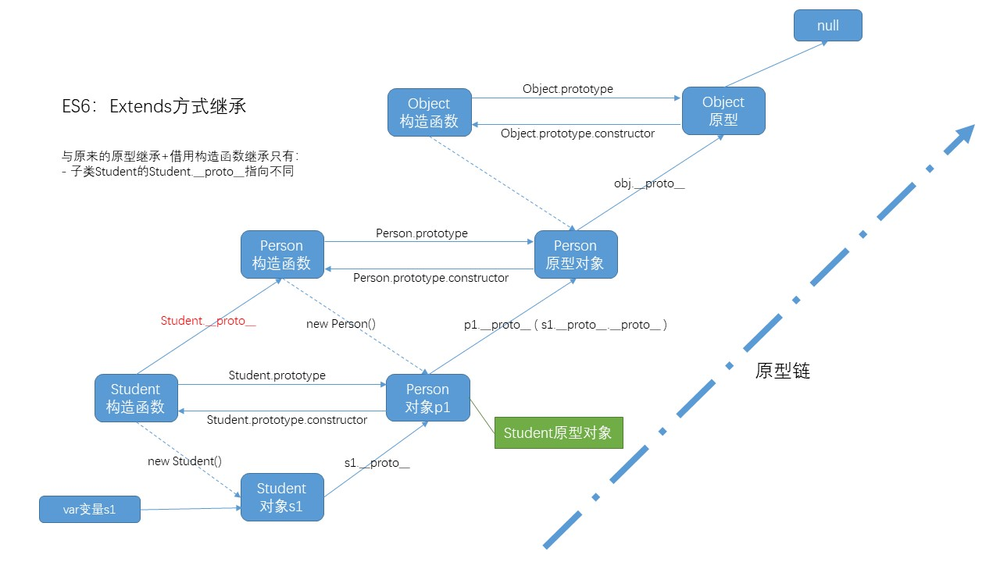

# Node.js

## 〇、Node开发环境配置

### 1. Node.js简介

#### 1.1 什么是Node

* Node.js 是一种建立在Google Chrome’s v8 engine上的 non-blocking (非阻塞）, event-driven （基于事件的） I/O平台. 
* Node.js平台使用的开发语言是JavaScript，平台提供了操作系统低层的API，方便做服务器端编程，具体包括文件操作、进程操作、通信操作等系统模块

#### 1.2 Node.js可以用来做什么

- 具有复杂逻辑的动态网站 
- WebSocket服务器 
- 命令行工具 
- 带有图形界面的本地应用程序 
- ......

### 2. window下终端的常用命令

- md 创建目录
- rmdir(rd) 删除目录，目录内没有文档。（要删除有子目录（文件）的目录，使用rd /s/q 目录名即可）
  - /s 子目录
  - /q 安静地删除，没有任何提示
- echo on > a.txt 创建空文件
  - echo 内容 > a.txt ——写入内容，覆盖原内容
  - echo 内容 >>  a.txt ——追加内容
- del 删除文件
- rm 文件名 删除文件
- cat 文件名 查看文件内容
- cat > 文件名 向文件中写上内容。（cat >> 文件名 向文件中追加内容）
  - 使用该命令后会进入输入模式，直接输入内容即可
  - 要结束输入，使用ctrl + c就可以，同时会保存内容

### 3. Node.js开发环境准备

#### 3.1 普通安装方式

* 普通安装方式[官方网站](https://nodejs.org/zh-cn/)
* 下载msi文件安装可以省去环境配置过程

##### (1) linux安装

1. 去node.js官网下载编译好的二进制文件

2. 将下载好的压缩包放入`/usr/local/src/`

3. 解压：`tar -Jxv -f node-v14.15.0-linux-x64.tar.xz`

4. 配置环境变量：要使用修改/etc/profile文件的方式（在bash中修改后重启即失效）

   * `vim /etc/profile`，在末尾添加如下内容（NODE_HOME的值就是node安装包的解压路径）

   * ```
     #SET PATH FOR NODEJS
     export NODE_HOME=/usr/local/src/node-v14.15.0-linux-x64
     export PATH=$NODE_HOME/bin:$PATH
     ```

5. 运行`source /etc/profile` 环境变量生效

6. 运行`node -v` 得到版本号代表安装成功

#### 3.2 多版本安装方式

- 卸载已有的Node.js
- 下载[nvm](https://github.com/coreybutler/nvm-windows)
- 在C盘创建目录dev
- 在dev目中中创建两个子目录nvm和nodejs
- 并且把nvm包解压进去nvm目录中
- 在install.cmd文件上面右键选择【以管理员身份运行】
- 打开的cmd窗口直接回车会生成一个settings.txt文件，修改文件中配置信息，将这个文件保存到nvm目录下
  * root:  C:\dev\nvm
  * path:  C:\dev\nodejs
- 配置nvm和Node.js环境变量
  - NVM_HOME:C:\dev\nvm
  - NVM_SYMLINK:C:\dev\nodejs
- 把配置好的两个环境变量（%NVM_HOME%;%NVM_SYMLINK%;）加到Path中

#### 3.3 nvm常用的命令

- nvm 查看nvm可用的命令
- nvm list 查看当前安装的Node.js所有版本
- nvm install 版本号 [操作系统位数，省略会自动识别]安装指定版本的Node.js
- nvm uninstall 版本号 卸载指定版本的Node.js
- nvm use 版本号 选择指定版本的Node.js

#### 3.4 Node.js之HelloWorld

- 命令行方式REPL——read-eval-print-loop（读-执行-打印结果-循环这个过程）
  - 可以直接输入代码执行，_代表最后一次执行的结果
  - .exit退出REPL环境
- 运行文件方式
  - 定位到js文件的目录，执行node xxx.js即可
  - sublime安装过terminal插件后可以直接在编辑器中使用ctrl + shift + t在当前目录下打开终端

### 4. 全局对象

* node.js中没有window对象，但也有一个类似的全局对象global

#### 4.1 global常见的属性和方法

1. __dirname —— 当前js文件的路径名（字符串）
2. __filename —— 当前js文件的全路径（带文件名的路径字符串）
3. setTimeout() —— 类似于浏览器环境中的定时器
4. setInterval() —— 类似于浏览器环境中的定时器
5. 与模块有关的属性和方法
   * exports
   * module
   * require()
6. process —— 进程对象
   * process.argv —— 数组，参数列表
     * 0：当前node的执行环境，即node.exe的全路径
     * 1：当前执行的js文件全路径
     * 2：从此项开始，是执行.js文件时传入的参数列表
   * process.arch —— 当前系统架构（x64 / x86）

### 5. 模块化与导入导出

#### 5.1 模块化

1. 传统的非模块化的缺点：
   * 命名冲突
   * 文件依赖复杂


2. node.js（后端）模块化的规则：
   * 一个js文件就是一个模块，模块内部的成员是独立的，其他js文件默认不能访问
   * 要使本模块的成员可以被其他模块使用，需要将其导出（exports或module.exports）
3. CommonJS（标准，Node.js是它的实现）模块化的特点
   * 所有代码都运行在模块作用域，不会污染全局作用域。
   * 模块可以多次加载，但是只会在`第一次加载时运行一次`，然后运行`结果就被缓存`了，以后再加载，就直接读取缓存结果。要想让模块再次运行，必须`清除缓存`。
   * 模块加载的顺序，按照其在代码中出现的顺序。

#### 5.2 导入导出方式

##### (1) exports

- 导出：exports.属性名（属性名自定义，随意）

```javascript
exports.sumEx = function (a, b) {
	return parseInt(a) + parseInt(b);
}
```

* 导入

```javascript
// 引入模块
// reqSum是一个对象，包含引入的模块导出的属性（方法）{ sumEx: [Function] }
var reqSum = require('./moduleExport.js');

var rlt = reqSum.sumEx(3, 5);
console.log(rlt);	// 8
```

##### (2) module

* 导出：module是一个对象，它有一个属性是exports，用于保存当前模块导出的成员

```
module.exports = function (a, b) {
	return parseInt(a) + parseInt(b);
}
```

* 导入

```javascript
// 引入模块
// reqSum就是module.exports
var sumReq = require('./module.js');
var rlt = sumReq(5, 3);
console.log(rlt);	// 8
```

##### (3) 作为global的属性(不推荐)

* 导出：将变量的值作为global的一个新增属性

```javascript
global.sumEx = function (a, b) {
	return parseInt(a) + parseInt(b);
}
```

* 导入

```javascript
// 引入，必须require
require('./global.js');
// 带不带global都可以
var rlt = global.sumEx(3, 5);
// var rlt = sumEx(3, 5);
console.log(rlt);	// 8
```

#### 5.3 exports和module.exports

* Nodejs中每一个文件都是一个模块，都是一个单独的作用域，每个（模块）作用域都有一个module对象
  * `module.id` 模块的识别符，通常是带有绝对路径的模块文件名。
  * `module.filename` 模块的文件名，带有绝对路径。
  * `module.loaded` 返回一个布尔值，表示模块是否已经完成加载。
  * `module.parent` 返回一个对象，表示调用该模块的模块。
  * `module.children` 返回一个数组，表示该模块要用到的其他模块。
* `module.exports`是每一个模块（文件）对外的接口，这个属性可以被其他模块导入（通过require()）。其他文件加载模块，实际上就是读取该模块的`module.exports`变量。
* 为了方便，Node为每个模块提供一个`exports`变量，指向`module.exports`。
  * 所以不能直接给`exports` 赋值，可以给它添加属性

#### 5.4 require()

##### (1) 基本用法

* `Node.js`使用`CommonJS`模块规范，内置的`require`命令用于加载模块文件。
* `require`命令的基本功能是，读入并执行一个JavaScript文件，然后返回该模块的`exports`对象。如果没有发现指定模块，会报错。加载的js文件的后缀可以省略
* require()的功能很强大，需要的话可以参考[nodejs模块加载](https://blog.csdn.net/u012060033/article/details/102753195)

##### (2) 省略后缀

* require的参数字符串中省略文件后缀，会按以下优先级去自动添加后缀：.js > .json > .node
  * .json是json文件，使用require读取之后会返回一个json对象
  * .node是c/c++编译而成的二进制文件，require读取之后会返回一个对象（来自二进制程序的接口）

##### (3) 加载规则

根据参数的不同格式，`require`命令去不同路径寻找模块文件。

1. 如果参数字符串以`“/”`开头，则表示加载的是一个位于`绝对路径`的模块文件。比如，`require('/home/marco/foo.js')`将加载/home/marco/foo.js。
2. 如果参数字符串以`“./”`开头，则表示加载的是一个位于`相对路径`（跟当前执行脚本的位置相比）的模块文件。比如，`require('./circle')`将加载当前脚本同一目录的`circle.js`。
3. 如果参数字符串不以`“./“或”/“`开头，则表示加载的是一个`默认提供的核心模块`（位于Node的系统安装目录中），或者一个位于各级`node_modules`目录的已安装模块（全局安装或局部安装）。
   举例来说，脚本`/home/user/projects/foo.js`执行了`require('bar.js')`命令，`Node`会依次搜索以下文件。
   * /usr/local/lib/node/bar.js
   * /home/user/projects/node_modules/bar.js
   * /home/user/node_modules/bar.js
   * /home/node_modules/bar.js
   * /node_modules/bar.js
   * 这样设计的目的是，使得不同的模块可以将所依赖的模块本地化。
4. 如果参数字符串不以`“./“或”/“`开头，而且是一个路径，比如`require('example-module/path/to/file')`，则将先找到`example-module`的位置，然后再以它为参数，找到后续路径。
5. 如果指定的模块文件没有发现，`Node`会尝试为文件名添加`.js、.json、.node`后，再去搜索。.js件会以文本格式的JavaScript脚本文件解析，.json文件会以JSON格式的文本文件解析，.node文件会以编译后的二进制文件解析。
6. 如果想得到`require`命令加载的确切文件名，使用`require.resolve()`方法。


## 一、ES6语法

* ES6指的是ECMAScript2015之后的版本

### 1. let与const

#### 1.1 let声明变量

1. let声明的变量不存在预解析

2. let不允许（在同一个作用域）重复声明同名变量

   ```javascript
   // 同样报错
   var a = 2;
   let a = 2;
   ```

3. let声明的变量存在块级作用域

   * 花括号括起来的代码
   * if语句
   * for循环，包括括号中let声明的循环变量
   * while

4. 暂时性死区：当前作用域中的let变量声明之前不能使用

   * 本质：一进入当前作用域let变量就存在了，但不能使用，直到变量声明语句
   * 所以typeof不再安全，`typeof 上下文中均未声明的变量` 返回undefined
   * `typeof 下文中声明的let变量` ，直接报错

5. let与全局对象

   * 在**浏览器**环境下，全局作用域中的let变量**不是**window的属性
   * 在**node**环境下，全局（模块）作用域中的var和let变量都**不是**global的属性

#### 1.2 const常量

1. const常量不参与预解析

2. const不能重复声明同名常量

3. const声明的常量量存在块级作用域

4. const声明的常量同样存在暂时性死区

5. **const常量不能重新赋值**

6. **const常量必须在声明时初始化**

7. const常量指向复杂类型时，仅代表其指向的引用不变，复杂类型的属性可以改变

   ```
   const a = {};
   a.name = 'zhangsan';	// 可以
   a = {name: 'lisi'};	// 报错
   ```

#### 1.3 块级作用域与函数声明

* es6中允许在块级作用域声明函数，且函数声明具有类似于let的特性
* 但是为了保持兼容以前的代码，es6又允许浏览器不遵守上述规定，于是在node环境、Chrome环境中块级作用域中的函数声明还是会被提升到外面（即函数声明实际上没有块级作用域）
* 不同的环境可能结果不一样，因为浏览器可以自己决定实现方式
* 结论：**最好不要在块级作用域中使用函数声明，如有需要可以使用函数表达式**
* **主流浏览器和nodejs都没有遵循ES6（函数声明具有块级作用域）的规定，会将块里面的函数声明提升到外面**

### 2. 解构赋值

1. 数组解构赋值

   ```javascript
   let [a, b, c] = [1, 2, 3];
   console.log(a, b, c);	// 1 2 3
   ```

   ```javascript
   // 可以不为某个变量赋值
   let [d, e, f] = [, 123, ];
   console.log(d, e, f);	// undefined 123 undefined
   ```

   ```javascript
   // 可以为某个变量设置默认值
   let [g=111, h, i] = [, 123, ];
   console.log(g, h, i);	// 111 123 undefined
   ```

   ```javascript
   // 可以不为后续变量赋值
   let [j, k, l] = [1];
   console.log(j, k, l);	// 1 undefined undefined
   ```

2. 对象解构赋值：就是根据{}里面的变量名，把对象的同名属性的值赋值给变量

   ```javascript
   let {foo, bar} = {foo : 'hello', bar : 'hi'};
   ```

   ```javascript
   // 可以在{变量名}中为变量设置别名，设置了别名，原名称就失效了
   let {foo:abc, bar} = {foo : 'nihao', bar : 'hi'};
   console.log(abc, bar);	// nihao hi
   console.log(foo, bar);	// 报错
   ```

   ```javascript
   // 对象的解构赋值指定默认值
   let {foo='hello', bar} = {bar : 'hi'};
   console.log(foo, bar);	// hello hi
   ```

   * 应用：取出对象中的属性，可以将类的静态方法（下方代码）或实例方法（类名.prototype）取出

     ```javascript
     let {cos,sin,random} = Math;
     // 四舍五入
     console.log(Math.round(cos(3.1415926)));	// -1 （cos(π)）
     console.log(Math.round(sin(3.1415926)));	// 0 （sin(π)）
     console.log(random());	// 一个随机数
     ```

   * 应用：获取字符串的长度

     ```javascript
     let {length} = 'hello';
     console.log(length);	// 5
     ```

3. 字符串的解构赋值：类似于数组的解构赋值，将字符一个一个对应的赋值给[变量]中的变量

   ```javascript
   // 变量数 > 字符数，多出来的变量是undefined
   let [a, b, c, d, e, f] = 'hello';
   console.log(a, b, c, d, e, f);	// h e l l o undefined
   ```

### 3. 字符串扩展

#### 3.1 includes()

* string.includes(str)：检查字符串中是否包含指定的子串
* 参数1：指定的子串
* 参数2：搜索的起始索引（从0开始，包括索引位置的字符）
* 返回值：找到指定子串，返回true；未找到指定子串，返回false

#### 3.2 startsWith()

* string.startsWith(str)：检查字符串是否以指定的子串开头
* 参数1：指定的子串
* 返回值：以指定子串开头，返回true；否则返回false

#### 3.3 endsWith()

- string.endsWith(str)：检查字符串是否以指定的子串结束
- 参数1：指定的子串
- 返回值：以指定子串结束，返回true；否则返回false

#### 3.4 模板字符串

* 反引号表示模板，其中可以写具有一定格式的字符串
* 通过${obj.attribute}可以填充数据
* ${}里面可以进行算数运算，可以调用函数

```javascript
let fn = function(info){
    return info;
}
let tpl = `
    <div>
        <span>${obj.username}</span>
        <span>${obj.age}</span>
        <span>${obj.gender}</span>
        <span>${1+1}</span>
        <span>${fn('nihao')}</span>
    </div>
`;
console.log(tpl);
// 
//     <div>
//         <span>lisi</span>
//         <span>12</span>
//         <span>male</span>
//         <span>2</span>
//         <span>nihao</span>
//     </div>
// 
```

#### 4.5 字符串填充方法

1. `string.padStart(maxLength, 填充的字符)`：在字符串开头填充指定的字符，直至字符串长度满足要求
   * 参数1：填充后的最大长度
   * 参数2：要填充的字符（串）
2. `string.padEnd(maxLength, 填充的字符)`：在字符串末尾填充指定的字符，直至字符串长度满足要求
   * 参数1：填充后的最大长度
   * 参数2：要填充的字符（串）

### 4. 函数扩展

#### 4.1 参数默认值

* 可以在函数声明中为形参设置默认值，函数表达式同样适用

```javascript
function foo(name = 'zhangsan') {
  	console.log(name);
}
foo();	// zhangsan
```

#### 4.2 参数解构赋值

* 类似于数组和对象的解构赋值，把[形参1, 形参2, ...]或{形参1, 形参2, ...}作为形参列表
* 对应的在函数调用时传入[实参1, 实参2, ...]或{形参1: 实参1, 形参2: 实参2, ...}
* []和{}不可混用，解构赋值与一般的参数传递也不可混用
* 字符串解构赋值也可以：形参[]，调用时传入字符串

```javascript
let foo = function ({name, age}) {
  	console.log(name);
  	console.log(age);
}
foo({name: 'zhangsan', age: 22});

let bar = function ([name, age]) {
  	console.log(name);
  	console.log(age);
}
bar(['zhangsan', 18]);

let bar1 = function ([name, age]) {
  	console.log(name);
  	console.log(age);
}
bar1('hello');
// h
// e
```

#### 4.3 rest剩余参数

* 在函数的形参列表中可以使用(arg1, arg2, ...parameter)来把多于2（依据具体情况）个的实参放进数组parameter中
* 若实参个数比设定的形参数还少，则parameter是一个空数组，没给实参的形参是undefined

```javascript
function foo(a,b,...param){
    console.log(a);
    console.log(b);
    console.log(param);
}
foo(1,2,3,4,5);
// 1
// 2
// [ 3, 4, 5 ]
```

#### 4.4 扩展运算符"..."

* 扩展运算符"..."的作用是将其后面跟的数组分解成用", "分隔的值列表

* 应用：将数组分解成形参列表

  ```javascript
  function foo(a,b,c,d,e,f,g){
      console.log(a + b + c + d + e + f + g);
  }
  let arr = [1,2,3,4,5,6,7];
  foo(...arr);	// 相当于foo(1,2,3,4,5,6,7);
  ```

* 应用：合并数组

  ```javascript
  let arr1 = [1,2,3];
  let arr2 = [4,5,6];
  let arr3 = [...arr1,...arr2];
  console.log(arr3);	// [1,2,3,4,5,6]
  ```

### 5. 箭头函数

* 箭头函数一般用在需要匿名函数的地方，简洁
* 格式：`(parameters list) => {function body}`
* 若只有一个形参，可以不带()：`e => {function body}`
* 若直接返回参数，可以不用return：`e => e` ,等价于`function (e) {return e;}`

1. 箭头函数中的this
   * 箭头函数中的this指向取决于**箭头函数定义所在的（函数）作用域中的this指向**，而非调用时决定
2. 箭头函数不能用作构造函数
   * 即箭头函数不能new fun()
3. 箭头函数中的不能使用arguments获取实参列表
   * arguments另有他用
   * 要获取箭头函数的实参列表，可以使用rest剩余参数来实现

```javascript
let arrowfun = (a, b) => {
	console.log(a, b);
	console.log(arguments);	// 并非参数列表
}
arrowfun(1, 2);
// 1 2
// [Arguments] {
//   '0': {},
//   '1': [Function: require] {
//     内容省略...
//   },
//   '2': Module {
//     id: '.',
//     path: 'F:\\SublimeProjects\\11-nodejsProject1\\01-module',
//     exports: {},
//     内容省略...
//   },
//   '3': 'F:\\SublimeProjects\\11-nodejsProject1\\01-module\\实验.js',
//   '4': 'F:\\SublimeProjects\\11-nodejsProject1\\01-module'
// }
```

### 6. 类与继承

#### 6.1 class关键字

##### (1) 基本使用

* class关键字用于声明一个类，**class类型本身其实就是函数类型**

  * 类名不使用new是无法调用的，`myClass()` 会报错
  * 不存在变量提升，即class类型的数据不会变量提升
  * **类和模块的内部，都是严格模式**

* constructor()是类的**构造函数**，创建实例的时候会自动调用constructor()

* **实例方法**可以直接声明，不需要function关键字

* 使用**new** classname()就可以创建一个实例

* 类myClass也有prototype属性，即原型对象，实例方法都定义在prototype对象中

* `prototype`对象的`constructor`属性，直接指向“类”的本身，这与ES5的行为是一致的。

  ```javascript
  myClass.prototype.constructor === myClass // true
  ```

```javascript
class myClass {
	constructor() {
		console.log('构造函数被调用');
		this.name = 'zhangsan';
	}
	showName() {
		console.log(this.name);
	}
}
console.log(typeof myClass);	// function
let aClass = new myClass();		// 自动调用constructor
aClass.showName();				// 调用方法
```

##### (2) constructor方法

* constructor方法是类的默认方法，在new一个实例时会自动调用该方法
  * constructor()可以传参数，通过`new 类名(实参列表)`
  * constructor()不能被实例对象调用（实际上只能在new语句中调用）
* 一个类必须有`constructor`方法，如果没有显式定义，一个空的`constructor`方法会被默认添加。
* constructor方法默认返回创建的实例对象

##### (3) static静态方法

* 在类的定义中使用static关键字声明一个方法，就是此类的静态方法

* 静态方法是类（对象）本身的的一个属性

* **静态方法中的this指向类（对象）本身**

* **静态方法只能通过类名调用**

  ```javascript
  class HelloWorld {
    constructor() {
    }
    static fun() {
      console.log('这是静态方法')
    }
  }
  ```

##### (4) static静态属性

* ES6+支持静态属性

  ```javascript
  class HelloWorld {
    constructor() {
    }
    static msg = '静态属性'
  }
  ```

##### (5) class表达式

* 与函数一样，类也可以使用表达式的形式定义。

  ```
  const MyClass = class Me {
    getClassName() {
      return Me.name;
    }
  };
  ```

  上面代码使用表达式定义了一个类。需要注意的是，**这个类的名字是`MyClass`而不是`Me`，`Me`只在Class的内部代码可用，指代当前类。**

##### (6) this指向

* **类的方法内部的this默认指向类的实例**

> 如果使用对象的解构赋值把类的实例的方法取出，其中的this指向会有问题（此时方法变成了普通函数，不再指向实例）
>
> ```javascript
> let {printName} = instance;	// 变量printName就指向实例instance的printName()方法
> ```
>
> 若要让解构的实例方法依然指向实例，可以：
>
> 1.在构造方法中绑定`this`，这样就不会找不到`print`方法了。
>
> ```javascript
> class Logger {
>   constructor() {
>     this.printName = this.printName.bind(this);
>   }
>   printName() {
>     console.log(this.name);
>   }
>   // ...
> }
> ```
>
> 2.另一种解决方法是使用箭头函数。
>
> ```javascript
> class Logger {
>   constructor() {
>     this.printName = (name = 'there') => {
>       this.print(`Hello ${name}`);
>     };
>   }
>
>   // ...
> }
> ```
>
> 3.还有一种解决方法是使用`Proxy`，获取方法的时候，自动绑定`this`。（还没学，先了解）http://caibaojian.com/es6/let.html

#### 6.2 类的继承

##### (1) extends关键字

* Class之间可以通过`extends`关键字实现继承
  * `extends`关键字后面可以跟多种类型的值。只要是一个有`prototype`属性的函数，就能被继承。由于函数都有`prototype`属性（除了`Function.prototype`函数），因此任意函数都可以被继承。
  * 可以继承原生类型，例如Array，可以对数组类进行扩展
* 子类必须在构造函数中调用super
  * 子类没有自己的`this`对象，而是继承父类的`this`对象，然后对其进行加工。如果不调用`super`方法，子类就得不到`this`对象。
  * ES6的继承机制实质是**先创造父类的实例对象**`this`（所以必须先调用`super`方法），然后再用子类的构造函数修改`this`。
  * 子类的构造函数constructor中中调用super()之后才能使用this，否则报错

```javascript
class Dog extends Animal{
    constructor(name,color){
        super(name);	//super用来调用父类的构造函数
        this.color = color;
    }
    showColor(){
        console.log(this.color);
    }
}
```

##### (2) super关键字

1. 作为函数调用`super()`，代表调用了父类的构造函数，但是返回的是子类的实例
   * 相当于把父类构造函数的`this`指向了子类的实例，然后调用父类的构造函数
   * 作为函数时，`super()`只能用在子类的构造函数之中，用在其他地方就会报错。
   * **super()可以传参数进去，会作为父类构造函数的实参**
2. super作为对象时，指向父类的原型对象，即`super = A.prototype`
   * 可以在子类的构造函数或方法中通过super.fun()调用父类的实例方法（定义在父类的原型对象`prototype`上）
   * 通过`super`调用父类的方法时，`super`会绑定子类的`this`。（即此时父类方法中的this指向子类的实例）
   * 由于对象总是继承其他对象的，所以可以在任意一个对象中，使用`super`关键字（作为对象）。

##### (3) 类的prototype属性和\__proto__属性

```javascript
class A {
}
class B extends A {
}
B.__proto__ === A // true
B.prototype.__proto__ === A.prototype // true
```

* 作为一个对象，子类（`B`）的原型（`__proto__`属性）是父类（`A`），**这样可以继承父类的静态方法**
* 作为一个构造函数，子类（`B`）的原型（`prototype`属性）是父类的实例。



> 这样的结果是因为，类的继承是按照下面的模式实现的。
>
> ```javascript
> class A {
> }
> class B {
> }
> // B的实例继承A的实例
> Object.setPrototypeOf(B.prototype, A.prototype);
> // B继承A的静态属性
> Object.setPrototypeOf(B, A);
> ```
>
> `Object.setPrototypeOf`方法的实现。
>
> ```javascript
> Object.setPrototypeOf = function (obj, proto) {
>   obj.__proto__ = proto;
>   return obj;
> }
> ```
>
> 因此，就得到了上面的结果。

##### (4) 判断继承关系

* `Object.getPrototypeOf(child)` 会返回child的父类

```javascript
console.log(Object.getPrototypeOf(child) === parent);	// true
```

## 二、Node基本操作

### 1. Buffer（缓冲器）

* Buffer是Node.js提供的全局类（具有一系列静态方法和实例方法），用于储存和操作二进制数据
* Buffer类型的数据继承于数组，数据结构就是**字节序列**
* 对于数值类型的数据，放入buffer时，会被截断，只保留低8位（0 ~ 255）
  * 例如把256放入buffer，就被转换成了0x00；把-1放入buffer就被转换成了0xff
* 对于字符（串）类型的数据，放入buffer时，会根据其编码来放置，默认编码方式是utf-8。
  * 例如：汉字的utf-8编码占3个字节，那1个汉字放入buffer就会被分为3个字节
  * 英文字母的utf-8编码只占1个字节（且兼容ASCII），一个英文字符放入buffer就占1个字节

#### 1.1 创建buffer实例

1. `let buf = Buffer.alloc(10, 1)`：创建长度为10，每一个初始值为0x01的buffer
   * Buffer.alloc()，静态方法，用于创建buffer对象
   * 参数1：指定buffer对象的（字节）长度
   * 参数2（可选）：指定初始化buffer的内容，会把指定的内容拆分成字节，重复放入buffer直到把buffer填满
   * 返回值：buffer对象
2. `let buf2 = Buffer.from([1,2,3,256]);` ：通过数组、字符串或另一个buffer实例创建新的buffer
   * 参数1：数组，如果数组元素不是数字，则会尝试转换成数字，若不能转换成数字，则作为0x00处理。数字会被截断只留低8位
   * 参数1：字符串，将字符串中的字符按照指定的编码方式放入buffer，默认是utf8编码
     * 参数2（可选）：编码方式
   * 参数1：buffer，将buffer对象的值拷贝一份，返回一个新的buffer对象
   * 返回值：一个新的buffer对象

#### 1.2 常用静态方法

1. Buffer.isEncoding() 判断是否支持该编码
   * 参数：编码名称的字符串，例如'uft8'。`Buffer.isEncoding('utf8')  //true`
   * 返回值：布尔值
2. Buffer.isBuffer() 判断是否为Buffer
   * 参数：对象，判断是否为buffer对象
   * 返回值：布尔值
3. Buffer.byteLength() 返回指定编码的字节长度，默认utf8
   * 参数1：字符串/buffer对象......
   * 参数2（可选）：编码方式，默认utf-8
   * 返回值：使用指定编码方式时第一个参数的字节数
4. Buffer.concat() 将一组Buffer对象合并为一个Buffer对象
   * 参数1：一个由buffer对象组成的数组
   * 参数2（可选）：指定合并后的长度，小于默认总长度则舍弃多余的；大于默认总长度则补0x00
   * 返回值：一个新的buffer对象

#### 1.3 常用实例方法

1. buffer.write() 向buffer对象中写入内容

   * 参数1：字符串，要写入buffer对象的字符串
   * 参数2（可选）：offset要写入的起始位置，默认是0
   * 参数3（可选）：要写入最大字节数，默认值buffer.length - offset
   * 参数4（可选）：string的字符编码。默认utf-8
   * 返回值：写入的字节数

2. buffer.slice() 截取新的buffer对象

   * 参数1（可选）：截取的起始位置
   * 参数2（可选）：截取的结束位置（取不到）
   * 返回值：截取出的新buffer

3. buffer.toString() 把buf对象转成字符串

   * 参数1（可选）：解码所用的编码方式。默认utf-8
   * 参数2（可选）：解码的起始位置
   * 参数3（可选）：解码的结束位置（取不到）
   * 返回值：字符串

4. buffer.toJson() 把buf对象转成json形式的字符串

   * 不需要显式调用，当JSON.stringify(buffer)时会自动调用

   * 返回的json字符串格式为：

     ```javascript
     let buf5 = Buffer.from('我爱中国');
     console.log(JSON.stringify(buf5));
     // {
     // 	"type":"Buffer",
     // 	"data":[230,136,145,231,136,177,228,184,173,229,155,189]
     // }
     ```

#### 1.4 常用实例属性

1. buffer.length：获取buffer实例的字节长度

### 2. 路径操作

* 路径操作是node.js的核心模块之一，使用时只需：

  ```
  const path = require('path');
  ```

  然后`path.function()` 即可

* 在不同的操作系统上，node的path模块会按照所在的操作系统的路径风格处理

* 如果要在任意操作系统上使用 Windows 文件路径时获得一致的结果，则使用 `path.win32.api()`

* 如果要在任意操作系统上使用 POSIX （可移植操作系统接口，linux就是一种）文件路径时获得一致的结果，则使用 `path.posix.api()`

#### 2.1 常用方法

1. path.basename()：**获取目录的最后一部分**，**一般就是文件名** 。尾部的路径分割符`/foo/bar/`会被忽略

   * 参数1：目录字符串
   * 参数2（可选）：指定的扩展名，会将文件的扩展名去掉
   * 返回值：字符串，目录的最后一部分

   ```
   console.log(path.basename('/foo/bar/baz/asdf/quux.html', '.html'));
   // quux
   ```

2. path.dirname()：**获取路径中的目录名**，一般是**除去文件名**或**最后一级目录**的部分。尾部的路径分割符`/foo/bar/`会被忽略

   * 参数1：目录字符串
   * 返回值：字符串，目录的最后一部分**除去文件名**或**最后一级目录**的部分

3. path.extname()：**返回 `path` 的扩展名**，即 `path` 的**最后一部分**中从**最后一次**出现 `.`（句点）字符直到字符串结束。

   * 参数：目录字符串
   * 返回值：字符串，目录中的扩展名
   * 如果在 `path` 的最后一部分中没有 `.`，或者如果 `path` 的`basename`除了第一个字符以外没有 `.`，则返回空字符串。

   ```javascript
   path.extname('index');
   // 返回: ''
   path.extname('.index');
   // 返回: ''
   ```

4. path.format()：将**路径对象**格式化为**路径字符串**

   * 参数：路径对象（即通过path.parse()得到的路径对象形式，属性可以部分省略）
     * 路径对象如果同时提供root和dir，则忽略root
     * root和dir若只有一个，则使用提供的root或dir
     * 详见node.js文档
   * 返回值：根据路径对象得到的路径字符串

5. path.parse()：将**路径字符串**转换为**路径对象**

   * 参数：路径字符串

   * 返回值：路径对象，形如：

     ```
     {
       root: '/',	// 根路径，windows上是'C:\\'
       dir: '/foo/bar/baz/asdf',	// 路径，不包括最后一部分basename(如文件名)
       base: 'quux.html',	// 最后一部分（常是文件名）
       ext: '.html',		// 扩展名，若没有则是空字符串
       name: 'quux'	// 最后一部分basename的除去扩展名的部分
     }
     ```

6. path.isAbsolute()：**检测 `path` 是否为绝对路径。**

   * 参数：路径字符串
   * 返回值：布尔值，是绝对路径返回true，否则返回false
   * windows上：`'//server'` `'\\\\server'` `'C:/foo/..'` `'C:\\foo\\..'` 都是合法的绝对路径
   * linux上：`'/foo/bar'` `'/baz/..'` 是合法的绝对路径

7. path.join()：**将所有给定的 `path` 片段连接到一起**（使用平台特定的分隔符作为定界符），然后规范化生成的路径。

   * 参数：若干个字符串（必须是字符串），不限个数。可以使用相对路径运算符：`'..'` 表示上一级目录，`'.'` 表示当前目录
   * 返回值：规范化的路径字符串，缺少或多余 的分隔符会被 添加或删除
     * 第一个参数不以`'\\'`或`'/'`开头，且使用多个`'..'` 定位到第一个参数的上级，则返回`'.'` 
     * 若定位到第一个参数的上级的上级，则返回`'..'` 以此类推`'../..'`

8. path.normalize()：**将给出的路径做规范化处理**（匹配所处的OS环境），会解析 `'..'` 和 `'.'` 片段。**尾部的分隔符会保留。**

   * 参数：不规范的路径字符串，例如`'/foo/bar//baz/..'`
   * 返回值：规范化的路径字符串，例如上面的路径被规范为：`'/foo/bar'`

9. path.relative()：**计算从参数1到参数2的相对路径**

   * 参数1：源路径字符串
   * 参数2：目标路径字符串
   * 返回值：使用 `'..'` 运算符的相对路径。最好都使用绝对路径（或具有相同起始目录的相对路径），否则依然能计算，但计算出的路径未必存在
   * windows：跨盘符的计算会返回参数2

10. path.resolve()：**将路径或路径片段的序列解析为绝对路径。**可以使用相对路径运算符

*  给定的路径序列会**从右到左**进行处理，后面的每个 `path` 会被追加到前面，直到构造出绝对路径。
*  参数：若干个路径片段
   * 返回值：规范化的绝对路径

   ```javascript
   // 第3个参数的.就是目录2
   path.resolve('/目录1/目录2', './目录3');
   // 返回: '/目录1/目录2/目录3'

   path.resolve('/目录1/目录2', '/目录3/目录4/');
   // 返回: '/目录3/目录4'

   // 第3个参数中的..就是目录2
   path.resolve('目录1', '目录2/目录3/', '../目录4/文件.gif');
   // 如果当前工作目录是 /目录A/目录B，
   // 则返回 '/目录A/目录B/目录1/目录2/目录4/文件.gif'
   ```

#### 2.2 常用属性

1. path.delimiter：提供平台特定的（环境变量）路径定界符：
   - `;` 用于 Windows
   - `:` 用于 POSIX
2. path.sep：提供平台特定的路径片段分隔符：
   - Windows 上是 `\`。
   - POSIX 上是 `/`。

### 3. 文件操作

* node.js中的异步I/O：
  * 文件操作（I/O）
  * 网络操作（I/O）

* node.js中的事件模型与浏览器中的js一样，也是：
  
* 单线程 + 事件队列
  
* 要使用文件相关的API，需先导入文件模块

  ```javascript
  const fs = require('fs');
  ```


#### 3.1 查看文件状态

##### (1) fs.stat()

* fs.stat(path[, options], callback)：异步地获取文件的状态信息，操作完成调用callback
  * 参数1：字符串|Buffer实例|URL|文件描述符，字符串的话是文件的绝对路径
  * 参数2（可选）：对象，有一个属性bigint（布尔值），规定返回的fs.stats对象中的数据是否为bigint类型，默认false
  * 参数3：回调函数，接受两个参数：error对象，stats对象
    * error对象：操作成功是null，不成功则存储错误信息
    * stats对象：具有一些列属性和方法，与文件的状态相关
* stats对象常用属性和方法：
  * stats.atime：文件的访问时间
  * stats.mtime：文件的数据修改时间
  * stats.ctime：文件的状态更改时间（如权限）
  * stats.birthtime：文件的创建时间
  * stats.size：文件的大小（以字节为单位）
  * stats.isDirectory()：文件是否为目录，是目录返回true，否则返回false
  * stats.isFile()：文件是否为普通文件（非目录），是普通文件（非目录）返回true，否则返回false
* fs.statSync()同步模式

#### 3.2 打开文件(获得文件描述符)

* 在 POSIX 系统上，对于每个进程，内核都维护着一张当前打开着的文件和资源的表格。 每个打开的文件都分配了一个称为文件描述符的简单的数字标识符。 在系统层，所有文件系统操作都使用这些文件描述符来标识和跟踪每个特定的文件。
* Windows 系统使用了一个虽然不同但概念上类似的机制来跟踪资源。 为了简化用户的工作，Node.js 抽象出操作系统之间的特定差异，并为所有打开的文件分配一个数字型的文件描述符。
* 大多数操作系统限制在任何给定时间内可能打开的文件描述符的数量，因此当操作完成时关闭描述符至关重要。

##### (0) 文件读写标志位

**通用的**，对于文件使用方式有以下几点说明：

1. 文件使用方式由r,w,a,t,b，+六个字符拼成，各字符的含义是：
   - r(read): 读
   - w(write): 写
   - a(append): 追加
   - t(text): 文本文件，可省略不写
   - b(banary): 二进制文件
   - +: 读和写


2. 凡用“r”打开一个文件时，该文件必须已经存在，且只能从该文件读出。


3. 用“w”打开的文件只能向该文件写入。若打开的文件不存在，则以指定的文件名建立该文件，若打开的文件已经存在，则将该文件删去，重建一个新文件。


4. 若要向一个已存在的文件追加新的信息，只能用“a ”方式打开文件。但此时该文件必须是存在的，否则将会出错。

**对于Node.js**，当 `flag` （文件系统标志）选项采用字符串时，则以下标志均可用：

- `'a'`: 打开文件用于追加。 如果文件不存在，则创建该文件。

- `'ax'`: 类似于 `'a'`，但如果路径存在，则失败。

- `'a+'`: 打开文件用于读取和追加。 如果文件不存在，则创建该文件。

- `'ax+'`: 类似于 `'a+'`，但如果路径存在，则失败。

- `'as'`: 打开文件用于追加（在同步模式中）。 如果文件不存在，则创建该文件。

- `'as+'`: 打开文件用于读取和追加（在同步模式中）。 如果文件不存在，则创建该文件。

- `'r'`: 打开文件用于读取。 如果文件不存在，则会发生异常。

- `'r+'`: 打开文件用于读取和写入（**修改而非覆盖**）。 如果文件不存在，则会发生异常。

- `'rs+'`: 打开文件用于读取和写入（在同步模式中）。 指示操作系统绕过本地的文件系统缓存。

  这对于在 NFS 挂载上打开文件时非常有用，因为它可以跳过可能过时的本地缓存。 它对 I/O 性能有非常实际的影响，因此不建议使用此标志（除非真的需要）。

  这不会把 `fs.open()` 或 `fsPromises.open()` 变成同步的阻塞调用。 如果需要同步的操作，则应使用 `fs.openSync()` 之类的。

- `'w'`: 打开文件用于写入。 如果文件不存在则创建文件，如果文件存在则截断文件。

- `'wx'`: 类似于 `'w'`，但如果路径存在，则失败。

- `'w+'`: 打开文件用于读取和写入。 如果文件不存在则创建文件，如果文件存在则截断文件。

- `'wx+'`: 类似于 `'w+'`，但如果路径存在，则失败。

##### (1) fs.open()

* fs.open(path[, flags[, mode]], callback)：异步地打开文件，操作完成调用callback。
  * 参数1：字符串|Buffer实例|URL，文件的路径
  * 参数2（可选）：操作类型标志，默认值: `'r'`。
    * 若要向打开的文件写入内容，要设置为`'w'`
  * 参数3（可选）：用于设置文件模式（权限和粘滞位），但仅限于创建文件时。 在 Windows 上，只能操作写权限。默认值`0o666`。
  * 参数4：回调函数，接受两个参数：error错误对象；fd文件描述符
    * error对象：操作成功是null，不成功则存储错误信息
    * fd：数值类型，文件描述符

##### (2) fs.close()

* fs.close(fd, callback)：异步地关闭打开的文件描述符。
  * `fd`：数值类型，要关闭的文件的文件描述符
  * `callback` ：除了可能的异常，完成回调没有其他参数。

#### 3.3 读文件操作

* fs.readFile()和fs.readFileSync()在macOS、Linux 和 Windows 上读取目录，返回error

##### (1) fs.readFile()

* fs.readFile(path[, options], callback)：读取指定路径的文件到内存，读取完成调用callback
  * 参数1：字符串|Buffer实例|URL|文件描述符，字符串的话是文件的绝对路径
  * 参数2（可选）：若要同时指定以下两个参数，可以将其放入一个对象作为参数2；仅指定1个的话只需传入字符串即可
    * `encoding`  ：是否按指定的编码方式得到字符串
      * 默认值: `null` ，即读取完成后的data是一个Buffer实例对象。
      * 'utf8' ，则读取完成后的data是一个字符串
    * `flag` ：操作类型标志，默认值: `'r'`。
  * 参数3：回调函数，接受两个参数：error错误对象，data读取后的数据
    * error对象：操作成功是null，不成功则存储错误信息
    * data：若第二个参数指定了解码方式，则data是一个（文件内容）解码后的字符串；若未指定解码方式则data是一个Buffer实例（以字节数组的形式储存文件内容）
* fs.readFileSync()同步模式

#### 3.4 写文件操作

##### (1) fs.writeFile()

* fs.writeFile(file, data[, options], callback)：异步地将指定data写入到指定的文件中（如果文件已存在，则覆盖文件），操作完成调用callback
  * 参数1：字符串|Buffer实例|URL|文件描述符，字符串的话是文件的绝对路径
  * 参数2：字符串|Buffer实例，要写入文件的数据
  * 参数3（可选）：若要同时指定以下多个参数，可以将其放入一个对象作为参数3；仅指定1个的话只需传入字符串即可
    * `encoding`  ：编码方式，默认'utf8'
    * `mode` ：用于设置文件模式（权限和粘滞位），默认值`0o666`
    * `flag` ：操作类型标志，默认值: `'w'`。
  * 参数4：回调函数，接受一个参数：error对象
    - error对象：操作成功是null，不成功则存储错误信息
* fs.writeFileSync()同步模式

##### (3) fs.write()

* fs.write(fd, buffer[, offset[, length[, position]]], callback)：写入 `buffer` 到 `fd` 指定的文件，操作完成调用callback。
  * `fd` ：文件标识符，数值
  * `buffer` ：要写入文件的数据，Buffer实例
  * `offset` ：决定buffer 中要被写入的部位
  * `length` ：整数，指定要写入的字节数
  * `position` ：指定文件开头的偏移量（数据要被写入的位置，从0开始）。 如果 `typeof position !== 'number'`，则数据会被写入当前的位置。追加模式不起作用
  * `callback` ：回调有三个参数 `(err, bytesWritten, buffer)`，其中 `bytesWritten` 指定从 `buffer` 中被写入的字节数。
* fs.write(fd, string[, position[, encoding]], callback)：写入 `string` 到 `fd` 指定的文件，操作完成调用callback。
  - `fd` ：文件标识符，数值
  - `string` ：要写入文件的数据，字符串或对象
  - `position` ：指定文件开头的偏移量（数据要被写入的位置）。 如果 `typeof position !== 'number'`，则数据会被写入当前的位置。
  - `encoding` ：是期望的字符串编码。
  - `callback` ：回调会接收到参数 `(err, written, string)`，其中 `written` 指定传入的字符串中被要求写入的字节数。 被写入的字节数不一定与被写入的字符串字符数相同。


#### 3.5 删除文件

##### (1) fs.rm()

* fs.rm(path[, options], callback)：异步地删除指定的文件或目录，操作完成调用callback
  - 参数1：字符串|Buffer实例|URL，要删除的文件的路径
  - 参数2：参考文档，一些关于删除操作的细节设定，如强制删除、重复尝试次数、递归删除（目录）、重复尝试间隔等
  - 参数3：回调函数，接受一个可能的error对象
* fs.rmSync()同步模式

#### 3.6 目录操作

##### (1) fs.mkdir()

* fs.mkdir(path[, options], callback)：异步地创建目录，操作完成调用callback
  * 参数1：字符串|Buffer实例|URL，要创建的目录的路径
  * 参数2：对象 | 数值，若是数值，就是`mode` 
    * `recursive`：回调函数是否传入创建的第一个目录的路径，默认false，不传递
    * `mode`：用于设置文件模式（权限和粘滞位），默认值`0o777` ，windows不支持
  * 参数3：回调函数：回调会传入可能的异常、以及创建的第一个目录的路径（如果 `recursive` 为 `true`）， `(err, [path])`。


* fs.mkdirSync()同步模式

##### (2) fs.readdir()

* fs.readdir(path[, options], callback)：异步地读取目录，操作完成调用callback
  - 参数1：字符串|Buffer实例|URL，要读取的目录的路径
  - 参数2：字符串 | 对象，若是字符串，就是`encoding` 
    * `encoding` ：指定的编码方式，默认是'utf8'。如果 `encoding` 被设置为 `'buffer'`，则返回的文件名会作为 `Buffer` 对象传入。
    * `withFileTypes` ：默认为false。如果 `options.withFileTypes` 被设置为 `true`，则 `files` 数组会包含 `fs.Dirent`对象。
  - 参数3：回调函数，接受两个参数：error错误对象；目录下的文件列表（数组），（不包括 `'.'` 和 `'..'`）


* fs.readdirSync()同步模式

##### (3) fs.rmdir()

* fs.rmdir(path[, options], callback)：异步地删除目录，操作完成调用callback
  * 参数1：字符串|Buffer实例|URL，要删除的目录的路径
  * 参数2：参考文档，一些关于删除目录的细节设定，重复尝试次数、递归删除（目录）、重复尝试间隔等
  * 参数3：回调函数，接受一个可能的error对象
* fs.rmdirSync()同步模式
* fs.rmdir()只能删除目录，不能删除普通文件

#### 3.7 文件的可读流

* 用于大文件的读写，一块一块地将文件读入内存，写入时一块一块地从内存写入文件
* 为流注册事件的方式与js相同，使用：readStream.on('event', callback)即可

##### (1) fs.createReadStream()

* fs.createReadStream(path[, options])：创建一个文件读取流
  * 参数1：字符串|Buffer实例|URL，读取流源文件的路径
  * 参数2：对象 | 字符串，用于指定读取流的细节。如果是字符串，则它指定字符编码。
    * flags <string> 文件读写标志位，默认值: 'r'。
    * encoding <string>  编码方式，默认值: null。
    * fd <integer> 文件描述符，默认值: null。
    * mode <integer> 用于设置文件模式（权限和粘滞位），仅限于文件被创建时。默认值: 0o666。
    * autoClose <boolean> 是否自动关闭文件描述符，默认值: true。
    * emitClose <boolean> 默认值: false。
    * start <integer> 从索引为start的字节开始读取（包含）
    * end <integer> 读取到索引为end的字节（包含），默认值: Infinity。
    * highWaterMark <integer> 内部缓冲区最多能容纳的字节数，如果超过这个大小，就停止读取资源文件。默认值: 64 * 1024。
      * 就是每次读取的数据大小，读完一次会触发data事件
    * fs \<Object> | \<null> 默认值: null。
  * 返回值：<fs.ReadStream> 可读流**Readable**。
* 可读流常见事件：
  * 'close'事件：当流或其底层资源（比如文件描述符）被关闭时触发 `'close'` 事件。 该事件表明不会再触发其他事件，也不会再发生操作。
  * 'data' 事件：当有数据可读时触发
    * `chunk`：传给回调函数的参数。数据块。字符串、buffer或其他值
  * 'end'事件：当流中没有更多的数据可读时触发，`'end'` 事件只有在数据被完全消费掉后才会触发。
  * 'error'事件：在接收和写入过程中发生错误时触发。 通常，如果底层的流由于底层内部的故障而无法生成数据，或者流的实现尝试推送无效的数据块，则可能会发生这种情况。
    * 监听器回调将会传入一个 `Error` 对象。

##### (2) readable.read()

* readable.read([size])：从内部缓冲拉取并返回数据。 如果没有可读的数据，则返回 `null`。 默认情况下， `readable.read()` 返回的数据是 `Buffer` 对象
  * 可选的 `size` 参数指定要读取的特定字节数。 如果没有指定 `size` 参数，则返回内部缓冲中的所有数据。`size` 参数必须小于或等于 1 GiB。

#### 3.8 文件的可写流

- 用于大文件的读写，一块一块地将文件读入内存，写入时一块一块地从内存写入文件
- 为流注册事件的方式与js相同，使用：readStream.on('event', callback)即可

##### (1)  fs.createWriteStream()

- fs.createWriteStream(path[, options])：创建一个文件可写流
  - 参数1：字符串|Buffer实例|URL，可写流目标文件的路径
  - 参数2：对象 | 字符串，用于指定可写流的细节。如果是字符串，则它指定字符编码。
    - flags <string> 文件读写标志位，默认值: 'w'。
    - encoding <string> 编码方式，默认值: 'utf8'。
    - fd <integer> 文件描述符，默认值: null。
    - mode <integer> 用于设置文件模式（权限和粘滞位），仅限于文件被创建时。默认值: 0o666。
    - autoClose <boolean> 是否自动关闭文件描述符，默认值: true。
    - emitClose <boolean> 默认值: false。
    - start <integer> 从目标文件的索引为start的字节开始写入（包含）。若要修改文件而不是覆盖文件，则需要 `flags` 选项被设置为 `r+` 而不是默认的 `w`。
    - fs \<Object> | \<null> 默认值: null。
  - 返回值：<fs.WriteStream> 可读流。
- 写入流常见事件：
  - 'close'事件：当流或其底层资源（比如文件描述符）被关闭时触发 `'close'` 事件。 该事件表明不会再触发其他事件，也不会再发生操作。
  - 'error'事件：在接收和写入过程中发生错误时触发。 在写入或用管道输送数据时发生错误，则会触发 `'error'` 事件。详情见文档
    - 监听器回调将会传入一个 `Error` 对象。
  - 'finish'事件：调用 `stream.end()`且缓冲数据都已传给底层系统之后触发。

```javascript
const path = require('path');
const fs = require('fs');
// 源文件路径和目标文件路径
let sPath = path.join(__dirname, 'bd.mp4');
let tPath = path.join(__dirname, 'tar/bd.mp4');
// 创建可读流和写入流
let readStream = fs.createReadStream(sPath);
let writeStream = fs.createWriteStream(tPath);
// 记录data事件触发次数
let nums = 0;
// 每当有数据可以取出的时候，就取出将其写入写入流
readStream.on('data', (chunk) => {
	nums++;
	writeStream.write(chunk);
})
// 当没有更多数据可读时触发（此时还没有写入完成）
readStream.on('end', () => {
  	// 写入流finish事件的触发前提，代表不能再写入更多内容了
	writeStream.end();
})
// 写入完成
writeStream.on('finish', () => {
	console.log('写入完成');
	console.log('data事件触发了' + nums + '次');
})
```

##### (2) writable.write()

* writable.write(chunk\[, encoding][, callback])：写入数据到流（进而写入到目标文件），并在数据被完全处理之后调用 `callback`。
  * chunk <string> | <Buffer> | <Uint8Array> | <any> 要写入的数据。  对于非对象模式的流， chunk 必须是字符串、 Buffer 或 Uint8Array。 对于对象模式的流， chunk 可以是任何 JavaScript 值，除了 null。
  * encoding <string> 如果 chunk 是字符串，则指定字符编码。默认值: 'utf8'。
  * callback <Function> 当数据块被输出到目标后的回调函数。

##### (3) writable.end()

* writable.end(\[chunk\[, encoding]][, callback])：调用 `writable.end()` 表明已没有数据要被写入可写流
  * chunk <string> | <Buffer> | <Uint8Array> | <any> 要写入的数据。 对于非对象模式的流， chunk 必须是字符串、 Buffer、或 Uint8Array。 对于对象模式的流， chunk 可以是任何 JavaScript 值，除了 null。
  * encoding <string> 如果 chunk 是字符串，则指定字符编码。
  * callback <Function> 当流结束或报错时的回调函数。
  * 如果传入了 callback 函数，则会做为监听器添加到 'finish' 事件和 'error' 事件。
  * **调用 stream.end() 之后再调用 stream.write() 会导致错误。**

#### 3.9 管道操作

- readStream.pipe(writeStream)，可直接将读取流的数据通过写入流，写入目标文件

## 三、包管理工具

### 1. npm

#### 1.1 概念

1. npm（node.js package management）是一个工具，也是一个开源包托管平台
2. 包（package）：多个node模块（js文件）根据一定的规则形成的规范的模块
3. 包的安装分为全局安装和本地安装：
   * 全局安装：一般用于node命令行，作为命令行工具使用，安装目录是Node.js环境的node_modules目录
     * npm install -g 包名称
   * 本地安装：一般用于实际开发，当前目录下的node_modules里面
     * npm install 包名称
4. package.json文件：在包的目录里面都有一个package.json文件，记录着包的信息，运行包的时候（命令行或require()）先读取package.json
   * "name" ：包的名称，一般就是包目录的名称
   * "version" ：包的版本
   * "main"：字符串，一般是"index.js"，是包的入口文件，即运行一个包的时候会先运行包中的index.js文件
   * "dependencies"：对象，当前包所依赖的包（生产环境）
     * 执行npm install xxx --save命令即会将当前安装的包名称xxx放入"dependencies"中
     * 生产环境（的当前包目录）中执行npm install --production就会安装此属性中记录的包
   * "devDependencies"：对象，当前包所依赖的包（开发环境）
     * 执行npm install xxx --save-dev命令即会将当前安装的包名称xxx放入"devDependencies"中
     * 开发环境（的当前包目录）中执行npm install就会安装此属性中记录的包
   * 开发完成后，依赖的第三方包比较大，只会将自己开发的包放入生产环境，然后根据"dependencies"或"devDependencies"属性来现场安装依赖包

#### 1.2 常用命令

1. 初始化包（自定义包）

   * npm init：在需要作为包的目录下执行此命令，然后一路回车即可，完成后本目录下会多出一个package.json文件
     * 参数：`npm init -y` ：忽略提示，完全按照默认值初始化一个包
     * 对于中文的包名称（项目目录），不要使用-y参数，然后在npm init的第一个配置中设置非中文的包名称

2. 安装包

   * npm install 包名称：安装当前包的依赖包（包名称@版本号，安装指定版本的包），==install可以简写为i==
     * 参数：`npm install -g 包名称` ，全局安装
     * 参数：`npm install 包名称 --save` ：安装依赖包，并将包名称记录在package.json中的"dependencies"对象中，==--save可以简写为-S==
     * 参数：`npm install 包名称 --save-dev` ：安装依赖包，并将包名称记录在package.json中的"devDependencies"对象中，==--save-dev可以简写为-D==
     * 参数：`npm install --production` ：生产环境中使用，根据package.json中的"dependencies"对象来安装依赖包
     * 参数： `npm install` ：开发环境中使用，根据package.json中的"dependencies"和"devDependencies"对象来安装依赖包

3. 卸载包

   * npm uninstall 包名：卸载当前包的依赖包
     * 参数：`npm uninstall -g 包名` 卸载全局安装的包

4. 更新包

   * npm update 包名：更新包到最新保本，有时会更新失败，可用install代替
     * 参数：`npm update -g 包名` 更新全局安装的包

5. 运行包：

   - `node .` ：即运行当前目录（前提是当前目录是一个包，有package.json）

   - `npm run test` ：运行当前目录（一个包）中的package.json中的"scripts"属性中的"test属性"的命令

     ```json
     // package.json文件
     {
       ...
       "scripts" : {
         "test" : "node index.js"
       }
       ...
     }
     ```

   - `require('包路径')` ：当require()的参数是一个目录时，它会把目录作为一个包来执行，即先检查package.json文件，然后执行"main"属性指定的js文件。

6. 设置下载镜像的地址

   * `npm config set registry https://registry.npm.taobao.org/` 

#### 1.3 cnpm

* cnpm是npm的中国版本，跟npm的区别只是包管理器不同
* 使用方式和npm一样
* 使用==npm i cnpm -g==安装

### 2. yarn

* yarn是Facebook推出的包管理工具，相比npm具有更好的性能，更加稳定
* 其命令类似于npm


#### 2.1 yarn常用命令

1. 安装yarn工具：npm install -g yarn
2. 初始化包
   * yarn init
3. 安装包
   * yarn add xxx（相当于npm加了--save，即会安装生产环境依赖的包）
4. 移除包
   * yarn remove xxx
5. 更新包
   * yarn upgrade xxx
6. 安装开发依赖的包
   * yarn add xxx --dev
7. 全局安装
   * yarn global add xxx
8. 设置下载镜像的地址
   * `yarn config set registry https://registry.npm.taobao.org/` 
   * 查询当前镜像：`yarn config get registry`
   * 换成原来的镜像：`yarn config set registry http://registry.npmjs.org/`
   * 参考文献：https://blog.csdn.net/ggq89/article/details/107519969
9. 安装所有依赖
   * yarn install
10. 执行包
   * yarn run

### 3. 自定义包

#### 3.1 包的规范

1. 包的规范
   - package.json必须在包的顶层目录下
   - 二进制文件应该在bin目录下
   - JavaScript代码应该在lib目录下
   - 文档应该在doc目录下
   - 单元测试应该在test目录下
2. package.json字段分析
   - name：包的名称，必须是唯一的，由小写英文字母、数字和下划线组成，不能包含空格
   - description：包的简要说明
   - version：符合语义化版本识别规范的版本字符串
   - keywords：关键字数组，通常用于搜索
   - maintainers：维护者数组，每个元素要包含name、email（可选）、web（可选）字段
   - contributors：贡献者数组，格式与maintainers相同。包的作者应该是贡献者数组的第一- 个元素
   - bugs：提交bug的地址，可以是网站或者电子邮件地址
   - licenses：许可证数组，每个元素要包含type（许可证名称）和url（链接到许可证文本的- 地址）字段
   - repositories：仓库托管地址数组，每个元素要包含type（仓库类型，如git）、url（仓- 库的地址）和path（相对于仓库的路径，可选）字段
   - dependencies：生产环境包的依赖，一个关联数组，由包的名称和版本号组成
   - devDependencies：开发环境包的依赖，一个关联数组，由包的名称和版本号组成

#### 3.2 使用自定义的包

1. 首先自定义的包要按规范
2. 然后把自定义的包copy进项目目录中
3. 在需要使用此包的模块（js文件）中require
4. require的参数要定位到包的目录名，例如`'./mypackage'` 就是当前目录下的mypackage包

## 四、node服务器配置

* node.js使用其核心模块http就可以实现静态和动态网站，不需要借助其他软件

* 传统的动态网站开发需要应用软件
  * PHP ： Apache + php模块
  * java ：Tomcat 、Weblogic
  * Node.js  : 不需要应用软件（可以自己实现）

* node.js实现静态服务器功能
  * 导入http模块，创建http.server服务器实例
  * 绑定request事件，回调函数处理响应信息
  * 设置监听端口

  ```javascript
  // 简单服务器功能
  // 引入http模块
  const http = require('http');

  // 创建服务器实例，createServer()若传入一个callback，则会作为request事件的回调函数
  let myServer = http.createServer();
  // 为服务器实例绑定事件,当收到请求时触发
  myServer.on('request', (reqst, resp) => {
  	// 回调函数：第一个参数，请求对象
  	// 回调函数：第二个参数，响应对象
  	resp.end('hello');
  });
  // 设置服务器实例的监听端口
  // listen()第二个参数可以指定域名（ip地址），最后一个参数可以传入回调函数，当服务启动成功会调用这个函数
  myServer.listen(3000);
  ```

### 1. http模块常用API

* 若要使用http模块，需要require('http');

#### 1.1 http静态方法

##### (1) http.createServer()

1. http.createServer(\[options][, requestListener])：创建服务，返回新的http.Server类的实例
   * 参数1（可选）：对象，最多有4个属性，详见文档
   * 参数2（可选）：回调函数，自动添加到返回的http.Server实例的'request'事件
   * 返回值：新的http.Server类的实例

#### 1.2 http.Server类

##### 1.2.1 方法

1. httpServerInstance.listen(\[port\[, host\[, backlog]]][, callback])：由http.Server类的实例调用，启动一个 TCP 服务，监听输入的 `port` 和 `host`。
   - 参数1（可选）：数值，端口号
   - 参数2（可选）：主机名（域名、IP地址）
   - 参数3（可选）：参考文档
   - 参数4（可选）：回调函数
   - 返回值：参考文档

##### 1.2.2 事件

1. request：绑定给http.Server类的实例。每当有请求时触发。 每个连接可能有多个请求（对于 HTTP Keep-Alive 连接而言）。

   * 回调函数参数1：request对象（http.IncomingMessage类的实例）

     - request.url：请求的 URL 字符串。仅对从 http.Server获取的请求有效。
       - 包含端口号后面的内容，路径、查询参数等
     - request.headers：对象，包含host属性
       - request.headers.host：字符串，url中的`主机名:端口`

   * 回调函数参数2：response对象（http.ServerResponse类的实例）

     - response.end(\[data\[, encoding]][, callback])：此方法向服务器发出信号，表明已发送所有响应头和主体，该服务器应该视为此消息已完成。 必须在每个响应上调用此 `response.end()` 方法。

       - 参数1（可选）：字符串 | buffer，最后响应的数据
       - 参数2（可选）：编码方式
       - 参数3（可选）：回调函数，当响应流完成时将调用

     - response.writeHead(statusCode\[, statusMessage][, headers])：向请求发送响应头。此方法只能在消息上调用一次，并且必须在调用 response.end() 之前调用。

       - 参数1：数值，状态码，是一个 3 位的 HTTP 状态码，如 `404`。

       - 参数2（可选）：字符串，状态信息

       - 参数3（可选）：对象，响应头信息。可以设置响应的内容类型和字符编码

         ```javascript
         {
             'Content-Length': Buffer.byteLength(body),	// 以字节为单位。可以不要
             'Content-Type': 'text/plain; charset=utf8'
         }
         ```

     - response.write(chunk\[, encoding][, callback])：这会发送一块响应主体。 可以多次调用该方法以提供连续的响应主体片段。详情见文档。

       - 参数1：字符串 |  buffer。
       - 参数2（可选）：如果 `chunk` 是一个字符串，则第二个参数指定如何将其编码为字节流
       - 参数3（可选）：回调函数，当刷新此数据块时将调用 `callback`。

#### 1.3 http.IncomingMessage类

* http.IncomingMessage类实例是http服务的request事件回调函数的第一个参数

##### 1.3.1 常用属性

1. request.url：请求的 URL 字符串。仅对从 http.Server获取的请求有效。
   - 包含端口号后面的内容，路径、查询参数等
2. request.headers：对象，包含host属性
   - request.headers.host：字符串，url中的`主机名:端口`
3. request.method：请求方法为字符串。 只读。 示例：`'GET'`、 `'POST'`。

##### 1.3.2 事件(POST)

1. data：http请求发生后，**POST请求**的查询数据是流式传输，请求所包含的数据块可读时触发
   * 回调函数参数：`chunk` ，数据块，字符串（查询数据的一部分），经过拼接可以的到形如`username=admin&password=123` 这样的查询字符串
   * GET请求不会发生data事件，也不能通过此方式得到查询字符串
2. end：http请求中的（GET或POST请求）数据传输结束时触发
   * 此时可以获取到data中拼接的完整POST查询参数

#### 1.4 http.request()

1. http.request(options[, callback])：用于在服务端向其他服务器发送http请求

   * 参数1：对象，请求的具体配置

     * protocol：协议，默认值'http:'

     * hostname：字符串，域名/ip。

     * port：端口，第三方接口默认端口一般是`80`

     * path：路径（即url中的路径），可以跟查询参数

       * 要对查询参数使用encodeURI()进行编码，否则有中文参数时会报错

     * method：http请求方法，默认'GET'

     * headers：指定请求头信息，一般'GET'、'DELETE'不需要，'PUT'、'POST'需要

       * 指定请求主体数据为表单：

         ```js
         headers: {
         	'Content-Type': 'application/x-www-form-urlencoded',
             'Content-Length': Buffer.byteLength(postData)	//指定内容的字节长度
         }
         ```

   * 参数2：回调函数，得到响应时调用（会作为单次监听器被添加到'response'事件）

     * callback参数：response，包含响应信息的对象
       * response上的'data'事件，每当响应流缓存数据块chunk可读时触发
         * 回调函数参数：字符串，响应流缓存数据块chunk，拼接chunk即可得到响应主体信息
       * response上的'end'事件，没有更多数据可读时触发
         * 回调函数参数：无

   * 返回值：request对象，请求对象

     * request.write(string)：向请求主体写入数据（字符串，如abc=123&def=456）
     * request.end()：代表请求发送完毕

2. 应用：

   * 测试后端接口
   * 后端调用第三方接口，获取数据

```javascript
const postData = querystring.stringify({
  'msg': '你好世界'
});
const options = {
  hostname: 'nodejs.cn',
  port: 80,
  path: '/upload',
  method: 'POST',
  headers: {
    'Content-Type': 'application/x-www-form-urlencoded',
    'Content-Length': Buffer.byteLength(postData)
  }
};
const req = http.request(options, (res) => {
  console.log(`状态码: ${res.statusCode}`);
  console.log(`响应头: ${JSON.stringify(res.headers)}`);
  res.setEncoding('utf8');
  res.on('data', (chunk) => {
    console.log(`响应主体: ${chunk}`);
  });
  res.on('end', () => {
    console.log('响应中已无数据');
  });
});
req.on('error', (e) => {
  console.error(`请求遇到问题: ${e.message}`);
});
// 将数据写入请求主体。
req.write(postData);
req.end();
```

### 2. url模块常用API（GET）

* 若要使用url模块，需要require('url');
* 可以用来获取GET请求中的数据（查询字段）

#### 2.1 URL类

##### (1) new URL()

* new URL(input[, base])：根据input和base进行解析，得到一个URL对象

  * `input` ：要解析的绝对或相对的 URL。如果 `input` 是相对路径（即不带`协议://host:port`的），则需要 `base`。 如果 `input` 是绝对路径，则忽略 `base`。

  * `base` ：字符串 | URL。`input` 不是绝对路径，应该指定`base`是：`协议://host:port`

    * 字符串：`'http://127.0.0.1:3000'`
    * URL：\`http://${req.headers.host}\`

  * 返回值：URL类的实例对象

    ```javascript
    URL {
      href: 'http://127.0.0.1:3000/abc?un-aaa&df=qwe',	// 完整的url
      origin: 'http://127.0.0.1:3000',	// 协议://主机名:端口
      protocol: 'http:',	// 协议名
      username: '',	// username
      password: '',	// password
      host: '127.0.0.1:3000',	// 主机名:端口
      hostname: '127.0.0.1',	// 主机名
      port: '3000',				// 端口
      pathname: '/abc',			// 路径
      search: '?un-aaa&df=qwe',	// 查询字段
      // 包含查询字段键值对的对象，可使用searchParams.get()方法获取值
      searchParams: URLSearchParams { 'un' => 'aaa', 'df' => 'qwe' },
      hash: ''
    }
    ```

##### (2) url.format()

* 静态方法，此处的url是const url = require('url');
* 将参数中的URL类实例对象格式化为字符串形式的url，详情见文档

#### 2.2 URLSearchParams类

* `url实例.searchParams` 就是一个URLSearchParams类的实例
* URLSearchParams类提供了一系列接口来操作查询字段

##### (1) url.searchParams.get()

* url.searchParams.get(name)：根据字符串name指定的**键**来获取查询字段的**值**
  * 参数：查询字段的键，字符串
  * 返回值：相应键的值。如果没有对应的键值对，则返回`null`。
* url.searchParams.has(name)：检查查询字段有没有指定的键
  * 参数：查询字段的键，字符串
  * 返回值：如果存在至少一对键是 `name` 的键值对则返回 `true`。


### 3. querystring模块常用API

* 使用querystring模块提供的静态方法，可以很方便地将**POST请求获得的查询字符串**转变为对象

* 导入：

  ```javascript
  const querystring = require('querystring');
  ```

#### 3.1 常用方法

##### (1) querystring.parse()

* querystring.parse(str\[, sep[, eq[, options]]])：将str指定的查询字符串转换为js对象。
  * 参数1：查询字符串
  * 参数2（可选）：用于在查询字符串中分隔键值对的子字符串。**默认值:** `'&'`。
  * 参数3（可选）：用于在查询字符串中分隔键和值的子字符串。**默认值:** `'='`。
  * 参数4（可选）：详情见文档
  * 返回值：查询字符串转换的js对象。若查询字符串中有重复的键，则其不同的值组成一个数组

### 4. 服务器配置

#### 4.1 基本服务器功能

1. 引入http模块
2. 创建http.Server实例，绑定request事件，在事件回调函数中处理请求
3. 设置监听端口

```javascript
// 简单服务器功能
// 引入http模块
const http = require('http');

// createServer的回调函数会自动绑定给http.Server的request事件
http.createServer((reqst, resp) => {
	// 回调函数：第一个参数，请求对象
	// 回调函数：第二个参数，响应对象
	resp.end('hello');
}).listen(3000, ()=>{
	console.log('running...');
});
```

* 另一种方式

```javascript
// 简单服务器功能
// 引入http模块
const http = require('http');

// 创建服务器实例，createServer()若传入一个callback，则会作为request事件的回调函数
let myServer = http.createServer();
// 为服务器实例绑定事件,当收到请求时触发
myServer.on('request', (reqst, resp) => {
	// 回调函数：第一个参数，请求对象
	// 回调函数：第二个参数，响应对象
	resp.end('hello');
});
// 设置服务器实例的监听端口
// listen()第二个参数可以指定域名（ip地址），最后一个参数可以传入回调函数，当服务启动成功会调用这个函数
myServer.listen(3000);
```

#### 4.2 静态资源服务

&emsp;&emsp;静态资源服务：就是通过url请求服务器中已经准备好的文件，服务器将文件内容响应给用户。

1. 在request事件回调函数中处理
2. 服务器中的静态资源目录 + url中的路径 = 静态资源路径，进行读文件操作
   * 根据文件扩展名设置响应头信息
   * 将文件内容作为相应信息返回客户端

#### 4.3 动态资源服务

&emsp;&emsp;动态资源服务：根据**请求方式**和**url中的路径和参数**，动态地生成响应内容，将其响应给用户。

&emsp;&emsp;路由：就是根据**请求方式**和**请求路径** 进行路径分发处理。

1. 在request事件回调函数中处理
2. 检查request.method（请求方式）和request.url.startsWith()（请求路径）分发处理
   * 针对GET请求，可以通过request.url获得目标资源路径和查询参数
   * 针对POST请求，可以通过request.url获得目标资源路径
     * 通过request.on('data', cb)和request.on('end', cb)获取查询参数
3. 动态资源的生成可以使用模板引擎art-template
   * 模板文件（内容一般是html）使用temp.art扩展名
   * 使用模板引擎提供的API，传入**模板文件**和**源数据（对象）** ，就可以得到由模板文件+数据的字符串

## 五、Express框架

* Express框架是一个基于Node.js的，可以快速构建Web应用程序的框架

### 1. 入门

#### 1.1 安装Express

1. 首先将自己的包初始化`npm init -y`

2. 然后执行：

   ```
   $ npm install express --save
   ```

3. 使用Express

   ```javascript
   // 导入Express模块
   const express = require('express');
   const app = express();
   
   // 添加路由
   app.get('/', (request, response) => {
       response.send('hello world');
   })
   app.listen(3000, () => {
       console.log('running...');
   })
   ```

#### 1.2 托管静态文件

&emsp;&emsp;使用Express实现静态文件的访问非常方便。express.static('folder')是Express的内置中间件。

1. express.static('folder')：把路径'folder'所制定的目录下的文件或目录作为静态资源，当url访问的是其中的静态资源时，将静态资源响应给客户端

   * 参数：静态资源路径，如果是当前目录的直接子目录，则直接写目录名称即可；也可以使用绝对路径
   * 参数2：配置对象
  * maxAge：静态资源缓存时长（客户端）
   * 若有多个静态资源目录，可以使用多次express.static('folder')
   
   ```javascript
   // 导入Express模块
   const express = require('express');
   const app = express();
   // 静态资源
   app.use(express.static('www', { maxAge: 1000 * 3600 }));
   app.use(express.static('public'));
   ```
   
2. 快速启动一个开发服务器——方式2：使用serve工具

   * 全局安装`npm i serve -g`
   * 在项目根目录运行：`serve -s build`（把build作为静态资源目录）

### 2. 路由Routing

&emsp;&emsp;路由（Routing）是由一个 URI（或者叫路径）和一个特定的 HTTP 方法（GET、POST 等）组成的，涉及到应用如何响应客户端对某个网站节点的访问。路由 由以下内容组成：

* 一个 URI（或者叫路径）

* http请求方式（GET、POST 等）

* 若干个回调函数

  * 当以特定的http请求方式访问某个路径时，执行与之匹配的回调函数

    ```javascript
    var express = require('express');
    var app = express();
    
    // 当以GET方式访问根目录时，响应'hello world'
    app.get('/', function(req, res) {
      res.send('hello world');
    });
    ```

#### 2.1 路由方法

&emsp;&emsp;路由方法源于http请求方式，由express实例——app对象调用。例如，`app.get('path', cb)` 就是发生GET请求时调用`cb` 。常用的有：

1. app.all('path', cb1, cb2, ...)：all方法对其指定的路径上的所有请求加载中间件（处理函数）

   ```javascript
   // 来自 “/secret” 的请求，不管使用 GET、POST、PUT、DELETE 或其他任何 http 模块支持的 HTTP 请求，句柄都会得到执行。
   app.all('/secret', function (req, res, next) {
     console.log('Accessing the secret section ...');
     next(); // pass control to the next handler
   });
   ```

2. app.get('path', cb1, cb2, ...)：处理GET请求

3. app.post('path', cb1, cb2, ...)：处理POST请求

4. app.put('path', cb1, cb2, ...)：处理PUT请求

5. app.delete('path', cb1, cb2, ...)：处理DELETE请求

6. ......

#### 2.2 路由路径

&emsp;&emsp;路由路径和路由方法一起确定了请求的端点，路径可以是以下三种形式：

1. 普通字符串
2. 字符串模式（使用了正则限定符的字符串）
   * `app.get('/ab?cd', cb)` ：匹配`'acd'` 或 `'abcd'`（零次或一次）
   * `app.get('/ab+cd', cb)` ：匹配 `'abcd'` 或 `'abbcd'` 或更多的b的字符串（一次或多次）
   * `app.get('/ab*cd', cb)` ：匹配 '*' 位置是任意（数量）字符的字符串（这里跟正则中的\*不一样）
   * `app.get('/ab(cd)?e', cb)` ：匹配 `'abe'` 或 `'abcde'` 
3. 正则表达式
   * js中的正则表达式：/regular expression/
   * `app.get(/.*fly$/, cb)` ：匹配任意字符出现任意多次以fly结尾的字符串

#### 2.3 路由参数

&emsp;&emsp;可以通过指定的形式在路径中传递参数，然后通过`request.params`获得这些参数。

1. app.get('/users/:userId/books/:bookId', cb)

   * `:key1/:key2`。key的个数不限

   * 只要在url的路径中使用http://localhost:3000/users/34/books/8989

   * 就可以在回调函数cb中通过`request.params`得到

     ```javascript
     {
     	userId: "34",
     	bookId: "8989"
     }
     ```

2. app.get('/users/:from-:to', cb)：from和to可以是任意字符串，作为参数的键

   * `:key1-:key2`。key的个数不限

   * 只要在url的路径中使用http://localhost:3000/users/34-8989

   * 就可以在回调函数cb中通过`request.params`得到

     ```javascript
     {
     	from: "34",
     	to: "8989"
     }
     ```

3. app.get('/users/:abc.:def', cb)：abc和def可以是任意字符串，作为参数的键

   * `:key1.:key2`。key的个数不限

   * 只要在url的路径中使用http://localhost:3000/users/34-8989

   * 就可以在回调函数cb中通过`request.params`得到

     ```javascript
     {
     	abc: "34",
     	def: "8989"
     }
     ```

4. 以上均可以可以在key的后面使用正则表达式来限定
  
   * `app.get('/user/:userId(\\d+)', cb)`：限定userId是数值

#### 2.4 路由处理程序

&emsp;&emsp;对于一个路由，路由处理程序可以提供多个回调函数，回调函数会依次执行，类似于中间件。

* 与中间件不同的是，可以在某个回调函数中执行`next('route')` ，就会执行下一个路由（路径）

  ```javascript
  // 打印1，2, 4, 5, 6
  app.get('/user', function (req, res, next) {
    	console.log('1');
    	next();
  }, function (req, res, next) {
    	console.log('2');
      // 不再执行本路由端点的下一个callback
      // 跳到下一个同http请求方式的路由
    	next('route');
  }, function (req, res) {
  	console.log('3');
    	res.send('3');
  })
  app.get('/user', function (req, res, next) {
    	console.log('4');
    	next();
  }, function (req, res, next) {
    	console.log('5');
    	next();
  }, function (req, res) {
  	console.log('6');
    	res.send('6');
  })
  ```

* 每一个回调函数都要调用`next()`，代表将路由控制交给下一个回调函数，直至最后一个执行**响应方法**

* 一个路由的回调函数可以是一个函数、一个函数数组，或者是两者混合

  ```javascript
  var cb0 = function (req, res, next) {
    console.log('CB0');
    next();
  }
  
  var cb1 = function (req, res, next) {
    console.log('CB1');
    next();
  }
  
  app.get('/example/d', [cb0, cb1], function (req, res, next) {
    console.log('response will be sent by the next function ...');
    next();
  }, function (req, res) {
    res.send('Hello from D!');
  });
  ```

#### 2.5 响应方法

&emsp;&emsp;下表中响应对象（`res`）的方法向客户端返回响应，终结请求响应的循环。如果在路由句柄中一个方法也不调用，来自客户端的请求会一直挂起。

| 方法                                                         | 描述                                                         |
| ------------------------------------------------------------ | ------------------------------------------------------------ |
| [res.download()](http://caibaojian.com/expressjs/4x/api.html#res.download) | 提示下载文件。                                               |
| [res.end()](http://caibaojian.com/expressjs/4x/api.html#res.end) | 终结响应处理流程。                                           |
| [res.json()](http://caibaojian.com/expressjs/4x/api.html#res.json) | 发送一个 JSON 格式的响应。                                   |
| [res.jsonp()](http://caibaojian.com/expressjs/4x/api.html#res.jsonp) | 发送一个支持 JSONP 的 JSON 格式的响应。                      |
| [res.redirect()](http://caibaojian.com/expressjs/4x/api.html#res.redirect) | 重定向请求。某中间件中，要重复执行某个路由的操作，可以使用此方法。 |
| [res.render()](http://caibaojian.com/expressjs/4x/api.html#res.render) | 渲染视图模板。                                               |
| [res.send()](http://caibaojian.com/expressjs/4x/api.html#res.send) | 发送各种类型的响应。                                         |
| [res.sendFile](http://caibaojian.com/expressjs/4x/api.html#res.sendFile) | 以八位字节流的形式发送文件。                                 |
| [res.sendStatus()](http://caibaojian.com/expressjs/4x/api.html#res.sendStatus) | 设置响应状态代码，并将其以字符串形式作为响应体的一部分发送。 |

1. `res.render('模板文件', 源数据)` ：使用模板引擎，渲染模板文件，并将结果作为响应内容

   * 参数1：模板文件，例如'temp.art'，不需要路径（路径在Express设置模板引擎的时候就已经指定）
   * 参数2：对象或数组，要包含模板文件中使用的变量（作为属性）

2. `res.redirect(状态码, '重定向路径')`：将响应重定向到指定的路径（路由，往往已经写好处理程序）

   * 例如做完数据修改操作需要重新渲染页面，就重定向到渲染页面的路由，相当于在浏览器地址栏填入URL
* 参数1（可选）：http状态码，默认是302
   * 参数2：路径，可以是相对路径（相对于当前主机/域名）；也可以是绝对路径的URL
   
3. `res.json(data)` ：向客户端返回json形式的数据

   * 参数：js对象或数组，也可以是null或undefined

4. `res.jsonp(data)` ：向客户端返回jsonp形式的数据，默认的url中回调函数的键是callback，

   即`?callback=fun`

   * 参数：js对象或数组，也可以是null

   * 可以通过app.set()设置回调函数的键

     ```javascript
     // 将url中回调函数的键设置为cb
     app.set('jsonp callback name', 'cb');
     ```

   * 访问方式：`http://localhost:3000/books?callback=fun` 或者使用Ajax

   * 返回值：`typeof fun === 'function' && fun({"name":"zhangsan","id":3});`

### 3. 中间件

&emsp;&emsp;中间件字面意思就是一个流程中的一个环节，在程序中就是一个函数。将**web请求——响应过程**看做一个流程，这个流程的每一环都交给一个函数处理，这些函数就是中间件。

* **路由处理程序**中的每一个回调函数都是中间件。属于应用级中间件。

#### 3.1 应用级中间件

* 应用级中间件就是绑定给app.use()和app.method()的函数，method是http请求方式
* 每一个app.use()和app.method()称为一个挂载点，可以挂载一组中间件，这一组中间件形成中间件栈

1. app.use([路径], cb1, cb2, ...)：忽略http请求类型，所有指向[路径]的http请求都会都会执行该中间件
   * 参数1（可选）：请求的路径。如果没有指定路径，则所有请求都会执行该中间件
   * 剩余参数：一些列回调函数（中间件），**必须有next参数**
   * **必须在中间件中调用next()** ，最后一个不用
   * 可以调用多次，也可以和app.method()混合调用
2. app.method([路径], cb1, cb2, ...)：同路由（Routing）
   * 若要中间件栈中跳过剩余中间件，可以使用next('route')
   * next('route')只有在app.method()和router.method()可用

#### 3.2 路由级中间件

* 路由级中间件使用方法同应用级中间件，不同的是它的绑定对象是touter

  ```javascript
  const express = require('express');
  const app = express();
  // 声明router实例
  const router = express.Router();
  
  router.use();
  router.use();
  router.get();
  router.post();
  // 将路由挂载到应用
  app.use('/', router);
  ```

#### 3.3 错误处理中间件

* 使用方式类似于其他中间件，但它有4个参数(err, req, res, next)，而且不需要路径参数
* 可以定义多个错误处理中间件，使用next(err)传递错误
* 如果（在正常的中间件中）向 `next()` 传入参数（除了 ‘route’ 字符串），Express 会认为：
  * 当前请求有错误的输出，因此跳过后续其他**非错误处理和路由/中间件函数**。
  * 将next()的参数传递给错误处理中间件，作为err参数
* 详见[文档](http://caibaojian.com/expressjs/guide/error-handling.html)

#### 3.4 内置中间件

* `express.static` 是 Express 唯一内置的中间件。负责在 Express 应用中提托管静态资源

#### 3.5 第三方中间件

* 第三方中间件就是一个node包，通过npm安装，然后导入自己的模块

* 第三方中间件可以在应用级加载（使用`app.use(第三方中间件)`）

* 第三方中间件可以在路由级加载（使用`router.use(第三方中间件)`）

* 处理POST/PUT/DELETE请求数据——body-parser的使用（POST/PUT/DELETE请求在Express中获取数据的方法是一样的，也都支持json）

  * 使用npm安装body-parser
  * 导入body-parser模块
  * 挂载body-parser中间件

  ```javascript
  // 导入Express模块
  const express = require('express');
  const app = express();
  // 1.导入第三方中间件body-parser
  const bodyParser = require('body-parser');
  // 2.挂载第三方中间件,这时就可以通过request.body获得POST请求传递的（查询）参数了
  app.use(bodyParser.urlencoded({ extended: false }));
  // 3.挂载body-parser处理json数据中中间件，这样就可以通过request.body获得客户端ajax（post）请求中传递过来的json数据
  // GET没不要也不能传递json数据（json字符串会变成查询参数的键）
  app.use(bodyParser.json());
  
  app.use(express.static('www'));
  
  app.get('/user', (request, response) => {
  	let jsonStr = JSON.stringify(request.query);
  	response.send(jsonStr);
  });
  app.post('/user', (request, response) => {
      // 4.直接通过request.body就可以获得POST请求中的数据
  	let datafromPost = request.body;
  	response.json(datafromPost);
  });
  
  app.listen(3000, () => {
  	console.log('running...');
  })
  ```

#### 3.6 中间件的参数

1. request
   * request.params：对象，其属性是通过路由参数（2.3节）在URL中传递的参数
   * request.body：对象，POST请求的参数。默认值是undefined，要使它有值，需要使用body-parser第三方中间件
     * 其实是请求主体内容，即发送请求时的body，即使请求方式时get或jsonp，也可以使用request.body来获取请求主体的数据
   * request.query：对象，其属性是GET请求中的查询参数
   * request.param(name, [默认值])：获取指定name的参数的值，如果没有找到name指定的参数，则使用默认值
     * `name` ：字符串。name的值会在以下对象中依次查找
       * request.params
       * request.body
       * request.query
2. response
   * response.set()：设置响应头，类似于原生的response.writeHead()，可以通过一个对象设置响应类型

### 4. 模板引擎

&emsp;&emsp;Express本身并不提供模板引擎，但是它提供了使用模板引擎的接口，可以引入自己想用的模板引擎（例如art-template）。

#### 4.1 使用art-template

&emsp;&emsp;art-template专门针对Express提供了一个扩展包`express-art-template` 以使Express兼容art-template。

1. 安装`art-template`和`express-art-template`

   ```
   npm install art-template --save
   npm install express-art-template --save
   ```

2. 在js文件中设置express兼容art-template

   * 调用`app.engine('art', require('express-art-template'))`，把模板引擎引入Express
     * 参数1：模板引擎的模板文件后缀，对于art-template就是`'art'`
     * 参数2：要引入的模板引擎
   * 调用`app.set('views', folderOfTemplate)`：设置当前项目中存放模板文件的目录
     * 参数1：固定值'views'，一般模板存放目录也叫views
     * 参数2：存放模板文件的目录
   * 调用`app.set('view engine', 'art')` ：设置要使用的模板引擎（的模板文件后缀）
     * 参数1：固定值'view engine'
     * 参数2：要使用的模板引擎对应的模板文件后缀

3. 在路由处理程序/中间件中调用`response.render('模板文件名', 源数据)`渲染模板，渲染完成后的结果会直接作为响应返回给客户端

   * 参数1：模板文件名，可以省略后缀，不需要路径（路径已经设置过）
   * 参数2：对象，其属性名对应模板文件中的变量名

```javascript
var express = require('express');
var app = express();

// 使用时复制这一块就可以********************************
// 模板引擎引入Express
app.engine('art', require('express-art-template'));
app.set('view', {
    debug: process.env.NODE_ENV !== 'production'
});
// 设置当前项目中存放模板文件的目录
app.set('views', path.join(__dirname, 'views'));
// 设置要使用的模板引擎（的模板文件后缀）
app.set('view engine', 'art');
// **************************************************

// 路由
app.get('/', function (req, res) {
    // 响应模板引擎渲染的结果
    res.render('index.art', {
        user: {
            name: 'aui',
            tags: ['art', 'template', 'nodejs']
        }
    });
});
```

## 六、MySQL数据库操作

### 1. 使用node.js访问MySQL服务器

* node.js操作数据库依赖于相应的包——mysql

  ```
  npm install mysql --save
  # 或者安装较新的版本：
  npm install mysqljs/mysql --save
  ```

* 连接MySQL服务器

  * 导入mysql模块
  * 初始化MySQL连接
  * 建立连接
  * 操作数据库，增删改查
  * 断开连接

  ```javascript
  // 导入mysql包
  const mysql = require('mysql');
  // 初始化MySQL连接
  const connection = mysql.createConnection({
    host     : '192.168.10.10',	// MySQL服务器的域名或ip
    user     : 'root',	// MySQL服务的用户名
    password : '',	// MySQL服务的用户密码
    database : 'newdb'	// 要访问的MySQL服务器中的数据库名
  });
  // 建立连接
  connection.connect();
  // 操作数据库，增删改查
  connection.query('SELECT count(*) AS solution from newdbTb', function (error, results, fields) {
    if (error) throw error;
    console.log('The solution is: ', results[0].solution);
  });
  // 断开连接
  connection.end();
  ```


### 2. 基本的增删改查操作

#### 2.1 connection.query()方法

* connection.query(sql, data, callback(error, result, fields))：用于执行sql语句，操作数据库，执行结束调用回调函数
  * 参数1：字符串，sql语句。也可以是一个对象，通过其属性来指定sql语句或其他内容（详见[文档](https://www.oschina.net/translate/node-mysql-tutorial)）
    * 占位符：“ ? ”。sql 语句中需要具体的值时，要填充的值用“ ? ”代替，具体值由参数2填充
  * 参数2（可选）：数组，当添加或修改数据时，用于填充数据
  * 回调函数：操作完成时调用
    * 参数1：可能的错误信息
    * 参数2：sql语句的执行结果
    * 参数3：包含数据库返回的结果的数据域信息（就是列的相关属性信息，如果有的话）

#### 2.2 查询操作

* 使用select语句：`select 若干列 from 表名 where条件`

  * sql语句中的值：可以用“ ? ”代替，在data参数中填充；也可以直接写具体的值
  * 回调函数results：是一个数组，每一项是一个对象（数据表中的一行），属性是查询的列名称

  ```javascript
  // 查询表newdbTb中id是2的数据
  let sql = 'SELECT newdbTb_title from newdbTb where newdbTb_id=?';
  let data = [2];
  connection.query(sql, data, function (error, results, fields) {
    if (error) throw error;
    console.log(results);
    connection.end();
  });
  // 查询的数据库
  // +------------+---------------+----------------+----------------+
  // | newdbTb_id | newdbTb_title | newdbTb_author | submition_date |
  // +------------+---------------+----------------+----------------+
  // |          1 | 三国演义      | 罗贯中         | 2020-11-07     |
  // |          2 | 西游记        | 吴承恩         | 2020-11-07     |
  // |          3 | 水浒传        | 施耐庵         | 2020-11-07     |
  // +------------+---------------+----------------+----------------+
  // result的值:
  // [ RowDataPacket { newdbTb_title: '西游记' } ]
  ```

#### 2.3 修改操作

* 使用update语句：`update 表名 set 列1=值1,列2=值2 where条件`

  * where条件可以限定修改的行，否则（没有where）就更新所有行
  * 值1，值2，条件... 都可以用“ ? ”代替，在data参数中填充；也可以直接写具体的值
  * 回调函数results：一个对象，包含操作结果相关的属性
    * affectedRows：它代表此操作影响的行数，其值大于0，即可认为操作成功（其实并不安全）

  ```javascript
  // 将表newdbTb中作者是'吴承恩'的数据改为作者是'wce'
  let sql = 'update newdbTb set newdbTb_author=? where newdbTb_author=?';
  let data = ['wce', '吴承恩'];
  connection.query(sql, data, function (error, results, fields) {
    if (error) throw error;
    console.log(results);
    connection.end();
  });
  // results:
  // OkPacket {
  //   fieldCount: 0,
  //   affectedRows: 1,
  //   insertId: 0,
  //   serverStatus: 34,
  //   warningCount: 0,
  //   message: '(Rows matched: 1  Changed: 1  Warnings: 0',
  //   protocol41: true,
  //   changedRows: 1
  // }
  ```

#### 2.4 插入操作

* 使用insert语句：`insert into 表名 (列1, 列2, 列3, ...) values (值1, 值2, 值3, ...)`

  * 一次插入一行，对于自增的列，不需要设置值

  * 值1，值2，... 都可以用“ ? ”代替，在data参数中填充；也可以直接写具体的值

  * 回调函数results：一个对象，包含操作结果相关的属性

    * affectedRows：它代表此操作影响的行数，其值大于0，即可认为操作成功（其实并不安全）

    ```javascript
    // 向表newdbTb中添加一行
    let sql = 'insert into newdbTb (newdbTb_title, newdbTb_author, submition_date) values (?,?,now())';
    let data = ['斗罗大陆', '唐家三少'];
    connection.query(sql, data, function (error, results, fields) {
      if (error) throw error;
      console.log(results);
      connection.end();
    });
    // result:
    // OkPacket {
    //   fieldCount: 0,
    //   affectedRows: 1,
    //   insertId: 4,
    //   serverStatus: 2,
    //   warningCount: 1,
    //   message: '',
    //   protocol41: true,
    //   changedRows: 0
    // }
    ```

#### 2.4 删除操作

* 使用delete语句：`delete from 表名 where条件`

  * 应使用where条件限定删除的行，否则（没有where）就删除整张表

  * 回调函数results：一个对象，包含操作结果相关的属性

    * affectedRows：它代表此操作影响的行数，其值大于0，即可认为操作成功（其实并不安全）

    ```javascript
    // 删除表newdbTb中作者是唐家三少的小说（整行）
    let sql = 'delete from newdbTb where newdbTb_author=?';
    let data = ["唐家三少"];
    connection.query(sql, data, function (error, results, fields) {
      if (error) throw error;
      console.log(results);
      connection.end();
    });
    // results:
    // OkPacket {
    //   fieldCount: 0,
    //   affectedRows: 1,
    //   insertId: 0,
    //   serverStatus: 34,
    //   warningCount: 0,
    //   message: '',
    //   protocol41: true,
    //   changedRows: 0
    // }
    ```

### 3. 对数据库操作进行简单封装

* 增删改查操作

```javascript
const mysql = require('mysql');

// 参数1：对象，三个属性：
// 		1.字符串，sql语句；
// 		2.数组，sql语句中的“？”的值；
// 		3.对象，mysql服务器信息，包括主机名，用户，密码，数据库名等
// 参数2：回调函数，处理操作结果，所以有一个参数result
function queryMysql(info, callback) {
	// 默认mysql服务器参数
	let hostInfo = {
		host     : '192.168.10.10',
		user     : 'root',
		password : '',
		database : 'newdb'
	}
	// 参数处理
	info = info || {};
	data = info.data || null;
	sql = info.sql || '';
	if(info.server) {
		for(let key in info.server) {
			hostInfo[key] = info.server[key];
		}
	}
	const connection = mysql.createConnection(hostInfo);
	connection.connect();
	connection.query(sql, data, function (error, results, fields) {
		if (error) throw error;
		callback(results, fields);
		connection.end();
	});
}

exports.optdb = queryMysql;
```

* 使用

  ```javascript
  const optMysql = require('./optmysql.js');
  let sql = 'SELECT * from newdbTb';
  optMysql.optdb({
  	sql : sql,
  	server : {
  		host     : '192.168.10.10',
  		user     : 'root',
  		password : '',
  		database : 'newdb'
  	}
  }, (results) => {
  	console.log(results);
  })
  ```

## 七、接口和前端渲染

### 1.常用接口数据形式

#### 1.1 json

&emsp;&emsp;json是JavaScript对象表示法，就是把js的对象或数组 中的键和值分别用双引号""包裹，形成一个json形式的字符串。在Express中，有相应的方法来响应json形式的数据`response.json()`,详见**Express章节2.5响应方法**。

#### 1.2 jsonp

&emsp;&emsp;jsonp是为了解决同源策略下Ajax跨域请求数据的问题的，原理是：

* 在DOM中动态追加一个script标签，src属性是要请求的资源url（可以跨域）
* 准备一个回调函数fun（用于处理返回的数据），通过查询参数callback=fun把函数名传递给后端（callback是约定好的键）
* 后端返回一个字符串"fun(json)"，相当于返回了js代码，（自动）执行之即可。

#### 1.3 restful风格的url

&emsp;&emsp;restful风格的url可以使url中的路径和参数更加简洁清晰（get和delete才通过url传参）：

* 通过http请求方式（get、post、put、delete）+ **名词路径**决定路由
* 通过`/参数值` 的方式传参
* 后端路由中通过app.get('/path/:参数名1/:参数名2', callback)的方式接收参数

#### 1.4 接口测试

1. 自己写html页面。使用form表单测试，但表单不支持put和delete
2. 通过浏览器插件postman测试

### 2. 前端渲染和后端渲染

1. 后端渲染
   * 后端根据请求路由，向已经准备好的模板文件（html）填充数据
   * 将填充好的数据（完整的html页面发送给浏览器）
   * 一般用于用户打开新的页面时
2. 前端渲染
   * 后端返回的仅仅是数据（json、jsonp）
   * 前端拿到数据后将数据填充到页面中（设计结构样式）
   * 一般用于页面部分内容更新时


前端渲染，重写项目，后台接口先通过postman插件测试

前端请求数据，再根据数据渲染页面，添加和修改使用弹窗