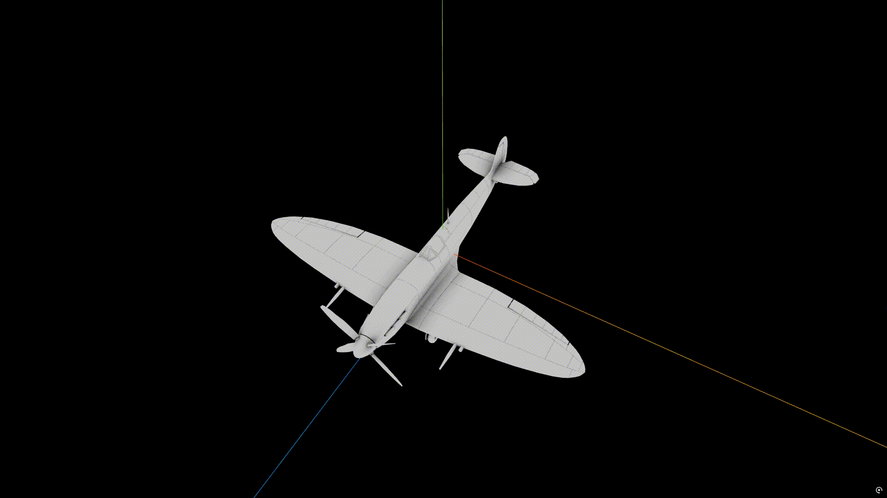
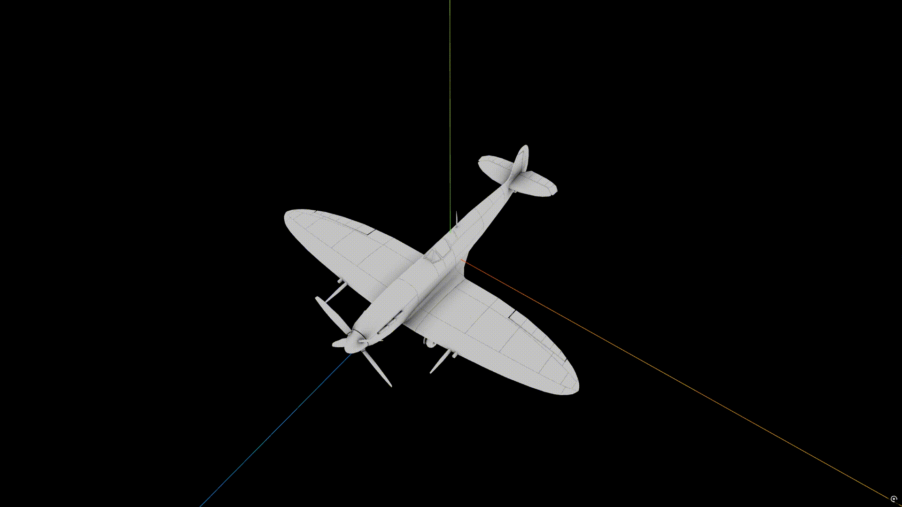

# 万向节锁死演示

理解欧拉角万向节锁死的关键（这里是自己总结的，正确！）：

* 欧拉角有顺序之分，针对某一种顺序，比如YXZ，从人的视角是先绕Y旋转30度，再绕X旋转90的，再绕Y旋转30度
* 但是对于欧拉角来说，下一帧计算时（对于飞行控制来说，是下一次传感器采样），物体是从最初建模完成的初始姿态，绕Y旋转的数值是30+30=60度，然后绕X旋转90度（而不是Y-X-Y），旋转就完成了（不存在先Y再X再Y）
* 结果就是此时物体的姿态跟先绕Y旋转30度，再绕X旋转90的，再绕Z旋转30度完全一样，Y轴和Z轴的旋转角度无法区分了，物体无法再进行左右转动
* 下图中其实是：先绕Y旋转30度，再绕X旋转90的，再绕Y旋转30度；最终看上去好像是：先绕Y旋转30度，再绕X旋转90的，再绕Z旋转30度；从代码中也可以看出从始至终没有动`rotation.z`

### 万向节锁演示



```js
const delayStart = 1; // ✅ 起始等待1秒

const durationY = 1;
const durationX = 1;
const wait = 1;
const durationY2 = 1;

let elapsed = 0;

// 以下aircraftMesh就是模型
function init() {
  aircraftMesh.rotation.order = 'YXZ';
  const axes = new THREE.AxesHelper(300);
  aircraftMesh.add(axes);
}

function update(event) {
  elapsed += event.delta / 1000;

  // ✅ 阶段0：起始等待
  if (elapsed <= delayStart) {
    aircraftMesh.rotation.y = 0;
    aircraftMesh.rotation.x = 0;

  // 阶段1：绕 Y 30°
  } else if (elapsed <= delayStart + durationY) {
    const t = (elapsed - delayStart) / durationY;
    aircraftMesh.rotation.y = t * Math.PI / 6;
    aircraftMesh.rotation.x = 0;

  // 阶段2：绕 X -90°
  } else if (elapsed <= delayStart + durationY + durationX) {
    const t = (elapsed - delayStart - durationY) / durationX;
    aircraftMesh.rotation.y = Math.PI / 6;
    aircraftMesh.rotation.x = -t * Math.PI / 2;

  // 阶段3：等待1秒
  } else if (elapsed <= delayStart + durationY + durationX + wait) {
    aircraftMesh.rotation.y = Math.PI / 6;
    aircraftMesh.rotation.x = -Math.PI / 2;

  // 阶段4：再绕 Y 30°
  } else if (elapsed <= delayStart + durationY + durationX + wait + durationY2) {
    const t = (elapsed - delayStart - durationY - durationX - wait) / durationY2;

    aircraftMesh.rotation.x = -Math.PI / 2;
    aircraftMesh.rotation.y = Math.PI / 6 + t * Math.PI / 6;

  // 结束
  } else {
    aircraftMesh.rotation.y = Math.PI / 3;
    aircraftMesh.rotation.x = -Math.PI / 2;
  }
}
```

### 四元数演示



```js
// 定义关键帧的四元数
var q0 = new THREE.Quaternion(); // 0-1s: 初始状态
var q1 = new THREE.Quaternion(); // 2s: 第一次绕 Y 旋转后的状态
var q2 = new THREE.Quaternion(); // 3s: 绕 X 旋转 -90 度后的状态
var q3 = new THREE.Quaternion(); // 5s: 最终再次绕 Y 旋转后的状态

// Three.js Editor 会在脚本启动时调用 init
// 以下aircraftMesh就是模型
function init() {
	const axes = new THREE.AxesHelper(300);
	aircraftMesh.add(axes);
    // 记录模型的初始姿态
    q0.copy(aircraftMesh.quaternion);

    // 定义旋转增量 (局部坐标系下的轴向)
    var qRotY = new THREE.Quaternion().setFromAxisAngle(new THREE.Vector3(0, 1, 0), THREE.MathUtils.degToRad(30));
    var qRotX = new THREE.Quaternion().setFromAxisAngle(new THREE.Vector3(1, 0, 0), THREE.MathUtils.degToRad(-90));

    // 计算 q1 (1-2s): 绕自身的Y轴旋转30度 (右乘表示局部旋转)
    q1.copy(q0).multiply(qRotY);

    // 计算 q2 (2-3s): 在 q1 的基础上，绕自身的X轴旋转-90度
    q2.copy(q1).multiply(qRotX);

    // 计算 q3 (4-5s): 在 q2 的基础上，再次绕自身的Y轴旋转30度
    // 这里因为是直接右乘局部Y轴旋转，所以绝对是偏航(Yaw)，完美避开欧拉角万向节死锁导致的滚转现象
    q3.copy(q2).multiply(qRotY);
}

// Three.js Editor 会在每一帧调用 update
function update(event) {
    // 将毫秒转换为秒。为了方便在编辑器里反复观察，这里让动画每 6 秒循环一次
    var t = (event.time / 1000) % 6.0; 

    if (t <= 1.0) {
        // 0-1s: 等待
        aircraftMesh.quaternion.copy(q0);
    } 
    else if (t <= 2.0) {
        // 1-2s: 让模型先绕自己的Y旋转30度
        var progress = t - 1.0; // 将时间映射到 0.0 - 1.0
        aircraftMesh.quaternion.copy(q0).slerp(q1, progress);
    } 
    else if (t <= 3.0) {
        // 2-3s: 再绕自己的X旋转-90度
        var progress = t - 2.0; 
        aircraftMesh.quaternion.copy(q1).slerp(q2, progress);
    } 
    else if (t <= 4.0) {
        // 3-4s: 等待
        aircraftMesh.quaternion.copy(q2);
    } 
    else if (t <= 5.0) {
        // 4-5s: 再绕自己的Y旋转30度
        var progress = t - 4.0;
        aircraftMesh.quaternion.copy(q2).slerp(q3, progress);
    } 
    else {
        // 5-6s: 保持最终形态，留 1 秒停顿用于观察，随后循环
        aircraftMesh.quaternion.copy(q3);
    }
}
```

# 以下公式AI出品，注意勘误

# 图形学四元数最常用的 12 个公式速查表

这份速查表总结了 **WebGL / Three.js / 游戏引擎 / 3D数学 / 物理引擎** 中最常用的四元数公式。  
所有公式采用工程常见形式：

$$
q=(w,x,y,z)=(w,\vec{v})
$$

其中

$$
\vec{v}=(x,y,z)
$$

---

## 1 四元数基本形式

四元数：

$$
q=w+xi+yj+zk
$$

向量形式：

$$
q=(w,x,y,z)
$$

或

$$
q=(w,\vec{v})
$$

其中

$$
\vec{v}=(x,y,z)
$$

---

## 2 四元数模（长度）

$$
|q|=
\sqrt{w^2+x^2+y^2+z^2}
$$

单位四元数：

$$
|q|=1
$$

图形学中 **旋转四元数必须是单位四元数**。

---

## 3 四元数归一化

$$
\hat{q}=\frac{q}{|q|}
$$

展开：

$$
\hat{q}=
\left(
\frac{w}{|q|},
\frac{x}{|q|},
\frac{y}{|q|},
\frac{z}{|q|}
\right)
$$

用途：

- 保证旋转稳定
- 避免数值漂移

---

## 4 四元数共轭

$$
q^*=(w,-x,-y,-z)
$$

或

$$
q^*=(w,-\vec{v})
$$

几何意义：

旋转反方向。

---

## 5 四元数逆

一般公式：

$$
q^{-1}=\frac{q^*}{|q|^2}
$$

若为单位四元数：

$$
q^{-1}=q^*
$$

即

$$
(w,x,y,z)^{-1}=(w,-x,-y,-z)
$$

---

## 6 四元数乘法

设

$$
p=(w_1,x_1,y_1,z_1)
$$

$$
q=(w_2,x_2,y_2,z_2)
$$

乘积：

$$
pq=(w,x,y,z)
$$

其中

$$
w=w_1w_2-x_1x_2-y_1y_2-z_1z_2
$$

$$
x=w_1x_2+x_1w_2+y_1z_2-z_1y_2
$$

$$
y=w_1y_2-x_1z_2+y_1w_2+z_1x_2
$$

$$
z=w_1z_2+x_1y_2-y_1x_2+z_1w_2
$$

---

## 7 向量形式的四元数乘法

设

$$
p=(w_1,\vec{v}_1)
$$

$$
q=(w_2,\vec{v}_2)
$$

则

$$
pq=
(
w_1w_2-\vec{v}_1\cdot\vec{v}_2,
\;
w_1\vec{v}_2+w_2\vec{v}_1+\vec{v}_1\times\vec{v}_2
)
$$

其中包含：

- 点积
- 叉积
- 向量加法

---

## 8 旋转轴角 → 四元数

旋转轴：

$$
\hat{u}=(u_x,u_y,u_z)
$$

旋转角：

$$
\theta
$$

四元数：

$$
q=
(
\cos(\theta/2),
\;
u_x\sin(\theta/2),
\;
u_y\sin(\theta/2),
\;
u_z\sin(\theta/2)
)
$$

这是 **3D引擎最常用的构造方式**。

---

## 9 四元数旋转向量

向量：

$$
\vec{v}
$$

转成纯四元数：

$$
V=(0,\vec{v})
$$

旋转：

$$
V' = qVq^{-1}
$$

得到

$$
\vec{v}'
$$

这是四元数旋转的核心公式。

---

## 10 向量旋转的简化公式（非常重要）

不用构造四元数：

设

$$
q=(w,\vec{u})
$$

向量旋转：

$$
\vec{v}'=
\vec{v}
+2w(\vec{u}\times\vec{v})
+2(\vec{u}\times(\vec{u}\times\vec{v}))
$$

这是 **GPU / 引擎优化常用公式**。

---

## 11 四元数 → 旋转矩阵

四元数：

$$
q=(w,x,y,z)
$$

旋转矩阵：

$$
R=
\begin{bmatrix}
1-2y^2-2z^2 & 2xy-2zw & 2xz+2yw \\
2xy+2zw & 1-2x^2-2z^2 & 2yz-2xw \\
2xz-2yw & 2yz+2xw & 1-2x^2-2y^2
\end{bmatrix}
$$

这是 **Shader / OpenGL / DirectX 常用公式**。

---

## 12 球面线性插值（SLERP）

两个旋转：

$$
q_1
$$

$$
q_2
$$

插值参数：

$$
t\in[0,1]
$$

定义：

$$
\theta=\arccos(q_1\cdot q_2)
$$

插值：

$$
\text{SLERP}(q_1,q_2,t)=
\frac{\sin((1-t)\theta)}{\sin\theta}q_1
+
\frac{\sin(t\theta)}{\sin\theta}q_2
$$

用途：

- 相机旋转
- 动画
- 骨骼系统

---

## 四元数最重要的 5 个公式

必须熟记：

### 1 轴角 → 四元数

$$
q=(\cos(\theta/2),\sin(\theta/2)\hat{u})
$$

---

### 2 四元数乘法

$$
pq=
(w_1w_2-\vec{v}_1\cdot\vec{v}_2,
w_1\vec{v}_2+w_2\vec{v}_1+\vec{v}_1\times\vec{v}_2)
$$

---

### 3 四元数逆

$$
q^{-1}=q^*
$$

（单位四元数）

---

### 4 向量旋转

$$
V' = qVq^{-1}
$$

---

### 5 四元数转矩阵

$$
R(q)
$$

---

## 一句话总结

在图形学中：

- **存储旋转**：四元数  
- **组合旋转**：四元数乘法  
- **应用旋转**：\(qVq^{-1}\)  
- **渲染矩阵**：四元数 → 矩阵  
- **动画插值**：SLERP

# 图形学四元数工程笔记（10 个最实用公式）

这份笔记整理 **Three.js / WebGL / 游戏引擎 / 物理引擎中最常直接写进代码的四元数公式**。  
重点是 **旋转构造、向量旋转、姿态转换、插值和稳定计算**。

统一记号：

四元数：

$$
q=(w,x,y,z)=(w,\vec{v})
$$

其中

$$
\vec{v}=(x,y,z)
$$

向量：

$$
\vec{a}=(a_x,a_y,a_z)
$$

---

## 1 轴角 → 四元数

旋转轴：

$$
\hat{u}=(u_x,u_y,u_z)
$$

旋转角：

$$
\theta
$$

四元数：

$$
q=
\left(
\cos\frac{\theta}{2},
u_x\sin\frac{\theta}{2},
u_y\sin\frac{\theta}{2},
u_z\sin\frac{\theta}{2}
\right)
$$

这是 **最标准的旋转构造方式**。

---

## 2 四元数 → 轴角

设：

$$
q=(w,x,y,z)
$$

旋转角：

$$
\theta=2\arccos(w)
$$

旋转轴：

$$
\hat{u}=
\frac{(x,y,z)}{\sqrt{1-w^2}}
$$

当

$$
w\approx1
$$

时旋转角接近 0，需要避免除零。

---

## 3 欧拉角 → 四元数

设欧拉角：

- roll（x轴）

$$
\phi
$$

- pitch（y轴）

$$
\theta
$$

- yaw（z轴）

$$
\psi
$$

定义：

$$
c_1=\cos\frac{\phi}{2},\quad s_1=\sin\frac{\phi}{2}
$$

$$
c_2=\cos\frac{\theta}{2},\quad s_2=\sin\frac{\theta}{2}
$$

$$
c_3=\cos\frac{\psi}{2},\quad s_3=\sin\frac{\psi}{2}
$$

四元数：

$$
w=c_1c_2c_3+s_1s_2s_3
$$

$$
x=s_1c_2c_3-c_1s_2s_3
$$

$$
y=c_1s_2c_3+s_1c_2s_3
$$

$$
z=c_1c_2s_3-s_1s_2c_3
$$

---

## 4 四元数 → 欧拉角

设：

$$
q=(w,x,y,z)
$$

roll：

$$
\phi=\text{atan2}(2(wx+yz),1-2(x^2+y^2))
$$

pitch：

$$
\theta=\arcsin(2(wy-zx))
$$

yaw：

$$
\psi=\text{atan2}(2(wz+xy),1-2(y^2+z^2))
$$

---

## 5 四元数旋转向量

向量：

$$
\vec{v}
$$

写成纯四元数：

$$
V=(0,\vec{v})
$$

旋转公式：

$$
V' = qVq^{-1}
$$

得到：

$$
\vec{v}'
$$

---

## 6 向量旋转简化公式（引擎常用）

设：

$$
q=(w,\vec{u})
$$

旋转向量：

$$
\vec{v}'=
\vec{v}
+2w(\vec{u}\times\vec{v})
+2(\vec{u}\times(\vec{u}\times\vec{v}))
$$

避免构造四元数乘法。

---

## 7 四元数 → 旋转矩阵

设：

$$
q=(w,x,y,z)
$$

旋转矩阵：

$$
R=
\begin{bmatrix}
1-2y^2-2z^2 & 2xy-2zw & 2xz+2yw \\
2xy+2zw & 1-2x^2-2z^2 & 2yz-2xw \\
2xz-2yw & 2yz+2xw & 1-2x^2-2y^2
\end{bmatrix}
$$

---

## 8 两个向量求旋转四元数

给定两个单位向量：

$$
\vec{a},\vec{b}
$$

点积：

$$
d=\vec{a}\cdot\vec{b}
$$

叉积：

$$
\vec{c}=\vec{a}\times\vec{b}
$$

四元数：

$$
q=(1+d,c_x,c_y,c_z)
$$

然后归一化：

$$
q=\frac{q}{|q|}
$$

---

## 9 LookAt 旋转 → 四元数

已知：

相机位置：

$$
\vec{p}
$$

目标位置：

$$
\vec{t}
$$

方向：

$$
\vec{f}=\frac{\vec{t}-\vec{p}}{|\vec{t}-\vec{p}|}
$$

右向量：

$$
\vec{r}=\frac{\vec{f}\times\vec{up}}{|\vec{f}\times\vec{up}|}
$$

上向量：

$$
\vec{u}=\vec{r}\times\vec{f}
$$

构造旋转矩阵：

$$
R=[\vec{r},\vec{u},-\vec{f}]
$$

再转换为四元数。

---

## 10 四元数 SLERP 插值

两个单位四元数：

$$
q_1,q_2
$$

夹角：

$$
\theta=\arccos(q_1\cdot q_2)
$$

插值：

$$
\text{SLERP}(q_1,q_2,t)
=
\frac{\sin((1-t)\theta)}{\sin\theta}q_1
+
\frac{\sin(t\theta)}{\sin\theta}q_2
$$

其中

$$
t\in[0,1]
$$

---

## 工程中最重要的 5 条

必须记住：

### 1 轴角 → 四元数

$$
q=(\cos(\theta/2),\sin(\theta/2)\hat{u})
$$

### 2 四元数旋转

$$
V' = qVq^{-1}
$$

### 3 四元数乘法

$$
pq=
(w_1w_2-\vec{v}_1\cdot\vec{v}_2,
w_1\vec{v}_2+w_2\vec{v}_1+\vec{v}_1\times\vec{v}_2)
$$

### 4 四元数 → 矩阵

$$
R(q)
$$

### 5 球面插值

$$
\text{SLERP}(q_1,q_2,t)
$$

---

## 一句话总结

四元数在图形学中的角色：

- **描述旋转**：四元数  
- **组合旋转**：四元数乘法  
- **应用旋转**：$qVq^{-1}$  
- **传给GPU**：四元数 → 矩阵  
- **动画过渡**：SLERP